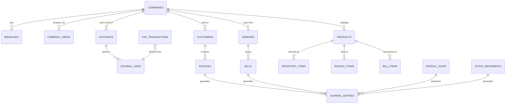
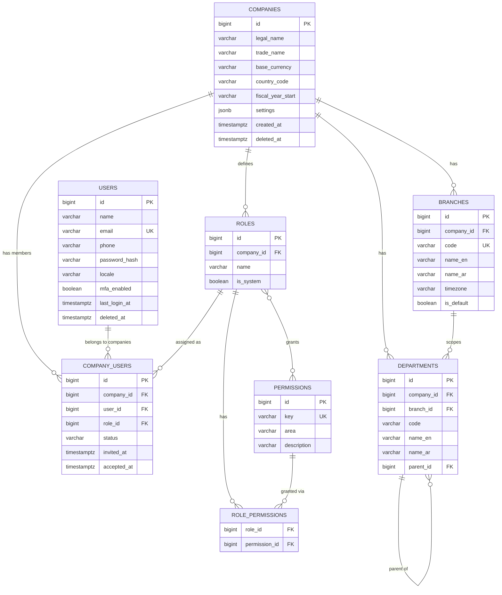
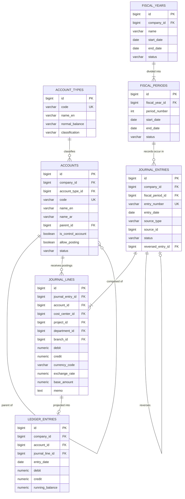
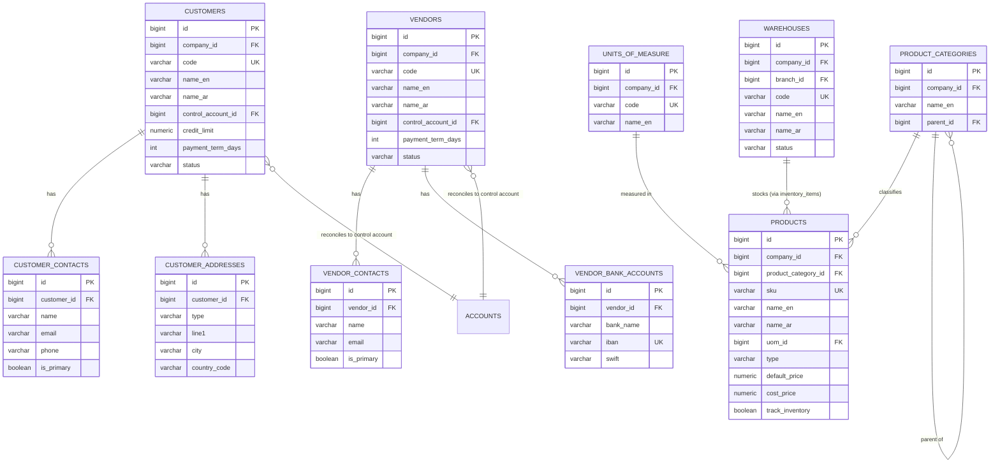
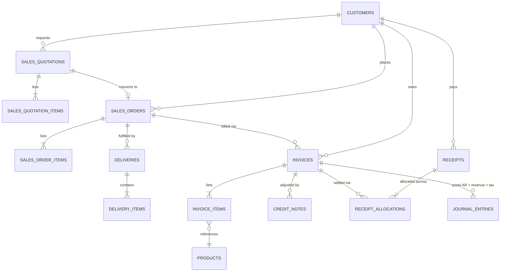
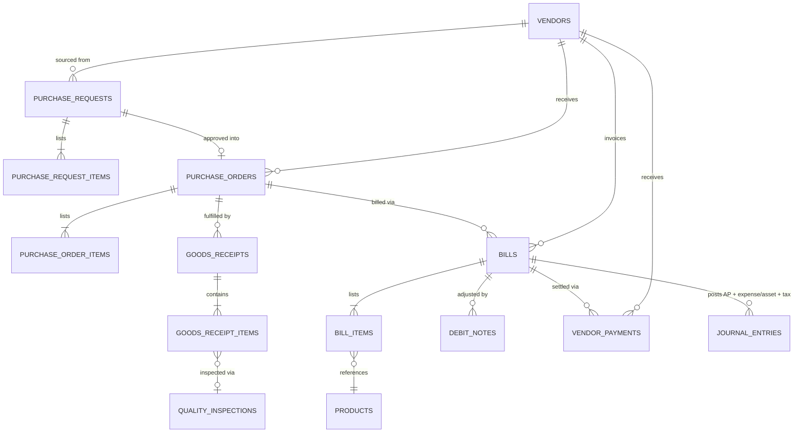
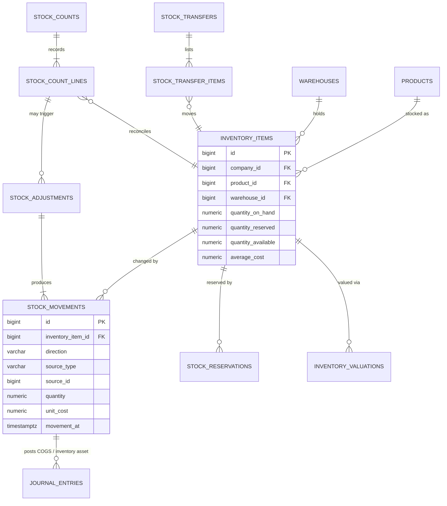
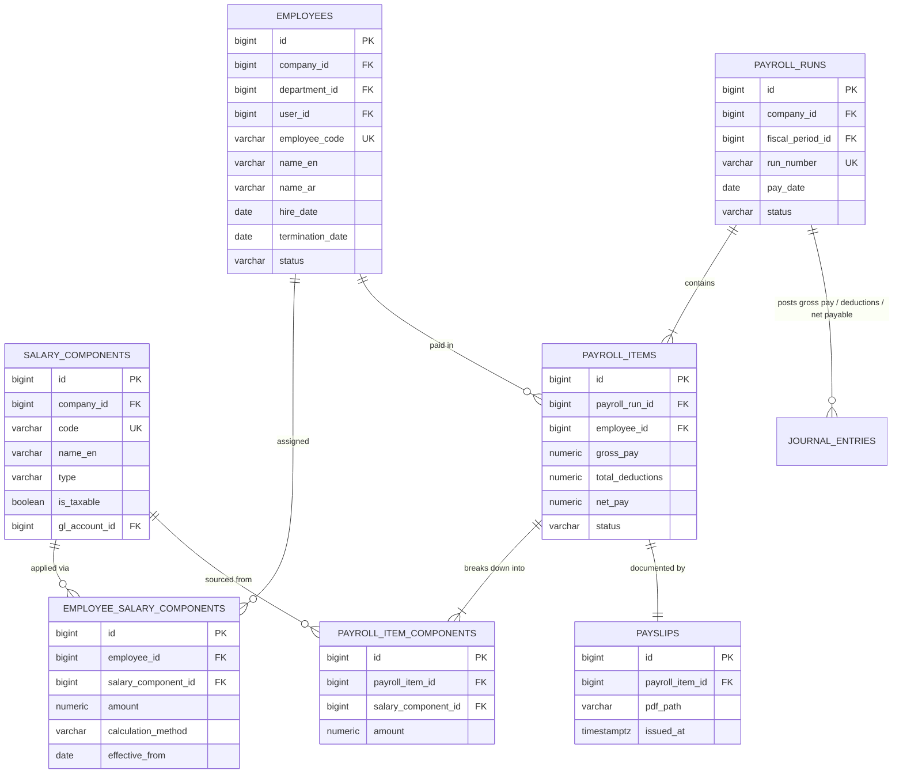
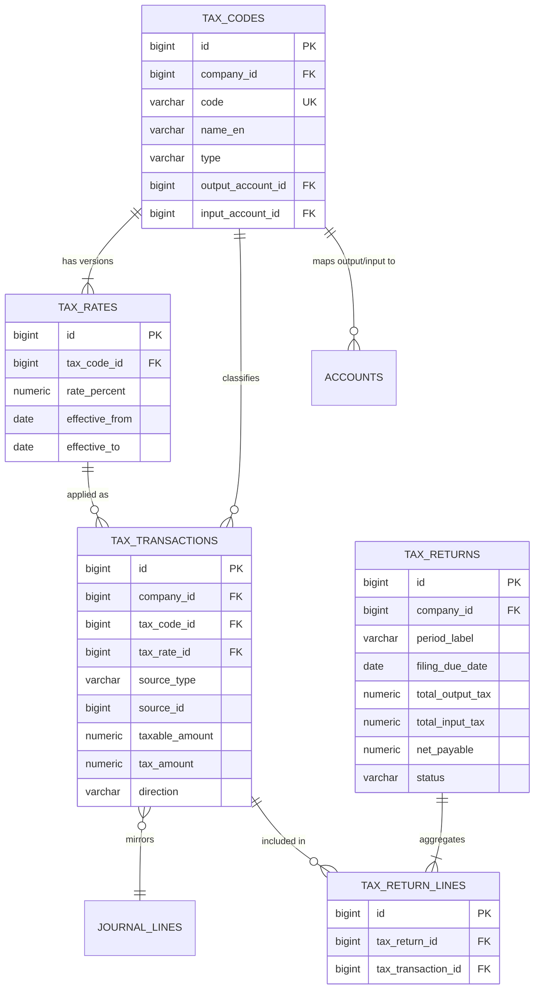
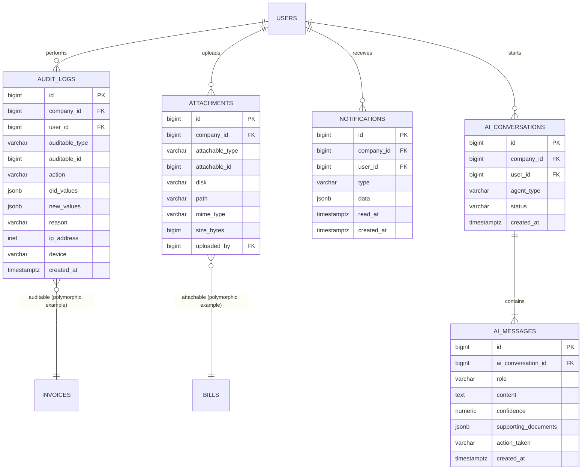

# Entity Relationship Model — QAYD Database Layer
Version: 1.0
Status: Design Specification
Module: Database
Submodule: ERD

---

# Purpose

This document is the canonical Entity Relationship reference for QAYD, the AI Financial Operating
System. It defines every core table cluster, the primary and foreign keys that bind them, and the
cardinality of every relationship, so that any engineer — human or AI — can generate migrations,
write queries, or reason about referential integrity without inspecting the running database.

The ERD is organized by bounded context (Identity & Tenancy, Accounting Core, Master Data, Sales,
Purchasing, Inventory, Payroll, Tax, System) because QAYD's Laravel backend is itself organized that
way: each context maps to a Laravel module with its own migrations, models, and service layer, and
each context communicates with the Accounting Core exclusively through domain events (never direct
foreign-key writes across module boundaries at the application layer, even though the database itself
does carry physical foreign keys for integrity).

Every diagram in this document uses Mermaid `erDiagram` syntax and renders directly in GitHub, GitLab,
and any Mermaid-compatible documentation tool. Column lists are abbreviated to the columns relevant to
the relationship being illustrated — the full column list for every table lives in the corresponding
migration file under `database/migrations/`. This document is the map; the migrations are the territory.

# Notation & Conventions

**Mermaid cardinality tokens** used throughout this document:

| Token | Meaning |
|---|---|
| `\|\|--\|\|` | exactly one — exactly one |
| `\|\|--o{` | exactly one — zero or many |
| `\|\|--\|{` | exactly one — one or many |
| `}o--o{` | zero or many — zero or many (many-to-many via junction table) |
| `}o--\|\|` | zero or many — exactly one |

**Column annotations** used inside entity blocks:

| Annotation | Meaning |
|---|---|
| `PK` | Primary key |
| `FK` | Foreign key |
| `UK` | Unique key / unique constraint |
| `NN` | Column carries `NOT NULL` (omitted when obvious from PK/FK) |

**Standard columns.** Per the platform contract, every business (tenant-scoped) table carries the
following columns even when a diagram below omits them for brevity:

```
id            BIGINT GENERATED ALWAYS AS IDENTITY PRIMARY KEY
company_id    BIGINT NOT NULL REFERENCES companies(id)      -- indexed
branch_id     BIGINT NULL REFERENCES branches(id)
created_by    BIGINT NULL REFERENCES users(id)
updated_by    BIGINT NULL REFERENCES users(id)
created_at    TIMESTAMPTZ NOT NULL DEFAULT now()
updated_at    TIMESTAMPTZ NOT NULL DEFAULT now()
deleted_at    TIMESTAMPTZ NULL
```

Diagrams show `company_id FK` and `branch_id FK` explicitly only where the relationship itself is the
point (e.g. the Identity & Tenancy ERD); elsewhere they are implied. Money columns are always
`NUMERIC(19,4)`, rates `NUMERIC(18,6)`, quantities `NUMERIC(18,4)`. Every table name is plural,
snake_case, and matches the canonical names fixed by the platform's shared design context — this
document introduces no new table names and renames nothing.

# High-Level Domain Map



Every downstream module (Sales, Purchasing, Inventory, Payroll, Tax) is a **source-document producer**:
it creates its own domain rows (invoices, bills, stock movements, payroll runs, tax transactions) and
emits a domain event that the Accounting Core consumes to write a balanced `journal_entries` /
`journal_lines` pair. No module writes directly into another module's tables. This is the single most
important structural fact in the entire schema and every ERD below reflects it.

# Identity & Tenancy ERD

Covers: `users`, `companies`, `company_users`, `branches`, `departments`, `roles`, `permissions`.



**Relationship cardinality — Identity & Tenancy**

| Relationship | Cardinality | Notes |
|---|---|---|
| companies → company_users | 1 : N | one company has many memberships |
| users → company_users | 1 : N | one user can belong to multiple companies (multi-tenant login) |
| companies → branches | 1 : N | at least one branch (`is_default = true`) is required per company |
| companies → departments | 1 : N | departments always scoped to a company |
| branches → departments | 1 : N (optional) | a department may be branch-scoped or company-wide (`branch_id NULL`) |
| departments → departments | 1 : N (self) | `parent_id` builds a tree; root nodes have `parent_id NULL` |
| companies → roles | 1 : N | roles can be system-defined (`is_system = true`, shared) or company-custom |
| roles ↔ permissions | N : N | via `role_permissions` junction table |
| roles → company_users | 1 : N | a company_user has exactly one role_id at a time (RBAC, not ABAC) |

`company_users` is the tenancy join table: a `users` row has no `company_id` of its own — identity is
global, tenancy membership is relational. This is what allows one accountant to work across multiple
client companies (an accounting-firm use case) without duplicating user records.

# Accounting Core ERD

Covers: `accounts`, `account_types`, `journal_entries`, `journal_lines`, `ledger_entries`,
`fiscal_years`, `fiscal_periods`.



**Relationship cardinality — Accounting Core**

| Relationship | Cardinality | Notes |
|---|---|---|
| account_types → accounts | 1 : N | fixed system list (asset/liability/equity/revenue/expense) |
| accounts → accounts | 1 : N (self) | chart-of-accounts tree; `parent_id NULL` = top-level (e.g. "1000 Assets") |
| accounts → journal_lines | 1 : N | an account accumulates many postings over its life |
| fiscal_years → fiscal_periods | 1 : N, minimum 1 | typically 12 monthly periods per fiscal year |
| fiscal_periods → journal_entries | 1 : N | every entry_date must fall inside an open period |
| journal_entries → journal_lines | 1 : N, minimum 2 | a balanced entry needs at least one debit line and one credit line |
| journal_entries → journal_entries | 0/1 : 1 (self) | `reversed_entry_id` links a reversal to its original; nullable |
| journal_lines → ledger_entries | 1 : 0/1 | populated only once the parent journal_entries.status = 'posted' |

`ledger_entries` is explicitly a **read-model projection**, not a primary data source: it is
rebuildable at any time by replaying `journal_lines` for a given `account_id`, ordered by
`entry_date, id`. The invariant `SUM(journal_lines.debit) = SUM(journal_lines.credit)` per
`journal_entry_id` is enforced at the application layer (Service class `PostJournalEntryService`)
and additionally guarded by a database `CHECK`-style trigger described in the Referential Integrity
Rules section.

# Master Data ERD

Covers: `customers`, `vendors`, `products`, `warehouses`.



**Relationship cardinality — Master Data**

| Relationship | Cardinality | Notes |
|---|---|---|
| customers → customer_contacts | 1 : N | exactly one contact should have `is_primary = true` (app-enforced) |
| customers → customer_addresses | 1 : N | typed `billing` / `shipping` / `other` |
| customers → accounts | N : 1 | every customer maps to one AR control account (usually shared, e.g. "1200 Accounts Receivable") |
| vendors → vendor_contacts | 1 : N | same pattern as customers |
| vendors → vendor_bank_accounts | 1 : N | used for payment issuance (vendor_payments) |
| vendors → accounts | N : 1 | maps to one AP control account (e.g. "2100 Accounts Payable") |
| product_categories → products | 1 : N | products may be uncategorized (`product_category_id NULL`) |
| product_categories → product_categories | 1 : N (self) | category tree |
| units_of_measure → products | 1 : N | base stocking/selling unit; `unit_conversions` handles alternates |
| warehouses ↔ products | N : N | realized through `inventory_items`, not a direct FK (see Inventory ERD) |

The control-account pattern is what keeps the AR/AP sub-ledgers reconciled to the General Ledger: the
sum of all open `invoices` per customer must always equal the balance of that customer's
`control_account_id` filtered to that customer's transactions — enforced by a nightly reconciliation
job (`ReconcileSubledgersJob`) that raises an `AccountingException` on drift.

# Sales ERD

Covers: `sales_quotations`, `sales_orders`, `invoices`, `invoice_items`, `credit_notes`, `receipts`.



**Relationship cardinality — Sales**

| Relationship | Cardinality | Notes |
|---|---|---|
| customers → sales_quotations | 1 : N | pre-sale, non-binding |
| sales_quotations → sales_orders | 0/1 : 1 | a quotation converts into at most one order (`converted_order_id`) |
| sales_orders → sales_order_items | 1 : N | line items carry `product_id`, `quantity`, `unit_price`, `tax_code_id` |
| sales_orders → deliveries | 1 : N | partial shipments supported; `status` tracks fulfillment progress |
| sales_orders → invoices | 1 : N | supports partial/progressive billing against one order |
| invoices → invoice_items | 1 : N, minimum 1 | each item can independently carry its own tax code |
| invoices → credit_notes | 1 : N | a credit note always references its originating `invoice_id` |
| invoices ↔ receipts | N : N | via `receipt_allocations` — one receipt can settle several invoices and vice versa (partial payments) |
| invoices → journal_entries | 1 : 1 (per posting event) | `invoice.created` posts Dr AR / Cr Revenue / Cr Tax Payable; `invoice.voided` posts the reversal |

`invoice_items.product_id` is nullable to support free-text/service line items that are not SKU-backed.
`receipt_allocations` is the many-to-many resolver between `receipts` and `invoices`; its own columns
(`receipt_id`, `invoice_id`, `amount_allocated`) must sum, per receipt, to `receipts.amount` or less
(over-allocation is rejected at the Service layer with a 422).

# Purchasing ERD

Covers: `purchase_orders`, `bills`, `bill_items`, `goods_receipts`, `debit_notes`, `vendor_payments`.



**Relationship cardinality — Purchasing**

| Relationship | Cardinality | Notes |
|---|---|---|
| purchase_requests → purchase_orders | 0/1 : 1 | internal requisition converts to an external PO after approval |
| purchase_orders → purchase_order_items | 1 : N | carries `product_id`, `quantity_ordered`, `unit_cost` |
| purchase_orders → goods_receipts | 1 : N | supports partial/staged deliveries |
| goods_receipts → goods_receipt_items | 1 : N | drives `stock_movements` (direction `in`) on confirmation |
| goods_receipt_items → quality_inspections | 1 : 0/1 | optional QA gate before stock is released to `available` status |
| purchase_orders → bills | 1 : N | 3-way match: PO quantity/price vs goods_receipt quantity vs bill quantity/price |
| bills → bill_items | 1 : N, minimum 1 | mirrors invoice_items structurally |
| bills → debit_notes | 1 : N | vendor-side equivalent of credit_notes |
| bills ↔ vendor_payments | N : N | via a `vendor_payment_allocations` junction, same pattern as receipts/invoices |
| bills → journal_entries | 1 : 1 (per posting event) | posts Dr Expense/Inventory / Dr Tax Receivable / Cr AP |

Three-way matching (`purchase_order_items` ↔ `goods_receipt_items` ↔ `bill_items`) is enforced by the
`ThreeWayMatchService`, which blocks a bill from moving to `approved` while unresolved variance exceeds
the configured tolerance (default 2% or a fixed currency threshold, whichever is greater, stored in
`companies.settings->>'three_way_match_tolerance'`).

# Inventory ERD

Covers: `inventory_items`, `stock_movements`, `stock_adjustments`, `stock_transfers`, `stock_counts`.



**Relationship cardinality — Inventory**

| Relationship | Cardinality | Notes |
|---|---|---|
| products × warehouses → inventory_items | effectively N : N | one row per (product_id, warehouse_id) pair; unique constraint `(company_id, product_id, warehouse_id)` |
| inventory_items → stock_movements | 1 : N | immutable append-only ledger; `quantity_on_hand` is a derived cache updated transactionally |
| inventory_items → stock_reservations | 1 : N | reservations back `quantity_reserved`; created by confirmed sales_orders pending delivery |
| stock_adjustments → stock_movements | 1 : N | one adjustment can touch multiple products/warehouses in one transaction |
| stock_transfers → stock_transfer_items | 1 : N | each item produces two stock_movements (`out` at source, `in` at destination warehouse) |
| stock_counts → stock_count_lines | 1 : N | one line per counted inventory_item |
| stock_count_lines → stock_adjustments | 0/1 : 1 | generated only when counted quantity ≠ system quantity |
| inventory_items → inventory_valuations | 1 : N | periodic snapshot for weighted-average / FIFO valuation reporting |
| stock_movements → journal_entries | 1 : 1 (per movement, if `products.track_inventory = true`) | Dr/Cr Inventory Asset against COGS or AP/clearing, depending on `source_type` |

`quantity_available` is a generated/derived column: `quantity_on_hand - quantity_reserved`. All three
quantity columns are `NUMERIC(18,4)` and never negative for `on_hand` outside of explicitly
back-ordered configurations (`companies.settings->>'allow_negative_stock'`).

# Payroll ERD

Covers: `employees`, `payroll_runs`, `payroll_items`, `salary_components`, `payslips`.



**Relationship cardinality — Payroll**

| Relationship | Cardinality | Notes |
|---|---|---|
| employees → employee_salary_components | 1 : N | standing salary structure (basic, housing, transport allowances, GOSI/social-insurance deduction, etc.) |
| salary_components → employee_salary_components | 1 : N | a component definition (e.g. "Housing Allowance") is reused across many employees |
| employees → payroll_items | 1 : N | one item per employee per run; unique `(payroll_run_id, employee_id)` |
| payroll_runs → payroll_items | 1 : N, minimum 1 | a run is not postable until every active employee has an item |
| payroll_items → payroll_item_components | 1 : N | the computed, run-specific breakdown (snapshot — historical amounts must never change retroactively) |
| payroll_items → payslips | 1 : 1 | generated on `payroll.completed`, stored in Cloudflare R2, path recorded in `pdf_path` |
| payroll_runs → journal_entries | 1 : 1 | Dr Salary Expense (per component's `gl_account_id`) / Cr Payroll Payable, then a second entry on disbursement: Dr Payroll Payable / Cr Bank |

`salary_components.gl_account_id` is what lets a fully dynamic salary structure still map deterministically
onto the fixed chart of accounts — every component (earning or deduction) is pre-wired to a GL account
at setup time, so payroll posting requires zero manual account selection at run time.

# Tax ERD

Covers: `tax_codes`, `tax_rates`, `tax_transactions`, `tax_returns`.



**Relationship cardinality — Tax**

| Relationship | Cardinality | Notes |
|---|---|---|
| tax_codes → tax_rates | 1 : N | rate history is versioned by `effective_from`/`effective_to`; never edited, only superseded |
| tax_codes → tax_transactions | 1 : N | every taxable line on an invoice/bill produces exactly one tax_transaction |
| tax_rates → tax_transactions | 1 : N | pins the transaction to the exact rate in force on the document date |
| tax_transactions → journal_lines | 1 : 1 | direction `output` (sales tax collected) posts Cr `output_account_id`; direction `input` (purchase tax paid) posts Dr `input_account_id` |
| tax_returns → tax_return_lines → tax_transactions | 1 : N : 1 | a filing period pulls every tax_transaction whose document date falls in that period and has not yet been filed |
| tax_codes → accounts | N : 2 | each tax_code references exactly two GL accounts: one output, one input |

`tax_transactions` never links directly to `invoices`/`bills` via a foreign key column with a fixed
name — it uses the polymorphic `source_type` + `source_id` pair (`'invoice_item'`, `'bill_item'`,
`'credit_note_item'`, `'debit_note_item'`) so tax logic stays identical across sales and purchasing
without a schema fork.

# System ERD

Covers: `audit_logs`, `attachments`, `notifications`, `ai_conversations`, `ai_messages` (the `ai_*`
family).



**Relationship cardinality — System**

| Relationship | Cardinality | Notes |
|---|---|---|
| users → audit_logs | 1 : N | one user action can still write multiple audit_logs rows if it touches multiple auditable rows (e.g. posting a journal entry with 5 lines writes 1 log for the entry, not one per line) |
| any table → audit_logs | polymorphic 1 : N | `auditable_type` + `auditable_id`, no physical FK — audit_logs must survive even if the audited row is later hard-purged from an archived tenant |
| any table → attachments | polymorphic 1 : N | `attachable_type` + `attachable_id`; e.g. a `bills` row can have many PDF/photo attachments |
| users → notifications | 1 : N | `data` JSONB carries the rendered payload; `read_at NULL` = unread |
| users → ai_conversations | 1 : N | one thread per (user, agent_type, topic) session |
| ai_conversations → ai_messages | 1 : N | alternating `role IN ('user','assistant','system')`; assistant messages always populate `confidence` and `supporting_documents` |

`audit_logs` and `attachments` are the two genuinely polymorphic tables in the schema — every other
relationship in this document is a concrete foreign key. Polymorphic association is intentional here:
it lets one infrastructure table serve all ~40 auditable/attachable business tables without a join
table explosion, at the cost of the database being unable to enforce `auditable_id` referential
integrity directly (enforced instead by the `Auditable`/`Attachable` traits at the Eloquent layer, and
verified by a nightly `VerifyPolymorphicIntegrityJob` that flags orphaned rows).

# Referential Integrity Rules

1. **No cross-module physical writes.** A Sales-module Service class must never `INSERT`/`UPDATE`
   directly into `journal_entries` or `journal_lines`. It calls
   `AccountingIntegrationService::postFromSourceDocument()`, which owns those tables exclusively.
2. **Cascade policy by relationship class.**
   - Parent-detail relationships within one document (e.g. `invoices` → `invoice_items`,
     `journal_entries` → `journal_lines`) use `ON DELETE CASCADE` at the physical FK level, but since
     financial rows are soft-deleted, this cascade is realized in practice through an application-level
     `deleted_at` cascade, not a hard `DELETE`.
   - Master-data references (e.g. `invoices.customer_id` → `customers.id`,
     `bill_items.product_id` → `products.id`) use `ON DELETE RESTRICT`. A customer or product with any
     transactional history can never be hard-deleted; it is archived via `status = 'archived'` instead.
   - Lookup/reference data (e.g. `journal_lines.account_id` → `accounts.id`,
     `tax_transactions.tax_code_id` → `tax_codes.id`) uses `ON DELETE RESTRICT` as well; an account with
     `allow_posting = true` and any posted `journal_lines` can never be deleted, only set
     `status = 'inactive'`.
3. **Balanced-entry constraint.** Enforced by an `AFTER INSERT OR UPDATE` trigger on `journal_lines`
   that raises an exception if, for the parent `journal_entry_id`,
   `SUM(debit) <> SUM(credit)` at the moment `journal_entries.status` transitions to `'posted'`:
   ```sql
   CREATE OR REPLACE FUNCTION enforce_balanced_journal_entry() RETURNS TRIGGER AS $$
   DECLARE
       v_status   TEXT;
       v_diff     NUMERIC(19,4);
   BEGIN
       SELECT status INTO v_status FROM journal_entries WHERE id = NEW.journal_entry_id;
       IF v_status = 'posted' THEN
           SELECT COALESCE(SUM(debit),0) - COALESCE(SUM(credit),0) INTO v_diff
           FROM journal_lines WHERE journal_entry_id = NEW.journal_entry_id;
           IF v_diff <> 0 THEN
               RAISE EXCEPTION 'Unbalanced journal_entry %: diff = %', NEW.journal_entry_id, v_diff;
           END IF;
       END IF;
       RETURN NEW;
   END; $$ LANGUAGE plpgsql;

   CREATE CONSTRAINT TRIGGER trg_balanced_journal
       AFTER INSERT OR UPDATE ON journal_lines
       FOR EACH ROW EXECUTE FUNCTION enforce_balanced_journal_entry();
   ```
4. **Immutability of posted rows.** A separate trigger blocks `UPDATE`/`DELETE` on `journal_lines` when
   the parent `journal_entries.status = 'posted'`, forcing all corrections through
   `reversed_entry_id`-linked reversing entries.
5. **Tenant isolation at the row level.** Every tenant table has Postgres Row-Level Security enabled,
   keyed to `company_id = current_setting('app.current_company_id')::bigint`, set per-request by
   Laravel middleware from the authenticated `X-Company-Id` context — a physical FK to `companies.id`
   is necessary but not sufficient for isolation; RLS is the enforced boundary.
6. **Unique constraints that double as integrity guards.**
   `journal_entries(company_id, entry_number)`, `invoices(company_id, invoice_number)`,
   `inventory_items(company_id, product_id, warehouse_id)`,
   `employee_salary_components(employee_id, salary_component_id, effective_from)`.
7. **Polymorphic tables skip physical FKs by design** (`audit_logs`, `attachments`) — integrity is
   validated by the nightly `VerifyPolymorphicIntegrityJob`, which reports (never silently deletes)
   orphans older than 24 hours to the `#data-integrity` ops channel.

# Edge Cases

- **Customer that is also a vendor.** QAYD does not merge `customers` and `vendors` into one polymorphic
  party table — they remain separate tables with separate control accounts, because AR and AP must
  never net against each other implicitly. A company that both sells to and buys from the same legal
  entity creates one `customers` row and one `vendors` row, optionally linked by a shared
  `external_reference` for reporting, and any netting is done through an explicit manual journal entry,
  never automatically.
- **Deleting an account that has zero postings but a non-zero opening balance.** `accounts` with
  `allow_posting = true` and zero rows in `journal_lines` can be soft-deleted; the RESTRICT constraint
  only fires once at least one `journal_lines` row references it, including the opening-balance entry
  itself (opening balances are ordinary journal entries dated at `fiscal_years.start_date`).
- **Reversing a journal entry that already has a reversal.** `journal_entries.reversed_entry_id` is
  unique-constrained per source row (`UNIQUE(reversed_entry_id)` where not null), so a second reversal
  attempt against an already-reversed entry is rejected with 409; the correct action is to reverse the
  reversal itself if the original needs to be reinstated.
- **Invoice with mixed taxed and tax-exempt line items.** `invoice_items.tax_code_id` is nullable
  per-line, not per-document; `tax_transactions` are only generated for lines with a non-null
  `tax_code_id`, so the same invoice can produce zero, one, or several tax_transactions rows.
- **Stock movement for a non-tracked product.** If `products.track_inventory = false`, no
  `inventory_items` row exists for it and Sales/Purchasing Services skip stock_movements entirely for
  that line — the invoice/bill still posts its accounting entry (COGS estimation is skipped; expense is
  posted directly at purchase or sale time).
- **Payroll run with a mid-period new hire or termination.** `payroll_items` for that employee are
  prorated by the Service layer using `employees.hire_date`/`termination_date` against
  `payroll_runs`' fiscal_period boundaries; the underlying `employee_salary_components.amount` is never
  mutated — only the computed `payroll_items.gross_pay` reflects the proration.
- **Tax rate changes mid-filing-period.** Because `tax_rates` is versioned by `effective_from`/
  `effective_to` and each `tax_transactions` row pins the exact `tax_rate_id` used at document-issue
  time, a rate change never retroactively alters historical `tax_transactions`; a `tax_returns` filing
  spanning the change date will correctly show a mix of old-rate and new-rate transactions.
- **Multi-currency receipt allocated against a base-currency invoice.** `receipts` carries its own
  `currency_code`/`exchange_rate`; `receipt_allocations.amount_allocated` is stored in the invoice's
  currency, with the exchange-rate gain/loss on settlement posted as a separate small journal entry
  (`source_type = 'fx_realized_gain_loss'`) rather than adjusted into the original invoice or receipt
  amounts.
- **Warehouse deleted while it still has non-zero inventory_items.** RESTRICT blocks the delete;
  operationally the required path is a `stock_transfers` to zero out every `inventory_items.quantity_on_hand`
  for that warehouse before `warehouses.status` can move to `'closed'`.
- **AI-suggested journal entry that is later rejected.** `ai_messages.action_taken` records
  `'suggested'`; if a human rejects it, no `journal_entries` row is ever created — the AI conversation
  and its suggestion remain in `ai_messages` purely as an audit trail, never silently retried.

# End of Document
