# Entity Relationship Design — QAYD Accounting Engine
Version: 1.0
Status: Design Specification
Module: Database
Submodule: ERD
---

# Purpose

This document is the complete Entity Relationship Design (ERD) for QAYD, an AI Financial Operating
System built on Next.js 15 / React 19 / TypeScript on the frontend, Laravel 12 / PHP 8.4+ on the
backend, a FastAPI/Python AI layer, and PostgreSQL 15+ as the single system of record. It is the
canonical, implementation-ready reference for every table, primary key, foreign key, index,
constraint, cardinality, delete/update rule, and normalization decision across all sixteen functional
modules of the platform: Users, Companies, Branches, Permissions, Accounting, Sales, Purchasing,
Inventory, Payroll, Banking, Tax, Reports, AI, Audit, Notifications, and Documents.

Every other QAYD engineering document — the per-topic database guides (naming conventions, indexing,
partitioning, caching, migrations, multi-tenancy, row-level security, soft deletes, seeding, backup and
recovery, versioning, monitoring, constraints, events, architecture) and every narrower module
specification (Chart of Accounts, General Ledger, Journal Entries, Sales Orders, Purchase Orders, and
so on) defers to this ERD for the shape of the data: table names, column lists, key definitions, and
cross-table relationships. Where a narrower document repeats a `CREATE TABLE`-adjacent snippet for
implementation convenience, this ERD is authoritative; any discrepancy is resolved in favor of this
document. An AI engineer implementing any module should be able to generate correct Laravel migrations,
Eloquent models, and PostgreSQL DDL directly from this document without asking a clarifying question.

QAYD is a multi-tenant, double-entry accounting engine with adjacent Sales, Purchasing, Inventory,
Payroll, Banking, Tax, Reporting, and AI subsystems layered around it. `company_id` is the tenant
boundary on every business table; companies are fully isolated from one another; the Laravel backend is
the only process permitted to write to PostgreSQL (the AI layer and the frontend never connect to the
database directly). Because financial correctness must hold under concurrent multi-branch,
multi-currency, multi-user, and multi-agent (AI-assisted) load, this ERD specifies not only "what points
to what" but the exact `ON DELETE` / `ON UPDATE` semantics, the exact index set that keeps every foreign
key and every common query path efficient, and the exact `CHECK` constraints that make illegal states
unrepresentable at the database layer rather than relying on application code discipline alone.

This document answers five questions, unambiguously, for every one of the eighty-one tables it defines:

1. What real-world fact does one row of this table assert, and why does the table exist as a distinct
   entity rather than a column on another table?
2. How does it connect — by foreign key, by polymorphic reference, or by domain event — to every other
   table it depends on or that depends on it?
3. What is the exact cardinality of each relationship (1:1, 1:N, N:M), and is the "many" side optional
   or mandatory?
4. What happens to this row and to related rows when it is deleted, voided, reversed, reclassified, or
   updated after being referenced elsewhere?
5. What normal form does the table satisfy, where was normalization deliberately traded for query
   performance (and why that trade is safe), and what is the known, planned extension path?

# Notation & Conventions

**Scope and audience.** This ERD assumes the reader is a backend or database engineer implementing
Laravel migrations and Eloquent models, or an AI agent (Document AI, Forecast Agent, Reporting Agent,
etc.) that needs to know precisely which tables it may read and which fields carry which meaning. Prose
is kept declarative; every non-trivial rule is expressed as a table, a `CHECK` constraint, or a code
block rather than as narrative alone.

**Table naming.** All table names are canonical and are reused verbatim across every QAYD document,
every Laravel migration, and every Eloquent model. Names are `snake_case` and plural (`journal_entries`,
`sales_orders`, `stock_movements`). Pivot/join tables are named from the two tables they join, in the
order that reads most naturally as "child belongs to parent" (`role_permissions`, `company_users`).
Line-item child tables append `_items` or a domain-specific noun to the parent's stem (`invoice_items`,
`journal_lines`, `payroll_items`). No table name introduced in one module is redefined in another; a
module that needs a table owned elsewhere references it by name and cites the owning module.

**Column naming.** Columns are `snake_case`. A foreign key column is always
`<referenced_table_singular>_id` (`customer_id` → `customers.id`, `warehouse_id` → `warehouses.id`).
Boolean columns are prefixed `is_` or `has_`. Status/state columns are named `status` and are typed as
`VARCHAR` with a `CHECK (status IN (...))` constraint rather than a native PostgreSQL `ENUM`, so that a
new state can be added by a normal migration (`ALTER TABLE ... DROP CONSTRAINT ...; ALTER TABLE ... ADD
CONSTRAINT ...;`) instead of the exclusive-lock-taking, cluster-wide `ALTER TYPE ... ADD VALUE`. Money
columns are suffixed `_amount` or, for compound names, are unambiguous from context (`grand_total`,
`subtotal`); quantity columns are suffixed `_qty` or `_quantity`; percentage columns are suffixed
`_percent`. Timestamps are always `TIMESTAMPTZ`, never bare `TIMESTAMP`, so that a session's `SET
TIMEZONE` never silently changes stored instants.

**Standard columns.** Unless a table's own section states an exception, every business (tenant-scoped)
table in this document carries the following eight columns. They are not repeated in every Attributes
table verbatim as prose, but every Attributes table below lists them explicitly for completeness, since
this ERD is a DDL-adjacent source of truth and a reader should never have to cross-reference this
paragraph to know a table's full shape:

| Column | Type | Null | Notes |
|---|---|---|---|
| `id` | `BIGINT GENERATED ALWAYS AS IDENTITY` | NOT NULL | Primary key. Identity column (PostgreSQL 10+), never a bare `SERIAL`. |
| `company_id` | `BIGINT` | NOT NULL | FK → `companies.id`. The tenant boundary. B-tree indexed on every table that has it. |
| `branch_id` | `BIGINT` | NULL | FK → `branches.id`. NULL means the row is company-wide, not scoped to one branch. |
| `created_by` | `BIGINT` | NULL | FK → `users.id`. NULL only for system-seeded or pure-AI-originated rows (see `ai_agent_id` pattern in AI-adjacent tables). |
| `updated_by` | `BIGINT` | NULL | FK → `users.id`. Set by the application on every `UPDATE`. |
| `created_at` | `TIMESTAMPTZ` | NOT NULL | `DEFAULT now()`. |
| `updated_at` | `TIMESTAMPTZ` | NOT NULL | `DEFAULT now()`; refreshed by a `BEFORE UPDATE` trigger (`trg_set_updated_at`), never left to application code alone. |
| `deleted_at` | `TIMESTAMPTZ` | NULL | Soft-delete marker. `NULL` = active row. See "Soft delete and immutability" below. |

Global/foundation tables that are not tenant-scoped (`users`, `permissions`, `account_types`, system-row
variants of `roles`/`tax_codes`/`report_definitions`/`ai_agents`) omit `company_id`/`branch_id` and this
is called out explicitly in that table's own Attributes list.

**Money, rate, and quantity precision.** Monetary amounts are `NUMERIC(19,4)` platform-wide — enough
range for values into the hundreds of trillions with four decimal places, which matters for currencies
like KWD that quote sub-fils fractional amounts in intermediate calculations (tax proration, FX
conversion) even though they settle to 3 decimal places. Exchange rates are `NUMERIC(18,6)`. Quantities
are `NUMERIC(18,4)`. Percentages are `NUMERIC(7,4)` (`15.0000` for 15%). No table deviates from this; a
column that looks like money but is typed differently is a defect.

**Multi-currency.** Any table that records a monetary transaction carries a fixed quartet of columns:
`currency_code CHAR(3)` (ISO 4217), `exchange_rate NUMERIC(18,6)` (to the company's base currency, as of
the transaction date), the transaction-currency amount (`grand_total`, `amount`, etc., `NUMERIC(19,4)`),
and a base-currency equivalent (`base_currency_amount` or, on `journal_lines`, `base_debit`/
`base_credit`, `NUMERIC(19,4)`). Every report, the General Ledger, and Trial Balance aggregate on the
base-currency column only; the transaction-currency column is retained for source-document fidelity and
for regenerating FX-gain/loss entries if a rate is corrected.

**Soft delete and immutability.** Financial rows are never physically `DELETE`d. `deleted_at` is set
instead, and every `SELECT` in the application layer runs through a global scope that filters
`WHERE deleted_at IS NULL` unless explicitly asked to include trashed rows. Posted accounting documents
(`journal_entries` in `posted` status and their `journal_lines`) are additionally immutable at the row
level: no `UPDATE` is permitted on a posted `journal_lines` row by any role, including `Owner`; the only
way to change a posted fact is a reversing or adjusting entry. This is enforced both by an application
policy layer and by a PostgreSQL `BEFORE UPDATE` trigger (`trg_block_posted_journal_line_update`) that
raises an exception if `OLD.status = 'posted'` is detected through the parent join, so the rule survives
even a direct `psql` session with a compromised or careless service credential.

**Cardinality notation.** Relationship cardinality is given in two equivalent forms in this document: a
plain-English form ("one company has many branches") and a Mermaid `erDiagram` crow's-foot form. The
Mermaid tokens used throughout, and their meaning, are:

| Mermaid token | Meaning |
|---|---|
| `\|\|--\|\|` | Exactly one — exactly one (strict 1:1). |
| `\|\|--o{` | Exactly one — zero or more (1:N, child optional). |
| `\|\|--\|{` | Exactly one — one or more (1:N, child mandatory, at least one must exist). |
| `}o--o{` | Zero or more — zero or more (M:N through a pivot table). |
| `}o--\|\|` | Zero or one (child side optional FK) — exactly one (parent mandatory). |

**Primary keys.** Every table has a single-column surrogate primary key `id BIGINT GENERATED ALWAYS AS
IDENTITY`. Natural/business keys (e.g. `(company_id, code)` on `accounts`, `(company_id, product_id,
warehouse_id)` on `inventory_items`) are enforced as `UNIQUE` constraints, never as the primary key
itself, so that a business-key rename never cascades through foreign keys.

**Foreign keys, delete rules, update rules.** Every foreign key below is documented with its exact
`ON DELETE` and `ON UPDATE` clause. QAYD uses four delete behaviors: `RESTRICT` (the default — you
cannot delete a parent row while children exist; the application must reassign or archive children
first), `CASCADE` (deleting the parent deletes/soft-deletes the child — used only for pure detail rows
that have no independent meaning, e.g. `journal_lines` under `journal_entries`), `SET NULL` (the FK
column is nullable and the relationship is optional/historical, e.g. `updated_by` when a user account is
removed), and `SOFT-CASCADE` (an application-level, trigger-assisted rule: deleting the parent sets
`deleted_at` on dependent rows rather than issuing a real `DELETE`, because the underlying table is
soft-delete-only). `ON UPDATE` is `CASCADE` on every foreign key as a matter of course (surrogate keys
never change in practice, but this keeps referential integrity correct if an `id` is ever renumbered in
a migration/merge scenario) except where a table's own section states a business rule that blocks the
update outright (e.g., you cannot repoint a posted `journal_lines.account_id`).

**Example records.** Each table includes one or more fully worked example rows, given first as a
PostgreSQL `INSERT` statement with literal values and then as the equivalent JSON representation, which
is the shape the Laravel API returns from `GET` endpoints (see the API-conventions documents for the
full response envelope). Examples use realistic Kuwait-first data (KWD base currency, Kuwait phone/CR
formats) with occasional AED/SAR/USD to demonstrate multi-currency handling, consistent with QAYD's
Gulf-first, globally-capable design target.

**Normalization.** Tables are designed to Third Normal Form (3NF) by default: every non-key attribute
depends on the key, the whole key, and nothing but the key. Deliberate departures from 3NF are called
out explicitly in each table's "Normalization" subsection with the specific reason (almost always
read-performance for a high-volume reporting path) and the mechanism that keeps the denormalized copy
correct (a database trigger, a Laravel model observer, or a scheduled reconciliation job). The two
largest denormalized surfaces in the platform are `ledger_entries` (a materialized projection of posted
`journal_lines`, kept only for General Ledger/Trial Balance query speed) and the `base_currency_amount`
family of columns (kept so reports never need a runtime FX join).

**Legend.** `PK` = Primary Key. `FK` = Foreign Key. `UQ` = Unique constraint. `IDX` = non-unique index.
`CK` = `CHECK` constraint. `NN` = `NOT NULL`. A dagger (†) on a column marks a column that is part of the
platform-wide "standard columns" set defined above, included here for completeness rather than because
the table is unusual.

# Users

The Users module holds global identity: the people who can sign in to QAYD, their active sessions, the
invitations that bring them into a company, and the tokens that let them reset a forgotten password.
`users` is deliberately **not** company-scoped — a single accountant, auditor, or business owner can
belong to several companies (a bookkeeping firm serving five clients, an owner with two legal entities),
so tenant membership itself lives one module over, in `company_users` (Companies module). Everything
downstream of authentication — which company is "active" for a request, which role applies, which
branch a user is scoped to — is resolved through that join, not through columns on `users`.

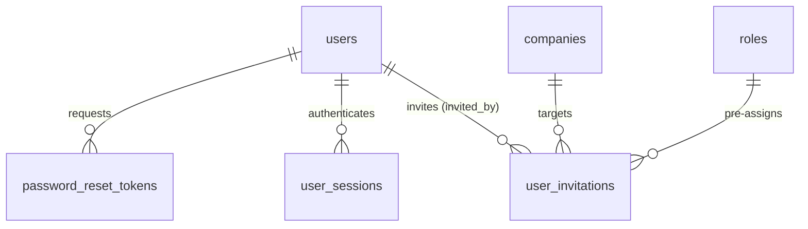

## `users`

**Purpose.** One row per human who can authenticate into QAYD. This is the platform's global identity
table — it is intentionally not tenant-scoped, since one person may hold accounts, roles, and sessions
across multiple companies. All company-specific state (role, branch, status within a company) hangs off
`company_users`/`user_roles` (Companies/Permissions modules), never off this table.

**Attributes**

| Column | Type | Null | Notes |
|---|---|---|---|
| `id` | `BIGINT GENERATED ALWAYS AS IDENTITY` | NOT NULL | PK. |
| `uuid` | `UUID` | NOT NULL | `DEFAULT gen_random_uuid()`. Public-facing identifier used in API responses and JWT `sub` claims, so the internal sequential `id` is never exposed to clients. |
| `full_name_en` | `VARCHAR(160)` | NOT NULL | |
| `full_name_ar` | `VARCHAR(160)` | NULL | |
| `email` | `CITEXT` | NOT NULL | Case-insensitive unique login identifier. |
| `phone` | `VARCHAR(20)` | NULL | E.164 format, e.g. `+96550001234`. |
| `password_hash` | `VARCHAR(255)` | NOT NULL | `bcrypt`/`argon2id` hash. Never selected by default Eloquent queries (`$hidden`). |
| `avatar_url` | `VARCHAR(500)` | NULL | Points to a Cloudflare R2 object or external URL. |
| `locale` | `VARCHAR(5)` | NOT NULL | `DEFAULT 'en'`. One of `en`, `ar`. Drives RTL rendering on the frontend. |
| `timezone` | `VARCHAR(50)` | NOT NULL | `DEFAULT 'Asia/Kuwait'`. IANA tz name. |
| `status` | `VARCHAR(20)` | NOT NULL | `CHECK (status IN ('active','invited','suspended','disabled'))`. |
| `mfa_enabled` | `BOOLEAN` | NOT NULL | `DEFAULT false`. |
| `mfa_secret` | `VARCHAR(255)` | NULL | Encrypted at rest (Laravel `encrypted` cast, AES-256-GCM). |
| `email_verified_at` | `TIMESTAMPTZ` | NULL | |
| `phone_verified_at` | `TIMESTAMPTZ` | NULL | |
| `last_login_at` | `TIMESTAMPTZ` | NULL | |
| `last_login_ip` | `INET` | NULL | |
| `created_at`† | `TIMESTAMPTZ` | NOT NULL | |
| `updated_at`† | `TIMESTAMPTZ` | NOT NULL | |
| `deleted_at`† | `TIMESTAMPTZ` | NULL | Soft delete; a deleted user cannot authenticate but is preserved for historical `created_by`/`audit_logs` attribution. |

Note: no `company_id`/`branch_id` — see Purpose above.

**Relationships**
- `users` 1 --- N `company_users` (a user may belong to many companies).
- `users` 1 --- N `user_sessions` (a user may have many concurrent device sessions).
- `users` 1 --- N `user_invitations` as the `invited_by` actor.
- `users` 1 --- N `user_roles`, `audit_logs`, `journal_entries.created_by`, and dozens of other tables'
  `created_by`/`updated_by` columns platform-wide (omitted from individual "Relationships" lists below
  to avoid repetition; every `created_by`/`updated_by` column in this document is implicitly FK →
  `users.id ON DELETE SET NULL`).

**Cardinality**
- One `users` row relates to zero-or-more `company_users` rows: `users ||--o{ company_users`.
- One `users` row relates to zero-or-more `user_sessions` rows: `users ||--o{ user_sessions`.

**Primary Key**
- `id`.

**Foreign Keys**
- None (root identity table).

**Indexes**
- `UNIQUE INDEX uq_users_email ON users (email)`.
- `INDEX idx_users_phone ON users (phone) WHERE phone IS NOT NULL`.
- `UNIQUE INDEX uq_users_uuid ON users (uuid)`.
- `INDEX idx_users_status ON users (status) WHERE deleted_at IS NULL`.

**Constraints**
- `CHECK (status IN ('active','invited','suspended','disabled'))`.
- `CHECK (email ~* '^[^@\s]+@[^@\s]+\.[^@\s]+$')` — defence-in-depth format check; full validation
  happens in the Laravel `FormRequest` layer.

**Delete Rules**
- Soft delete only. A hard `DELETE` is blocked by application policy; even a platform superadmin can
  only set `deleted_at`. Rows in every table that FK to `users.id` via `created_by`/`updated_by` keep
  their historical attribution (`ON DELETE SET NULL` would erase useful audit context, so in practice
  the application never hard-deletes a user — it deactivates via `status = 'disabled'` and soft-deletes
  only for GDPR-style erasure requests, at which point `full_name_en`/`email`/`phone` are also
  anonymized by a dedicated `AnonymizeUser` job, not by the delete itself).

**Update Rules**
- `email` changes require re-verification (`email_verified_at` reset to `NULL`, a verification email
  sent). `password_hash` updates always invalidate all other `user_sessions` except the session that
  performed the change (forces re-login everywhere else, a standard account-takeover mitigation).
  `status` transitions are policy-gated: only `owner`/`cfo`-equivalent roles in at least one shared
  company, or a platform administrator, may set `suspended`/`disabled`.

**Example Records**
```sql
INSERT INTO users (uuid, full_name_en, full_name_ar, email, phone, password_hash, locale, timezone, status, mfa_enabled, email_verified_at)
VALUES (gen_random_uuid(), 'Sarah Al-Fahad', 'سارة الفهد', 'sarah@qayd.io', '+96550012345',
        '$argon2id$v=19$m=65536,t=4,p=1$...', 'en', 'Asia/Kuwait', 'active', true, now());
```
```json
{
  "id": "b3f2b1a0-6e2b-4b8e-9b1a-2f6a7c9d1e02",
  "full_name_en": "Sarah Al-Fahad",
  "full_name_ar": "سارة الفهد",
  "email": "sarah@qayd.io",
  "phone": "+96550012345",
  "locale": "en",
  "timezone": "Asia/Kuwait",
  "status": "active",
  "mfa_enabled": true,
  "email_verified_at": "2026-06-01T08:12:00Z",
  "created_at": "2026-05-20T10:00:00Z"
}
```

**Normalization.** 3NF. `full_name_en`/`full_name_ar` are kept as single columns rather than split into
given/family name, a deliberate choice for a bilingual Gulf product where name ordering and particles
(`Al-`, `bin`) do not map cleanly onto a Western given/family split; search and sort use a generated
`tsvector` column (`name_search`) rather than structural decomposition.

**Future Expansion.** `oauth_identities` (Google/Microsoft SSO linkage) and `user_devices` (push-token
registry, superset of what `user_sessions` tracks) are anticipated but out of scope for this v1 ERD.

## `user_sessions`

**Purpose.** One row per active or historical authenticated session (a browser, or the native app on a
phone). Backs "sign out of all devices," session-based anomaly detection (new-country login alerts via
`security_events`), and Sanctum/JWT token revocation.

**Attributes**

| Column | Type | Null | Notes |
|---|---|---|---|
| `id` | `BIGINT GENERATED ALWAYS AS IDENTITY` | NOT NULL | PK. |
| `user_id` | `BIGINT` | NOT NULL | FK → `users.id`. |
| `company_id` | `BIGINT` | NULL | FK → `companies.id`. The "active company" context selected for this session; NULL before the user picks one (e.g. mid-onboarding). |
| `token_hash` | `VARCHAR(255)` | NOT NULL | SHA-256 of the Sanctum/JWT bearer token; the raw token is never stored. |
| `device_name` | `VARCHAR(120)` | NULL | e.g. `"Sarah's iPhone 16"`. |
| `device_type` | `VARCHAR(20)` | NOT NULL | `CHECK (device_type IN ('web','ios','android'))`. |
| `ip_address` | `INET` | NOT NULL | |
| `user_agent` | `VARCHAR(500)` | NULL | |
| `location_country` | `VARCHAR(2)` | NULL | Derived from IP via GeoIP at login time. |
| `is_active` | `BOOLEAN` | NOT NULL | `DEFAULT true`. |
| `last_active_at` | `TIMESTAMPTZ` | NOT NULL | Updated at most once per minute per session (throttled) to avoid write amplification. |
| `expires_at` | `TIMESTAMPTZ` | NOT NULL | |
| `revoked_at` | `TIMESTAMPTZ` | NULL | Set on explicit logout or forced revocation. |
| `created_at`† | `TIMESTAMPTZ` | NOT NULL | |

**Relationships**
- `users` 1 --- N `user_sessions`.
- `companies` 1 --- N `user_sessions` (nullable FK; a company deletion/suspension can bulk-revoke).

**Cardinality**
- `users ||--o{ user_sessions`. `companies ||--o{ user_sessions` (optional parent).

**Primary Key**
- `id`.

**Foreign Keys**
- `user_id` → `users.id` `ON DELETE CASCADE ON UPDATE CASCADE` (a hard-deleted identity cannot retain
  session rows; in practice `users` is soft-delete-only, so this cascade almost never fires, but it is
  specified for defensive correctness).
- `company_id` → `companies.id` `ON DELETE SET NULL ON UPDATE CASCADE`.

**Indexes**
- `INDEX idx_user_sessions_user_id ON user_sessions (user_id)`.
- `UNIQUE INDEX uq_user_sessions_token_hash ON user_sessions (token_hash)`.
- `INDEX idx_user_sessions_active ON user_sessions (user_id, is_active) WHERE revoked_at IS NULL`.

**Constraints**
- `CHECK (device_type IN ('web','ios','android'))`.
- `CHECK (expires_at > created_at)`.

**Delete Rules**
- Never deleted; expired/revoked sessions are retained for the security audit trail and pruned by a
  scheduled job only after 400 days (`security_events` retention window, see Audit module).

**Update Rules**
- `is_active`/`revoked_at` are the only columns updated after creation, aside from the throttled
  `last_active_at` heartbeat. `token_hash` is immutable — a refreshed token creates a new session row
  and revokes the old one, rather than rewriting `token_hash` in place, so the history of "this device
  had N distinct tokens over time" is preserved.

**Example Records**
```sql
INSERT INTO user_sessions (user_id, company_id, token_hash, device_name, device_type, ip_address, location_country, is_active, last_active_at, expires_at)
VALUES (1042, 17, encode(sha256('eyJhbGciOi...'::bytea), 'hex'), 'Sarah''s MacBook Pro', 'web',
        '85.154.12.9', 'KW', true, now(), now() + interval '30 days');
```
```json
{
  "id": 88231,
  "device_name": "Sarah's MacBook Pro",
  "device_type": "web",
  "location_country": "KW",
  "is_active": true,
  "last_active_at": "2026-07-16T09:44:00Z",
  "expires_at": "2026-08-15T09:44:00Z"
}
```

**Normalization.** 3NF. `location_country` is a derived/cached value (not authoritative — GeoIP can be
wrong), explicitly not treated as a foreign key into any country reference table for that reason.

**Future Expansion.** `user_devices` for push-notification token management (APNs/FCM), separate from
web session tracking; see the native-app companion project for the interim client-side implementation.

## `user_invitations`

**Purpose.** One row per pending or resolved invitation of an email address into a company with a
pre-assigned role. Converts to a `company_users` row (and a new `users` row if the email has never
signed up) on acceptance.

**Attributes**

| Column | Type | Null | Notes |
|---|---|---|---|
| `id` | `BIGINT GENERATED ALWAYS AS IDENTITY` | NOT NULL | PK. |
| `company_id`† | `BIGINT` | NOT NULL | FK → `companies.id`. |
| `invited_email` | `CITEXT` | NOT NULL | |
| `invited_by` | `BIGINT` | NOT NULL | FK → `users.id`. |
| `role_id` | `BIGINT` | NOT NULL | FK → `roles.id`. Pre-assigned role, applied on acceptance. |
| `branch_id`† | `BIGINT` | NULL | Optional branch scope for the resulting membership. |
| `token_hash` | `VARCHAR(255)` | NOT NULL | SHA-256 of the one-time invitation token sent by email. |
| `status` | `VARCHAR(20)` | NOT NULL | `CHECK (status IN ('pending','accepted','expired','revoked'))`. |
| `expires_at` | `TIMESTAMPTZ` | NOT NULL | `DEFAULT now() + interval '7 days'`. |
| `accepted_at` | `TIMESTAMPTZ` | NULL | |
| `created_at`† | `TIMESTAMPTZ` | NOT NULL | |
| `updated_at`† | `TIMESTAMPTZ` | NOT NULL | |

**Relationships**
- `companies` 1 --- N `user_invitations`.
- `users` 1 --- N `user_invitations` (as inviter).
- `roles` 1 --- N `user_invitations` (pre-assigned role).

**Cardinality**
- `companies ||--o{ user_invitations`, `roles ||--o{ user_invitations`.

**Primary Key**
- `id`.

**Foreign Keys**
- `company_id` → `companies.id` `ON DELETE CASCADE ON UPDATE CASCADE`.
- `invited_by` → `users.id` `ON DELETE RESTRICT ON UPDATE CASCADE` (preserve who invited whom; inviter
  must be reassigned/anonymized through the user-anonymization job, not through this FK).
- `role_id` → `roles.id` `ON DELETE RESTRICT ON UPDATE CASCADE`.
- `branch_id` → `branches.id` `ON DELETE SET NULL ON UPDATE CASCADE`.

**Indexes**
- `INDEX idx_user_invitations_company_id ON user_invitations (company_id)`.
- `UNIQUE INDEX uq_user_invitations_token_hash ON user_invitations (token_hash)`.
- `INDEX idx_user_invitations_email_status ON user_invitations (invited_email, status)`.

**Constraints**
- `CHECK (status IN ('pending','accepted','expired','revoked'))`.
- `UNIQUE (company_id, invited_email) WHERE status = 'pending'` (partial unique index — cannot double-invite the same email to the same company while a prior invite is still open).

**Delete Rules**
- Hard-deleted via `CASCADE` only when the parent `companies` row is purged (company account deletion
  after the legal retention window); otherwise retained indefinitely at `status = 'accepted'/'expired'/
  'revoked'` for onboarding-funnel analytics.

**Update Rules**
- Only `status`, `accepted_at`, and `updated_at` change after creation. `role_id`/`branch_id` are
  immutable once sent — revoking and re-inviting is required to change the pre-assigned role, so the
  audit trail always shows exactly what was offered.

**Example Records**
```sql
INSERT INTO user_invitations (company_id, invited_email, invited_by, role_id, token_hash, status, expires_at)
VALUES (17, 'ahmad@example.com', 1042, 6, encode(sha256(gen_random_uuid()::text::bytea), 'hex'),
        'pending', now() + interval '7 days');
```
```json
{
  "id": 552,
  "invited_email": "ahmad@example.com",
  "role": "Accountant",
  "status": "pending",
  "expires_at": "2026-07-23T09:00:00Z"
}
```

**Normalization.** 3NF.

**Future Expansion.** Bulk CSV invitation import; invitation reminders (`reminder_sent_at`,
`reminder_count`).

## `password_reset_tokens`

**Purpose.** One row per requested password-reset flow, following the standard Laravel
`password_reset_tokens` pattern, extended with request metadata for abuse detection.

**Attributes**

| Column | Type | Null | Notes |
|---|---|---|---|
| `email` | `CITEXT` | NOT NULL | Part of composite PK; not a FK (a reset can be requested for an email that later turns out not to match an active user, without leaking that fact). |
| `token_hash` | `VARCHAR(255)` | NOT NULL | Part of composite PK. SHA-256 of the mailed token. |
| `requested_ip` | `INET` | NOT NULL | |
| `expires_at` | `TIMESTAMPTZ` | NOT NULL | `DEFAULT now() + interval '60 minutes'`. |
| `used_at` | `TIMESTAMPTZ` | NULL | |
| `created_at`† | `TIMESTAMPTZ` | NOT NULL | |

**Relationships**
- Logically associated with `users` by `email` match at request time, but intentionally **not** FK-linked
  to `users.id` — this is the one deliberate exception to "every reference is a real FK" in this
  document, chosen so the reset-request endpoint can return an identical response whether or not the
  email exists (anti user-enumeration).

**Cardinality**
- N/A (no formal FK-based cardinality; conceptually zero-or-more tokens per email address over time).

**Primary Key**
- Composite `(email, token_hash)`.

**Foreign Keys**
- None (see Relationships).

**Indexes**
- `INDEX idx_password_reset_tokens_expires_at ON password_reset_tokens (expires_at)` (for the pruning job).

**Constraints**
- `CHECK (expires_at > created_at)`.

**Delete Rules**
- Hard-deleted by a scheduled job once `expires_at < now() - interval '24 hours'` — this table
  intentionally does not follow the platform's soft-delete convention because it holds no business
  fact worth retaining once expired, only a security-sensitive token hash best minimized.

**Update Rules**
- Only `used_at` is ever updated (set once, on redemption); a used or expired row is never reused.

**Example Records**
```sql
INSERT INTO password_reset_tokens (email, token_hash, requested_ip, expires_at)
VALUES ('sarah@qayd.io', encode(sha256(gen_random_uuid()::text::bytea), 'hex'), '85.154.12.9',
        now() + interval '60 minutes');
```
```json
{ "email": "sarah@qayd.io", "expires_at": "2026-07-16T10:44:00Z", "used_at": null }
```

**Normalization.** 3NF (trivially, given its two-column key and lack of transitive dependents).

**Future Expansion.** Rate-limit counters per email/IP could move here or into Redis; currently rate
limiting is enforced in Redis (`throttle:password-reset:<ip>`), not in PostgreSQL, keeping this table
purely about token lifecycle.

# Companies

The Companies module is the tenancy root. Every business-scoped row in every other module traces back,
by `company_id`, to exactly one row in `companies`. This module also owns the join that gives a global
`users` row access to a specific tenant (`company_users`), per-tenant configuration (`company_settings`),
and the commercial relationship QAYD has with the tenant (`company_subscriptions`).

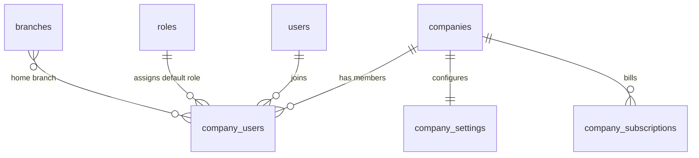

## `companies`

**Purpose.** One row per legal or trading entity using QAYD. This is the tenant. All isolation, all
billing, all fiscal configuration, and the base currency for every monetary column in the entire
platform ultimately resolve to one `companies` row.

**Attributes**

| Column | Type | Null | Notes |
|---|---|---|---|
| `id` | `BIGINT GENERATED ALWAYS AS IDENTITY` | NOT NULL | PK. |
| `uuid` | `UUID` | NOT NULL | `DEFAULT gen_random_uuid()`. Public identifier; also the value sent as `X-Company-Id` context is the integer `id`, but external references (webhooks) use `uuid`. |
| `legal_name_en` | `VARCHAR(200)` | NOT NULL | |
| `legal_name_ar` | `VARCHAR(200)` | NULL | |
| `trade_name_en` | `VARCHAR(200)` | NULL | |
| `trade_name_ar` | `VARCHAR(200)` | NULL | |
| `commercial_registration_no` | `VARCHAR(50)` | NULL | Kuwait CR number or local equivalent. |
| `tax_registration_no` | `VARCHAR(50)` | NULL | TRN, where applicable (see Tax module — Kuwait currently has no VAT regime, so this is commonly NULL for KW-only tenants and populated for AE/SA tenants). |
| `country_code` | `CHAR(2)` | NOT NULL | ISO 3166-1 alpha-2, e.g. `KW`. |
| `base_currency` | `CHAR(3)` | NOT NULL | `DEFAULT 'KWD'`. ISO 4217. Immutable after the first posted journal entry (see Update Rules). |
| `fiscal_year_start_month` | `SMALLINT` | NOT NULL | `DEFAULT 1`. `CHECK (fiscal_year_start_month BETWEEN 1 AND 12)`. |
| `logo_url` | `VARCHAR(500)` | NULL | |
| `industry` | `VARCHAR(80)` | NULL | Free-form, used for AI benchmarking/forecasting context. |
| `size_band` | `VARCHAR(20)` | NULL | `CHECK (size_band IN ('micro','small','medium','large') OR size_band IS NULL)`. |
| `status` | `VARCHAR(20)` | NOT NULL | `CHECK (status IN ('trial','active','suspended','cancelled'))`. |
| `owner_user_id` | `BIGINT` | NOT NULL | FK → `users.id`. The accountable legal signatory; distinct from any operational "Owner" role holder, though typically the same person. |
| `created_at`† | `TIMESTAMPTZ` | NOT NULL | |
| `updated_at`† | `TIMESTAMPTZ` | NOT NULL | |
| `deleted_at`† | `TIMESTAMPTZ` | NULL | |

Note: `companies` has no `company_id` column (it is the root of the tenancy tree) and no `branch_id`.

**Relationships**
- `companies` 1 --- N every tenant-scoped table in the platform (81 tables in this document alone carry
  `company_id`). Only the module-specific relationships are repeated per table below; the blanket
  "everything belongs to a company" relationship is not re-listed at every table to avoid repetition.
- `companies` 1 --- N `branches`, `company_users`, `company_subscriptions`.
- `companies` 1 --- 1 `company_settings`.

**Cardinality**
- `companies ||--o{ branches`, `companies ||--o{ company_users`, `companies ||--|| company_settings`.

**Primary Key**
- `id`.

**Foreign Keys**
- `owner_user_id` → `users.id` `ON DELETE RESTRICT ON UPDATE CASCADE` (ownership must be explicitly
  transferred before the owning user can be removed; the database refuses to let this dangle).

**Indexes**
- `UNIQUE INDEX uq_companies_uuid ON companies (uuid)`.
- `INDEX idx_companies_status ON companies (status) WHERE deleted_at IS NULL`.
- `UNIQUE INDEX uq_companies_cr_no ON companies (commercial_registration_no) WHERE commercial_registration_no IS NOT NULL`.

**Constraints**
- `CHECK (status IN ('trial','active','suspended','cancelled'))`.
- `CHECK (fiscal_year_start_month BETWEEN 1 AND 12)`.
- `CHECK (base_currency ~ '^[A-Z]{3}$')`.

**Delete Rules**
- Soft delete only, and gated: the application refuses to soft-delete a `companies` row while any
  `journal_entries.status = 'posted'` exists for it, unless the request is a compliance-driven data
  export + purge flow (owner + platform-admin dual confirmation, itself logged to `audit_logs`). Hard
  purge (real `DELETE`, cascading through every tenant table) is a separate, manually-triggered
  operation run only after the statutory retention period for financial records (typically 5–10 years
  depending on jurisdiction) has elapsed.

**Update Rules**
- `base_currency` is write-once in practice: the API rejects an `UPDATE` to `base_currency` once any row
  exists in `journal_lines` for the company, because every historical `base_debit`/`base_credit` value
  would become meaningless. Changing currency requires opening a new company/legal-entity record.
  `status` transitions from `trial`→`active` are driven by `company_subscriptions`; `active`→`suspended`
  is driven by billing failure or an Owner-level API call; `suspended`→`cancelled` is terminal and starts
  the retention clock toward hard purge.

**Example Records**
```sql
INSERT INTO companies (uuid, legal_name_en, legal_name_ar, commercial_registration_no, country_code,
                        base_currency, fiscal_year_start_month, status, owner_user_id)
VALUES (gen_random_uuid(), 'Al-Fahad Trading Co. W.L.L.', 'شركة الفهد التجارية ذ.م.م', '123456',
        'KW', 'KWD', 1, 'active', 1042);
```
```json
{
  "id": 17,
  "legal_name_en": "Al-Fahad Trading Co. W.L.L.",
  "legal_name_ar": "شركة الفهد التجارية ذ.م.م",
  "country_code": "KW",
  "base_currency": "KWD",
  "fiscal_year_start_month": 1,
  "status": "active"
}
```

**Normalization.** 3NF. `fiscal_year_start_month` is stored on the company rather than derived from the
first `fiscal_years` row because it must exist before any fiscal year has been created (it drives the
default when the first one is auto-generated at onboarding).

**Future Expansion.** `company_documents` for the CR certificate/trade license scan itself (currently
handled generically through `attachments` with `attachable_type = 'companies'`); a `parent_company_id`
self-referencing column for holding-company/subsidiary consolidation and inter-company eliminations.

## `company_users`

**Purpose.** The tenancy join: one row per (user, company) membership. This is what actually grants a
`users` row access to a `companies` row, distinct from — and a prerequisite to — the fine-grained role
grant in `user_roles` (Permissions module). A user with no `company_users` row for a company cannot see
that company at all, regardless of any role.

**Attributes**

| Column | Type | Null | Notes |
|---|---|---|---|
| `id` | `BIGINT GENERATED ALWAYS AS IDENTITY` | NOT NULL | PK. |
| `company_id`† | `BIGINT` | NOT NULL | FK → `companies.id`. |
| `user_id` | `BIGINT` | NOT NULL | FK → `users.id`. |
| `branch_id`† | `BIGINT` | NULL | The member's "home" branch; does not restrict access by itself (see Permissions module for branch-scoped role enforcement). |
| `job_title` | `VARCHAR(120)` | NULL | |
| `status` | `VARCHAR(20)` | NOT NULL | `CHECK (status IN ('active','invited','suspended'))`. |
| `is_owner` | `BOOLEAN` | NOT NULL | `DEFAULT false`. Exactly one row per company has `is_owner = true` (enforced by a partial unique index); mirrors `companies.owner_user_id` for query convenience. |
| `invited_by` | `BIGINT` | NULL | FK → `users.id`. |
| `joined_at` | `TIMESTAMPTZ` | NULL | Set on first successful login under this membership. |
| `created_at`† | `TIMESTAMPTZ` | NOT NULL | |
| `updated_at`† | `TIMESTAMPTZ` | NOT NULL | |
| `deleted_at`† | `TIMESTAMPTZ` | NULL | Soft-removing a member from a company. |

**Relationships**
- `companies` 1 --- N `company_users`; `users` 1 --- N `company_users`.
- `company_users` 1 --- N `user_roles` (a membership can carry several role grants).
- `branches` 1 --- N `company_users` (optional home-branch FK).

**Cardinality**
- `companies ||--o{ company_users`, `users ||--o{ company_users`. The join itself models the true M:N
  between `users` and `companies`: `users }o--o{ companies` via `company_users`.

**Primary Key**
- `id`.

**Foreign Keys**
- `company_id` → `companies.id` `ON DELETE CASCADE ON UPDATE CASCADE`.
- `user_id` → `users.id` `ON DELETE CASCADE ON UPDATE CASCADE` (removing the global identity removes
  its memberships; in practice `users` rows are never hard-deleted, so this is a safety net, not a live
  path).
- `branch_id` → `branches.id` `ON DELETE SET NULL ON UPDATE CASCADE`.
- `invited_by` → `users.id` `ON DELETE SET NULL ON UPDATE CASCADE`.

**Indexes**
- `UNIQUE INDEX uq_company_users_company_user ON company_users (company_id, user_id) WHERE deleted_at IS NULL`.
- `UNIQUE INDEX uq_company_users_one_owner ON company_users (company_id) WHERE is_owner = true`.
- `INDEX idx_company_users_user_id ON company_users (user_id)`.

**Constraints**
- `CHECK (status IN ('active','invited','suspended'))`.

**Delete Rules**
- `CASCADE` from `companies`/`users` as specified. Application-level removal ("remove this member from
  the company") is a soft delete (`deleted_at`), never a hard delete, so historical `created_by`
  attribution on that user's past documents remains meaningful. Removing the sole `is_owner = true`
  member is blocked until ownership is transferred to another active member.

**Update Rules**
- `is_owner` can move from one row to another within the same `company_id` only inside a single
  transaction that flips both the old and new owner rows and updates `companies.owner_user_id` together
  — enforced by a Laravel `TransferCompanyOwnership` service, never by a bare column update, so the
  partial unique index is never mid-transition inconsistent for another concurrent reader.

**Example Records**
```sql
INSERT INTO company_users (company_id, user_id, job_title, status, is_owner, joined_at)
VALUES (17, 1042, 'Managing Partner', 'active', true, now());
```
```json
{ "company_id": 17, "user_id": 1042, "job_title": "Managing Partner", "status": "active", "is_owner": true }
```

**Normalization.** 3NF.

**Future Expansion.** `department_id` direct assignment (currently reached only indirectly through
`employees.department_id` for payroll-linked staff); multi-branch home assignment (currently one
`branch_id` per membership, not an array).

## `company_settings`

**Purpose.** One row per company (strict 1:1) holding tenant-wide configuration that would otherwise be
scattered as magic defaults across the application: localization defaults, document numbering
sequences, and the company's AI autonomy posture.

**Attributes**

| Column | Type | Null | Notes |
|---|---|---|---|
| `id` | `BIGINT GENERATED ALWAYS AS IDENTITY` | NOT NULL | PK. |
| `company_id` | `BIGINT` | NOT NULL | FK → `companies.id`. `UNIQUE` — enforces 1:1. |
| `default_language` | `VARCHAR(5)` | NOT NULL | `DEFAULT 'en'`. |
| `date_format` | `VARCHAR(20)` | NOT NULL | `DEFAULT 'DD/MM/YYYY'`. |
| `number_format` | `VARCHAR(10)` | NOT NULL | `DEFAULT '#,##0.###'`. |
| `current_fiscal_year_id` | `BIGINT` | NULL | FK → `fiscal_years.id`. |
| `invoice_prefix` | `VARCHAR(10)` | NOT NULL | `DEFAULT 'INV-'`. |
| `invoice_next_number` | `BIGINT` | NOT NULL | `DEFAULT 1`. Incremented transactionally (`SELECT ... FOR UPDATE`) on each new invoice to guarantee gap-aware, collision-free numbering. |
| `bill_prefix` | `VARCHAR(10)` | NOT NULL | `DEFAULT 'BILL-'`. |
| `bill_next_number` | `BIGINT` | NOT NULL | `DEFAULT 1`. |
| `default_payment_terms_days` | `SMALLINT` | NOT NULL | `DEFAULT 30`. |
| `default_tax_code_id` | `BIGINT` | NULL | FK → `tax_codes.id`. |
| `ai_autonomy_level` | `VARCHAR(20)` | NOT NULL | `DEFAULT 'suggest_only'`. `CHECK (ai_autonomy_level IN ('suggest_only','approval_required','auto'))`. Company-wide ceiling; individual `ai_agents` rows may be further restricted but never loosened beyond this. |
| `branding` | `JSONB` | NOT NULL | `DEFAULT '{}'`. Colors/logo placement for generated PDFs. |
| `created_at`† | `TIMESTAMPTZ` | NOT NULL | |
| `updated_at`† | `TIMESTAMPTZ` | NOT NULL | |

**Relationships**
- `companies` 1 --- 1 `company_settings`.
- `fiscal_years` 1 --- N `company_settings` (as the "current" pointer; not the inverse — a fiscal year
  does not belong to settings, settings merely points at one).
- `tax_codes` 1 --- N `company_settings` (default tax code pointer).

**Cardinality**
- `companies ||--|| company_settings` (strict 1:1 — a row is created synchronously when a company is
  created, by the same `CreateCompany` service transaction, never lazily).

**Primary Key**
- `id`.

**Foreign Keys**
- `company_id` → `companies.id` `ON DELETE CASCADE ON UPDATE CASCADE`.
- `current_fiscal_year_id` → `fiscal_years.id` `ON DELETE SET NULL ON UPDATE CASCADE`.
- `default_tax_code_id` → `tax_codes.id` `ON DELETE SET NULL ON UPDATE CASCADE`.

**Indexes**
- `UNIQUE INDEX uq_company_settings_company_id ON company_settings (company_id)`.

**Constraints**
- `CHECK (ai_autonomy_level IN ('suggest_only','approval_required','auto'))`.
- `CHECK (invoice_next_number > 0 AND bill_next_number > 0)`.

**Delete Rules**
- `CASCADE` with `companies`. Never independently deleted.

**Update Rules**
- `invoice_next_number`/`bill_next_number` are only ever incremented, inside the same transaction that
  creates the numbered document, via `UPDATE company_settings SET invoice_next_number = invoice_next_number + 1 WHERE company_id = ? RETURNING invoice_next_number - 1` — guaranteeing no two invoices are
  ever issued the same number even under concurrent requests, and no gap is silently introduced by a
  read-then-write race.

**Example Records**
```sql
INSERT INTO company_settings (company_id, default_language, invoice_prefix, invoice_next_number, ai_autonomy_level)
VALUES (17, 'en', 'INV-', 1, 'approval_required');
```
```json
{ "company_id": 17, "invoice_prefix": "INV-", "invoice_next_number": 248, "ai_autonomy_level": "approval_required" }
```

**Normalization.** 3NF, functionally a vertical partition of `companies` split out to isolate
high-churn configuration writes from the low-churn identity row (avoids `companies` row-lock contention
when only a numbering counter changes).

**Future Expansion.** Per-document-type numbering beyond invoice/bill (quotations, credit notes
currently share a simpler in-table `_number` sequence per their own table; a generalized
`document_sequences(company_id, document_type, prefix, next_number)` table is the natural v2
consolidation, noted here and not built in v1 to avoid a premature abstraction over two cases).

## `company_subscriptions`

**Purpose.** One row per billing period/plan state for a company's commercial relationship with QAYD
itself (QAYD-as-SaaS billing, not to be confused with the company's own AR/AP — this table lives in the
Companies module precisely to keep "QAYD's revenue" out of the Accounting module's multi-tenant ledger).

**Attributes**

| Column | Type | Null | Notes |
|---|---|---|---|
| `id` | `BIGINT GENERATED ALWAYS AS IDENTITY` | NOT NULL | PK. |
| `company_id`† | `BIGINT` | NOT NULL | FK → `companies.id`. |
| `plan_code` | `VARCHAR(20)` | NOT NULL | `CHECK (plan_code IN ('free','starter','growth','enterprise'))`. |
| `status` | `VARCHAR(20)` | NOT NULL | `CHECK (status IN ('trialing','active','past_due','canceled'))`. |
| `seats_included` | `INTEGER` | NOT NULL | |
| `seats_used` | `INTEGER` | NOT NULL | `DEFAULT 0`. Denormalized `COUNT` of active `company_users`, refreshed by trigger on membership change. |
| `price_per_seat` | `NUMERIC(19,4)` | NOT NULL | |
| `billing_cycle` | `VARCHAR(10)` | NOT NULL | `CHECK (billing_cycle IN ('monthly','annual'))`. |
| `current_period_start` | `TIMESTAMPTZ` | NOT NULL | |
| `current_period_end` | `TIMESTAMPTZ` | NOT NULL | |
| `trial_ends_at` | `TIMESTAMPTZ` | NULL | |
| `canceled_at` | `TIMESTAMPTZ` | NULL | |
| `payment_provider` | `VARCHAR(30)` | NULL | e.g. `stripe`. |
| `payment_provider_customer_id` | `VARCHAR(120)` | NULL | |
| `created_at`† | `TIMESTAMPTZ` | NOT NULL | |
| `updated_at`† | `TIMESTAMPTZ` | NOT NULL | |

**Relationships**
- `companies` 1 --- N `company_subscriptions` (historical — a new row is inserted on plan change rather
  than updating the old one in place, preserving billing history).

**Cardinality**
- `companies ||--o{ company_subscriptions`, with at most one row per company having
  `status IN ('trialing','active','past_due')` at any time (enforced by partial unique index).

**Primary Key**
- `id`.

**Foreign Keys**
- `company_id` → `companies.id` `ON DELETE CASCADE ON UPDATE CASCADE`.

**Indexes**
- `INDEX idx_company_subscriptions_company_id ON company_subscriptions (company_id)`.
- `UNIQUE INDEX uq_company_subscriptions_one_live ON company_subscriptions (company_id) WHERE status IN ('trialing','active','past_due')`.

**Constraints**
- `CHECK (plan_code IN ('free','starter','growth','enterprise'))`.
- `CHECK (current_period_end > current_period_start)`.
- `CHECK (seats_used <= seats_included OR plan_code = 'enterprise')` (enterprise plans may exceed the
  nominal seat count pending a true-up invoice).

**Delete Rules**
- `CASCADE` with `companies` only on hard purge; otherwise retained indefinitely for billing history and
  never deleted independently.

**Update Rules**
- A plan/cycle change inserts a new row rather than mutating `plan_code` on the existing one, so
  `company_subscriptions` is an append-mostly history; only `status`, `seats_used`, and `canceled_at`
  are updated in place on the current live row.

**Example Records**
```sql
INSERT INTO company_subscriptions (company_id, plan_code, status, seats_included, seats_used,
                                    price_per_seat, billing_cycle, current_period_start, current_period_end)
VALUES (17, 'growth', 'active', 10, 6, 15.0000, 'monthly', '2026-07-01', '2026-08-01');
```
```json
{
  "company_id": 17,
  "plan_code": "growth",
  "status": "active",
  "seats_included": 10,
  "seats_used": 6,
  "current_period_end": "2026-08-01T00:00:00Z"
}
```

**Normalization.** 3NF. `seats_used` is a deliberate denormalization (a cached count) to avoid a
`COUNT(*)` over `company_users` on every billing-gate check; kept correct by a trigger on
`company_users` insert/soft-delete.

**Future Expansion.** `invoices`-style billing documents for QAYD's own SaaS invoices to the tenant
(distinct from the tenant's own `invoices` table) via a dedicated `platform_invoices` table; usage-based
add-ons (AI message volume, storage) as separate metered line items.

# Branches

The Branches module holds the physical/organizational locations a company operates from: legal branches
(for tax and reporting segmentation), internal departments, and warehouses (the physical inventory
locations consumed by the Inventory module). `branch_id` on any other table is a foreign key into
`branches` defined here.

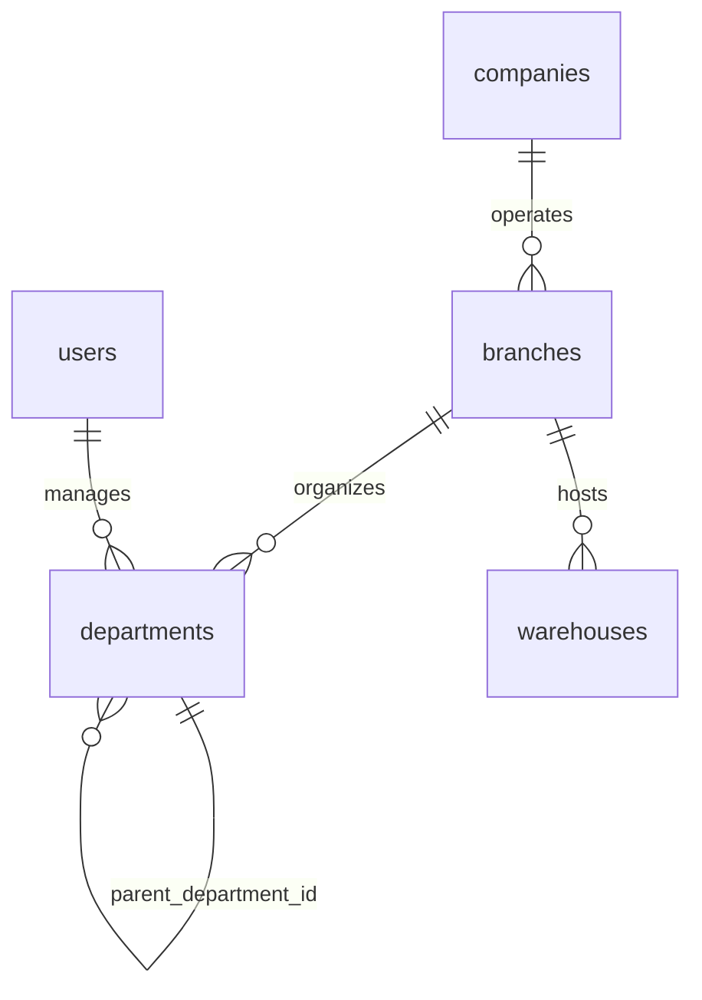

## `branches`

**Purpose.** A physical or legal place of business — a shop, office, or branch license — that other
records can be scoped to via `branch_id`.

**Attributes**

| Column | Type | Null | Notes |
|---|---|---|---|
| `id` | `BIGINT GENERATED ALWAYS AS IDENTITY` | NOT NULL | PK. |
| `company_id`† | `BIGINT` | NOT NULL | FK → `companies.id`. |
| `code` | `VARCHAR(20)` | NOT NULL | Short mnemonic, e.g. `HQ`, `SALMIYA-01`. |
| `name_en` | `VARCHAR(150)` | NOT NULL | |
| `name_ar` | `VARCHAR(150)` | NULL | |
| `address` | `TEXT` | NULL | |
| `city` | `VARCHAR(80)` | NULL | |
| `country_code` | `CHAR(2)` | NOT NULL | |
| `phone` | `VARCHAR(20)` | NULL | |
| `is_head_office` | `BOOLEAN` | NOT NULL | `DEFAULT false`. Exactly one `true` per company (partial unique index). |
| `timezone` | `VARCHAR(50)` | NOT NULL | `DEFAULT 'Asia/Kuwait'`. |
| `status` | `VARCHAR(20)` | NOT NULL | `CHECK (status IN ('active','inactive'))`. |
| `created_at`† / `updated_at`† / `deleted_at`† | — | — | Standard columns. |

**Relationships** `companies` 1—N `branches`; `branches` 1—N `departments`, `warehouses`, and every
`branch_id`-bearing table platform-wide (not re-listed per table).

**Cardinality** `companies ||--o{ branches`.

**Primary Key** `id`.

**Foreign Keys** `company_id` → `companies.id` `ON DELETE CASCADE ON UPDATE CASCADE`.

**Indexes** `UNIQUE (company_id, code)`; `UNIQUE (company_id) WHERE is_head_office = true`;
`INDEX (company_id, status)`.

**Constraints** `CHECK (status IN ('active','inactive'))`.

**Delete Rules** Soft delete only; blocked while any `warehouses`/`departments`/transactional row
still references the branch as active (must be reassigned or the branch reactivated first).

**Update Rules** `is_head_office` reassignment is transactional (old + new row flipped together), same
pattern as `company_users.is_owner`.

**Example Records**
```sql
INSERT INTO branches (company_id, code, name_en, name_ar, city, country_code, is_head_office, status)
VALUES (17, 'HQ', 'Head Office', 'المكتب الرئيسي', 'Kuwait City', 'KW', true, 'active');
```
```json
{ "id": 3, "code": "HQ", "name_en": "Head Office", "is_head_office": true, "status": "active" }
```

**Normalization.** 3NF.

**Future Expansion.** `opening_hours` JSONB for retail branches; geolocation (`lat`/`lng`) for delivery
routing.

## `departments`

**Purpose.** Internal organizational units (Finance, Sales, Warehouse Ops) used for reporting rollups,
manager attribution, and payroll cost allocation, independent of legal branch structure.

**Attributes**

| Column | Type | Null | Notes |
|---|---|---|---|
| `id` | `BIGINT GENERATED ALWAYS AS IDENTITY` | NOT NULL | PK. |
| `company_id`† | `BIGINT` | NOT NULL | |
| `branch_id`† | `BIGINT` | NULL | |
| `code` | `VARCHAR(20)` | NOT NULL | |
| `name_en` | `VARCHAR(120)` | NOT NULL | |
| `name_ar` | `VARCHAR(120)` | NULL | |
| `parent_department_id` | `BIGINT` | NULL | Self-FK; supports a department tree. |
| `manager_user_id` | `BIGINT` | NULL | FK → `users.id`. |
| `cost_center_id` | `BIGINT` | NULL | FK → `cost_centers.id` (Accounting module) — links org structure to GL cost allocation. |
| `status` | `VARCHAR(20)` | NOT NULL | `CHECK (status IN ('active','inactive'))`. |
| `created_at`† / `updated_at`† / `deleted_at`† | — | — | Standard columns. |

**Relationships** `branches` 1—N `departments`; `departments` 1—N `departments` (self); `employees`
(Payroll) N—1 `departments`; `cost_centers` (Accounting) 1—N `departments`.

**Cardinality** `branches ||--o{ departments`; `departments ||--o{ departments`.

**Primary Key** `id`.

**Foreign Keys** `company_id` → `companies.id ON DELETE CASCADE`; `branch_id` → `branches.id ON DELETE
SET NULL`; `parent_department_id` → `departments.id ON DELETE SET NULL`; `manager_user_id` →
`users.id ON DELETE SET NULL`; `cost_center_id` → `cost_centers.id ON DELETE SET NULL`.

**Indexes** `UNIQUE (company_id, code)`; `INDEX (parent_department_id)`; `INDEX (company_id, status)`.

**Constraints** `CHECK (id <> parent_department_id)`; a trigger blocks cyclical parent chains.

**Delete Rules** Soft delete; `employees.department_id` is `SET NULL` on removal rather than blocked,
since headcount reassignment is common and should not be a hard blocker.

**Update Rules** Re-parenting is allowed at any time; the cost-center link may be changed but does not
retroactively re-tag already-posted `journal_lines.department_id`.

**Example Records**
```sql
INSERT INTO departments (company_id, branch_id, code, name_en, manager_user_id, status)
VALUES (17, 3, 'FIN', 'Finance', 1042, 'active');
```
```json
{ "id": 8, "code": "FIN", "name_en": "Finance", "status": "active" }
```

**Normalization.** 3NF; the adjacency-list self-FK is the standard, index-friendly tree representation
for department depths typically under 5 levels.

**Future Expansion.** Materialized-path or `ltree` column if department trees grow deep enough that
recursive CTEs become a reporting bottleneck.

## `warehouses`

**Purpose.** A physical or virtual stock-holding location, consumed throughout the Inventory module as
the unit `inventory_items`/`stock_movements` are scoped to.

**Attributes**

| Column | Type | Null | Notes |
|---|---|---|---|
| `id` | `BIGINT GENERATED ALWAYS AS IDENTITY` | NOT NULL | PK. |
| `company_id`† | `BIGINT` | NOT NULL | |
| `branch_id`† | `BIGINT` | NULL | |
| `code` | `VARCHAR(20)` | NOT NULL | |
| `name_en` | `VARCHAR(120)` | NOT NULL | |
| `name_ar` | `VARCHAR(120)` | NULL | |
| `address` | `TEXT` | NULL | |
| `type` | `VARCHAR(20)` | NOT NULL | `CHECK (type IN ('main','retail','transit','virtual'))`. `virtual` supports drop-ship/consignment stock with no physical address. |
| `is_default` | `BOOLEAN` | NOT NULL | `DEFAULT false`. One default per company (partial unique index). |
| `status` | `VARCHAR(20)` | NOT NULL | `CHECK (status IN ('active','inactive'))`. |
| `created_at`† / `updated_at`† / `deleted_at`† | — | — | Standard columns. |

**Relationships** `branches` 1—N `warehouses`; `warehouses` 1—N `inventory_items`, `stock_movements`,
`goods_receipts`, `stock_transfers` (as source/destination) — detailed in the Inventory module.

**Cardinality** `branches ||--o{ warehouses`.

**Primary Key** `id`.

**Foreign Keys** `company_id` → `companies.id ON DELETE CASCADE`; `branch_id` → `branches.id ON DELETE
SET NULL`.

**Indexes** `UNIQUE (company_id, code)`; `UNIQUE (company_id) WHERE is_default = true`;
`INDEX (company_id, status)`.

**Constraints** `CHECK (type IN ('main','retail','transit','virtual'))`.

**Delete Rules** Soft delete blocked while `inventory_items.quantity_on_hand <> 0` exists for the
warehouse — stock must be transferred out or written off first.

**Update Rules** `type` may not change from `virtual` to a physical type (or back) once any
`stock_movements` row exists, since costing/valuation logic differs by type.

**Example Records**
```sql
INSERT INTO warehouses (company_id, branch_id, code, name_en, type, is_default, status)
VALUES (17, 3, 'WH-MAIN', 'Main Warehouse', 'main', true, 'active');
```
```json
{ "id": 5, "code": "WH-MAIN", "name_en": "Main Warehouse", "type": "main", "is_default": true }
```

**Normalization.** 3NF.

**Future Expansion.** Bin-level hierarchy (`warehouse_zones`/`warehouse_aisles`/`warehouse_shelves`/
`warehouse_bins`) for large distribution centers — deferred from this v1 ERD; `inventory_items` would
gain an optional `warehouse_bin_id` when introduced.

# Permissions

The Permissions module implements default-deny RBAC: a catalog of granular permission keys, roles that
bundle them, and the assignment of roles to a specific user within a specific company (and optionally a
specific branch).

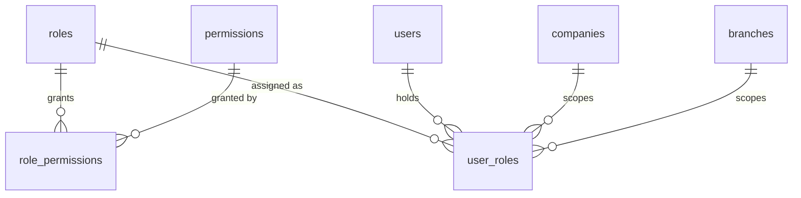

## `roles`

**Purpose.** A named bundle of permissions (`Owner`, `Accountant`, `Auditor`, …). System roles
(`company_id IS NULL`) ship with the platform; a company may also define custom roles.

**Attributes**

| Column | Type | Null | Notes |
|---|---|---|---|
| `id` | `BIGINT GENERATED ALWAYS AS IDENTITY` | NOT NULL | PK. |
| `company_id` | `BIGINT` | NULL | FK → `companies.id`. `NULL` = system default role template. |
| `name_en` | `VARCHAR(80)` | NOT NULL | |
| `name_ar` | `VARCHAR(80)` | NULL | |
| `code` | `VARCHAR(40)` | NOT NULL | e.g. `owner`, `cfo`, `finance_manager`, `senior_accountant`, `accountant`, `auditor`, `hr_manager`, `payroll_officer`, `inventory_manager`, `warehouse_employee`, `sales_manager`, `sales_employee`, `purchasing_manager`, `purchasing_employee`, `read_only`, `external_auditor`, or a custom slug. |
| `is_system` | `BOOLEAN` | NOT NULL | `DEFAULT false`. System roles cannot be edited or deleted by tenants. |
| `description` | `TEXT` | NULL | |
| `created_at`† / `updated_at`† / `deleted_at`† | — | — | Standard columns (`company_id`/`branch_id` per above; no `branch_id` on this table). |

**Relationships** `roles` 1—N `role_permissions`, `user_roles`, `user_invitations`.

**Cardinality** `roles ||--o{ role_permissions`; `roles }o--o{ permissions` in effect, through the join.

**Primary Key** `id`.

**Foreign Keys** `company_id` → `companies.id ON DELETE CASCADE ON UPDATE CASCADE` (NULL for system rows,
so cascade never fires for them).

**Indexes** `UNIQUE (company_id, code)`; `INDEX (is_system)`.

**Constraints** `CHECK (is_system = false OR company_id IS NULL)` — a system role can never carry a
`company_id`.

**Delete Rules** Soft delete blocked while any `user_roles` row references it; system roles cannot be
deleted at all (enforced in the policy layer, not just the constraint).

**Update Rules** `code` is immutable after creation (roles are referenced by code in seed data and AI
agent prompts); only `name_en`/`name_ar`/`description` and the linked `role_permissions` set may change.

**Example Records**
```sql
INSERT INTO roles (company_id, name_en, code, is_system) VALUES (NULL, 'Accountant', 'accountant', true);
```
```json
{ "id": 6, "name_en": "Accountant", "code": "accountant", "is_system": true }
```

**Normalization.** 3NF.

**Future Expansion.** Role templates that a company can clone-then-customize (currently a company either
uses a system role as-is or creates an unrelated custom one).

## `permissions`

**Purpose.** The global catalog of granular permission keys, named `<area>.<action>` or
`<area>.<entity>.<action>` (e.g. `accounting.journal.post`, `bank.reconcile`, `payroll.approve`,
`inventory.adjust`, `tax.submit`, `reports.export`).

**Attributes**

| Column | Type | Null | Notes |
|---|---|---|---|
| `id` | `BIGINT GENERATED ALWAYS AS IDENTITY` | NOT NULL | PK. |
| `key` | `VARCHAR(80)` | NOT NULL | Unique, dotted key. |
| `area` | `VARCHAR(30)` | NOT NULL | e.g. `accounting`, `bank`, `payroll`. |
| `entity` | `VARCHAR(30)` | NULL | e.g. `journal`. |
| `action` | `VARCHAR(30)` | NOT NULL | e.g. `post`, `create`, `read`, `approve`. |
| `description` | `TEXT` | NULL | |
| `is_sensitive` | `BOOLEAN` | NOT NULL | `DEFAULT false`. `true` forces a human-approval chain regardless of role (bank transfers, payroll release, tax submission, deleting/voiding financial data, permission changes, company settings). |
| `created_at`† / `updated_at`† | — | — | No `company_id` — global catalog. |

**Relationships** `permissions` 1—N `role_permissions`.

**Cardinality** `permissions ||--o{ role_permissions`.

**Primary Key** `id`.

**Foreign Keys** None (global catalog; not tenant-scoped).

**Indexes** `UNIQUE (key)`; `INDEX (area, entity)`; `INDEX (is_sensitive) WHERE is_sensitive = true`.

**Constraints** `CHECK (key ~ '^[a-z_]+(\.[a-z_]+){1,2}$')`.

**Delete Rules** Never deleted in production; new permissions are added by migration as features ship,
and a permission that becomes obsolete is deprecated (`description` prefixed `[DEPRECATED]`) rather than
removed, so historical `role_permissions`/`audit_logs` rows referencing it stay meaningful.

**Update Rules** `key` is immutable; `is_sensitive` may be tightened but not loosened without a
platform-level change-review (loosening a sensitive flag is itself a `permission_changed` security event).

**Example Records**
```sql
INSERT INTO permissions (key, area, entity, action, is_sensitive)
VALUES ('bank.transfer', 'bank', NULL, 'transfer', true);
```
```json
{ "key": "bank.transfer", "area": "bank", "action": "transfer", "is_sensitive": true }
```

**Normalization.** 3NF.

**Future Expansion.** Permission groups/bundles as a query convenience layer over the flat catalog.

## `role_permissions`

**Purpose.** Join table granting a permission to a role.

**Attributes**

| Column | Type | Null | Notes |
|---|---|---|---|
| `id` | `BIGINT GENERATED ALWAYS AS IDENTITY` | NOT NULL | PK. |
| `role_id` | `BIGINT` | NOT NULL | FK → `roles.id`. |
| `permission_id` | `BIGINT` | NOT NULL | FK → `permissions.id`. |
| `created_at`† | `TIMESTAMPTZ` | NOT NULL | |

**Relationships** Pure M:N join between `roles` and `permissions`.

**Cardinality** `roles }o--o{ permissions`.

**Primary Key** `id` (surrogate; the natural key is the unique pair below).

**Foreign Keys** `role_id` → `roles.id ON DELETE CASCADE`; `permission_id` → `permissions.id ON DELETE
CASCADE`.

**Indexes** `UNIQUE (role_id, permission_id)`; `INDEX (permission_id)`.

**Constraints** None beyond the FKs and unique pair.

**Delete Rules** `CASCADE` from either parent — a deleted role or a deprecated-and-removed permission
(rare; see above) removes the grant row itself, which is pure join metadata with no independent history
value.

**Update Rules** Immutable rows; a change in grants is a delete-and-reinsert, not an update.

**Example Records**
```sql
INSERT INTO role_permissions (role_id, permission_id) VALUES (6, 41);
```
```json
{ "role_id": 6, "permission_id": 41 }
```

**Normalization.** BCNF (pure associative table).

**Future Expansion.** A `granted_at`/`granted_by` pair if per-grant audit becomes necessary beyond what
`audit_logs` already captures at the role level.

## `user_roles`

**Purpose.** Assigns a role to a user within a specific company (and optionally scopes it to one
branch), separate from — and layered on top of — the coarse-grained `company_users` membership.

**Attributes**

| Column | Type | Null | Notes |
|---|---|---|---|
| `id` | `BIGINT GENERATED ALWAYS AS IDENTITY` | NOT NULL | PK. |
| `company_id`† | `BIGINT` | NOT NULL | |
| `user_id` | `BIGINT` | NOT NULL | FK → `users.id`. |
| `role_id` | `BIGINT` | NOT NULL | FK → `roles.id`. |
| `branch_id`† | `BIGINT` | NULL | `NULL` = role applies company-wide. |
| `granted_by` | `BIGINT` | NULL | FK → `users.id`. |
| `granted_at` | `TIMESTAMPTZ` | NOT NULL | `DEFAULT now()`. |
| `expires_at` | `TIMESTAMPTZ` | NULL | Time-boxed grants (e.g. temporary External Auditor access). |
| `created_at`† / `updated_at`† / `deleted_at`† | — | — | Standard columns. |

**Relationships** `users` 1—N `user_roles`; `roles` 1—N `user_roles`; `company_users` is a logical
prerequisite (a `user_roles` row is only meaningful if a matching `company_users` row exists — enforced
in the application layer, not a DB-level composite FK, to avoid a chicken-and-egg constraint during
onboarding transactions).

**Cardinality** `users ||--o{ user_roles`; `roles ||--o{ user_roles`.

**Primary Key** `id`.

**Foreign Keys** `company_id` → `companies.id ON DELETE CASCADE`; `user_id` → `users.id ON DELETE
CASCADE`; `role_id` → `roles.id ON DELETE RESTRICT` (a role in active use cannot be deleted); `branch_id`
→ `branches.id ON DELETE SET NULL`; `granted_by` → `users.id ON DELETE SET NULL`.

**Indexes** `UNIQUE (company_id, user_id, role_id, branch_id)` (NULLS treated as a distinct value via a
COALESCE-based expression index, so a company-wide and a branch-scoped grant of the same role can
coexist); `INDEX (user_id, company_id)`.

**Constraints** `CHECK (expires_at IS NULL OR expires_at > granted_at)`.

**Delete Rules** Soft delete (revocation); a revoked grant is retained for audit history rather than
purged.

**Update Rules** `role_id`/`branch_id` are immutable on a grant; changing either is modeled as
revoke-and-regrant so `audit_logs` shows an explicit trail of what changed, not an in-place mutation that
would obscure it.

**Example Records**
```sql
INSERT INTO user_roles (company_id, user_id, role_id, granted_by) VALUES (17, 1088, 6, 1042);
```
```json
{ "company_id": 17, "user_id": 1088, "role_id": 6, "role_code": "accountant", "branch_id": null }
```

**Normalization.** 3NF.

**Future Expansion.** Approval workflows for self-service role requests (a user requests a role, an
Owner/CFO approves) — currently grants are admin-initiated only.

# Accounting

The Accounting module is the platform's core: the Chart of Accounts, fiscal calendar, and the
double-entry journal that every other module posts into. General Ledger and Trial Balance are
**derived** from posted `journal_lines`; they store no primary data of their own. `ledger_entries` is a
materialized projection kept only for query speed. Sales, Purchasing, Banking, Inventory, Payroll, and
Tax each post into this module via domain events (`invoice.posted`, `bill.posted`, `payment.received`,
`payroll.completed`, `stock_adjustment.posted`, …) — never by writing directly into another module's
tables.

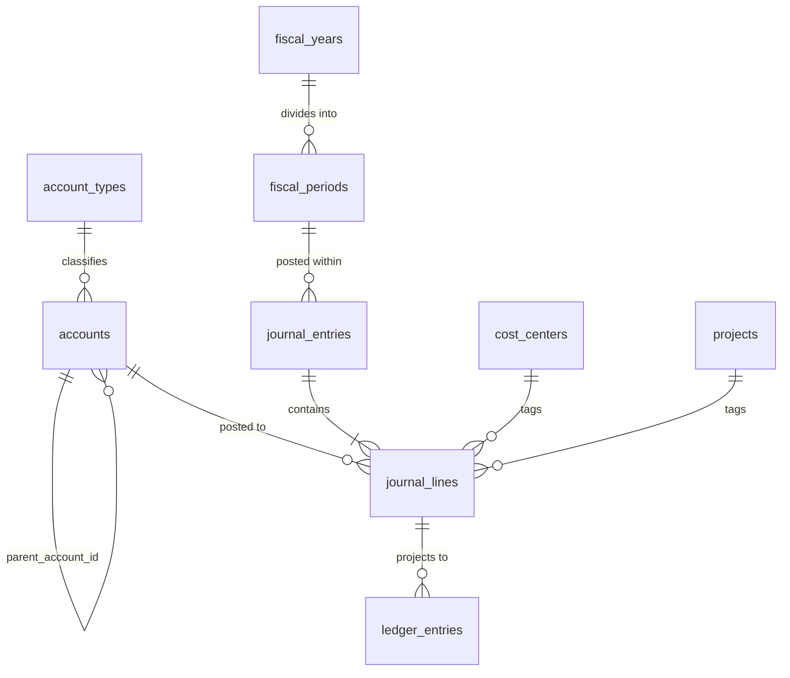

## `account_types`

**Purpose.** The five fixed accounting classifications (asset, liability, equity, revenue, expense) and
each one's normal balance side. System-level, not tenant-scoped — every company shares the same five
rows.

**Attributes**

| Column | Type | Null | Notes |
|---|---|---|---|
| `id` | `BIGINT GENERATED ALWAYS AS IDENTITY` | NOT NULL | PK. |
| `code` | `VARCHAR(20)` | NOT NULL | `asset`, `liability`, `equity`, `revenue`, `expense`. |
| `name_en` / `name_ar` | `VARCHAR(60)` | NOT NULL / NULL | |
| `normal_balance` | `VARCHAR(6)` | NOT NULL | `CHECK (normal_balance IN ('debit','credit'))`. Debit-normal: asset, expense. Credit-normal: liability, equity, revenue. |
| `is_system` | `BOOLEAN` | NOT NULL | `DEFAULT true`. |

**Relationships** `account_types` 1—N `accounts`.

**Cardinality** `account_types ||--o{ accounts`.

**Primary Key** `id`.

**Foreign Keys** None (global catalog).

**Indexes** `UNIQUE (code)`.

**Constraints** `CHECK (normal_balance IN ('debit','credit'))`; exactly 5 seed rows, enforced by
migration, not by a DB constraint (a 6th classification is a schema change, not tenant data).

**Delete Rules** Never deleted — referenced by every `accounts` row in every tenant.

**Update Rules** Immutable after seed; `normal_balance` never changes (it is an accounting axiom, not
configuration).

**Example Records**
```sql
INSERT INTO account_types (code, name_en, normal_balance) VALUES ('asset', 'Asset', 'debit');
```
```json
{ "code": "asset", "name_en": "Asset", "normal_balance": "debit" }
```

**Normalization.** 3NF; a lookup table kept separate from `accounts` so `normal_balance` is defined once,
not repeated per account.

**Future Expansion.** None anticipated — this is a closed, five-row domain by accounting definition.

## `accounts`

**Purpose.** The Chart of Accounts: a per-company tree of postable and header (roll-up) accounts. Every
`journal_lines.account_id` points here; this table is the backbone the General Ledger is built from.

**Attributes**

| Column | Type | Null | Notes |
|---|---|---|---|
| `id` | `BIGINT GENERATED ALWAYS AS IDENTITY` | NOT NULL | PK. |
| `company_id`† | `BIGINT` | NOT NULL | |
| `account_type_id` | `BIGINT` | NOT NULL | FK → `account_types.id`. |
| `parent_account_id` | `BIGINT` | NULL | Self-FK; builds the tree (e.g. `1000 Assets` → `1100 Current Assets` → `1110 Cash and Banks`). |
| `code` | `VARCHAR(20)` | NOT NULL | e.g. `1110`. |
| `name_en` / `name_ar` | `VARCHAR(150)` | NOT NULL / NULL | |
| `currency_code` | `CHAR(3)` | NULL | Set only for a foreign-currency-denominated account; `NULL` uses company base currency. |
| `is_control_account` | `BOOLEAN` | NOT NULL | `DEFAULT false`. |
| `control_account_for` | `VARCHAR(20)` | NULL | `CHECK (control_account_for IN ('customers','vendors') OR control_account_for IS NULL)`. |
| `is_postable` | `BOOLEAN` | NOT NULL | `DEFAULT true`. `false` = header/roll-up account; journal lines may not post to it. |
| `status` | `VARCHAR(20)` | NOT NULL | `CHECK (status IN ('active','inactive'))`. |
| `opening_balance` | `NUMERIC(19,4)` | NOT NULL | `DEFAULT 0`. |
| `created_at`† / `updated_at`† / `deleted_at`† | — | — | Standard columns. |

**Relationships** `account_types` 1—N `accounts`; `accounts` 1—N `accounts` (self, tree);
`accounts` 1—N `journal_lines`; `customers`/`vendors` N—1 `accounts` (their `control_account_id`).

**Cardinality** `account_types ||--o{ accounts`; `accounts ||--o{ accounts`; `accounts ||--o{ journal_lines`.

**Primary Key** `id`.

**Foreign Keys** `company_id` → `companies.id ON DELETE CASCADE`; `account_type_id` →
`account_types.id ON DELETE RESTRICT`; `parent_account_id` → `accounts.id ON DELETE RESTRICT` (cannot
delete a parent while children exist — must re-parent first).

**Indexes** `UNIQUE (company_id, code)`; `INDEX (parent_account_id)`; `INDEX (company_id, is_postable,
status)`; `INDEX (company_id, is_control_account) WHERE is_control_account = true`.

**Constraints** `CHECK (is_control_account = false OR control_account_for IS NOT NULL)`;
`CHECK (id <> parent_account_id)`; a trigger blocks a `journal_lines` insert against a non-postable
account (`is_postable = false`).

**Delete Rules** Soft delete blocked while `journal_lines` reference the account (permanent history) or
while child accounts exist; a no-longer-used account is set `status = 'inactive'` instead, which blocks
new postings without touching history.

**Update Rules** `account_type_id` is immutable once any `journal_lines` row exists against the account
(changing debit/credit "normal side" retroactively would misstate every historical balance); `code` may
be renumbered (rare, company-wide chart renumbering project) via a dedicated service that updates all
denormalized references atomically.

**Example Records**
```sql
INSERT INTO accounts (company_id, account_type_id, parent_account_id, code, name_en, is_postable, status)
VALUES (17, 1, 42, '1110', 'Cash and Banks', true, 'active');
```
```json
{ "id": 210, "code": "1110", "name_en": "Cash and Banks", "account_type": "asset", "is_postable": true }
```

**Normalization.** 3NF; the adjacency-list tree is standard for a chart of accounts of a few hundred to
low thousands of nodes.

**Future Expansion.** Multi-level consolidation mapping (`consolidation_account_id`) for group reporting
across related companies.

## `fiscal_years`

**Purpose.** A company's accounting year, the top of the period hierarchy that every posted document
must fall within.

**Attributes**

| Column | Type | Null | Notes |
|---|---|---|---|
| `id` | `BIGINT GENERATED ALWAYS AS IDENTITY` | NOT NULL | PK. |
| `company_id`† | `BIGINT` | NOT NULL | |
| `name` | `VARCHAR(20)` | NOT NULL | e.g. `FY2026`. |
| `start_date` / `end_date` | `DATE` | NOT NULL | |
| `status` | `VARCHAR(20)` | NOT NULL | `CHECK (status IN ('open','closed','locked'))`. |
| `closed_by` | `BIGINT` | NULL | FK → `users.id`. |
| `closed_at` | `TIMESTAMPTZ` | NULL | |
| `created_at`† / `updated_at`† | — | — | Standard columns. |

**Relationships** `fiscal_years` 1—N `fiscal_periods`.

**Cardinality** `fiscal_years ||--|{ fiscal_periods` (a fiscal year always has at least one period).

**Primary Key** `id`.

**Foreign Keys** `company_id` → `companies.id ON DELETE CASCADE`; `closed_by` → `users.id ON DELETE
SET NULL`.

**Indexes** `UNIQUE (company_id, name)`; `INDEX (company_id, start_date, end_date)`.

**Constraints** `CHECK (end_date > start_date)`; a trigger rejects overlapping date ranges per company.

**Delete Rules** Never hard-deleted once `status <> 'open'`; a fiscal year with any posted activity is
retained permanently (statutory requirement).

**Update Rules** `open → closed` requires every child `fiscal_periods` to be `closed` first;
`closed → locked` is one-way and blocks even adjustment/reversal entries (used after external audit
sign-off).

**Example Records**
```sql
INSERT INTO fiscal_years (company_id, name, start_date, end_date, status) VALUES (17, 'FY2026', '2026-01-01', '2026-12-31', 'open');
```
```json
{ "id": 4, "name": "FY2026", "start_date": "2026-01-01", "end_date": "2026-12-31", "status": "open" }
```

**Normalization.** 3NF.

**Future Expansion.** Automated year-end closing entries (retained earnings roll-forward) as a
system-generated `journal_entries` row tagged `source_type = 'year_end_close'`.

## `fiscal_periods`

**Purpose.** The monthly (or other cadence) subdivision of a fiscal year that every `journal_entries`
row is posted within; the natural unit for period-close and for period-scoped reporting.

**Attributes**

| Column | Type | Null | Notes |
|---|---|---|---|
| `id` | `BIGINT GENERATED ALWAYS AS IDENTITY` | NOT NULL | PK. |
| `company_id`† | `BIGINT` | NOT NULL | |
| `fiscal_year_id` | `BIGINT` | NOT NULL | FK → `fiscal_years.id`. |
| `period_number` | `SMALLINT` | NOT NULL | `CHECK (period_number BETWEEN 1 AND 12)`. |
| `name` | `VARCHAR(20)` | NOT NULL | e.g. `Jan 2026`. |
| `start_date` / `end_date` | `DATE` | NOT NULL | |
| `status` | `VARCHAR(20)` | NOT NULL | `CHECK (status IN ('open','closed','locked'))`. |
| `created_at`† / `updated_at`† | — | — | Standard columns. |

**Relationships** `fiscal_years` 1—N `fiscal_periods`; `fiscal_periods` 1—N `journal_entries`,
`tax_transactions`, `inventory_valuations`.

**Cardinality** `fiscal_years ||--|{ fiscal_periods`; `fiscal_periods ||--o{ journal_entries`.

**Primary Key** `id`.

**Foreign Keys** `company_id` → `companies.id ON DELETE CASCADE`; `fiscal_year_id` →
`fiscal_years.id ON DELETE CASCADE`.

**Indexes** `UNIQUE (fiscal_year_id, period_number)`; `INDEX (company_id, start_date, end_date)`.

**Constraints** `CHECK (end_date > start_date)`; `CHECK (period_number BETWEEN 1 AND 12)`.

**Delete Rules** Never deleted once any `journal_entries` references it; periods are generated
automatically for the whole fiscal year at creation, not created ad hoc.

**Update Rules** `status: open → closed` is blocked by the application while any `journal_entries` in
that period sits in `draft`; posting or explicitly excluding drafts is required first. `closed → open`
("reopen") requires an `Owner`/`CFO`-level permission and writes a `security_events` row.

**Example Records**
```sql
INSERT INTO fiscal_periods (company_id, fiscal_year_id, period_number, name, start_date, end_date, status)
VALUES (17, 4, 7, 'Jul 2026', '2026-07-01', '2026-07-31', 'open');
```
```json
{ "id": 46, "period_number": 7, "name": "Jul 2026", "status": "open" }
```

**Normalization.** 3NF.

**Future Expansion.** 13-period (4-4-5 retail calendar) support via a company-level flag that changes
period generation, without changing this table's shape.

## `journal_entries`

**Purpose.** The header of a double-entry accounting transaction. Every financial event in QAYD —
whether typed by an accountant or posted automatically from Sales/Purchasing/Banking/Payroll — resolves
to exactly one `journal_entries` row and two-or-more balanced `journal_lines`.

**Attributes**

| Column | Type | Null | Notes |
|---|---|---|---|
| `id` | `BIGINT GENERATED ALWAYS AS IDENTITY` | NOT NULL | PK. |
| `company_id`† | `BIGINT` | NOT NULL | |
| `branch_id`† | `BIGINT` | NULL | |
| `fiscal_period_id` | `BIGINT` | NOT NULL | FK → `fiscal_periods.id`. |
| `entry_number` | `VARCHAR(30)` | NOT NULL | Company-scoped sequential number, e.g. `JE-2026-000482`. |
| `entry_date` | `DATE` | NOT NULL | |
| `source_type` | `VARCHAR(30)` | NOT NULL | `CHECK (source_type IN ('manual','sales_invoice','purchase_bill','receipt','vendor_payment','payroll','bank','inventory_adjustment','tax','adjustment','reversal'))`. |
| `source_id` | `BIGINT` | NULL | Polymorphic pointer paired with `source_type` (e.g. the `invoices.id` when `source_type = 'sales_invoice'`); `NULL` for `manual`. |
| `memo` | `TEXT` | NULL | |
| `status` | `VARCHAR(20)` | NOT NULL | `CHECK (status IN ('draft','posted','reversed','voided'))`. |
| `posted_by` | `BIGINT` | NULL | FK → `users.id`. |
| `posted_at` | `TIMESTAMPTZ` | NULL | |
| `reversed_journal_entry_id` | `BIGINT` | NULL | Self-FK to the reversing entry, once one exists. |
| `total_debit` / `total_credit` | `NUMERIC(19,4)` | NOT NULL | `DEFAULT 0`; must be equal at `posted` (see Constraints). |
| `created_at`† / `updated_at`† / `deleted_at`† | — | — | Standard columns. |

**Relationships** `fiscal_periods` 1—N `journal_entries`; `journal_entries` 1—N `journal_lines`;
`journal_entries` 1—1 `journal_entries` (self, `reversed_journal_entry_id`); referenced by
`invoices.journal_entry_id`, `bills.journal_entry_id`, `receipts.journal_entry_id`,
`vendor_payments.journal_entry_id`, `payroll_runs.journal_entry_id`, `bank_transactions.journal_entry_id`,
`stock_adjustments.journal_entry_id`, `transfers.journal_entry_id` (each an inverse FK from that module
back into this one).

**Cardinality** `fiscal_periods ||--o{ journal_entries`; `journal_entries ||--|{ journal_lines`
(mandatory — posting with fewer than two lines is rejected).

**Primary Key** `id`.

**Foreign Keys** `company_id` → `companies.id ON DELETE CASCADE`; `branch_id` → `branches.id ON DELETE
SET NULL`; `fiscal_period_id` → `fiscal_periods.id ON DELETE RESTRICT`; `posted_by` → `users.id ON
DELETE SET NULL`; `reversed_journal_entry_id` → `journal_entries.id ON DELETE SET NULL`.

**Indexes** `UNIQUE (company_id, entry_number)`; `INDEX (company_id, fiscal_period_id, status)`;
`INDEX (source_type, source_id)`; `INDEX (company_id, entry_date)`.

**Constraints** `CHECK (status <> 'posted' OR total_debit = total_credit)` — the balanced-books
invariant, enforced at the row level in addition to application logic; `CHECK (source_id IS NOT NULL OR
source_type = 'manual')`.

**Delete Rules** Never hard-deleted. `draft` entries may be soft-deleted (abandoned); `posted` entries
are never deleted — they are reversed (a new entry with debits/credits swapped, linked via
`reversed_journal_entry_id`) or, in narrow pre-close windows, voided (`status = 'voided'`, lines zeroed
out by an offsetting reversal generated in the same transaction).

**Update Rules** Once `status = 'posted'`, no column on this row or on its `journal_lines` may be
updated by any caller — enforced by `trg_block_posted_journal_line_update` (see Notation & Conventions)
and a mirrored trigger on `journal_entries` itself. The only legal state transitions are
`draft → posted`, `posted → reversed`, `posted → voided` (pre-close only).

**Example Records**
```sql
INSERT INTO journal_entries (company_id, fiscal_period_id, entry_number, entry_date, source_type,
                              source_id, status, total_debit, total_credit)
VALUES (17, 46, 'JE-2026-000482', '2026-07-16', 'sales_invoice', 9931, 'posted', 525.000, 525.000);
```
```json
{
  "id": 4820,
  "entry_number": "JE-2026-000482",
  "source_type": "sales_invoice",
  "source_id": 9931,
  "status": "posted",
  "total_debit": "525.0000",
  "total_credit": "525.0000"
}
```

**Normalization.** 3NF. `total_debit`/`total_credit` are a deliberate denormalization (derivable by
summing `journal_lines`) kept for O(1) balance-check and list-view rendering; a trigger recomputes them
on every `journal_lines` insert/update within the same transaction, so they can never drift.

**Future Expansion.** Recurring journal templates (`recurring_journal_templates`) that spawn a new
`journal_entries` row on a schedule (rent, depreciation) — planned, not yet modeled.

## `journal_lines`

**Purpose.** One debit or credit line of a journal entry — the atomic unit of the General Ledger. Every
balance in the system is, ultimately, a sum over this table.

**Attributes**

| Column | Type | Null | Notes |
|---|---|---|---|
| `id` | `BIGINT GENERATED ALWAYS AS IDENTITY` | NOT NULL | PK. |
| `journal_entry_id` | `BIGINT` | NOT NULL | FK → `journal_entries.id`. |
| `company_id`† | `BIGINT` | NOT NULL | Denormalized from the parent for query/RLS performance (see Row-Level-Security doc). |
| `line_number` | `SMALLINT` | NOT NULL | |
| `account_id` | `BIGINT` | NOT NULL | FK → `accounts.id`. |
| `debit` / `credit` | `NUMERIC(19,4)` | NOT NULL | `DEFAULT 0`. Exactly one is nonzero per line. |
| `currency_code` | `CHAR(3)` | NOT NULL | |
| `exchange_rate` | `NUMERIC(18,6)` | NOT NULL | `DEFAULT 1`. |
| `base_debit` / `base_credit` | `NUMERIC(19,4)` | NOT NULL | `= debit/credit × exchange_rate`, computed at insert. |
| `cost_center_id` | `BIGINT` | NULL | FK → `cost_centers.id`. |
| `project_id` | `BIGINT` | NULL | FK → `projects.id`. |
| `department_id` | `BIGINT` | NULL | FK → `departments.id` (Branches module). |
| `branch_id`† | `BIGINT` | NULL | |
| `customer_id` | `BIGINT` | NULL | FK → `customers.id`; tags an AR sub-ledger line. |
| `vendor_id` | `BIGINT` | NULL | FK → `vendors.id`; tags an AP sub-ledger line. |
| `description` | `VARCHAR(255)` | NULL | |
| `created_at`† / `updated_at`† | — | — | Standard columns. |

**Relationships** `journal_entries` 1—N `journal_lines`; `accounts` 1—N `journal_lines`; optional tags
to `cost_centers`, `projects`, `departments`, `customers`, `vendors`; `journal_lines` 1—N `ledger_entries`
(projection).

**Cardinality** `journal_entries ||--|{ journal_lines`; `accounts ||--o{ journal_lines`.

**Primary Key** `id`.

**Foreign Keys** `journal_entry_id` → `journal_entries.id ON DELETE CASCADE` (lines have no independent
meaning without their header); `account_id` → `accounts.id ON DELETE RESTRICT`; `cost_center_id` →
`cost_centers.id ON DELETE SET NULL`; `project_id` → `projects.id ON DELETE SET NULL`; `department_id` →
`departments.id ON DELETE SET NULL`; `customer_id` → `customers.id ON DELETE RESTRICT`; `vendor_id` →
`vendors.id ON DELETE RESTRICT` (a customer/vendor with posted history cannot be hard-deleted).

**Indexes** `INDEX (journal_entry_id)`; `INDEX (company_id, account_id, journal_entry_id)` (GL
lookups); `INDEX (customer_id) WHERE customer_id IS NOT NULL`; `INDEX (vendor_id) WHERE vendor_id IS NOT
NULL`; `INDEX (cost_center_id)`, `INDEX (project_id)`.

**Constraints** `CHECK (NOT (debit > 0 AND credit > 0))`; `CHECK (debit >= 0 AND credit >= 0)`;
`CHECK (debit > 0 OR credit > 0)` (no fully-zero lines).

**Delete Rules** `CASCADE` only with a `draft` parent; a `posted` parent's lines are immutable and
never deleted (see `journal_entries` Update Rules) — reversal, not deletion, is the correction path.

**Update Rules** Blocked entirely once the parent is `posted` (trigger-enforced). While `draft`, any
column may be edited freely by the authoring accountant.

**Example Records**
```sql
INSERT INTO journal_lines (journal_entry_id, company_id, line_number, account_id, debit, credit,
                            currency_code, exchange_rate, base_debit, base_credit, customer_id)
VALUES (4820, 17, 1, 210, 525.000, 0, 'KWD', 1, 525.000, 0, 3301);
```
```json
{ "journal_entry_id": 4820, "line_number": 1, "account_id": 210, "debit": "525.0000", "credit": "0.0000" }
```

**Normalization.** 3NF; `company_id` on the child duplicates the parent's for RLS/index locality, a
standard, safe denormalization since it is set once at insert and never diverges (enforced by a
`CHECK`-via-trigger that `journal_lines.company_id = journal_entries.company_id`).

**Future Expansion.** A `tax_code_id` tag directly on the line for jurisdictions requiring line-level
tax reporting from the GL rather than only from `tax_transactions`.

## `ledger_entries`

**Purpose.** A materialized, append-only projection of posted `journal_lines`, carrying a running
balance per account. Exists purely so General Ledger and Trial Balance pages render in O(log n) instead
of re-summing the entire `journal_lines` history on every request.

**Attributes**

| Column | Type | Null | Notes |
|---|---|---|---|
| `id` | `BIGINT GENERATED ALWAYS AS IDENTITY` | NOT NULL | PK. |
| `company_id`† | `BIGINT` | NOT NULL | |
| `account_id` | `BIGINT` | NOT NULL | FK → `accounts.id`. |
| `journal_entry_id` | `BIGINT` | NOT NULL | FK → `journal_entries.id`. |
| `journal_line_id` | `BIGINT` | NOT NULL | FK → `journal_lines.id`. `UNIQUE` — exactly one projection row per posted line. |
| `fiscal_period_id` | `BIGINT` | NOT NULL | FK → `fiscal_periods.id`. |
| `entry_date` | `DATE` | NOT NULL | |
| `debit` / `credit` | `NUMERIC(19,4)` | NOT NULL | Copied from the source line. |
| `running_balance` | `NUMERIC(19,4)` | NOT NULL | Cumulative balance for `(company_id, account_id)` ordered by `(entry_date, id)`. |
| `currency_code` | `CHAR(3)` | NOT NULL | |
| `base_amount` | `NUMERIC(19,4)` | NOT NULL | Signed, base currency (debit positive, credit negative, per `account_types.normal_balance`). |
| `created_at`† | `TIMESTAMPTZ` | NOT NULL | Set when the projection row is written (on posting), not when the source event occurred. |

**Relationships** One-to-one with a posted `journal_lines` row; N—1 to `accounts`, `journal_entries`,
`fiscal_periods`.

**Cardinality** `journal_lines ||--|| ledger_entries` (for posted lines only — a `draft` line has no
projection row).

**Primary Key** `id`.

**Foreign Keys** `account_id` → `accounts.id ON DELETE RESTRICT`; `journal_entry_id` →
`journal_entries.id ON DELETE RESTRICT`; `journal_line_id` → `journal_lines.id ON DELETE RESTRICT`;
`fiscal_period_id` → `fiscal_periods.id ON DELETE RESTRICT` (a projection row is never orphaned by
deleting what it projects, because the source is itself immutable once posted).

**Indexes** `UNIQUE (journal_line_id)`; `INDEX (company_id, account_id, entry_date, id)` — the primary
GL-rendering index; `INDEX (company_id, fiscal_period_id, account_id)` — the Trial Balance index.

**Constraints** `CHECK (NOT (debit > 0 AND credit > 0))`.

**Delete Rules** Never deleted directly; a row disappears only if the *entire fiscal year* is purged
after statutory retention, which cascades from `journal_entries`. Reversal does not delete a
`ledger_entries` row — it inserts new offsetting rows, exactly mirroring how `journal_lines` handles
reversal, so `running_balance` history is never rewritten.

**Update Rules** Effectively insert-only. `running_balance` on rows *after* a given point would, in a
naive design, need rewriting when a same-day backdated entry posts; QAYD avoids this by recomputing
`running_balance` only forward from the affected point in the same transaction that inserts the
backdated projection row (a bounded `UPDATE ... WHERE entry_date >= ? AND account_id = ?`), not by ever
editing historical debit/credit amounts.

**Example Records**
```sql
INSERT INTO ledger_entries (company_id, account_id, journal_entry_id, journal_line_id, fiscal_period_id,
                             entry_date, debit, credit, running_balance, currency_code, base_amount)
VALUES (17, 210, 4820, 88231, 46, '2026-07-16', 525.000, 0, 12480.500, 'KWD', 525.000);
```
```json
{ "account_id": 210, "entry_date": "2026-07-16", "debit": "525.0000", "running_balance": "12480.5000" }
```

**Normalization.** Deliberately denormalized (a materialized read model, not a normalized entity) —
called out explicitly per the Notation & Conventions section; correctness is guaranteed by the fact that
it is only ever written by the single `PostJournalEntry` service method, never by ad hoc code.

**Future Expansion.** Partitioning by `fiscal_period_id` once per-company row counts justify it (see the
Partitioning companion document); a rollup `account_period_balances` summary table for even faster
multi-year Trial Balance comparisons.

## `cost_centers`

**Purpose.** A dimension for allocating revenue/expense independent of the account itself or the
organizational department — e.g. "Marketing Campaign Q3" cutting across several departments.

**Attributes**

| Column | Type | Null | Notes |
|---|---|---|---|
| `id` | `BIGINT GENERATED ALWAYS AS IDENTITY` | NOT NULL | PK. |
| `company_id`† | `BIGINT` | NOT NULL | |
| `code` | `VARCHAR(20)` | NOT NULL | |
| `name_en` / `name_ar` | `VARCHAR(120)` | NOT NULL / NULL | |
| `parent_id` | `BIGINT` | NULL | Self-FK. |
| `status` | `VARCHAR(20)` | NOT NULL | `CHECK (status IN ('active','inactive'))`. |
| `created_at`† / `updated_at`† / `deleted_at`† | — | — | Standard columns. |

**Relationships** `cost_centers` 1—N `journal_lines`, `departments` (optional link), `cost_centers`
(self).

**Cardinality** `cost_centers ||--o{ journal_lines`.

**Primary Key** `id`.

**Foreign Keys** `company_id` → `companies.id ON DELETE CASCADE`; `parent_id` → `cost_centers.id ON
DELETE SET NULL`.

**Indexes** `UNIQUE (company_id, code)`; `INDEX (parent_id)`.

**Constraints** `CHECK (id <> parent_id)`.

**Delete Rules** Soft delete blocked while referenced by any `journal_lines`.

**Update Rules** Re-parenting allowed; does not retroactively change historical `journal_lines` rollups
(those remain tagged to the cost center as it was at posting time).

**Example Records**
```sql
INSERT INTO cost_centers (company_id, code, name_en, status) VALUES (17, 'CC-MKT-Q3', 'Marketing Campaign Q3', 'active');
```
```json
{ "id": 12, "code": "CC-MKT-Q3", "name_en": "Marketing Campaign Q3", "status": "active" }
```

**Normalization.** 3NF.

**Future Expansion.** Budget-vs-actual tracking per cost center (`cost_center_budgets`).

## `projects`

**Purpose.** A dimension for job-costing: revenue and cost tracked against a specific customer
engagement or internal initiative, with its own budget.

**Attributes**

| Column | Type | Null | Notes |
|---|---|---|---|
| `id` | `BIGINT GENERATED ALWAYS AS IDENTITY` | NOT NULL | PK. |
| `company_id`† | `BIGINT` | NOT NULL | |
| `code` | `VARCHAR(20)` | NOT NULL | |
| `name_en` / `name_ar` | `VARCHAR(150)` | NOT NULL / NULL | |
| `customer_id` | `BIGINT` | NULL | FK → `customers.id`. |
| `budget` | `NUMERIC(19,4)` | NULL | |
| `start_date` / `end_date` | `DATE` | NULL | |
| `status` | `VARCHAR(20)` | NOT NULL | `CHECK (status IN ('planned','active','on_hold','completed','cancelled'))`. |
| `created_at`† / `updated_at`† / `deleted_at`† | — | — | Standard columns. |

**Relationships** `customers` 1—N `projects`; `projects` 1—N `journal_lines`.

**Cardinality** `customers ||--o{ projects`; `projects ||--o{ journal_lines`.

**Primary Key** `id`.

**Foreign Keys** `company_id` → `companies.id ON DELETE CASCADE`; `customer_id` → `customers.id ON
DELETE SET NULL`.

**Indexes** `UNIQUE (company_id, code)`; `INDEX (customer_id)`; `INDEX (company_id, status)`.

**Constraints** `CHECK (end_date IS NULL OR start_date IS NULL OR end_date >= start_date)`.

**Delete Rules** Soft delete blocked while referenced by `journal_lines`.

**Update Rules** `status → completed`/`cancelled` is one-way in the UI (reopening requires explicit
Owner/CFO override, logged to `audit_logs`).

**Example Records**
```sql
INSERT INTO projects (company_id, code, name_en, customer_id, budget, status) VALUES (17, 'PRJ-2026-04', 'Warehouse Fit-Out', 3301, 45000.0000, 'active');
```
```json
{ "id": 9, "code": "PRJ-2026-04", "name_en": "Warehouse Fit-Out", "budget": "45000.0000", "status": "active" }
```

**Normalization.** 3NF.

**Future Expansion.** Milestone/phase sub-entities (`project_milestones`) with their own budget and
percent-complete, feeding revenue-recognition schedules.

# Sales

The Sales module covers the order-to-cash cycle: customer master data, quotations, sales orders,
invoices, and cash receipts, plus the credit-note reversal path. Every posted `invoices`/`receipts`/
`credit_notes` row emits a domain event that the Accounting module turns into a `journal_entries` row;
Sales never writes to `journal_lines` directly.

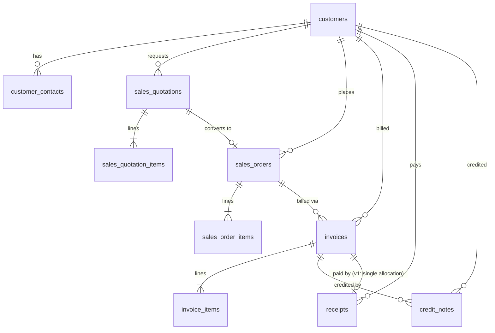

## `customers`

**Purpose.** A buyer of the company's goods/services — the AR sub-ledger counterparty.

**Attributes**

| Column | Type | Null | Notes |
|---|---|---|---|
| `id` | `BIGINT GENERATED ALWAYS AS IDENTITY` | NOT NULL | PK. |
| `company_id`† | `BIGINT` | NOT NULL | |
| `customer_code` | `VARCHAR(20)` | NOT NULL | |
| `name_en` / `name_ar` | `VARCHAR(160)` | NOT NULL / NULL | |
| `type` | `VARCHAR(20)` | NOT NULL | `CHECK (type IN ('individual','business'))`. |
| `tax_registration_no` | `VARCHAR(50)` | NULL | |
| `email` / `phone` | `VARCHAR(160)` / `VARCHAR(20)` | NULL | |
| `billing_address` / `shipping_address` | `TEXT` | NULL | |
| `currency_code` | `CHAR(3)` | NOT NULL | |
| `payment_terms_days` | `SMALLINT` | NOT NULL | `DEFAULT 30`. |
| `credit_limit` | `NUMERIC(19,4)` | NULL | `NULL` = no enforced limit. |
| `control_account_id` | `BIGINT` | NOT NULL | FK → `accounts.id`; the shared AR control account this customer's balance rolls into. |
| `status` | `VARCHAR(20)` | NOT NULL | `CHECK (status IN ('active','inactive','blocked'))`. |
| `created_at`† / `updated_at`† / `deleted_at`† | — | — | Standard columns. |

**Relationships** `customers` 1—N `customer_contacts`, `sales_quotations`, `sales_orders`, `invoices`,
`receipts`, `credit_notes`, `projects` (Accounting), `journal_lines` (AR tag).

**Cardinality** `customers ||--o{ invoices`.

**Primary Key** `id`.

**Foreign Keys** `company_id` → `companies.id ON DELETE CASCADE`; `control_account_id` →
`accounts.id ON DELETE RESTRICT`.

**Indexes** `UNIQUE (company_id, customer_code)`; `INDEX (company_id, status)`;
`INDEX USING gin (name_en gin_trgm_ops)` for fuzzy search.

**Constraints** `CHECK (type IN ('individual','business'))`; `CHECK (credit_limit IS NULL OR credit_limit >= 0)`.

**Delete Rules** Soft delete blocked while any unpaid `invoices` or posted `journal_lines` reference the
customer; `status = 'inactive'` is the practical retirement path.

**Update Rules** `control_account_id` may only be changed by a Senior Accountant+ role and never
retroactively re-tags historical `journal_lines.customer_id` balances; `credit_limit` breaches block new
`sales_orders`/`invoices` at the application layer (soft block, Sales Manager can override with reason).

**Example Records**
```sql
INSERT INTO customers (company_id, customer_code, name_en, type, currency_code, payment_terms_days, control_account_id, status)
VALUES (17, 'CUST-0031', 'Al-Bounyan Contracting Co.', 'business', 'KWD', 30, 118, 'active');
```
```json
{ "id": 3301, "customer_code": "CUST-0031", "name_en": "Al-Bounyan Contracting Co.", "status": "active" }
```

**Normalization.** 3NF.

**Future Expansion.** `customer_addresses` (multiple ship-to sites) and `customer_documents`
(trade-license attachments) — both named in the platform's extended canonical table list and layered on
via the `attachments` polymorphic table without a schema change.

## `customer_contacts`

**Purpose.** Named individuals at a business customer (procurement officer, AP contact), distinct from
the customer entity itself.

**Attributes**

| Column | Type | Null | Notes |
|---|---|---|---|
| `id` | `BIGINT GENERATED ALWAYS AS IDENTITY` | NOT NULL | PK. |
| `customer_id` | `BIGINT` | NOT NULL | FK → `customers.id`. |
| `company_id`† | `BIGINT` | NOT NULL | |
| `full_name` | `VARCHAR(160)` | NOT NULL | |
| `title` | `VARCHAR(80)` | NULL | |
| `email` / `phone` | `VARCHAR(160)` / `VARCHAR(20)` | NULL | |
| `is_primary` | `BOOLEAN` | NOT NULL | `DEFAULT false`. One primary per customer (partial unique index). |
| `created_at`† / `updated_at`† / `deleted_at`† | — | — | Standard columns. |

**Relationships** `customers` 1—N `customer_contacts`.

**Cardinality** `customers ||--o{ customer_contacts`.

**Primary Key** `id`.

**Foreign Keys** `customer_id` → `customers.id ON DELETE CASCADE`.

**Indexes** `INDEX (customer_id)`; `UNIQUE (customer_id) WHERE is_primary = true`.

**Constraints** None beyond the FK and partial unique index.

**Delete Rules** `CASCADE` with the customer — a contact has no meaning independent of it.

**Update Rules** Unrestricted; contact details change freely.

**Example Records**
```sql
INSERT INTO customer_contacts (customer_id, company_id, full_name, title, email, is_primary)
VALUES (3301, 17, 'Yousef Al-Bounyan', 'Procurement Manager', 'yousef@albounyan.com', true);
```
```json
{ "customer_id": 3301, "full_name": "Yousef Al-Bounyan", "title": "Procurement Manager", "is_primary": true }
```

**Normalization.** 3NF.

**Future Expansion.** Contact-level notification preferences for statements/reminders.

## `sales_quotations`

**Purpose.** A pre-sale offer to a customer; converts to a `sales_orders` row on acceptance without
re-keying line items.

**Attributes**

| Column | Type | Null | Notes |
|---|---|---|---|
| `id` | `BIGINT GENERATED ALWAYS AS IDENTITY` | NOT NULL | PK. |
| `company_id`† / `branch_id`† | `BIGINT` | NOT NULL / NULL | |
| `customer_id` | `BIGINT` | NOT NULL | FK → `customers.id`. |
| `quotation_number` | `VARCHAR(30)` | NOT NULL | |
| `quotation_date` / `expiry_date` | `DATE` | NOT NULL | |
| `currency_code` | `CHAR(3)` | NOT NULL | |
| `exchange_rate` | `NUMERIC(18,6)` | NOT NULL | `DEFAULT 1`. |
| `subtotal` / `discount_total` / `tax_total` / `grand_total` | `NUMERIC(19,4)` | NOT NULL | `DEFAULT 0`. |
| `status` | `VARCHAR(20)` | NOT NULL | `CHECK (status IN ('draft','sent','accepted','rejected','expired','converted'))`. |
| `converted_sales_order_id` | `BIGINT` | NULL | FK → `sales_orders.id`. |
| `created_by`† / `created_at`† / `updated_at`† / `deleted_at`† | — | — | Standard columns. |

**Relationships** `customers` 1—N `sales_quotations`; `sales_quotations` 1—N `sales_quotation_items`;
`sales_quotations` 1—0..1 `sales_orders` (on conversion).

**Cardinality** `customers ||--o{ sales_quotations`; `sales_quotations ||--|{ sales_quotation_items`.

**Primary Key** `id`.

**Foreign Keys** `customer_id` → `customers.id ON DELETE RESTRICT`; `converted_sales_order_id` →
`sales_orders.id ON DELETE SET NULL`.

**Indexes** `UNIQUE (company_id, quotation_number)`; `INDEX (customer_id, status)`.

**Constraints** `CHECK (expiry_date >= quotation_date)`; `CHECK (grand_total = subtotal - discount_total + tax_total)`.

**Delete Rules** Soft delete only; `converted` quotations are never deleted (linked history).

**Update Rules** Immutable once `status IN ('accepted','converted')`; a new quotation (`amend`) is
issued instead, cross-referenced in `memo`.

**Example Records**
```sql
INSERT INTO sales_quotations (company_id, customer_id, quotation_number, quotation_date, expiry_date,
                               currency_code, subtotal, tax_total, grand_total, status)
VALUES (17, 3301, 'QT-2026-0091', '2026-07-10', '2026-08-09', 'KWD', 500.000, 25.000, 525.000, 'sent');
```
```json
{ "id": 910, "quotation_number": "QT-2026-0091", "grand_total": "525.0000", "status": "sent" }
```

**Normalization.** 3NF.

**Future Expansion.** Multi-version quotations (rev A/B/C to the same opportunity) via a
`quotation_group_id`.

## `sales_quotation_items`

**Purpose.** Line items of a quotation.

**Attributes**

| Column | Type | Null | Notes |
|---|---|---|---|
| `id` | `BIGINT GENERATED ALWAYS AS IDENTITY` | NOT NULL | PK. |
| `sales_quotation_id` | `BIGINT` | NOT NULL | FK → `sales_quotations.id`. |
| `company_id`† | `BIGINT` | NOT NULL | |
| `line_number` | `SMALLINT` | NOT NULL | |
| `product_id` | `BIGINT` | NOT NULL | FK → `products.id`. |
| `description` | `VARCHAR(255)` | NULL | |
| `quantity` | `NUMERIC(18,4)` | NOT NULL | |
| `unit_of_measure_id` | `BIGINT` | NOT NULL | FK → `units_of_measure.id`. |
| `unit_price` | `NUMERIC(19,4)` | NOT NULL | |
| `discount_percent` | `NUMERIC(7,4)` | NOT NULL | `DEFAULT 0`. |
| `tax_code_id` | `BIGINT` | NULL | FK → `tax_codes.id`. |
| `line_total` | `NUMERIC(19,4)` | NOT NULL | |

**Relationships** `sales_quotations` 1—N `sales_quotation_items`; `products` 1—N `sales_quotation_items`.

**Cardinality** `sales_quotations ||--|{ sales_quotation_items`.

**Primary Key** `id`.

**Foreign Keys** `sales_quotation_id` → `sales_quotations.id ON DELETE CASCADE`; `product_id` →
`products.id ON DELETE RESTRICT`; `unit_of_measure_id` → `units_of_measure.id ON DELETE RESTRICT`;
`tax_code_id` → `tax_codes.id ON DELETE RESTRICT`.

**Indexes** `INDEX (sales_quotation_id)`; `UNIQUE (sales_quotation_id, line_number)`.

**Constraints** `CHECK (quantity > 0)`; `CHECK (discount_percent BETWEEN 0 AND 100)`;
`CHECK (line_total = ROUND(quantity * unit_price * (1 - discount_percent/100), 4))`.

**Delete Rules** `CASCADE` with the parent quotation.

**Update Rules** Free while parent is `draft`; blocked once `sent` (must amend via a new quotation).

**Example Records**
```sql
INSERT INTO sales_quotation_items (sales_quotation_id, company_id, line_number, product_id, quantity, unit_of_measure_id, unit_price, line_total)
VALUES (910, 17, 1, 5510, 10, 1, 50.000, 500.000);
```
```json
{ "sales_quotation_id": 910, "line_number": 1, "quantity": "10.0000", "unit_price": "50.0000", "line_total": "500.0000" }
```

**Normalization.** 3NF; `line_total` is a stored, trigger-verified derived column kept for fast
list-view rendering without recomputation.

**Future Expansion.** Alternates/options per line (good/better/best tiers) for configurable quotations.

## `sales_orders`

**Purpose.** A confirmed customer commitment to buy; the pivot document that fulfillment (delivery) and
billing (invoicing) both key off.

**Attributes**

| Column | Type | Null | Notes |
|---|---|---|---|
| `id` | `BIGINT GENERATED ALWAYS AS IDENTITY` | NOT NULL | PK. |
| `company_id`† / `branch_id`† | `BIGINT` | NOT NULL / NULL | |
| `customer_id` | `BIGINT` | NOT NULL | FK → `customers.id`. |
| `sales_quotation_id` | `BIGINT` | NULL | FK → `sales_quotations.id`. |
| `order_number` | `VARCHAR(30)` | NOT NULL | |
| `order_date` | `DATE` | NOT NULL | |
| `currency_code` / `exchange_rate` | — | NOT NULL | Same convention as `sales_quotations`. |
| `subtotal` / `discount_total` / `tax_total` / `grand_total` | `NUMERIC(19,4)` | NOT NULL | |
| `status` | `VARCHAR(20)` | NOT NULL | `CHECK (status IN ('draft','confirmed','partially_delivered','delivered','invoiced','cancelled'))`. |
| `created_by`† / `created_at`† / `updated_at`† / `deleted_at`† | — | — | Standard columns. |

**Relationships** `customers` 1—N `sales_orders`; `sales_quotations` 1—N `sales_orders`;
`sales_orders` 1—N `sales_order_items`, `invoices`.

**Cardinality** `customers ||--o{ sales_orders`; `sales_orders ||--|{ sales_order_items`;
`sales_orders ||--o{ invoices` (an order may be billed across several partial invoices).

**Primary Key** `id`.

**Foreign Keys** `customer_id` → `customers.id ON DELETE RESTRICT`; `sales_quotation_id` →
`sales_quotations.id ON DELETE SET NULL`.

**Indexes** `UNIQUE (company_id, order_number)`; `INDEX (customer_id, status)`.

**Constraints** `CHECK (grand_total = subtotal - discount_total + tax_total)`.

**Delete Rules** Soft delete blocked once any `invoices` reference the order; `cancelled` is the
practical retirement path for unfulfilled orders.

**Update Rules** Lines/totals editable while `draft`/`confirmed`; `status` advances automatically as
child `invoice_items.quantity`/(future) `delivery_items.quantity` accumulate toward `sales_order_items.quantity`.

**Example Records**
```sql
INSERT INTO sales_orders (company_id, customer_id, sales_quotation_id, order_number, order_date, currency_code, subtotal, tax_total, grand_total, status)
VALUES (17, 3301, 910, 'SO-2026-0140', '2026-07-11', 'KWD', 500.000, 25.000, 525.000, 'confirmed');
```
```json
{ "id": 1402, "order_number": "SO-2026-0140", "grand_total": "525.0000", "status": "confirmed" }
```

**Normalization.** 3NF.

**Future Expansion.** `deliveries`/`delivery_items` for shipment tracking distinct from invoicing,
already named in the platform's extended canonical table list; not detailed in this v1 ERD.

## `sales_order_items`

**Purpose.** Line items of a sales order, tracking ordered vs. invoiced quantity.

**Attributes**

| Column | Type | Null | Notes |
|---|---|---|---|
| `id` | `BIGINT GENERATED ALWAYS AS IDENTITY` | NOT NULL | PK. |
| `sales_order_id` | `BIGINT` | NOT NULL | FK → `sales_orders.id`. |
| `company_id`† | `BIGINT` | NOT NULL | |
| `line_number` | `SMALLINT` | NOT NULL | |
| `product_id` | `BIGINT` | NOT NULL | FK → `products.id`. |
| `quantity` | `NUMERIC(18,4)` | NOT NULL | |
| `quantity_delivered` / `quantity_invoiced` | `NUMERIC(18,4)` | NOT NULL | `DEFAULT 0`. |
| `unit_of_measure_id` | `BIGINT` | NOT NULL | FK → `units_of_measure.id`. |
| `unit_price` | `NUMERIC(19,4)` | NOT NULL | |
| `discount_percent` | `NUMERIC(7,4)` | NOT NULL | `DEFAULT 0`. |
| `tax_code_id` | `BIGINT` | NULL | FK → `tax_codes.id`. |
| `line_total` | `NUMERIC(19,4)` | NOT NULL | |

**Relationships** `sales_orders` 1—N `sales_order_items`; `products` 1—N `sales_order_items`;
`invoice_items` reference this row indirectly via `sales_order_items_id` (see `invoice_items`).

**Cardinality** `sales_orders ||--|{ sales_order_items`.

**Primary Key** `id`.

**Foreign Keys** `sales_order_id` → `sales_orders.id ON DELETE CASCADE`; `product_id` →
`products.id ON DELETE RESTRICT`; `unit_of_measure_id` → `units_of_measure.id ON DELETE RESTRICT`;
`tax_code_id` → `tax_codes.id ON DELETE RESTRICT`.

**Indexes** `INDEX (sales_order_id)`; `UNIQUE (sales_order_id, line_number)`.

**Constraints** `CHECK (quantity_invoiced <= quantity)`; `CHECK (quantity > 0)`.

**Delete Rules** `CASCADE` with the parent order while `quantity_invoiced = 0`; blocked (`RESTRICT`
enforced in application policy) once any invoicing has occurred against the line.

**Update Rules** `quantity_invoiced`/`quantity_delivered` are updated only by the invoicing/fulfillment
service, never directly by a user, keeping them a true derived progress counter.

**Example Records**
```sql
INSERT INTO sales_order_items (sales_order_id, company_id, line_number, product_id, quantity, unit_of_measure_id, unit_price, line_total)
VALUES (1402, 17, 1, 5510, 10, 1, 50.000, 500.000);
```
```json
{ "sales_order_id": 1402, "quantity": "10.0000", "quantity_invoiced": "10.0000", "line_total": "500.0000" }
```

**Normalization.** 3NF.

**Future Expansion.** Backorder tracking (`quantity_backordered`) once partial-fulfillment scenarios are
prioritized.

## `invoices`

**Purpose.** The sales invoice — a legally billable document to a customer and the primary trigger for
posting revenue and AR into the General Ledger. Per platform convention, purchase-side invoices live in
the separate `bills` table (Purchasing module); this table is sales-only.

**Attributes**

| Column | Type | Null | Notes |
|---|---|---|---|
| `id` | `BIGINT GENERATED ALWAYS AS IDENTITY` | NOT NULL | PK. |
| `company_id`† / `branch_id`† | `BIGINT` | NOT NULL / NULL | |
| `customer_id` | `BIGINT` | NOT NULL | FK → `customers.id`. |
| `sales_order_id` | `BIGINT` | NULL | FK → `sales_orders.id`. |
| `invoice_number` | `VARCHAR(30)` | NOT NULL | Generated from `company_settings.invoice_prefix`/`invoice_next_number`. |
| `invoice_date` / `due_date` | `DATE` | NOT NULL | |
| `currency_code` / `exchange_rate` | — | NOT NULL | |
| `subtotal` / `discount_total` / `tax_total` / `grand_total` | `NUMERIC(19,4)` | NOT NULL | |
| `amount_paid` | `NUMERIC(19,4)` | NOT NULL | `DEFAULT 0`. Updated by `receipts` allocation. |
| `journal_entry_id` | `BIGINT` | NULL | FK → `journal_entries.id`; set on posting. |
| `status` | `VARCHAR(20)` | NOT NULL | `CHECK (status IN ('draft','posted','partially_paid','paid','overdue','void'))`. |
| `voided_reason` | `TEXT` | NULL | |
| `created_by`† / `created_at`† / `updated_at`† / `deleted_at`† | — | — | Standard columns. |

**Relationships** `customers` 1—N `invoices`; `sales_orders` 1—N `invoices`; `invoices` 1—N
`invoice_items`, `credit_notes`; `invoices` 1—1 `journal_entries` (once posted).

**Cardinality** `customers ||--o{ invoices`; `invoices ||--|{ invoice_items`;
`invoices ||--o| journal_entries`.

**Primary Key** `id`.

**Foreign Keys** `customer_id` → `customers.id ON DELETE RESTRICT`; `sales_order_id` →
`sales_orders.id ON DELETE SET NULL`; `journal_entry_id` → `journal_entries.id ON DELETE RESTRICT`.

**Indexes** `UNIQUE (company_id, invoice_number)`; `INDEX (customer_id, status)`;
`INDEX (due_date) WHERE status IN ('posted','partially_paid')` (overdue-scan index).

**Constraints** `CHECK (grand_total = subtotal - discount_total + tax_total)`;
`CHECK (amount_paid <= grand_total)`; `CHECK (due_date >= invoice_date)`.

**Delete Rules** Soft delete only while `draft`; `posted` invoices are voided (reversing entry), never
deleted — `status = 'void'` with `voided_reason` mandatory.

**Update Rules** Fully editable while `draft`. Immutable line/total fields once `posted`; only
`status`/`amount_paid` (via receipts) and `voided_reason` may change thereafter. Voiding a `posted`
invoice generates a reversing `journal_entries` row in the same transaction.

**Example Records**
```sql
INSERT INTO invoices (company_id, customer_id, sales_order_id, invoice_number, invoice_date, due_date,
                       currency_code, subtotal, tax_total, grand_total, status)
VALUES (17, 3301, 1402, 'INV-2026-000248', '2026-07-16', '2026-08-15', 'KWD', 500.000, 25.000, 525.000, 'posted');
```
```json
{
  "id": 9931,
  "invoice_number": "INV-2026-000248",
  "grand_total": "525.0000",
  "amount_paid": "0.0000",
  "status": "posted",
  "due_date": "2026-08-15"
}
```

**Normalization.** 3NF. `amount_paid` is a maintained rollup of allocated `receipts`, avoiding a
`SUM()` join on every invoice list render.

**Future Expansion.** `receipt_allocations` for many-to-many receipt-to-invoice application (v1 models a
simple one-receipt-one-invoice case via `receipts.invoice_id`; partial/combined payments across several
invoices are the natural v2 extension, noted here rather than silently unsupported).

## `invoice_items`

**Purpose.** Line items of a sales invoice — the rows that (after tax) sum to `invoices.grand_total` and
that Inventory reads to decrement stock for tracked products.

**Attributes**

| Column | Type | Null | Notes |
|---|---|---|---|
| `id` | `BIGINT GENERATED ALWAYS AS IDENTITY` | NOT NULL | PK. |
| `invoice_id` | `BIGINT` | NOT NULL | FK → `invoices.id`. |
| `company_id`† | `BIGINT` | NOT NULL | |
| `line_number` | `SMALLINT` | NOT NULL | |
| `product_id` | `BIGINT` | NOT NULL | FK → `products.id`. |
| `description` | `VARCHAR(255)` | NULL | |
| `quantity` | `NUMERIC(18,4)` | NOT NULL | |
| `unit_of_measure_id` | `BIGINT` | NOT NULL | FK → `units_of_measure.id`. |
| `unit_price` | `NUMERIC(19,4)` | NOT NULL | |
| `discount_percent` | `NUMERIC(7,4)` | NOT NULL | `DEFAULT 0`. |
| `tax_code_id` | `BIGINT` | NULL | FK → `tax_codes.id`. |
| `line_total` | `NUMERIC(19,4)` | NOT NULL | |

**Relationships** `invoices` 1—N `invoice_items`; `products` 1—N `invoice_items`; triggers a
`stock_movements` row (Inventory) per line when `products.is_stock_tracked = true`.

**Cardinality** `invoices ||--|{ invoice_items`.

**Primary Key** `id`.

**Foreign Keys** `invoice_id` → `invoices.id ON DELETE CASCADE`; `product_id` → `products.id ON DELETE
RESTRICT`; `unit_of_measure_id` → `units_of_measure.id ON DELETE RESTRICT`; `tax_code_id` →
`tax_codes.id ON DELETE RESTRICT`.

**Indexes** `INDEX (invoice_id)`; `INDEX (product_id)` (product sales-history lookups).

**Constraints** `CHECK (quantity > 0)`; `CHECK (line_total = ROUND(quantity * unit_price * (1 - discount_percent/100), 4))`.

**Delete Rules** `CASCADE` while parent `draft`; immutable/undeletable once parent `posted`.

**Update Rules** Same lock as parent — free in `draft`, frozen at `posted`.

**Example Records**
```sql
INSERT INTO invoice_items (invoice_id, company_id, line_number, product_id, quantity, unit_of_measure_id, unit_price, line_total)
VALUES (9931, 17, 1, 5510, 10, 1, 50.000, 500.000);
```
```json
{ "invoice_id": 9931, "product_id": 5510, "quantity": "10.0000", "line_total": "500.0000" }
```

**Normalization.** 3NF.

**Future Expansion.** Serial/batch capture directly on the invoice line for traceable products (today
captured at `goods_receipt_items`/`stock_movements` level only).

## `receipts`

**Purpose.** Money received from a customer — the event that reduces AR and increases cash/bank.

**Attributes**

| Column | Type | Null | Notes |
|---|---|---|---|
| `id` | `BIGINT GENERATED ALWAYS AS IDENTITY` | NOT NULL | PK. |
| `company_id`† / `branch_id`† | `BIGINT` | NOT NULL / NULL | |
| `customer_id` | `BIGINT` | NOT NULL | FK → `customers.id`. |
| `invoice_id` | `BIGINT` | NULL | FK → `invoices.id`. v1 single-invoice allocation (see `invoices` Future Expansion). |
| `receipt_number` | `VARCHAR(30)` | NOT NULL | |
| `receipt_date` | `DATE` | NOT NULL | |
| `method` | `VARCHAR(20)` | NOT NULL | `CHECK (method IN ('cash','card','bank_transfer','cheque','knet','apple_pay'))`. |
| `bank_account_id` | `BIGINT` | NULL | FK → `bank_accounts.id`; required unless `method = 'cash'`. |
| `amount` | `NUMERIC(19,4)` | NOT NULL | |
| `currency_code` / `exchange_rate` | — | NOT NULL | |
| `reference_no` | `VARCHAR(60)` | NULL | Cheque number / KNET reference. |
| `journal_entry_id` | `BIGINT` | NULL | FK → `journal_entries.id`. |
| `status` | `VARCHAR(20)` | NOT NULL | `CHECK (status IN ('draft','posted','bounced','voided'))`. |
| `created_by`† / `created_at`† / `updated_at`† / `deleted_at`† | — | — | Standard columns. |

**Relationships** `customers` 1—N `receipts`; `invoices` 1—N `receipts`; `bank_accounts` 1—N `receipts`.

**Cardinality** `customers ||--o{ receipts`; `invoices ||--o{ receipts` (0..1 in the v1 simple case).

**Primary Key** `id`.

**Foreign Keys** `customer_id` → `customers.id ON DELETE RESTRICT`; `invoice_id` → `invoices.id ON
DELETE SET NULL`; `bank_account_id` → `bank_accounts.id ON DELETE RESTRICT`; `journal_entry_id` →
`journal_entries.id ON DELETE RESTRICT`.

**Indexes** `UNIQUE (company_id, receipt_number)`; `INDEX (customer_id)`; `INDEX (invoice_id)`.

**Constraints** `CHECK (method = 'cash' OR bank_account_id IS NOT NULL)`; `CHECK (amount > 0)`.

**Delete Rules** Soft delete only while `draft`; `posted` receipts are voided (reversing entry) or
marked `bounced` (cheque/KNET failure — also reverses AR reduction), never hard-deleted.

**Update Rules** Frozen at `posted`. A `bounced` transition auto-generates a reversing journal entry and
resets the linked `invoices.amount_paid`.

**Example Records**
```sql
INSERT INTO receipts (company_id, customer_id, invoice_id, receipt_number, receipt_date, method,
                       bank_account_id, amount, currency_code, status)
VALUES (17, 3301, 9931, 'RCT-2026-0512', '2026-07-16', 'bank_transfer', 2, 525.000, 'KWD', 'posted');
```
```json
{ "id": 5120, "receipt_number": "RCT-2026-0512", "amount": "525.0000", "method": "bank_transfer", "status": "posted" }
```

**Normalization.** 3NF.

**Future Expansion.** `receipt_allocations` join table for one receipt covering several invoices (and
vice versa).

## `credit_notes`

**Purpose.** A reversal/reduction against a previously posted invoice — returns, pricing corrections,
goodwill credits — that preserves the original invoice unedited.

**Attributes**

| Column | Type | Null | Notes |
|---|---|---|---|
| `id` | `BIGINT GENERATED ALWAYS AS IDENTITY` | NOT NULL | PK. |
| `company_id`† / `branch_id`† | `BIGINT` | NOT NULL / NULL | |
| `customer_id` | `BIGINT` | NOT NULL | FK → `customers.id`. |
| `invoice_id` | `BIGINT` | NULL | FK → `invoices.id`. |
| `credit_note_number` | `VARCHAR(30)` | NOT NULL | |
| `credit_note_date` | `DATE` | NOT NULL | |
| `reason` | `VARCHAR(255)` | NOT NULL | |
| `subtotal` / `tax_total` / `grand_total` | `NUMERIC(19,4)` | NOT NULL | |
| `journal_entry_id` | `BIGINT` | NULL | FK → `journal_entries.id`. |
| `status` | `VARCHAR(20)` | NOT NULL | `CHECK (status IN ('draft','posted','applied','voided'))`. |
| `created_by`† / `created_at`† / `updated_at`† / `deleted_at`† | — | — | Standard columns. |

**Relationships** `customers` 1—N `credit_notes`; `invoices` 1—N `credit_notes`.

**Cardinality** `invoices ||--o{ credit_notes`.

**Primary Key** `id`.

**Foreign Keys** `customer_id` → `customers.id ON DELETE RESTRICT`; `invoice_id` → `invoices.id ON
DELETE RESTRICT`; `journal_entry_id` → `journal_entries.id ON DELETE RESTRICT`.

**Indexes** `UNIQUE (company_id, credit_note_number)`; `INDEX (invoice_id)`.

**Constraints** `CHECK (grand_total = subtotal + tax_total)`; `CHECK (grand_total > 0)`.

**Delete Rules** Soft delete only while `draft`; `posted` is permanent (it is itself a correction
document — voiding a credit note requires a further debit note, not deletion).

**Update Rules** Frozen at `posted`; `status → applied` when fully offset against the customer's
balance or refunded via `refunds` (future extension).

**Example Records**
```sql
INSERT INTO credit_notes (company_id, customer_id, invoice_id, credit_note_number, credit_note_date,
                           reason, subtotal, tax_total, grand_total, status)
VALUES (17, 3301, 9931, 'CN-2026-0022', '2026-07-18', 'Damaged goods returned', 50.000, 2.500, 52.500, 'posted');
```
```json
{ "id": 22, "credit_note_number": "CN-2026-0022", "grand_total": "52.5000", "status": "posted" }
```

**Normalization.** 3NF.

**Future Expansion.** `refunds` (cash-back against a credit note rather than offset against future
invoices) — named in the platform's extended canonical list, not detailed in this v1 ERD.

# Purchasing

The Purchasing module mirrors Sales on the buy side: vendor master data, purchase orders, goods
receipts (which feed Inventory), vendor bills (AP), and vendor payments. Vendor payments are a
sensitive, human-approval-gated operation per platform policy — never AI-autonomous.

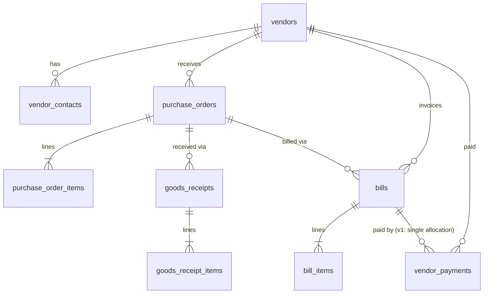

## `vendors`

**Purpose.** A supplier of goods/services — the AP sub-ledger counterparty.

**Attributes**

| Column | Type | Null | Notes |
|---|---|---|---|
| `id` | `BIGINT GENERATED ALWAYS AS IDENTITY` | NOT NULL | PK. |
| `company_id`† | `BIGINT` | NOT NULL | |
| `vendor_code` | `VARCHAR(20)` | NOT NULL | |
| `name_en` / `name_ar` | `VARCHAR(160)` | NOT NULL / NULL | |
| `tax_registration_no` | `VARCHAR(50)` | NULL | |
| `email` / `phone` | `VARCHAR(160)` / `VARCHAR(20)` | NULL | |
| `address` | `TEXT` | NULL | |
| `currency_code` | `CHAR(3)` | NOT NULL | |
| `payment_terms_days` | `SMALLINT` | NOT NULL | `DEFAULT 30`. |
| `control_account_id` | `BIGINT` | NOT NULL | FK → `accounts.id`; the AP control account. |
| `status` | `VARCHAR(20)` | NOT NULL | `CHECK (status IN ('active','inactive','blocked'))`. |
| `created_at`† / `updated_at`† / `deleted_at`† | — | — | Standard columns. |

**Relationships** `vendors` 1—N `vendor_contacts`, `purchase_orders`, `bills`, `vendor_payments`,
`journal_lines` (AP tag).

**Cardinality** `vendors ||--o{ bills`.

**Primary Key** `id`.

**Foreign Keys** `company_id` → `companies.id ON DELETE CASCADE`; `control_account_id` →
`accounts.id ON DELETE RESTRICT`.

**Indexes** `UNIQUE (company_id, vendor_code)`; `INDEX (company_id, status)`.

**Constraints** None beyond the FKs.

**Delete Rules** Soft delete blocked while unpaid `bills` or posted `journal_lines` reference the
vendor.

**Update Rules** `control_account_id` change requires Senior Accountant+; does not retag historical
lines.

**Example Records**
```sql
INSERT INTO vendors (company_id, vendor_code, name_en, currency_code, payment_terms_days, control_account_id, status)
VALUES (17, 'VEND-0014', 'Gulf Office Supplies Co.', 'KWD', 30, 220, 'active');
```
```json
{ "id": 1401, "vendor_code": "VEND-0014", "name_en": "Gulf Office Supplies Co.", "status": "active" }
```

**Normalization.** 3NF.

**Future Expansion.** `vendor_addresses`, `vendor_bank_accounts` (payout IBAN detail), `vendor_certificates`
(ISO/trade licenses, via `attachments`), `vendor_contracts` — all named in the extended canonical list,
layered on without a schema change to this table.

## `vendor_contacts`

**Purpose.** Named individuals at a vendor (sales rep, AR contact).

**Attributes**

| Column | Type | Null | Notes |
|---|---|---|---|
| `id` | `BIGINT GENERATED ALWAYS AS IDENTITY` | NOT NULL | PK. |
| `vendor_id` | `BIGINT` | NOT NULL | FK → `vendors.id`. |
| `company_id`† | `BIGINT` | NOT NULL | |
| `full_name` | `VARCHAR(160)` | NOT NULL | |
| `title` | `VARCHAR(80)` | NULL | |
| `email` / `phone` | `VARCHAR(160)` / `VARCHAR(20)` | NULL | |
| `is_primary` | `BOOLEAN` | NOT NULL | `DEFAULT false`. |
| `created_at`† / `updated_at`† / `deleted_at`† | — | — | Standard columns. |

**Relationships** `vendors` 1—N `vendor_contacts`.

**Cardinality** `vendors ||--o{ vendor_contacts`.

**Primary Key** `id`.

**Foreign Keys** `vendor_id` → `vendors.id ON DELETE CASCADE`.

**Indexes** `INDEX (vendor_id)`; `UNIQUE (vendor_id) WHERE is_primary = true`.

**Constraints** None beyond FK/unique.

**Delete Rules** `CASCADE` with the vendor.

**Update Rules** Unrestricted.

**Example Records**
```sql
INSERT INTO vendor_contacts (vendor_id, company_id, full_name, title, is_primary) VALUES (1401, 17, 'Mona Al-Rashidi', 'Account Manager', true);
```
```json
{ "vendor_id": 1401, "full_name": "Mona Al-Rashidi", "is_primary": true }
```

**Normalization.** 3NF.

**Future Expansion.** None beyond what `vendor_addresses`/`vendor_contracts` will add at the vendor level.

## `purchase_orders`

**Purpose.** A commitment to buy from a vendor; drives goods-receipt matching and, ultimately, bill
three-way matching (PO ↔ receipt ↔ bill).

**Attributes**

| Column | Type | Null | Notes |
|---|---|---|---|
| `id` | `BIGINT GENERATED ALWAYS AS IDENTITY` | NOT NULL | PK. |
| `company_id`† / `branch_id`† | `BIGINT` | NOT NULL / NULL | |
| `vendor_id` | `BIGINT` | NOT NULL | FK → `vendors.id`. |
| `po_number` | `VARCHAR(30)` | NOT NULL | |
| `order_date` / `expected_date` | `DATE` | NOT NULL / NULL | |
| `currency_code` / `exchange_rate` | — | NOT NULL | |
| `subtotal` / `discount_total` / `tax_total` / `grand_total` | `NUMERIC(19,4)` | NOT NULL | |
| `status` | `VARCHAR(20)` | NOT NULL | `CHECK (status IN ('draft','sent','confirmed','partially_received','received','closed','cancelled'))`. |
| `created_by`† / `created_at`† / `updated_at`† / `deleted_at`† | — | — | Standard columns. |

**Relationships** `vendors` 1—N `purchase_orders`; `purchase_orders` 1—N `purchase_order_items`,
`goods_receipts`, `bills`.

**Cardinality** `vendors ||--o{ purchase_orders`; `purchase_orders ||--|{ purchase_order_items`.

**Primary Key** `id`.

**Foreign Keys** `vendor_id` → `vendors.id ON DELETE RESTRICT`.

**Indexes** `UNIQUE (company_id, po_number)`; `INDEX (vendor_id, status)`.

**Constraints** `CHECK (grand_total = subtotal - discount_total + tax_total)`.

**Delete Rules** Soft delete blocked once any `goods_receipts`/`bills` reference the PO; `cancelled` is
the retirement path pre-receipt.

**Update Rules** Editable pre-`sent`; `status` advances automatically as `goods_receipt_items`/
`bill_items` accumulate toward `purchase_order_items.quantity`.

**Example Records**
```sql
INSERT INTO purchase_orders (company_id, vendor_id, po_number, order_date, currency_code, subtotal, tax_total, grand_total, status)
VALUES (17, 1401, 'PO-2026-0210', '2026-07-05', 'KWD', 800.000, 40.000, 840.000, 'confirmed');
```
```json
{ "id": 2101, "po_number": "PO-2026-0210", "grand_total": "840.0000", "status": "confirmed" }
```

**Normalization.** 3NF.

**Future Expansion.** `purchase_requests`/`rfqs`/`rfq_responses` upstream approval-and-sourcing workflow
— named in the extended canonical list, feeding into `purchase_orders` once approved; not detailed in
this v1 ERD.

## `purchase_order_items`

**Purpose.** Line items of a purchase order, tracking ordered vs. received quantity.

**Attributes**

| Column | Type | Null | Notes |
|---|---|---|---|
| `id` | `BIGINT GENERATED ALWAYS AS IDENTITY` | NOT NULL | PK. |
| `purchase_order_id` | `BIGINT` | NOT NULL | FK → `purchase_orders.id`. |
| `company_id`† | `BIGINT` | NOT NULL | |
| `line_number` | `SMALLINT` | NOT NULL | |
| `product_id` | `BIGINT` | NOT NULL | FK → `products.id`. |
| `quantity` | `NUMERIC(18,4)` | NOT NULL | |
| `quantity_received` | `NUMERIC(18,4)` | NOT NULL | `DEFAULT 0`. |
| `unit_of_measure_id` | `BIGINT` | NOT NULL | FK → `units_of_measure.id`. |
| `unit_price` | `NUMERIC(19,4)` | NOT NULL | |
| `tax_code_id` | `BIGINT` | NULL | FK → `tax_codes.id`. |
| `line_total` | `NUMERIC(19,4)` | NOT NULL | |

**Relationships** `purchase_orders` 1—N `purchase_order_items`; `products` 1—N `purchase_order_items`;
`goods_receipt_items` 1—N reference this row.

**Cardinality** `purchase_orders ||--|{ purchase_order_items`.

**Primary Key** `id`.

**Foreign Keys** `purchase_order_id` → `purchase_orders.id ON DELETE CASCADE`; `product_id` →
`products.id ON DELETE RESTRICT`; `unit_of_measure_id` → `units_of_measure.id ON DELETE RESTRICT`;
`tax_code_id` → `tax_codes.id ON DELETE RESTRICT`.

**Indexes** `INDEX (purchase_order_id)`; `UNIQUE (purchase_order_id, line_number)`.

**Constraints** `CHECK (quantity_received <= quantity)`; `CHECK (quantity > 0)`.

**Delete Rules** `CASCADE` while `quantity_received = 0`; blocked thereafter.

**Update Rules** `quantity_received` updated only by the goods-receipt service.

**Example Records**
```sql
INSERT INTO purchase_order_items (purchase_order_id, company_id, line_number, product_id, quantity, unit_of_measure_id, unit_price, line_total)
VALUES (2101, 17, 1, 5612, 40, 1, 20.000, 800.000);
```
```json
{ "purchase_order_id": 2101, "quantity": "40.0000", "quantity_received": "40.0000", "line_total": "800.0000" }
```

**Normalization.** 3NF.

**Future Expansion.** Landed-cost allocation (freight/duty apportioned back onto received lines).

## `goods_receipts`

**Purpose.** Confirms physical receipt of goods against a purchase order, at a specific warehouse, and
is the event that increments `inventory_items.quantity_on_hand`.

**Attributes**

| Column | Type | Null | Notes |
|---|---|---|---|
| `id` | `BIGINT GENERATED ALWAYS AS IDENTITY` | NOT NULL | PK. |
| `company_id`† / `branch_id`† | `BIGINT` | NOT NULL / NULL | |
| `warehouse_id` | `BIGINT` | NOT NULL | FK → `warehouses.id`. |
| `vendor_id` | `BIGINT` | NOT NULL | FK → `vendors.id`. |
| `purchase_order_id` | `BIGINT` | NOT NULL | FK → `purchase_orders.id`. |
| `receipt_number` | `VARCHAR(30)` | NOT NULL | |
| `receipt_date` | `DATE` | NOT NULL | |
| `status` | `VARCHAR(20)` | NOT NULL | `CHECK (status IN ('draft','completed','cancelled'))`. |
| `received_by` | `BIGINT` | NULL | FK → `users.id`. |
| `created_at`† / `updated_at`† / `deleted_at`† | — | — | Standard columns. |

**Relationships** `purchase_orders` 1—N `goods_receipts`; `warehouses` 1—N `goods_receipts`;
`goods_receipts` 1—N `goods_receipt_items`.

**Cardinality** `purchase_orders ||--o{ goods_receipts`; `goods_receipts ||--|{ goods_receipt_items`.

**Primary Key** `id`.

**Foreign Keys** `warehouse_id` → `warehouses.id ON DELETE RESTRICT`; `vendor_id` → `vendors.id ON
DELETE RESTRICT`; `purchase_order_id` → `purchase_orders.id ON DELETE RESTRICT`; `received_by` →
`users.id ON DELETE SET NULL`.

**Indexes** `UNIQUE (company_id, receipt_number)`; `INDEX (purchase_order_id)`; `INDEX (warehouse_id, receipt_date)`.

**Constraints** None beyond the FKs.

**Delete Rules** Soft delete blocked once `completed` (stock has moved); `cancelled` pre-completion only.

**Update Rules** Immutable once `completed` — a wrong receipt is corrected via a `stock_adjustments`
row, not by editing history.

**Example Records**
```sql
INSERT INTO goods_receipts (company_id, warehouse_id, vendor_id, purchase_order_id, receipt_number, receipt_date, status, received_by)
VALUES (17, 5, 1401, 2101, 'GR-2026-0198', '2026-07-14', 'completed', 1088);
```
```json
{ "id": 1980, "receipt_number": "GR-2026-0198", "status": "completed" }
```

**Normalization.** 3NF.

**Future Expansion.** `quality_inspections` gating (hold received stock until QA pass) — named in the
extended canonical list.

## `goods_receipt_items`

**Purpose.** Line items of a goods receipt; each row is the direct source of a `stock_movements` entry.

**Attributes**

| Column | Type | Null | Notes |
|---|---|---|---|
| `id` | `BIGINT GENERATED ALWAYS AS IDENTITY` | NOT NULL | PK. |
| `goods_receipt_id` | `BIGINT` | NOT NULL | FK → `goods_receipts.id`. |
| `company_id`† | `BIGINT` | NOT NULL | |
| `purchase_order_item_id` | `BIGINT` | NOT NULL | FK → `purchase_order_items.id`. |
| `product_id` | `BIGINT` | NOT NULL | FK → `products.id`. |
| `quantity_received` | `NUMERIC(18,4)` | NOT NULL | |
| `unit_of_measure_id` | `BIGINT` | NOT NULL | FK → `units_of_measure.id`. |
| `batch_no` / `serial_no` | `VARCHAR(60)` | NULL | |
| `created_at`† / `updated_at`† | — | — | Standard columns. |

**Relationships** `goods_receipts` 1—N `goods_receipt_items`; `purchase_order_items` 1—N
`goods_receipt_items`; each row 1—1 a resulting `stock_movements` row.

**Cardinality** `goods_receipts ||--|{ goods_receipt_items`.

**Primary Key** `id`.

**Foreign Keys** `goods_receipt_id` → `goods_receipts.id ON DELETE CASCADE`; `purchase_order_item_id`
→ `purchase_order_items.id ON DELETE RESTRICT`; `product_id` → `products.id ON DELETE RESTRICT`;
`unit_of_measure_id` → `units_of_measure.id ON DELETE RESTRICT`.

**Indexes** `INDEX (goods_receipt_id)`; `INDEX (purchase_order_item_id)`.

**Constraints** `CHECK (quantity_received > 0)`.

**Delete Rules** `CASCADE` only while parent `draft`; blocked once `completed` and stock has moved.

**Update Rules** Frozen once parent `completed`.

**Example Records**
```sql
INSERT INTO goods_receipt_items (goods_receipt_id, company_id, purchase_order_item_id, product_id, quantity_received, unit_of_measure_id)
VALUES (1980, 17, 21010, 5612, 40, 1);
```
```json
{ "goods_receipt_id": 1980, "product_id": 5612, "quantity_received": "40.0000" }
```

**Normalization.** 3NF.

**Future Expansion.** `product_serials`/`product_batches` full traceability linkage beyond the flat
`batch_no`/`serial_no` text columns.

## `bills`

**Purpose.** The vendor invoice — the AP counterpart of `invoices` — recording what the company owes
and driving expense/asset and AP postings.

**Attributes**

| Column | Type | Null | Notes |
|---|---|---|---|
| `id` | `BIGINT GENERATED ALWAYS AS IDENTITY` | NOT NULL | PK. |
| `company_id`† / `branch_id`† | `BIGINT` | NOT NULL / NULL | |
| `vendor_id` | `BIGINT` | NOT NULL | FK → `vendors.id`. |
| `purchase_order_id` | `BIGINT` | NULL | FK → `purchase_orders.id`. |
| `bill_number` | `VARCHAR(30)` | NOT NULL | Internal number, per `company_settings.bill_prefix`. |
| `vendor_invoice_number` | `VARCHAR(60)` | NULL | The vendor's own invoice number, kept for 3-way-match and dispute reference. |
| `bill_date` / `due_date` | `DATE` | NOT NULL | |
| `currency_code` / `exchange_rate` | — | NOT NULL | |
| `subtotal` / `tax_total` / `grand_total` | `NUMERIC(19,4)` | NOT NULL | |
| `amount_paid` | `NUMERIC(19,4)` | NOT NULL | `DEFAULT 0`. |
| `journal_entry_id` | `BIGINT` | NULL | FK → `journal_entries.id`. |
| `status` | `VARCHAR(20)` | NOT NULL | `CHECK (status IN ('draft','posted','partially_paid','paid','overdue','void'))`. |
| `created_by`† / `created_at`† / `updated_at`† / `deleted_at`† | — | — | Standard columns. |

**Relationships** `vendors` 1—N `bills`; `purchase_orders` 1—N `bills`; `bills` 1—N `bill_items`,
`vendor_payments`; `bills` 1—1 `journal_entries` (once posted).

**Cardinality** `vendors ||--o{ bills`; `bills ||--|{ bill_items`.

**Primary Key** `id`.

**Foreign Keys** `vendor_id` → `vendors.id ON DELETE RESTRICT`; `purchase_order_id` →
`purchase_orders.id ON DELETE SET NULL`; `journal_entry_id` → `journal_entries.id ON DELETE RESTRICT`.

**Indexes** `UNIQUE (company_id, bill_number)`; `INDEX (vendor_id, status)`;
`INDEX (due_date) WHERE status IN ('posted','partially_paid')`.

**Constraints** `CHECK (grand_total = subtotal + tax_total)`; `CHECK (amount_paid <= grand_total)`.

**Delete Rules** Soft delete only while `draft`; `posted` bills are voided (reversing entry), never
deleted.

**Update Rules** Frozen at `posted`; three-way match (PO quantity/price vs. receipt quantity vs. bill
quantity/price) is enforced at the `FormRequest` layer before a bill may transition to `posted`, with any
variance beyond a configurable tolerance requiring Purchasing Manager approval.

**Example Records**
```sql
INSERT INTO bills (company_id, vendor_id, purchase_order_id, bill_number, vendor_invoice_number,
                    bill_date, due_date, currency_code, subtotal, tax_total, grand_total, status)
VALUES (17, 1401, 2101, 'BILL-2026-000133', 'GOS-88213', '2026-07-15', '2026-08-14', 'KWD', 800.000, 40.000, 840.000, 'posted');
```
```json
{ "id": 1330, "bill_number": "BILL-2026-000133", "grand_total": "840.0000", "status": "posted" }
```

**Normalization.** 3NF.

**Future Expansion.** `debit_notes` (the AP mirror of `credit_notes`) for vendor-side returns/corrections
— named in the platform's canonical list, structurally identical to `credit_notes`.

## `bill_items`

**Purpose.** Line items of a vendor bill.

**Attributes**

| Column | Type | Null | Notes |
|---|---|---|---|
| `id` | `BIGINT GENERATED ALWAYS AS IDENTITY` | NOT NULL | PK. |
| `bill_id` | `BIGINT` | NOT NULL | FK → `bills.id`. |
| `company_id`† | `BIGINT` | NOT NULL | |
| `line_number` | `SMALLINT` | NOT NULL | |
| `product_id` | `BIGINT` | NULL | FK → `products.id`; `NULL` permitted for non-stock expense lines (e.g. a utility bill). |
| `description` | `VARCHAR(255)` | NULL | |
| `quantity` | `NUMERIC(18,4)` | NOT NULL | `DEFAULT 1`. |
| `unit_price` | `NUMERIC(19,4)` | NOT NULL | |
| `tax_code_id` | `BIGINT` | NULL | FK → `tax_codes.id`. |
| `line_total` | `NUMERIC(19,4)` | NOT NULL | |

**Relationships** `bills` 1—N `bill_items`; `products` 1—N `bill_items` (optional).

**Cardinality** `bills ||--|{ bill_items`.

**Primary Key** `id`.

**Foreign Keys** `bill_id` → `bills.id ON DELETE CASCADE`; `product_id` → `products.id ON DELETE SET
NULL`; `tax_code_id` → `tax_codes.id ON DELETE RESTRICT`.

**Indexes** `INDEX (bill_id)`.

**Constraints** `CHECK (quantity > 0)`.

**Delete Rules** `CASCADE` while parent `draft`; frozen thereafter.

**Update Rules** Frozen once parent `posted`.

**Example Records**
```sql
INSERT INTO bill_items (bill_id, company_id, line_number, product_id, quantity, unit_price, line_total)
VALUES (1330, 17, 1, 5612, 40, 20.000, 800.000);
```
```json
{ "bill_id": 1330, "product_id": 5612, "line_total": "800.0000" }
```

**Normalization.** 3NF.

**Future Expansion.** Expense-account override per line for split-coded bills (utility bill spanning
two departments).

## `vendor_payments`

**Purpose.** Money paid to a vendor — reduces AP and cash/bank. Classified `is_sensitive` under the
Permissions catalog; requires an explicit approval chain regardless of the initiating role or AI
suggestion.

**Attributes**

| Column | Type | Null | Notes |
|---|---|---|---|
| `id` | `BIGINT GENERATED ALWAYS AS IDENTITY` | NOT NULL | PK. |
| `company_id`† / `branch_id`† | `BIGINT` | NOT NULL / NULL | |
| `vendor_id` | `BIGINT` | NOT NULL | FK → `vendors.id`. |
| `bill_id` | `BIGINT` | NULL | FK → `bills.id`. v1 single-bill allocation. |
| `payment_number` | `VARCHAR(30)` | NOT NULL | |
| `payment_date` | `DATE` | NOT NULL | |
| `method` | `VARCHAR(20)` | NOT NULL | Same domain as `receipts.method`. |
| `bank_account_id` | `BIGINT` | NOT NULL | FK → `bank_accounts.id`. |
| `amount` | `NUMERIC(19,4)` | NOT NULL | |
| `currency_code` / `exchange_rate` | — | NOT NULL | |
| `reference_no` | `VARCHAR(60)` | NULL | |
| `journal_entry_id` | `BIGINT` | NULL | FK → `journal_entries.id`. |
| `status` | `VARCHAR(20)` | NOT NULL | `CHECK (status IN ('draft','pending_approval','posted','voided'))`. |
| `requires_approval` | `BOOLEAN` | NOT NULL | `DEFAULT true`. |
| `approved_by` | `BIGINT` | NULL | FK → `users.id`. |
| `approved_at` | `TIMESTAMPTZ` | NULL | |
| `created_by`† / `created_at`† / `updated_at`† / `deleted_at`† | — | — | Standard columns. |

**Relationships** `vendors` 1—N `vendor_payments`; `bills` 1—N `vendor_payments`; `bank_accounts` 1—N
`vendor_payments`.

**Cardinality** `vendors ||--o{ vendor_payments`; `bills ||--o{ vendor_payments`.

**Primary Key** `id`.

**Foreign Keys** `vendor_id` → `vendors.id ON DELETE RESTRICT`; `bill_id` → `bills.id ON DELETE SET
NULL`; `bank_account_id` → `bank_accounts.id ON DELETE RESTRICT`; `journal_entry_id` →
`journal_entries.id ON DELETE RESTRICT`; `approved_by` → `users.id ON DELETE SET NULL`.

**Indexes** `UNIQUE (company_id, payment_number)`; `INDEX (vendor_id)`; `INDEX (status) WHERE status = 'pending_approval'`.

**Constraints** `CHECK (amount > 0)`; `CHECK (status <> 'posted' OR approved_by IS NOT NULL OR
requires_approval = false)`.

**Delete Rules** Soft delete only while `draft`; `posted` payments are voided (reversing entry), never
deleted.

**Update Rules** `draft → pending_approval → posted` is a strict one-way pipeline; an AI agent (Treasury
Manager) may create a `draft` proposal (see AI module, `ai_feedback`) but can never itself set
`approved_by` or advance to `posted`.

**Example Records**
```sql
INSERT INTO vendor_payments (company_id, vendor_id, bill_id, payment_number, payment_date, method,
                              bank_account_id, amount, currency_code, status, requires_approval, approved_by, approved_at)
VALUES (17, 1401, 1330, 'VP-2026-0077', '2026-08-10', 'bank_transfer', 2, 840.000, 'KWD', 'posted', true, 1042, now());
```
```json
{ "id": 77, "payment_number": "VP-2026-0077", "amount": "840.0000", "status": "posted", "approved_by": 1042 }
```

**Normalization.** 3NF.

**Future Expansion.** Batch payment runs (one bank file / one `journal_entries` header covering many
`vendor_payments` rows) for efficient month-end AP settlement.

# Inventory

The Inventory module tracks products, units of measure, and stock quantity/value per warehouse. Every
quantity change — a sale, a purchase receipt, a manual adjustment, an inter-warehouse transfer — is
captured as an immutable `stock_movements` row, the inventory equivalent of `journal_lines`, and
(for stock-tracked products) triggers its own costing entry into the Accounting module.

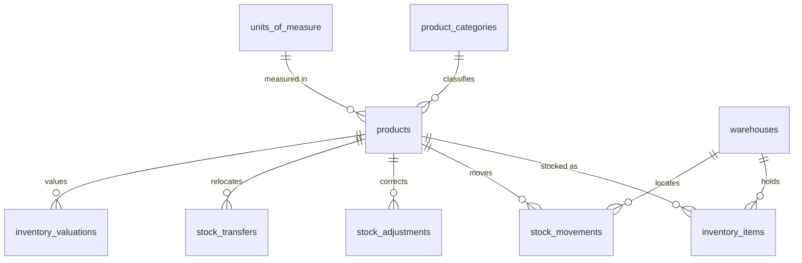

## `product_categories`

**Purpose.** A hierarchical grouping of products for catalog navigation, reporting rollups, and
default GL account inheritance.

**Attributes**

| Column | Type | Null | Notes |
|---|---|---|---|
| `id` | `BIGINT GENERATED ALWAYS AS IDENTITY` | NOT NULL | PK. |
| `company_id`† | `BIGINT` | NOT NULL | |
| `parent_category_id` | `BIGINT` | NULL | Self-FK. |
| `code` | `VARCHAR(20)` | NOT NULL | |
| `name_en` / `name_ar` | `VARCHAR(120)` | NOT NULL / NULL | |
| `status` | `VARCHAR(20)` | NOT NULL | `CHECK (status IN ('active','inactive'))`. |
| `created_at`† / `updated_at`† / `deleted_at`† | — | — | Standard columns. |

**Relationships** `product_categories` 1—N `products`, `product_categories` (self).

**Cardinality** `product_categories ||--o{ products`.

**Primary Key** `id`.

**Foreign Keys** `company_id` → `companies.id ON DELETE CASCADE`; `parent_category_id` →
`product_categories.id ON DELETE SET NULL`.

**Indexes** `UNIQUE (company_id, code)`; `INDEX (parent_category_id)`.

**Constraints** `CHECK (id <> parent_category_id)`.

**Delete Rules** Soft delete blocked while `products` reference it.

**Update Rules** Re-parenting allowed; does not retag historical transactions.

**Example Records**
```sql
INSERT INTO product_categories (company_id, code, name_en, status) VALUES (17, 'OFFICE-SUP', 'Office Supplies', 'active');
```
```json
{ "id": 40, "code": "OFFICE-SUP", "name_en": "Office Supplies", "status": "active" }
```

**Normalization.** 3NF.

**Future Expansion.** Category-level default tax code / GL account inheritance rules.

## `units_of_measure`

**Purpose.** The measurement unit a product is bought, stocked, and sold in (pieces, boxes, kilograms).

**Attributes**

| Column | Type | Null | Notes |
|---|---|---|---|
| `id` | `BIGINT GENERATED ALWAYS AS IDENTITY` | NOT NULL | PK. |
| `company_id`† | `BIGINT` | NOT NULL | |
| `code` | `VARCHAR(10)` | NOT NULL | e.g. `PCS`, `BOX`, `KG`. |
| `name_en` / `name_ar` | `VARCHAR(60)` | NOT NULL / NULL | |
| `is_base_unit` | `BOOLEAN` | NOT NULL | `DEFAULT true`. |
| `created_at`† / `updated_at`† | — | — | Standard columns. |

**Relationships** `units_of_measure` 1—N `products` (base unit), `sales_order_items`, `invoice_items`,
`purchase_order_items`, `goods_receipt_items`.

**Cardinality** `units_of_measure ||--o{ products`.

**Primary Key** `id`.

**Foreign Keys** `company_id` → `companies.id ON DELETE CASCADE`.

**Indexes** `UNIQUE (company_id, code)`.

**Constraints** None beyond the unique code.

**Delete Rules** Soft delete blocked while referenced by any product or transaction line.

**Update Rules** `code` immutable once referenced by a posted line.

**Example Records**
```sql
INSERT INTO units_of_measure (company_id, code, name_en, is_base_unit) VALUES (17, 'PCS', 'Pieces', true);
```
```json
{ "id": 1, "code": "PCS", "name_en": "Pieces", "is_base_unit": true }
```

**Normalization.** 3NF.

**Future Expansion.** `unit_conversions` (e.g. 1 `BOX` = 12 `PCS`) for buy-in-bulk/sell-individually
scenarios — named in the extended canonical list.

## `products`

**Purpose.** A sellable/purchasable good or service, the shared master record that Sales, Purchasing,
and Inventory all key transaction lines against.

**Attributes**

| Column | Type | Null | Notes |
|---|---|---|---|
| `id` | `BIGINT GENERATED ALWAYS AS IDENTITY` | NOT NULL | PK. |
| `company_id`† | `BIGINT` | NOT NULL | |
| `product_category_id` | `BIGINT` | NULL | FK → `product_categories.id`. |
| `sku` | `VARCHAR(60)` | NOT NULL | |
| `barcode` | `VARCHAR(60)` | NULL | |
| `name_en` / `name_ar` | `VARCHAR(200)` | NOT NULL / NULL | |
| `description` | `TEXT` | NULL | |
| `type` | `VARCHAR(20)` | NOT NULL | `CHECK (type IN ('goods','service','bundle'))`. |
| `base_unit_of_measure_id` | `BIGINT` | NOT NULL | FK → `units_of_measure.id`. |
| `purchase_account_id` / `sales_account_id` / `inventory_account_id` | `BIGINT` | NULL | FK → `accounts.id` each; default GL postings for this product. |
| `cost_method` | `VARCHAR(20)` | NOT NULL | `CHECK (cost_method IN ('fifo','weighted_average','standard'))`. |
| `standard_cost` | `NUMERIC(19,4)` | NULL | Required if `cost_method = 'standard'`. |
| `default_sale_price` | `NUMERIC(19,4)` | NULL | |
| `is_stock_tracked` | `BOOLEAN` | NOT NULL | `DEFAULT true`. `false` for `type = 'service'`. |
| `reorder_point` | `NUMERIC(18,4)` | NULL | |
| `status` | `VARCHAR(20)` | NOT NULL | `CHECK (status IN ('active','inactive','discontinued'))`. |
| `created_at`† / `updated_at`† / `deleted_at`† | — | — | Standard columns. |

**Relationships** `product_categories` 1—N `products`; `units_of_measure` 1—N `products`; `products`
1—N `inventory_items`, `stock_movements`, all sales/purchasing line-item tables.

**Cardinality** `product_categories ||--o{ products`; `products ||--o{ inventory_items`.

**Primary Key** `id`.

**Foreign Keys** `product_category_id` → `product_categories.id ON DELETE SET NULL`;
`base_unit_of_measure_id` → `units_of_measure.id ON DELETE RESTRICT`; `purchase_account_id` /
`sales_account_id` / `inventory_account_id` → `accounts.id ON DELETE SET NULL` each.

**Indexes** `UNIQUE (company_id, sku)`; `UNIQUE (company_id, barcode) WHERE barcode IS NOT NULL`;
`INDEX (company_id, status)`; `INDEX USING gin (name_en gin_trgm_ops)`.

**Constraints** `CHECK (type <> 'service' OR is_stock_tracked = false)`;
`CHECK (cost_method <> 'standard' OR standard_cost IS NOT NULL)`.

**Delete Rules** Soft delete blocked while `inventory_items.quantity_on_hand <> 0` or while referenced
by any posted transaction line; `status = 'discontinued'` is the practical retirement path.

**Update Rules** `cost_method` change is blocked once any `stock_movements` exists (switching FIFO ↔
weighted-average mid-stream would corrupt valuation history); a full stock revaluation project is
required to change it, run as a one-time `inventory_valuations` reconciliation, not a column flip.

**Example Records**
```sql
INSERT INTO products (company_id, product_category_id, sku, name_en, type, base_unit_of_measure_id,
                       cost_method, default_sale_price, is_stock_tracked, status)
VALUES (17, 40, 'SKU-A4-PAPER', 'A4 Paper Ream', 'goods', 1, 'weighted_average', 1.500, true, 'active');
```
```json
{ "id": 5510, "sku": "SKU-A4-PAPER", "name_en": "A4 Paper Ream", "cost_method": "weighted_average", "status": "active" }
```

**Normalization.** 3NF.

**Future Expansion.** `product_variants` (size/color matrices), `product_barcodes` (multiple barcodes
per product), `product_serials`/`product_batches` (full lot traceability), `price_list_items` — all
named in the extended canonical list.

## `price_lists`

**Purpose.** A named set of prices (by customer segment, currency, or promotional window) that can
override `products.default_sale_price` at quotation/order time.

**Attributes**

| Column | Type | Null | Notes |
|---|---|---|---|
| `id` | `BIGINT GENERATED ALWAYS AS IDENTITY` | NOT NULL | PK. |
| `company_id`† | `BIGINT` | NOT NULL | |
| `name` | `VARCHAR(120)` | NOT NULL | |
| `currency_code` | `CHAR(3)` | NOT NULL | |
| `customer_segment` | `VARCHAR(60)` | NULL | |
| `is_default` | `BOOLEAN` | NOT NULL | `DEFAULT false`. |
| `valid_from` / `valid_to` | `DATE` | NULL | |
| `status` | `VARCHAR(20)` | NOT NULL | `CHECK (status IN ('active','inactive'))`. |
| `created_at`† / `updated_at`† / `deleted_at`† | — | — | Standard columns. |

**Relationships** `price_lists` 1—N `price_list_items` (per-product override rows — see Future
Expansion; not separately detailed in this v1 ERD).

**Cardinality** `companies ||--o{ price_lists`.

**Primary Key** `id`.

**Foreign Keys** `company_id` → `companies.id ON DELETE CASCADE`.

**Indexes** `UNIQUE (company_id) WHERE is_default = true`; `INDEX (company_id, status)`.

**Constraints** `CHECK (valid_to IS NULL OR valid_from IS NULL OR valid_to >= valid_from)`.

**Delete Rules** Soft delete blocked while referenced by an open `sales_quotations`/`sales_orders`.

**Update Rules** `is_default` reassignment is transactional, same pattern as other single-default flags
in this document.

**Example Records**
```sql
INSERT INTO price_lists (company_id, name, currency_code, is_default, status) VALUES (17, 'Standard KWD Pricing', 'KWD', true, 'active');
```
```json
{ "id": 2, "name": "Standard KWD Pricing", "is_default": true, "status": "active" }
```

**Normalization.** 3NF.

**Future Expansion.** `price_list_items (price_list_id, product_id, price, min_quantity)` for per-product,
volume-tiered pricing — named in the extended canonical list, deferred from this v1 ERD to keep the
Inventory module's table count focused on physical stock; it hangs off this table without changing its
shape.

## `inventory_items`

**Purpose.** The current stock-on-hand snapshot per product per warehouse — the single row the
storefront/POS and low-stock alerts read for "how many do we have right now."

**Attributes**

| Column | Type | Null | Notes |
|---|---|---|---|
| `id` | `BIGINT GENERATED ALWAYS AS IDENTITY` | NOT NULL | PK. |
| `company_id`† | `BIGINT` | NOT NULL | |
| `product_id` | `BIGINT` | NOT NULL | FK → `products.id`. |
| `warehouse_id` | `BIGINT` | NOT NULL | FK → `warehouses.id`. |
| `quantity_on_hand` | `NUMERIC(18,4)` | NOT NULL | `DEFAULT 0`. |
| `quantity_reserved` | `NUMERIC(18,4)` | NOT NULL | `DEFAULT 0`. Held against unshipped confirmed sales orders. |
| `quantity_available` | `NUMERIC(18,4)` | NOT NULL | `GENERATED ALWAYS AS (quantity_on_hand - quantity_reserved) STORED`. |
| `average_cost` | `NUMERIC(19,4)` | NOT NULL | `DEFAULT 0`. Current weighted-average unit cost. |
| `last_counted_at` | `TIMESTAMPTZ` | NULL | |
| `created_at`† / `updated_at`† | — | — | Standard columns. |

**Relationships** `products` 1—N `inventory_items`; `warehouses` 1—N `inventory_items`; every
`stock_movements` row updates exactly one `inventory_items` row.

**Cardinality** `products ||--o{ inventory_items`; `warehouses ||--o{ inventory_items`.

**Primary Key** `id`.

**Foreign Keys** `product_id` → `products.id ON DELETE RESTRICT`; `warehouse_id` →
`warehouses.id ON DELETE RESTRICT`.

**Indexes** `UNIQUE (company_id, product_id, warehouse_id)`; `INDEX (warehouse_id, quantity_on_hand)`
(low-stock scans); `INDEX (product_id)`.

**Constraints** `CHECK (quantity_on_hand >= 0)`; `CHECK (quantity_reserved >= 0 AND quantity_reserved <= quantity_on_hand)`.

**Delete Rules** Never deleted while `quantity_on_hand <> 0`; a zero-quantity row is retained (not
purged) so reorder-point history and average cost are not lost between stock-outs.

**Update Rules** Updated exclusively by the `stock_movements`-writing service in the same transaction as
the movement row — never directly by a user-facing "set quantity" endpoint (a manual correction always
goes through `stock_adjustments`, which itself writes a `stock_movements` row, so `inventory_items` has
exactly one write path).

**Example Records**
```sql
INSERT INTO inventory_items (company_id, product_id, warehouse_id, quantity_on_hand, average_cost)
VALUES (17, 5510, 5, 240.0000, 1.350);
```
```json
{ "product_id": 5510, "warehouse_id": 5, "quantity_on_hand": "240.0000", "quantity_available": "240.0000", "average_cost": "1.3500" }
```

**Normalization.** 3NF; `quantity_available` is a stored generated column (not application-computed) so
it is always consistent even under concurrent readers.

**Future Expansion.** Bin-level breakdown once `warehouse_bins` (see `warehouses` Future Expansion) is
introduced — `inventory_items` would gain an optional `warehouse_bin_id` and the uniqueness key would
extend to include it.

## `stock_movements`

**Purpose.** The immutable, append-only ledger of every quantity change to every product at every
warehouse — the Inventory module's equivalent of `journal_lines`. `inventory_items.quantity_on_hand` is,
conceptually, a running sum over this table (though maintained incrementally for performance, exactly as
`ledger_entries.running_balance` is for the GL).

**Attributes**

| Column | Type | Null | Notes |
|---|---|---|---|
| `id` | `BIGINT GENERATED ALWAYS AS IDENTITY` | NOT NULL | PK. |
| `company_id`† | `BIGINT` | NOT NULL | |
| `product_id` | `BIGINT` | NOT NULL | FK → `products.id`. |
| `warehouse_id` | `BIGINT` | NOT NULL | FK → `warehouses.id`. |
| `movement_type` | `VARCHAR(30)` | NOT NULL | `CHECK (movement_type IN ('receipt','issue','transfer_out','transfer_in','adjustment_increase','adjustment_decrease','sale','return'))`. |
| `quantity` | `NUMERIC(18,4)` | NOT NULL | Signed: positive for inbound types, negative for outbound. `CHECK (quantity <> 0)`. |
| `unit_cost` | `NUMERIC(19,4)` | NOT NULL | Cost basis at the moment of movement (per `cost_method`). |
| `source_type` | `VARCHAR(30)` | NOT NULL | `CHECK (source_type IN ('goods_receipt','invoice','stock_adjustment','stock_transfer','credit_note'))`. |
| `source_id` | `BIGINT` | NOT NULL | Polymorphic pointer paired with `source_type`. |
| `movement_date` | `TIMESTAMPTZ` | NOT NULL | |
| `created_by`† / `created_at`† | — | — | Standard columns (no `updated_at`/`deleted_at` — see Delete Rules). |

**Relationships** `products` 1—N `stock_movements`; `warehouses` 1—N `stock_movements`; each row traces
to exactly one `goods_receipt_items`/`invoice_items`/`stock_adjustments`/`stock_transfers` row via the
polymorphic `source_type`/`source_id` pair.

**Cardinality** `products ||--o{ stock_movements`; `warehouses ||--o{ stock_movements`.

**Primary Key** `id`.

**Foreign Keys** `product_id` → `products.id ON DELETE RESTRICT`; `warehouse_id` →
`warehouses.id ON DELETE RESTRICT`.

**Indexes** `INDEX (company_id, product_id, warehouse_id, movement_date)`; `INDEX (source_type,
source_id)`.

**Constraints** `CHECK (quantity <> 0)`; `CHECK (unit_cost >= 0)`.

**Delete Rules** Never deleted or updated — no `deleted_at`/`updated_at` columns exist on this table by
design, matching `ledger_entries`/`audit_logs`; a mistaken movement is corrected by inserting an
offsetting movement, never by editing or removing the original.

**Update Rules** None — insert-only table.

**Example Records**
```sql
INSERT INTO stock_movements (company_id, product_id, warehouse_id, movement_type, quantity, unit_cost, source_type, source_id, movement_date)
VALUES (17, 5612, 5, 'receipt', 40.0000, 20.000, 'goods_receipt', 1980, now());
```
```json
{ "product_id": 5612, "movement_type": "receipt", "quantity": "40.0000", "unit_cost": "20.0000", "source_type": "goods_receipt" }
```

**Normalization.** 3NF; deliberately mirrors `journal_lines`'s immutable-ledger design so the same
mental model (and the same reversal-not-edit discipline) applies to both money and stock.

**Future Expansion.** `stock_reservations` as a distinct table (currently folded into
`inventory_items.quantity_reserved` as an aggregate rather than itemized per order) once reservation
expiry/release policies need per-reservation tracking.

## `stock_adjustments`

**Purpose.** A manual correction to on-hand quantity — damage, loss, theft, recount, expiry — that
requires a reason and, above a configurable value threshold, approval, and posts both a
`stock_movements` row and a `journal_entries` row (typically debiting an inventory-shrinkage expense
account). Modeled in v1 as a single product/line per adjustment; multi-line adjustments are a noted
extension (see Future Expansion).

**Attributes**

| Column | Type | Null | Notes |
|---|---|---|---|
| `id` | `BIGINT GENERATED ALWAYS AS IDENTITY` | NOT NULL | PK. |
| `company_id`† | `BIGINT` | NOT NULL | |
| `warehouse_id` | `BIGINT` | NOT NULL | FK → `warehouses.id`. |
| `product_id` | `BIGINT` | NOT NULL | FK → `products.id`. |
| `adjustment_number` | `VARCHAR(30)` | NOT NULL | |
| `adjustment_date` | `DATE` | NOT NULL | |
| `reason` | `VARCHAR(20)` | NOT NULL | `CHECK (reason IN ('damage','loss','theft','recount','expiry','other'))`. |
| `quantity_before` / `quantity_after` | `NUMERIC(18,4)` | NOT NULL | |
| `quantity_delta` | `NUMERIC(18,4)` | NOT NULL | `GENERATED ALWAYS AS (quantity_after - quantity_before) STORED`. |
| `unit_of_measure_id` | `BIGINT` | NOT NULL | FK → `units_of_measure.id`. |
| `status` | `VARCHAR(20)` | NOT NULL | `CHECK (status IN ('draft','pending_approval','posted'))`. |
| `approved_by` | `BIGINT` | NULL | FK → `users.id`. |
| `journal_entry_id` | `BIGINT` | NULL | FK → `journal_entries.id`. |
| `created_by`† / `created_at`† / `updated_at`† / `deleted_at`† | — | — | Standard columns. |

**Relationships** `warehouses` 1—N `stock_adjustments`; `products` 1—N `stock_adjustments`; each posted
row produces one `stock_movements` row and one `journal_entries` row.

**Cardinality** `products ||--o{ stock_adjustments`.

**Primary Key** `id`.

**Foreign Keys** `warehouse_id` → `warehouses.id ON DELETE RESTRICT`; `product_id` →
`products.id ON DELETE RESTRICT`; `approved_by` → `users.id ON DELETE SET NULL`; `journal_entry_id` →
`journal_entries.id ON DELETE RESTRICT`.

**Indexes** `UNIQUE (company_id, adjustment_number)`; `INDEX (warehouse_id, product_id)`.

**Constraints** `CHECK (quantity_after >= 0)`; `CHECK (status <> 'posted' OR journal_entry_id IS NOT NULL)`.

**Delete Rules** Soft delete only while `draft`; `posted` is permanent (reversal is a further, opposite
adjustment).

**Update Rules** Frozen at `posted`; adjustments above a company-configured value threshold require
`inventory.adjust` **and** a second-approver permission before `pending_approval → posted`.

**Example Records**
```sql
INSERT INTO stock_adjustments (company_id, warehouse_id, product_id, adjustment_number, adjustment_date,
                                reason, quantity_before, quantity_after, unit_of_measure_id, status)
VALUES (17, 5, 5510, 'ADJ-2026-0033', '2026-07-16', 'damage', 240.0000, 235.0000, 1, 'posted');
```
```json
{ "id": 33, "adjustment_number": "ADJ-2026-0033", "reason": "damage", "quantity_delta": "-5.0000", "status": "posted" }
```

**Normalization.** 3NF; single-line-per-adjustment is a deliberate v1 simplification (see Purpose).

**Future Expansion.** `stock_adjustment_items` child table for multi-product adjustments in one
document/approval; `stock_counts`/`stock_count_lines` for full cycle-count workflows feeding
adjustments automatically.

## `stock_transfers`

**Purpose.** Moves stock from one warehouse to another within the same company, decrementing the source
and incrementing the destination via two linked `stock_movements` rows. Modeled in v1 as a single
product/line per transfer (see `stock_adjustments` Purpose for the same design trade-off).

**Attributes**

| Column | Type | Null | Notes |
|---|---|---|---|
| `id` | `BIGINT GENERATED ALWAYS AS IDENTITY` | NOT NULL | PK. |
| `company_id`† | `BIGINT` | NOT NULL | |
| `from_warehouse_id` / `to_warehouse_id` | `BIGINT` | NOT NULL | Both FK → `warehouses.id`. |
| `transfer_number` | `VARCHAR(30)` | NOT NULL | |
| `transfer_date` | `DATE` | NOT NULL | |
| `product_id` | `BIGINT` | NOT NULL | FK → `products.id`. |
| `quantity` | `NUMERIC(18,4)` | NOT NULL | |
| `status` | `VARCHAR(20)` | NOT NULL | `CHECK (status IN ('draft','in_transit','completed','cancelled'))`. |
| `shipped_at` / `received_at` | `TIMESTAMPTZ` | NULL | |
| `created_by`† / `created_at`† / `updated_at`† / `deleted_at`† | — | — | Standard columns. |

**Relationships** `warehouses` 1—N `stock_transfers` (twice: source and destination); `products` 1—N
`stock_transfers`.

**Cardinality** `warehouses ||--o{ stock_transfers`.

**Primary Key** `id`.

**Foreign Keys** `from_warehouse_id` → `warehouses.id ON DELETE RESTRICT`; `to_warehouse_id` →
`warehouses.id ON DELETE RESTRICT`; `product_id` → `products.id ON DELETE RESTRICT`.

**Indexes** `UNIQUE (company_id, transfer_number)`; `INDEX (from_warehouse_id)`;
`INDEX (to_warehouse_id)`.

**Constraints** `CHECK (from_warehouse_id <> to_warehouse_id)`; `CHECK (quantity > 0)`.

**Delete Rules** Soft delete only while `draft`; `completed` is permanent.

**Update Rules** `in_transit → completed` requires `received_at`; a mis-shipped transfer is corrected by
a reversing transfer, not by editing the original.

**Example Records**
```sql
INSERT INTO stock_transfers (company_id, from_warehouse_id, to_warehouse_id, transfer_number, transfer_date, product_id, quantity, status)
VALUES (17, 5, 6, 'TRF-2026-0009', '2026-07-16', 5510, 50.0000, 'completed');
```
```json
{ "id": 9, "transfer_number": "TRF-2026-0009", "quantity": "50.0000", "status": "completed" }
```

**Normalization.** 3NF.

**Future Expansion.** `stock_transfer_items` for multi-product transfers in one shipment/document.

## `inventory_valuations`

**Purpose.** A period-end snapshot of quantity and value per product per warehouse, feeding the balance
sheet's inventory asset line and the cost-of-goods-sold calculation for the period.

**Attributes**

| Column | Type | Null | Notes |
|---|---|---|---|
| `id` | `BIGINT GENERATED ALWAYS AS IDENTITY` | NOT NULL | PK. |
| `company_id`† | `BIGINT` | NOT NULL | |
| `product_id` | `BIGINT` | NOT NULL | FK → `products.id`. |
| `warehouse_id` | `BIGINT` | NOT NULL | FK → `warehouses.id`. |
| `fiscal_period_id` | `BIGINT` | NOT NULL | FK → `fiscal_periods.id`. |
| `quantity_on_hand` | `NUMERIC(18,4)` | NOT NULL | |
| `unit_cost` | `NUMERIC(19,4)` | NOT NULL | |
| `total_value` | `NUMERIC(19,4)` | NOT NULL | `GENERATED ALWAYS AS (quantity_on_hand * unit_cost) STORED`. |
| `valuation_method` | `VARCHAR(20)` | NOT NULL | Snapshot of `products.cost_method` at generation time. |
| `generated_at` | `TIMESTAMPTZ` | NOT NULL | |
| `created_at`† | `TIMESTAMPTZ` | NOT NULL | |

**Relationships** `products` 1—N `inventory_valuations`; `warehouses` 1—N `inventory_valuations`;
`fiscal_periods` 1—N `inventory_valuations`.

**Cardinality** `fiscal_periods ||--o{ inventory_valuations`.

**Primary Key** `id`.

**Foreign Keys** `product_id` → `products.id ON DELETE RESTRICT`; `warehouse_id` →
`warehouses.id ON DELETE RESTRICT`; `fiscal_period_id` → `fiscal_periods.id ON DELETE RESTRICT`.

**Indexes** `UNIQUE (product_id, warehouse_id, fiscal_period_id)`; `INDEX (fiscal_period_id)`.

**Constraints** `CHECK (quantity_on_hand >= 0 AND unit_cost >= 0)`.

**Delete Rules** Never deleted once the parent `fiscal_periods.status = 'closed'` — a closed period's
valuation is a matter of record.

**Update Rules** Regenerable while the period is `open` (re-running the valuation job overwrites the row
for that period); frozen once `closed`.

**Example Records**
```sql
INSERT INTO inventory_valuations (company_id, product_id, warehouse_id, fiscal_period_id, quantity_on_hand, unit_cost, valuation_method, generated_at)
VALUES (17, 5510, 5, 46, 235.0000, 1.350, 'weighted_average', now());
```
```json
{ "product_id": 5510, "fiscal_period_id": 46, "quantity_on_hand": "235.0000", "total_value": "317.2500" }
```

**Normalization.** Deliberately denormalized snapshot (duplicates `unit_cost × quantity` that could be
derived from `stock_movements`), kept because re-deriving month-end valuation by replaying the entire
movement history for every product on every report render is not viable at scale.

**Future Expansion.** Lower-of-cost-or-market (LCOM) write-down tracking as an additional
`market_value`/`writedown_amount` pair.

# Payroll

The Payroll module runs periodic pay cycles: employee master data, the earning/deduction components
that make up a payslip, and the batch run that calculates, approves, and posts them to the GL. Payroll
release is a sensitive, human-approval-gated action per platform policy.

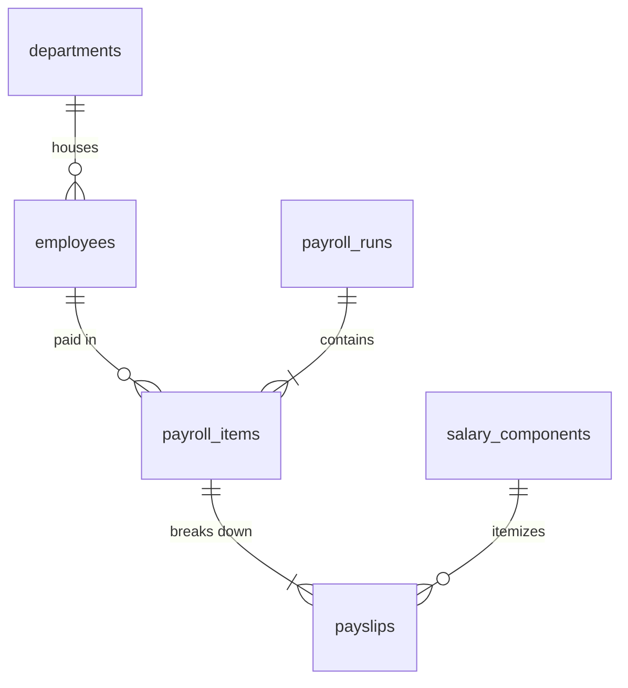

## `employees`

**Purpose.** A person on payroll — distinct from `users` (an employee may or may not have app login
access; a warehouse worker may be paid without ever signing in).

**Attributes**

| Column | Type | Null | Notes |
|---|---|---|---|
| `id` | `BIGINT GENERATED ALWAYS AS IDENTITY` | NOT NULL | PK. |
| `company_id`† / `branch_id`† | `BIGINT` | NOT NULL / NULL | |
| `department_id` | `BIGINT` | NULL | FK → `departments.id`. |
| `user_id` | `BIGINT` | NULL | FK → `users.id`; set only if the employee also has an app account. |
| `employee_code` | `VARCHAR(20)` | NOT NULL | |
| `full_name_en` / `full_name_ar` | `VARCHAR(160)` | NOT NULL / NULL | |
| `civil_id` | `VARCHAR(20)` | NULL | Kuwait civil ID or local equivalent, encrypted at rest. |
| `job_title` | `VARCHAR(120)` | NULL | |
| `hire_date` / `termination_date` | `DATE` | NOT NULL / NULL | |
| `employment_type` | `VARCHAR(20)` | NOT NULL | `CHECK (employment_type IN ('full_time','part_time','contractor'))`. |
| `base_salary` | `NUMERIC(19,4)` | NOT NULL | |
| `currency_code` | `CHAR(3)` | NOT NULL | |
| `status` | `VARCHAR(20)` | NOT NULL | `CHECK (status IN ('active','on_leave','terminated'))`. |
| `created_at`† / `updated_at`† / `deleted_at`† | — | — | Standard columns. |

**Relationships** `departments` 1—N `employees`; `users` 1—0..1 `employees`; `employees` 1—N
`payroll_items`.

**Cardinality** `departments ||--o{ employees`; `employees ||--o{ payroll_items`.

**Primary Key** `id`.

**Foreign Keys** `department_id` → `departments.id ON DELETE SET NULL`; `user_id` → `users.id ON
DELETE SET NULL`.

**Indexes** `UNIQUE (company_id, employee_code)`; `INDEX (department_id)`; `INDEX (company_id, status)`.

**Constraints** `CHECK (termination_date IS NULL OR termination_date >= hire_date)`;
`CHECK (base_salary >= 0)`.

**Delete Rules** Soft delete blocked while referenced by any `payroll_items`; `status = 'terminated'`
(with `termination_date` set) is the practical retirement path, preserving history for end-of-service
benefit calculation.

**Update Rules** `base_salary` changes take effect only from the next `payroll_runs` cycle onward;
historical `payroll_items` are never recomputed from a later salary change.

**Example Records**
```sql
INSERT INTO employees (company_id, department_id, employee_code, full_name_en, hire_date, employment_type, base_salary, currency_code, status)
VALUES (17, 8, 'EMP-0042', 'Fatima Al-Sabah', '2025-03-01', 'full_time', 850.000, 'KWD', 'active');
```
```json
{ "id": 42, "employee_code": "EMP-0042", "full_name_en": "Fatima Al-Sabah", "base_salary": "850.0000", "status": "active" }
```

**Normalization.** 3NF. `civil_id` is stored encrypted (Laravel `encrypted` cast) as a deliberate
column-level security measure for national-ID-class PII.

**Future Expansion.** `employee_bank_accounts` (separate from `bank_accounts`, which models the
company's own accounts) for payout IBAN detail beyond a single inline field.

## `salary_components`

**Purpose.** A reusable definition of an earning (basic, housing allowance, overtime) or deduction
(social security, loan repayment) that can be attached to any employee's payslip.

**Attributes**

| Column | Type | Null | Notes |
|---|---|---|---|
| `id` | `BIGINT GENERATED ALWAYS AS IDENTITY` | NOT NULL | PK. |
| `company_id`† | `BIGINT` | NOT NULL | |
| `code` | `VARCHAR(30)` | NOT NULL | |
| `name_en` / `name_ar` | `VARCHAR(120)` | NOT NULL / NULL | |
| `type` | `VARCHAR(10)` | NOT NULL | `CHECK (type IN ('earning','deduction'))`. |
| `calculation_method` | `VARCHAR(20)` | NOT NULL | `CHECK (calculation_method IN ('fixed','percentage_of_basic','formula'))`. |
| `default_amount` | `NUMERIC(19,4)` | NULL | |
| `is_taxable` | `BOOLEAN` | NOT NULL | `DEFAULT true`. |
| `gl_account_id` | `BIGINT` | NOT NULL | FK → `accounts.id`. |
| `status` | `VARCHAR(20)` | NOT NULL | `CHECK (status IN ('active','inactive'))`. |
| `created_at`† / `updated_at`† / `deleted_at`† | — | — | Standard columns. |

**Relationships** `salary_components` 1—N `payslips`; `accounts` 1—N `salary_components`.

**Cardinality** `salary_components ||--o{ payslips`.

**Primary Key** `id`.

**Foreign Keys** `gl_account_id` → `accounts.id ON DELETE RESTRICT`.

**Indexes** `UNIQUE (company_id, code)`; `INDEX (type)`.

**Constraints** `CHECK (type IN ('earning','deduction'))`.

**Delete Rules** Soft delete blocked while referenced by any `payslips`.

**Update Rules** `gl_account_id` change affects only future runs.

**Example Records**
```sql
INSERT INTO salary_components (company_id, code, name_en, type, calculation_method, gl_account_id, status)
VALUES (17, 'HOUSING', 'Housing Allowance', 'earning', 'fixed', 610, 'active');
```
```json
{ "id": 3, "code": "HOUSING", "name_en": "Housing Allowance", "type": "earning" }
```

**Normalization.** 3NF.

**Future Expansion.** Formula DSL evaluation engine for `calculation_method = 'formula'` (currently
evaluated by a Laravel service class per component code; a declarative expression column is planned).

## `payroll_runs`

**Purpose.** A batch pay cycle header — the unit that is calculated, sent for approval, released (paid),
and posted to the GL as a single journal entry.

**Attributes**

| Column | Type | Null | Notes |
|---|---|---|---|
| `id` | `BIGINT GENERATED ALWAYS AS IDENTITY` | NOT NULL | PK. |
| `company_id`† / `branch_id`† | `BIGINT` | NOT NULL / NULL | |
| `run_number` | `VARCHAR(30)` | NOT NULL | |
| `pay_period_start` / `pay_period_end` | `DATE` | NOT NULL | |
| `pay_date` | `DATE` | NOT NULL | |
| `status` | `VARCHAR(20)` | NOT NULL | `CHECK (status IN ('draft','calculated','pending_approval','approved','paid','cancelled'))`. |
| `total_gross` / `total_deductions` / `total_net` | `NUMERIC(19,4)` | NOT NULL | `DEFAULT 0`. |
| `journal_entry_id` | `BIGINT` | NULL | FK → `journal_entries.id`. |
| `approved_by` | `BIGINT` | NULL | FK → `users.id`. |
| `approved_at` | `TIMESTAMPTZ` | NULL | |
| `created_by`† / `created_at`† / `updated_at`† / `deleted_at`† | — | — | Standard columns. |

**Relationships** `payroll_runs` 1—N `payroll_items`; 1—1 `journal_entries` (once posted).

**Cardinality** `payroll_runs ||--|{ payroll_items`.

**Primary Key** `id`.

**Foreign Keys** `journal_entry_id` → `journal_entries.id ON DELETE RESTRICT`; `approved_by` →
`users.id ON DELETE SET NULL`.

**Indexes** `UNIQUE (company_id, run_number)`; `INDEX (company_id, status)`;
`INDEX (pay_period_start, pay_period_end)`.

**Constraints** `CHECK (pay_period_end >= pay_period_start)`;
`CHECK (total_net = total_gross - total_deductions)`;
`CHECK (status <> 'paid' OR approved_by IS NOT NULL)`.

**Delete Rules** Soft delete only while `draft`; `paid` is permanent (a correction is a subsequent
adjustment run, not an edit).

**Update Rules** `pending_approval → approved → paid` is one-way and permission-gated
(`payroll.approve` for the first transition; `payroll.release`, always `is_sensitive`, for the second) —
an AI Payroll Manager agent may reach `calculated`/`pending_approval` autonomously but never
`approved`/`paid`.

**Example Records**
```sql
INSERT INTO payroll_runs (company_id, run_number, pay_period_start, pay_period_end, pay_date, status, total_gross, total_deductions, total_net)
VALUES (17, 'PR-2026-07', '2026-07-01', '2026-07-31', '2026-08-01', 'paid', 12500.000, 1875.000, 10625.000);
```
```json
{ "id": 7, "run_number": "PR-2026-07", "total_net": "10625.0000", "status": "paid" }
```

**Normalization.** 3NF; totals are a maintained rollup of `payroll_items`.

**Future Expansion.** Off-cycle/bonus runs as a `run_type` discriminator alongside the regular monthly
cadence.

## `payroll_items`

**Purpose.** One employee's summarized result within a payroll run; the row `payslips` line items roll
up into.

**Attributes**

| Column | Type | Null | Notes |
|---|---|---|---|
| `id` | `BIGINT GENERATED ALWAYS AS IDENTITY` | NOT NULL | PK. |
| `payroll_run_id` | `BIGINT` | NOT NULL | FK → `payroll_runs.id`. |
| `company_id`† | `BIGINT` | NOT NULL | |
| `employee_id` | `BIGINT` | NOT NULL | FK → `employees.id`. |
| `gross_pay` / `total_deductions` / `net_pay` | `NUMERIC(19,4)` | NOT NULL | |
| `days_worked` | `NUMERIC(5,2)` | NOT NULL | |
| `created_at`† / `updated_at`† | — | — | Standard columns. |

**Relationships** `payroll_runs` 1—N `payroll_items`; `employees` 1—N `payroll_items`; `payroll_items`
1—N `payslips`.

**Cardinality** `payroll_runs ||--|{ payroll_items`; `payroll_items ||--|{ payslips`.

**Primary Key** `id`.

**Foreign Keys** `payroll_run_id` → `payroll_runs.id ON DELETE CASCADE`; `employee_id` →
`employees.id ON DELETE RESTRICT`.

**Indexes** `UNIQUE (payroll_run_id, employee_id)`; `INDEX (employee_id)`.

**Constraints** `CHECK (net_pay = gross_pay - total_deductions)`; `CHECK (gross_pay >= 0)`.

**Delete Rules** `CASCADE` while parent `draft`/`calculated`; frozen once parent `approved`/`paid`.

**Update Rules** Recalculated freely until parent leaves `draft`/`calculated`.

**Example Records**
```sql
INSERT INTO payroll_items (payroll_run_id, company_id, employee_id, gross_pay, total_deductions, net_pay, days_worked)
VALUES (7, 17, 42, 1050.000, 157.500, 892.500, 31);
```
```json
{ "employee_id": 42, "gross_pay": "1050.0000", "net_pay": "892.5000" }
```

**Normalization.** 3NF.

**Future Expansion.** Attendance-linked `days_worked` sourced from a future time-and-attendance module
rather than manual entry.

## `payslips`

**Purpose.** The component-level breakdown of a `payroll_items` row — one row per earning/deduction
line — which is what a rendered payslip PDF (stored via `attachments`) is generated from.

**Attributes**

| Column | Type | Null | Notes |
|---|---|---|---|
| `id` | `BIGINT GENERATED ALWAYS AS IDENTITY` | NOT NULL | PK. |
| `payroll_item_id` | `BIGINT` | NOT NULL | FK → `payroll_items.id`. |
| `company_id`† | `BIGINT` | NOT NULL | |
| `employee_id` | `BIGINT` | NOT NULL | FK → `employees.id`. Denormalized for direct employee-history queries without joining through `payroll_items`. |
| `salary_component_id` | `BIGINT` | NOT NULL | FK → `salary_components.id`. |
| `amount` | `NUMERIC(19,4)` | NOT NULL | |
| `type` | `VARCHAR(10)` | NOT NULL | Copied from `salary_components.type` at generation time. |
| `created_at`† | `TIMESTAMPTZ` | NOT NULL | |

**Relationships** `payroll_items` 1—N `payslips`; `salary_components` 1—N `payslips`; `employees` 1—N
`payslips`.

**Cardinality** `payroll_items ||--|{ payslips`.

**Primary Key** `id`.

**Foreign Keys** `payroll_item_id` → `payroll_items.id ON DELETE CASCADE`; `employee_id` →
`employees.id ON DELETE RESTRICT`; `salary_component_id` → `salary_components.id ON DELETE RESTRICT`.

**Indexes** `INDEX (payroll_item_id)`; `INDEX (employee_id, created_at)`.

**Constraints** `CHECK (amount >= 0)`.

**Delete Rules** `CASCADE` with the parent `payroll_items` under the same lifecycle rule (frozen once
`approved`/`paid`).

**Update Rules** Frozen once parent run leaves `draft`/`calculated`.

**Example Records**
```sql
INSERT INTO payslips (payroll_item_id, company_id, employee_id, salary_component_id, amount, type)
VALUES (420, 17, 42, 3, 100.000, 'earning');
```
```json
{ "employee_id": 42, "salary_component_id": 3, "amount": "100.0000", "type": "earning" }
```

**Normalization.** 3NF; `employee_id` denormalized from the parent for query locality, kept correct by a
trigger matching `payroll_items.employee_id`.

**Future Expansion.** Rendered PDF caching (`attachable_type = 'payslips'` row in `attachments`) —
already supported structurally via the polymorphic Documents module, generated on demand today.

# Banking

The Banking module tracks the company's own bank accounts, the transactions moving through them, bank
feed reconciliation against the book record, and inter-account transfers. Transfers above policy
thresholds are sensitive, human-approval-gated actions.

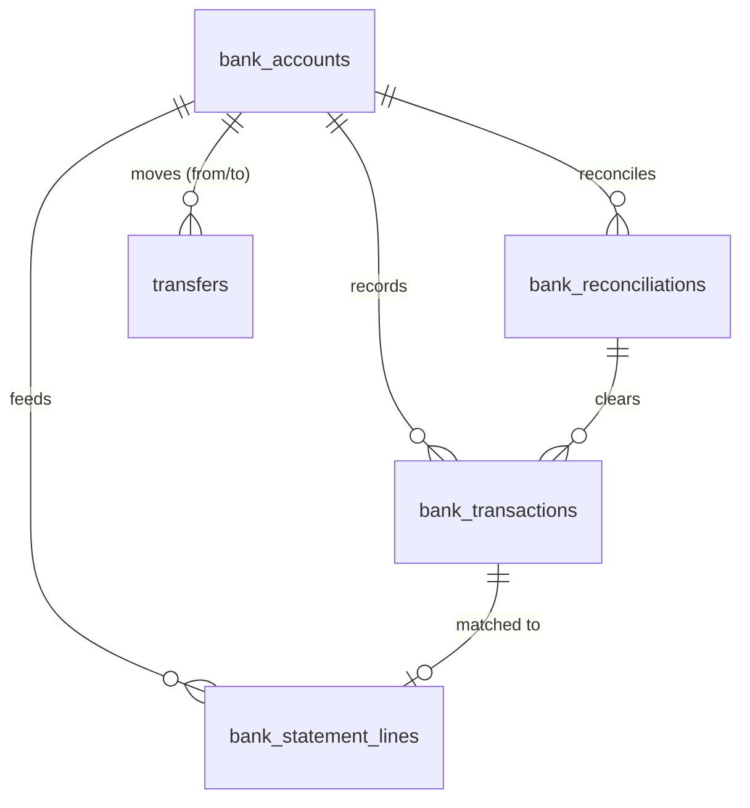

## `bank_accounts`

**Purpose.** One of the company's own bank/cash accounts, linked to a specific cash/bank GL account so
every transaction on it posts consistently.

**Attributes**

| Column | Type | Null | Notes |
|---|---|---|---|
| `id` | `BIGINT GENERATED ALWAYS AS IDENTITY` | NOT NULL | PK. |
| `company_id`† / `branch_id`† | `BIGINT` | NOT NULL / NULL | |
| `bank_name` | `VARCHAR(120)` | NOT NULL | |
| `account_name` | `VARCHAR(120)` | NOT NULL | |
| `account_number` | `VARCHAR(60)` | NOT NULL | Encrypted at rest. |
| `iban` | `VARCHAR(34)` | NULL | Encrypted at rest. |
| `swift_code` | `VARCHAR(11)` | NULL | |
| `currency_code` | `CHAR(3)` | NOT NULL | |
| `gl_account_id` | `BIGINT` | NOT NULL | FK → `accounts.id`. |
| `current_balance` | `NUMERIC(19,4)` | NOT NULL | `DEFAULT 0`. Cached; authoritative balance is always the linked GL account's ledger balance. |
| `status` | `VARCHAR(20)` | NOT NULL | `CHECK (status IN ('active','inactive','closed'))`. |
| `created_at`† / `updated_at`† / `deleted_at`† | — | — | Standard columns. |

**Relationships** `bank_accounts` 1—N `bank_transactions`, `bank_statement_lines`,
`bank_reconciliations`, `transfers` (as either side); `accounts` 1—N `bank_accounts`.

**Cardinality** `accounts ||--o{ bank_accounts`; `bank_accounts ||--o{ bank_transactions`.

**Primary Key** `id`.

**Foreign Keys** `gl_account_id` → `accounts.id ON DELETE RESTRICT`.

**Indexes** `INDEX (company_id, status)`; `UNIQUE (gl_account_id)` (one bank account per GL cash/bank
account).

**Constraints** `CHECK (status IN ('active','inactive','closed'))`.

**Delete Rules** Soft delete blocked while `current_balance <> 0` or while any un-reconciled
`bank_transactions` exist.

**Update Rules** `gl_account_id` immutable once any `bank_transactions` exists.

**Example Records**
```sql
INSERT INTO bank_accounts (company_id, bank_name, account_name, account_number, currency_code, gl_account_id, current_balance, status)
VALUES (17, 'National Bank of Kuwait', 'Al-Fahad Trading — Current Account', 'ENC:a91f...', 'KWD', 1110, 48210.750, 'active');
```
```json
{ "id": 2, "bank_name": "National Bank of Kuwait", "currency_code": "KWD", "current_balance": "48210.7500", "status": "active" }
```

**Normalization.** 3NF; `current_balance` is a cache of the GL balance, refreshed by trigger on every
posted `journal_lines` against `gl_account_id`.

**Future Expansion.** Open-banking live-feed credential storage (`bank_feed_connections`) once a direct
bank API integration replaces manual CSV/MT940 import.

## `bank_transactions`

**Purpose.** An internal record of money moving through a bank account — a deposit, withdrawal, fee, or
interest — distinct from the raw feed line it may later be matched against.

**Attributes**

| Column | Type | Null | Notes |
|---|---|---|---|
| `id` | `BIGINT GENERATED ALWAYS AS IDENTITY` | NOT NULL | PK. |
| `company_id`† | `BIGINT` | NOT NULL | |
| `bank_account_id` | `BIGINT` | NOT NULL | FK → `bank_accounts.id`. |
| `transaction_date` | `DATE` | NOT NULL | |
| `type` | `VARCHAR(20)` | NOT NULL | `CHECK (type IN ('deposit','withdrawal','fee','interest','transfer_in','transfer_out'))`. |
| `amount` | `NUMERIC(19,4)` | NOT NULL | Signed. |
| `description` | `VARCHAR(255)` | NULL | |
| `source_type` | `VARCHAR(30)` | NULL | `CHECK (source_type IN ('receipt','vendor_payment','payroll_run','transfer') OR source_type IS NULL)`. |
| `source_id` | `BIGINT` | NULL | Polymorphic pointer. |
| `journal_entry_id` | `BIGINT` | NULL | FK → `journal_entries.id`. |
| `reconciled` | `BOOLEAN` | NOT NULL | `DEFAULT false`. |
| `bank_reconciliation_id` | `BIGINT` | NULL | FK → `bank_reconciliations.id`. |
| `created_by`† / `created_at`† / `updated_at`† / `deleted_at`† | — | — | Standard columns. |

**Relationships** `bank_accounts` 1—N `bank_transactions`; `bank_reconciliations` 1—N
`bank_transactions`; 0..1 matched `bank_statement_lines`.

**Cardinality** `bank_accounts ||--o{ bank_transactions`.

**Primary Key** `id`.

**Foreign Keys** `bank_account_id` → `bank_accounts.id ON DELETE RESTRICT`; `journal_entry_id` →
`journal_entries.id ON DELETE RESTRICT`; `bank_reconciliation_id` → `bank_reconciliations.id ON DELETE
SET NULL`.

**Indexes** `INDEX (bank_account_id, transaction_date)`; `INDEX (reconciled) WHERE reconciled = false`;
`INDEX (source_type, source_id)`.

**Constraints** `CHECK (amount <> 0)`.

**Delete Rules** Soft delete only while un-reconciled and un-posted; posted/reconciled rows are
permanent.

**Update Rules** `reconciled`/`bank_reconciliation_id` set only by the reconciliation workflow;
financial fields frozen once `journal_entry_id` is set.

**Example Records**
```sql
INSERT INTO bank_transactions (company_id, bank_account_id, transaction_date, type, amount, source_type, source_id, reconciled)
VALUES (17, 2, '2026-07-16', 'deposit', 525.000, 'receipt', 5120, false);
```
```json
{ "bank_account_id": 2, "type": "deposit", "amount": "525.0000", "reconciled": false }
```

**Normalization.** 3NF.

**Future Expansion.** Multi-currency bank accounts holding several `currency_code` sub-balances
simultaneously (today one bank account = one currency).

## `bank_statement_lines`

**Purpose.** A raw line imported from a bank feed, CSV export, or MT940 file, before it is matched to an
internal `bank_transactions` row. Exists so reconciliation has an unambiguous "what the bank says"
record independent of "what QAYD recorded."

**Attributes**

| Column | Type | Null | Notes |
|---|---|---|---|
| `id` | `BIGINT GENERATED ALWAYS AS IDENTITY` | NOT NULL | PK. |
| `company_id`† | `BIGINT` | NOT NULL | |
| `bank_account_id` | `BIGINT` | NOT NULL | FK → `bank_accounts.id`. |
| `statement_date` / `value_date` | `DATE` | NOT NULL | |
| `description_raw` | `TEXT` | NOT NULL | |
| `amount` | `NUMERIC(19,4)` | NOT NULL | |
| `balance_after` | `NUMERIC(19,4)` | NULL | |
| `external_ref` | `VARCHAR(120)` | NULL | |
| `import_batch_id` | `UUID` | NULL | Groups lines from one import run. |
| `matched_bank_transaction_id` | `BIGINT` | NULL | FK → `bank_transactions.id`. |
| `match_status` | `VARCHAR(20)` | NOT NULL | `CHECK (match_status IN ('unmatched','matched','ignored'))`. |
| `created_at`† / `updated_at`† | — | — | Standard columns. |

**Relationships** `bank_accounts` 1—N `bank_statement_lines`; 0..1 `bank_transactions` once matched.

**Cardinality** `bank_accounts ||--o{ bank_statement_lines`.

**Primary Key** `id`.

**Foreign Keys** `bank_account_id` → `bank_accounts.id ON DELETE RESTRICT`;
`matched_bank_transaction_id` → `bank_transactions.id ON DELETE SET NULL`.

**Indexes** `INDEX (bank_account_id, statement_date)`; `INDEX (match_status) WHERE match_status = 'unmatched'`;
`UNIQUE (bank_account_id, external_ref) WHERE external_ref IS NOT NULL` (import idempotency).

**Constraints** `CHECK (match_status IN ('unmatched','matched','ignored'))`.

**Delete Rules** Never deleted — the raw feed is a source-of-truth import artifact retained for audit,
even after matching or being marked `ignored` (e.g. a bank-internal transfer notice not relevant to
QAYD).

**Update Rules** Only `matched_bank_transaction_id`/`match_status` change after import; `amount`/
`description_raw` are immutable (they are exactly what the bank sent).

**Example Records**
```sql
INSERT INTO bank_statement_lines (company_id, bank_account_id, statement_date, value_date, description_raw, amount, match_status)
VALUES (17, 2, '2026-07-16', '2026-07-16', 'INWARD TRF REF 88213 AL-BOUNYAN', 525.000, 'unmatched');
```
```json
{ "bank_account_id": 2, "amount": "525.0000", "match_status": "unmatched" }
```

**Normalization.** 3NF.

**Future Expansion.** Fuzzy auto-matching confidence score (`match_confidence`), feeding the Treasury
Manager AI agent's suggested-match queue.

## `bank_reconciliations`

**Purpose.** A period-end reconciliation session that ties the bank's statement ending balance to
QAYD's book balance for one account, clearing matched `bank_transactions`.

**Attributes**

| Column | Type | Null | Notes |
|---|---|---|---|
| `id` | `BIGINT GENERATED ALWAYS AS IDENTITY` | NOT NULL | PK. |
| `company_id`† | `BIGINT` | NOT NULL | |
| `bank_account_id` | `BIGINT` | NOT NULL | FK → `bank_accounts.id`. |
| `statement_date` | `DATE` | NOT NULL | |
| `statement_ending_balance` / `book_ending_balance` | `NUMERIC(19,4)` | NOT NULL | |
| `difference` | `NUMERIC(19,4)` | NOT NULL | `GENERATED ALWAYS AS (statement_ending_balance - book_ending_balance) STORED`. |
| `status` | `VARCHAR(20)` | NOT NULL | `CHECK (status IN ('in_progress','completed'))`. |
| `completed_by` | `BIGINT` | NULL | FK → `users.id`. |
| `completed_at` | `TIMESTAMPTZ` | NULL | |
| `created_at`† / `updated_at`† | — | — | Standard columns. |

**Relationships** `bank_accounts` 1—N `bank_reconciliations`; 1—N `bank_transactions` (cleared set).

**Cardinality** `bank_accounts ||--o{ bank_reconciliations`.

**Primary Key** `id`.

**Foreign Keys** `bank_account_id` → `bank_accounts.id ON DELETE RESTRICT`; `completed_by` →
`users.id ON DELETE SET NULL`.

**Indexes** `INDEX (bank_account_id, statement_date)`.

**Constraints** `CHECK (status <> 'completed' OR difference = 0)` — cannot close a reconciliation with
an unexplained difference; an unreconciled difference must be posted as a bank fee/adjustment
transaction first.

**Delete Rules** Never deleted once `completed` (audit/compliance record).

**Update Rules** Frozen once `completed`; reopening requires Finance Manager+ and is logged as a
`security_events` row.

**Example Records**
```sql
INSERT INTO bank_reconciliations (company_id, bank_account_id, statement_date, statement_ending_balance, book_ending_balance, status)
VALUES (17, 2, '2026-07-31', 48210.750, 48210.750, 'completed');
```
```json
{ "bank_account_id": 2, "statement_date": "2026-07-31", "difference": "0.0000", "status": "completed" }
```

**Normalization.** 3NF.

**Future Expansion.** Multi-statement reconciliation spanning more than one calendar month in a single
session for accounts reconciled less frequently.

## `transfers`

**Purpose.** Moves funds between two of the company's own bank accounts (sweeping cash to a
higher-yield account, funding a branch's local account). Classified sensitive, requiring approval above
a configurable threshold.

**Attributes**

| Column | Type | Null | Notes |
|---|---|---|---|
| `id` | `BIGINT GENERATED ALWAYS AS IDENTITY` | NOT NULL | PK. |
| `company_id`† | `BIGINT` | NOT NULL | |
| `from_bank_account_id` / `to_bank_account_id` | `BIGINT` | NOT NULL | Both FK → `bank_accounts.id`. |
| `transfer_date` | `DATE` | NOT NULL | |
| `amount` | `NUMERIC(19,4)` | NOT NULL | |
| `currency_code` / `exchange_rate` | — | NOT NULL | |
| `reference_no` | `VARCHAR(60)` | NULL | |
| `journal_entry_id` | `BIGINT` | NULL | FK → `journal_entries.id`. |
| `status` | `VARCHAR(20)` | NOT NULL | `CHECK (status IN ('pending','pending_approval','completed','failed'))`. |
| `requires_approval` | `BOOLEAN` | NOT NULL | `DEFAULT true`. |
| `approved_by` | `BIGINT` | NULL | FK → `users.id`. |
| `approved_at` | `TIMESTAMPTZ` | NULL | |
| `created_by`† / `created_at`† / `updated_at`† / `deleted_at`† | — | — | Standard columns. |

**Relationships** `bank_accounts` 1—N `transfers` (twice: source and destination).

**Cardinality** `bank_accounts ||--o{ transfers`.

**Primary Key** `id`.

**Foreign Keys** `from_bank_account_id` → `bank_accounts.id ON DELETE RESTRICT`; `to_bank_account_id` →
`bank_accounts.id ON DELETE RESTRICT`; `journal_entry_id` → `journal_entries.id ON DELETE RESTRICT`;
`approved_by` → `users.id ON DELETE SET NULL`.

**Indexes** `INDEX (from_bank_account_id)`; `INDEX (to_bank_account_id)`;
`INDEX (status) WHERE status = 'pending_approval'`.

**Constraints** `CHECK (from_bank_account_id <> to_bank_account_id)`; `CHECK (amount > 0)`.

**Delete Rules** Soft delete only while `pending`; `completed` is permanent.

**Update Rules** Same one-way approval pipeline as `vendor_payments`; an AI Treasury Manager agent may
propose a `pending` transfer but never self-approve.

**Example Records**
```sql
INSERT INTO transfers (company_id, from_bank_account_id, to_bank_account_id, transfer_date, amount, currency_code, status, requires_approval, approved_by, approved_at)
VALUES (17, 2, 3, '2026-07-16', 5000.000, 'KWD', 'completed', true, 1042, now());
```
```json
{ "id": 14, "amount": "5000.0000", "status": "completed", "approved_by": 1042 }
```

**Normalization.** 3NF.

**Future Expansion.** Cross-currency transfers with FX-gain/loss posting for companies holding accounts
in more than one currency.

# Tax

The Tax module models jurisdiction-aware indirect tax (VAT/withholding/excise): the codes and rates
applied to transaction lines, the resulting tax capture per document, and the periodic filing rollup.
Kuwait currently has no VAT regime, so a Kuwait-only tenant typically operates with a `none`-type
default code, while AE/SA tenants apply real VAT rates — the schema is jurisdiction-agnostic by design.
Tax submission is a sensitive, human-approval-gated action.

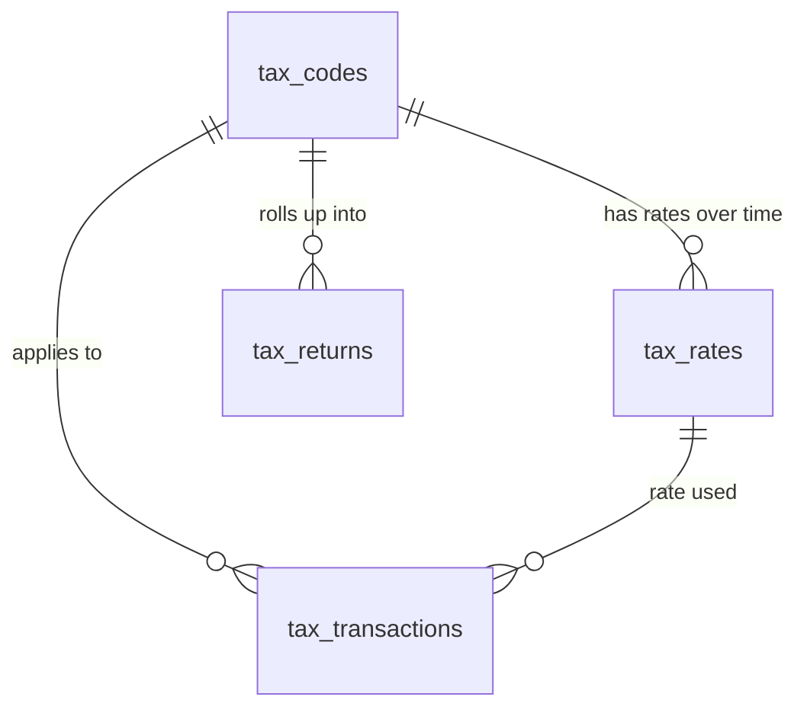

## `tax_codes`

**Purpose.** A named tax treatment (e.g. `KW-NONE`, `AE-VAT-STD`, `SA-VAT-STD`) that a product,
customer, or transaction line can be tagged with. System defaults (`company_id IS NULL`) ship with the
platform; a company may define overrides.

**Attributes**

| Column | Type | Null | Notes |
|---|---|---|---|
| `id` | `BIGINT GENERATED ALWAYS AS IDENTITY` | NOT NULL | PK. |
| `company_id` | `BIGINT` | NULL | `NULL` = system default, visible to all companies in that country. |
| `code` | `VARCHAR(30)` | NOT NULL | |
| `name_en` / `name_ar` | `VARCHAR(120)` | NOT NULL / NULL | |
| `tax_type` | `VARCHAR(20)` | NOT NULL | `CHECK (tax_type IN ('vat','withholding','excise','none'))`. |
| `is_recoverable` | `BOOLEAN` | NOT NULL | `DEFAULT true`. Whether input tax under this code can be reclaimed. |
| `gl_payable_account_id` | `BIGINT` | NULL | FK → `accounts.id`; output tax liability account. |
| `gl_receivable_account_id` | `BIGINT` | NULL | FK → `accounts.id`; recoverable input tax asset account. |
| `status` | `VARCHAR(20)` | NOT NULL | `CHECK (status IN ('active','inactive'))`. |
| `created_at`† / `updated_at`† / `deleted_at`† | — | — | Standard columns. |

**Relationships** `tax_codes` 1—N `tax_rates`, `tax_transactions`, `tax_returns`; referenced from
`invoice_items`/`sales_quotation_items`/`sales_order_items`/`bill_items`/`purchase_order_items`.

**Cardinality** `tax_codes ||--o{ tax_rates`.

**Primary Key** `id`.

**Foreign Keys** `company_id` → `companies.id ON DELETE CASCADE` (NULL for system rows);
`gl_payable_account_id` / `gl_receivable_account_id` → `accounts.id ON DELETE SET NULL`.

**Indexes** `UNIQUE (company_id, code)`; `INDEX (tax_type)`.

**Constraints** `CHECK (tax_type IN ('vat','withholding','excise','none'))`.

**Delete Rules** Soft delete blocked while referenced by any transaction line.

**Update Rules** `tax_type` immutable once used; GL account links may be repointed for future
transactions without affecting posted `tax_transactions`.

**Example Records**
```sql
INSERT INTO tax_codes (company_id, code, name_en, tax_type, is_recoverable, status) VALUES (NULL, 'KW-NONE', 'No VAT (Kuwait)', 'none', false, 'active');
```
```json
{ "code": "KW-NONE", "name_en": "No VAT (Kuwait)", "tax_type": "none", "status": "active" }
```

**Normalization.** 3NF.

**Future Expansion.** Reverse-charge mechanism flag for cross-border B2B services once QAYD expands
into full GCC VAT jurisdictions beyond AE/SA.

## `tax_rates`

**Purpose.** The specific percentage a tax code applies, versioned over time (VAT rates change by
government decree; historical transactions must keep the rate that applied when they were posted).

**Attributes**

| Column | Type | Null | Notes |
|---|---|---|---|
| `id` | `BIGINT GENERATED ALWAYS AS IDENTITY` | NOT NULL | PK. |
| `tax_code_id` | `BIGINT` | NOT NULL | FK → `tax_codes.id`. |
| `company_id` | `BIGINT` | NULL | Mirrors `tax_codes.company_id`. |
| `rate_percent` | `NUMERIC(6,3)` | NOT NULL | e.g. `5.000` for AE standard VAT. |
| `effective_from` | `DATE` | NOT NULL | |
| `effective_to` | `DATE` | NULL | `NULL` = currently in force. |
| `created_at`† / `updated_at`† | — | — | Standard columns. |

**Relationships** `tax_codes` 1—N `tax_rates`; `tax_rates` 1—N `tax_transactions`.

**Cardinality** `tax_codes ||--o{ tax_rates`.

**Primary Key** `id`.

**Foreign Keys** `tax_code_id` → `tax_codes.id ON DELETE CASCADE`.

**Indexes** `INDEX (tax_code_id, effective_from)`; a trigger blocks overlapping `effective_from`/
`effective_to` ranges per `tax_code_id`.

**Constraints** `CHECK (rate_percent >= 0)`; `CHECK (effective_to IS NULL OR effective_to > effective_from)`.

**Delete Rules** Never deleted once referenced by any `tax_transactions` (historical rate integrity).

**Update Rules** A rate change is a new row with `effective_from` set and the prior row's
`effective_to` closed, never an in-place percentage edit.

**Example Records**
```sql
INSERT INTO tax_rates (tax_code_id, rate_percent, effective_from) VALUES (9, 5.000, '2018-01-01');
```
```json
{ "tax_code_id": 9, "rate_percent": "5.000", "effective_from": "2018-01-01", "effective_to": null }
```

**Normalization.** 3NF; temporal versioning via effective-dated rows rather than overwriting a single
current-rate column.

**Future Expansion.** Tiered/bracketed rates (e.g. excise tax bands by product category) as an
additional `product_category_id` qualifier.

## `tax_transactions`

**Purpose.** Line-level tax capture from a posted invoice/bill/credit note/debit note — the atomic
facts a `tax_returns` filing rolls up from.

**Attributes**

| Column | Type | Null | Notes |
|---|---|---|---|
| `id` | `BIGINT GENERATED ALWAYS AS IDENTITY` | NOT NULL | PK. |
| `company_id`† | `BIGINT` | NOT NULL | |
| `tax_code_id` | `BIGINT` | NOT NULL | FK → `tax_codes.id`. |
| `tax_rate_id` | `BIGINT` | NOT NULL | FK → `tax_rates.id`. |
| `source_type` | `VARCHAR(20)` | NOT NULL | `CHECK (source_type IN ('invoice','bill','credit_note','debit_note'))`. |
| `source_id` | `BIGINT` | NOT NULL | Polymorphic pointer. |
| `taxable_amount` / `tax_amount` | `NUMERIC(19,4)` | NOT NULL | |
| `direction` | `VARCHAR(10)` | NOT NULL | `CHECK (direction IN ('output','input'))`. `output` = tax charged to customers; `input` = tax paid to vendors. |
| `transaction_date` | `DATE` | NOT NULL | |
| `fiscal_period_id` | `BIGINT` | NOT NULL | FK → `fiscal_periods.id`. |
| `created_at`† | `TIMESTAMPTZ` | NOT NULL | |

**Relationships** `tax_codes`/`tax_rates` 1—N `tax_transactions`; `fiscal_periods` 1—N
`tax_transactions`; `tax_returns` aggregate over this table by period.

**Cardinality** `tax_codes ||--o{ tax_transactions`; `fiscal_periods ||--o{ tax_transactions`.

**Primary Key** `id`.

**Foreign Keys** `tax_code_id` → `tax_codes.id ON DELETE RESTRICT`; `tax_rate_id` →
`tax_rates.id ON DELETE RESTRICT`; `fiscal_period_id` → `fiscal_periods.id ON DELETE RESTRICT`.

**Indexes** `INDEX (company_id, fiscal_period_id, direction)`; `INDEX (source_type, source_id)`.

**Constraints** `CHECK (direction IN ('output','input'))`; `CHECK (tax_amount >= 0)`.

**Delete Rules** Never deleted — generated automatically when the source document posts, removed only
if the source document is voided (which inserts an offsetting negative-amount row, mirroring
`journal_lines` reversal discipline, rather than deleting the original).

**Update Rules** Insert-only; corrections are offsetting rows.

**Example Records**
```sql
INSERT INTO tax_transactions (company_id, tax_code_id, tax_rate_id, source_type, source_id, taxable_amount, tax_amount, direction, transaction_date, fiscal_period_id)
VALUES (17, 9, 4, 'invoice', 9931, 500.000, 25.000, 'output', '2026-07-16', 46);
```
```json
{ "source_type": "invoice", "source_id": 9931, "tax_amount": "25.0000", "direction": "output" }
```

**Normalization.** 3NF.

**Future Expansion.** Place-of-supply tracking for cross-border digital services once needed for
multi-jurisdiction VAT compliance.

## `tax_returns`

**Purpose.** The periodic filing rollup submitted to the tax authority: total output tax, total
recoverable input tax, and the net payable/refundable position.

**Attributes**

| Column | Type | Null | Notes |
|---|---|---|---|
| `id` | `BIGINT GENERATED ALWAYS AS IDENTITY` | NOT NULL | PK. |
| `company_id`† | `BIGINT` | NOT NULL | |
| `tax_code_id` | `BIGINT` | NOT NULL | FK → `tax_codes.id`. |
| `period_start` / `period_end` | `DATE` | NOT NULL | |
| `total_output_tax` / `total_input_tax` | `NUMERIC(19,4)` | NOT NULL | |
| `net_payable` | `NUMERIC(19,4)` | NOT NULL | `GENERATED ALWAYS AS (total_output_tax - total_input_tax) STORED`. |
| `status` | `VARCHAR(20)` | NOT NULL | `CHECK (status IN ('draft','filed','paid','amended'))`. |
| `filed_at` | `TIMESTAMPTZ` | NULL | |
| `filed_by` | `BIGINT` | NULL | FK → `users.id`. |
| `submission_reference` | `VARCHAR(120)` | NULL | Tax authority's acknowledgment/reference number. |
| `created_at`† / `updated_at`† | — | — | Standard columns. |

**Relationships** `tax_codes` 1—N `tax_returns`; conceptually aggregates `tax_transactions` for the
period (no FK — the aggregation is computed at generation time and stored, not live-joined).

**Cardinality** `tax_codes ||--o{ tax_returns`.

**Primary Key** `id`.

**Foreign Keys** `tax_code_id` → `tax_codes.id ON DELETE RESTRICT`; `filed_by` → `users.id ON DELETE
SET NULL`.

**Indexes** `UNIQUE (company_id, tax_code_id, period_start, period_end)`.

**Constraints** `CHECK (period_end > period_start)`; `CHECK (status <> 'filed' OR filed_at IS NOT NULL)`.

**Delete Rules** Never deleted once `filed` (statutory record).

**Update Rules** `draft → filed` requires `tax.submit` permission (always `is_sensitive`) — an AI Tax
Advisor agent may prepare the `draft` figures but never itself files; `filed → amended` opens a new
linked return rather than editing the filed one.

**Example Records**
```sql
INSERT INTO tax_returns (company_id, tax_code_id, period_start, period_end, total_output_tax, total_input_tax, status)
VALUES (17, 9, '2026-04-01', '2026-06-30', 4200.000, 1150.000, 'filed');
```
```json
{ "period_start": "2026-04-01", "period_end": "2026-06-30", "net_payable": "3050.0000", "status": "filed" }
```

**Normalization.** 3NF.

**Future Expansion.** Direct e-filing API integration (submission automatically populates
`submission_reference` rather than manual entry).

# Reports

The Reports module defines what reports exist (system-provided and company-custom), when they run
automatically, and the history of each run's output. Every generated file is stored via the Documents
module's `attachments` table.

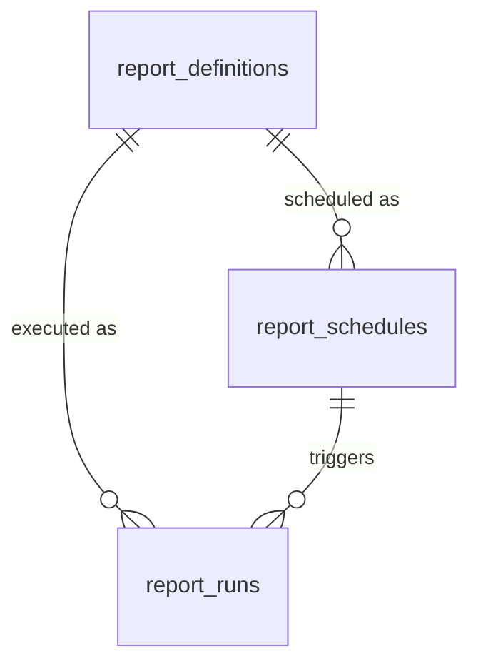

## `report_definitions`

**Purpose.** A named, parameterized report — Trial Balance, P&L, AR Aging, Inventory Valuation — either
a system-provided standard report or a company-custom one built on the report query builder.

**Attributes**

| Column | Type | Null | Notes |
|---|---|---|---|
| `id` | `BIGINT GENERATED ALWAYS AS IDENTITY` | NOT NULL | PK. |
| `company_id` | `BIGINT` | NULL | `NULL` = system-standard report available to all companies. |
| `code` | `VARCHAR(40)` | NOT NULL | e.g. `trial_balance`, `profit_and_loss`, `ar_aging`. |
| `name_en` / `name_ar` | `VARCHAR(150)` | NOT NULL / NULL | |
| `category` | `VARCHAR(20)` | NOT NULL | `CHECK (category IN ('financial','sales','purchasing','inventory','payroll','tax','custom'))`. |
| `query_definition` | `JSONB` | NOT NULL | Parameterized query/builder tree consumed by the reporting engine. |
| `output_formats` | `TEXT[]` | NOT NULL | `DEFAULT ARRAY['pdf']`. Subset of `pdf`, `xlsx`, `csv`, `json`. |
| `status` | `VARCHAR(20)` | NOT NULL | `CHECK (status IN ('active','inactive'))`. |
| `created_at`† / `updated_at`† / `deleted_at`† | — | — | Standard columns. |

**Relationships** `report_definitions` 1—N `report_schedules`, `report_runs`.

**Cardinality** `report_definitions ||--o{ report_runs`.

**Primary Key** `id`.

**Foreign Keys** `company_id` → `companies.id ON DELETE CASCADE` (NULL for system rows).

**Indexes** `UNIQUE (company_id, code)`; `INDEX (category)`.

**Constraints** `CHECK (output_formats <@ ARRAY['pdf','xlsx','csv','json']::TEXT[])`.

**Delete Rules** Soft delete blocked while any `report_schedules` reference it.

**Update Rules** `query_definition` changes apply only to future `report_runs`; past runs retain their
output as generated.

**Example Records**
```sql
INSERT INTO report_definitions (company_id, code, name_en, category, query_definition, output_formats, status)
VALUES (NULL, 'trial_balance', 'Trial Balance', 'financial', '{"source": "ledger_entries", "group_by": "account_id"}', ARRAY['pdf','xlsx'], 'active');
```
```json
{ "code": "trial_balance", "name_en": "Trial Balance", "category": "financial", "output_formats": ["pdf", "xlsx"] }
```

**Normalization.** 3NF for the relational columns; `query_definition` is intentionally JSONB (a
semi-structured query tree does not decompose cleanly into relational columns without a bespoke
query-plan schema of its own).

**Future Expansion.** A visual report-builder's canonical AST replacing the current loosely-typed JSONB
shape with a versioned schema.

## `report_schedules`

**Purpose.** Recurring automatic execution of a report definition, with recipients and parameters.

**Attributes**

| Column | Type | Null | Notes |
|---|---|---|---|
| `id` | `BIGINT GENERATED ALWAYS AS IDENTITY` | NOT NULL | PK. |
| `company_id`† | `BIGINT` | NOT NULL | |
| `report_definition_id` | `BIGINT` | NOT NULL | FK → `report_definitions.id`. |
| `name` | `VARCHAR(150)` | NOT NULL | |
| `frequency` | `VARCHAR(20)` | NOT NULL | `CHECK (frequency IN ('daily','weekly','monthly','quarterly','on_demand'))`. |
| `cron_expression` | `VARCHAR(60)` | NULL | Required unless `frequency = 'on_demand'`. |
| `recipients` | `JSONB` | NOT NULL | `DEFAULT '[]'`. Array of `user_id`/email entries. |
| `parameters` | `JSONB` | NOT NULL | `DEFAULT '{}'`. |
| `next_run_at` | `TIMESTAMPTZ` | NULL | |
| `last_run_at` | `TIMESTAMPTZ` | NULL | |
| `status` | `VARCHAR(20)` | NOT NULL | `CHECK (status IN ('active','paused'))`. |
| `created_by`† / `created_at`† / `updated_at`† / `deleted_at`† | — | — | Standard columns. |

**Relationships** `report_definitions` 1—N `report_schedules`; `report_schedules` 1—N `report_runs`.

**Cardinality** `report_definitions ||--o{ report_schedules`.

**Primary Key** `id`.

**Foreign Keys** `report_definition_id` → `report_definitions.id ON DELETE CASCADE`.

**Indexes** `INDEX (next_run_at) WHERE status = 'active'` (the scheduler's poll index).

**Constraints** `CHECK (frequency = 'on_demand' OR cron_expression IS NOT NULL)`.

**Delete Rules** Soft delete blocked while referenced by any `report_runs`; `status = 'paused'` is the
practical pause path.

**Update Rules** `next_run_at` is recomputed by the scheduler after every run; direct user edits to it
are disallowed (only `cron_expression`/`frequency` are user-editable, from which the scheduler derives
`next_run_at`).

**Example Records**
```sql
INSERT INTO report_schedules (company_id, report_definition_id, name, frequency, cron_expression, recipients, status)
VALUES (17, 1, 'Monthly Trial Balance', 'monthly', '0 6 1 * *', '[{"user_id": 1042}]', 'active');
```
```json
{ "name": "Monthly Trial Balance", "frequency": "monthly", "status": "active" }
```

**Normalization.** 3NF for relational columns; `recipients`/`parameters` as JSONB for schema flexibility
across wildly different report parameter shapes.

**Future Expansion.** Conditional schedules ("only run/notify if net_payable > 0") via a `condition`
JSONB expression evaluated before dispatch.

## `report_runs`

**Purpose.** One executed instance of a report — on-demand or scheduled — and a pointer to its
generated output file.

**Attributes**

| Column | Type | Null | Notes |
|---|---|---|---|
| `id` | `BIGINT GENERATED ALWAYS AS IDENTITY` | NOT NULL | PK. |
| `company_id`† | `BIGINT` | NOT NULL | |
| `report_definition_id` | `BIGINT` | NOT NULL | FK → `report_definitions.id`. |
| `report_schedule_id` | `BIGINT` | NULL | FK → `report_schedules.id`; `NULL` = on-demand run. |
| `requested_by` | `BIGINT` | NULL | FK → `users.id`; `NULL` if system-scheduled. |
| `parameters` | `JSONB` | NOT NULL | `DEFAULT '{}'`. |
| `status` | `VARCHAR(20)` | NOT NULL | `CHECK (status IN ('queued','running','completed','failed'))`. |
| `output_attachment_id` | `BIGINT` | NULL | FK → `attachments.id`. |
| `error_message` | `TEXT` | NULL | |
| `started_at` | `TIMESTAMPTZ` | NOT NULL | |
| `completed_at` | `TIMESTAMPTZ` | NULL | |
| `created_at`† | `TIMESTAMPTZ` | NOT NULL | |

**Relationships** `report_definitions`/`report_schedules` 1—N `report_runs`; `attachments` 1—1
`report_runs` (once completed).

**Cardinality** `report_definitions ||--o{ report_runs`.

**Primary Key** `id`.

**Foreign Keys** `report_definition_id` → `report_definitions.id ON DELETE CASCADE`;
`report_schedule_id` → `report_schedules.id ON DELETE SET NULL`; `requested_by` → `users.id ON DELETE
SET NULL`; `output_attachment_id` → `attachments.id ON DELETE SET NULL`.

**Indexes** `INDEX (company_id, report_definition_id, started_at)`; `INDEX (status) WHERE status IN ('queued','running')`.

**Constraints** `CHECK (status <> 'completed' OR output_attachment_id IS NOT NULL)`;
`CHECK (status <> 'failed' OR error_message IS NOT NULL)`.

**Delete Rules** Never deleted; retained as an execution audit trail. Pruning of very old runs (and
their attached files) is a separate, explicit retention job, not a default behavior.

**Update Rules** `status` progresses `queued → running → completed|failed`; terminal states are
immutable.

**Example Records**
```sql
INSERT INTO report_runs (company_id, report_definition_id, requested_by, status, started_at, completed_at, output_attachment_id)
VALUES (17, 1, 1042, 'completed', now() - interval '2 minutes', now(), 8801);
```
```json
{ "report_definition_id": 1, "status": "completed", "output_attachment_id": 8801 }
```

**Normalization.** 3NF.

**Future Expansion.** Run-time metrics (`rows_processed`, `execution_ms`) for report-performance
monitoring, feeding the platform's general observability stack.

# AI

The AI module governs every agent interaction in the platform: the registry of agent types and their
autonomy level, the conversation/message transcript, and — critically — the human approval loop that
makes "AI proposes, a human or policy disposes" an enforceable database fact rather than a prose
promise. The FastAPI AI layer never writes to any other module's tables; every AI action is a row in
this module, which the Laravel backend then turns into a real domain action only after the applicable
approval gate clears.

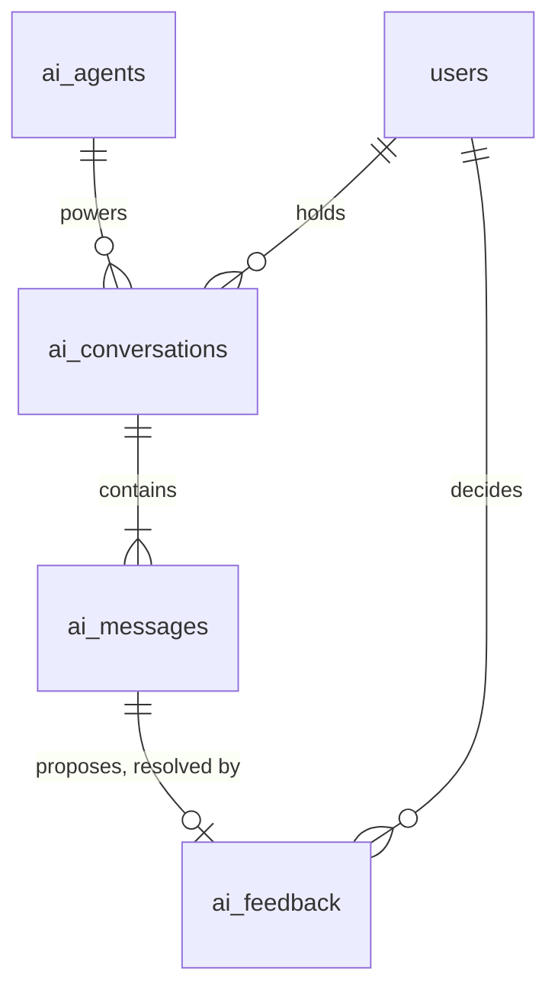

## `ai_agents`

**Purpose.** The registry of the platform's named AI agents — General Accountant, Auditor, Tax Advisor,
Payroll Manager, Inventory Manager, Treasury Manager, CFO, Fraud Detection, Reporting Agent, Document
AI, OCR Agent, Forecast Agent, Compliance Agent, Approval Assistant — and each one's configured autonomy
level. System defaults (`company_id IS NULL`) ship with the platform; a company may tighten (never
loosen beyond `company_settings.ai_autonomy_level`) via an override row.

**Attributes**

| Column | Type | Null | Notes |
|---|---|---|---|
| `id` | `BIGINT GENERATED ALWAYS AS IDENTITY` | NOT NULL | PK. |
| `company_id` | `BIGINT` | NULL | `NULL` = system default config. |
| `code` | `VARCHAR(40)` | NOT NULL | `general_accountant`, `auditor`, `tax_advisor`, `payroll_manager`, `inventory_manager`, `treasury_manager`, `cfo`, `fraud_detection`, `reporting_agent`, `document_ai`, `ocr_agent`, `forecast_agent`, `compliance_agent`, `approval_assistant`. |
| `name_en` / `name_ar` | `VARCHAR(80)` | NOT NULL / NULL | |
| `autonomy_level` | `VARCHAR(20)` | NOT NULL | `CHECK (autonomy_level IN ('auto','suggest_only','requires_approval'))`. |
| `model_provider` | `VARCHAR(30)` | NOT NULL | `DEFAULT 'anthropic'`. |
| `model_name` | `VARCHAR(60)` | NOT NULL | e.g. `claude-sonnet-4-5`. |
| `system_prompt_version` | `VARCHAR(20)` | NOT NULL | |
| `status` | `VARCHAR(20)` | NOT NULL | `CHECK (status IN ('enabled','disabled'))`. |
| `created_at`† / `updated_at`† | — | — | Standard columns. |

**Relationships** `ai_agents` 1—N `ai_conversations`; referenced from `ai_feedback` (indirectly, via
`ai_messages`), `attachments.ai_agent_id`, `audit_logs.ai_agent_id`.

**Cardinality** `ai_agents ||--o{ ai_conversations`.

**Primary Key** `id`.

**Foreign Keys** `company_id` → `companies.id ON DELETE CASCADE` (NULL for system rows).

**Indexes** `UNIQUE (company_id, code)`.

**Constraints** `CHECK (autonomy_level IN ('auto','suggest_only','requires_approval'))`; a trigger
rejects a company-level override row whose `autonomy_level` is looser than that company's
`company_settings.ai_autonomy_level` ceiling.

**Delete Rules** System rows never deleted; company overrides soft-deleted freely (falls back to the
system default).

**Update Rules** `autonomy_level` changes take effect immediately for new conversations; in-flight
`ai_conversations` keep the autonomy level that applied when they started, avoiding a mid-conversation
authority change.

**Example Records**
```sql
INSERT INTO ai_agents (company_id, code, name_en, autonomy_level, model_provider, model_name, system_prompt_version, status)
VALUES (NULL, 'general_accountant', 'General Accountant', 'suggest_only', 'anthropic', 'claude-sonnet-4-5', 'v3', 'enabled');
```
```json
{ "code": "general_accountant", "autonomy_level": "suggest_only", "model_name": "claude-sonnet-4-5", "status": "enabled" }
```

**Normalization.** 3NF.

**Future Expansion.** Per-agent rate limits and per-agent-per-company usage quotas tied into
`company_subscriptions` billing.

## `ai_conversations`

**Purpose.** One chat thread between a user and an agent, optionally grounded in a specific record
(an invoice being disputed, a journal entry being explained).

**Attributes**

| Column | Type | Null | Notes |
|---|---|---|---|
| `id` | `BIGINT GENERATED ALWAYS AS IDENTITY` | NOT NULL | PK. |
| `company_id`† | `BIGINT` | NOT NULL | |
| `user_id` | `BIGINT` | NOT NULL | FK → `users.id`. |
| `ai_agent_id` | `BIGINT` | NOT NULL | FK → `ai_agents.id`. |
| `title` | `VARCHAR(150)` | NULL | Auto-generated from the first message if not set. |
| `context_type` | `VARCHAR(30)` | NULL | e.g. `invoice`, `journal_entry`; `NULL` = general chat. |
| `context_id` | `BIGINT` | NULL | Polymorphic pointer paired with `context_type`. |
| `status` | `VARCHAR(20)` | NOT NULL | `CHECK (status IN ('active','archived'))`. |
| `started_at` | `TIMESTAMPTZ` | NOT NULL | |
| `last_message_at` | `TIMESTAMPTZ` | NOT NULL | |
| `created_at`† / `updated_at`† / `deleted_at`† | — | — | Standard columns. |

**Relationships** `users`/`ai_agents` 1—N `ai_conversations`; `ai_conversations` 1—N `ai_messages`.

**Cardinality** `ai_agents ||--o{ ai_conversations`; `ai_conversations ||--|{ ai_messages`.

**Primary Key** `id`.

**Foreign Keys** `user_id` → `users.id ON DELETE CASCADE`; `ai_agent_id` → `ai_agents.id ON DELETE
RESTRICT`.

**Indexes** `INDEX (user_id, last_message_at)`; `INDEX (context_type, context_id)`.

**Constraints** None beyond status domain.

**Delete Rules** Soft delete only; retained for the AI feedback/quality-improvement loop unless the
user requests deletion (a GDPR-style erasure path anonymizes `ai_messages.content` in place rather than
removing the row, preserving aggregate quality metrics).

**Update Rules** `last_message_at` bumped on every new message; `status → archived` is user-initiated
and reversible.

**Example Records**
```sql
INSERT INTO ai_conversations (company_id, user_id, ai_agent_id, context_type, context_id, status, started_at, last_message_at)
VALUES (17, 1088, 1, 'invoice', 9931, 'active', now(), now());
```
```json
{ "id": 771, "ai_agent_id": 1, "context_type": "invoice", "context_id": 9931, "status": "active" }
```

**Normalization.** 3NF.

**Future Expansion.** Shared/team conversations (multiple users in one thread) for collaborative
AI-assisted review sessions.

## `ai_messages`

**Purpose.** One turn in a conversation — user prompt, assistant reply, or tool call — carrying the
confidence/reasoning/supporting-document metadata the platform's AI-governance rules require.

**Attributes**

| Column | Type | Null | Notes |
|---|---|---|---|
| `id` | `BIGINT GENERATED ALWAYS AS IDENTITY` | NOT NULL | PK. |
| `ai_conversation_id` | `BIGINT` | NOT NULL | FK → `ai_conversations.id`. |
| `company_id`† | `BIGINT` | NOT NULL | |
| `role` | `VARCHAR(10)` | NOT NULL | `CHECK (role IN ('user','assistant','system','tool'))`. |
| `content` | `TEXT` | NOT NULL | |
| `tool_calls` | `JSONB` | NULL | Structured tool-use payload, if any. |
| `confidence_score` | `NUMERIC(4,3)` | NULL | `CHECK (confidence_score BETWEEN 0 AND 1)`. Set on `assistant` messages proposing an action. |
| `reasoning` | `TEXT` | NULL | Explanation accompanying a proposal. |
| `supporting_document_ids` | `JSONB` | NULL | Array of `attachments.id`. |
| `tokens_input` / `tokens_output` | `INTEGER` | NULL | |
| `latency_ms` | `INTEGER` | NULL | |
| `created_at`† | `TIMESTAMPTZ` | NOT NULL | |

**Relationships** `ai_conversations` 1—N `ai_messages`; `ai_messages` 1—0..1 `ai_feedback` (when the
message proposes an action).

**Cardinality** `ai_conversations ||--|{ ai_messages`.

**Primary Key** `id`.

**Foreign Keys** `ai_conversation_id` → `ai_conversations.id ON DELETE CASCADE`.

**Indexes** `INDEX (ai_conversation_id, created_at)`.

**Constraints** `CHECK (role IN ('user','assistant','system','tool'))`;
`CHECK (confidence_score IS NULL OR confidence_score BETWEEN 0 AND 1)`.

**Delete Rules** `CASCADE` with the parent conversation only on hard erasure; otherwise permanent
(no `updated_at`/`deleted_at` — messages are an immutable transcript).

**Update Rules** None — insert-only.

**Example Records**
```sql
INSERT INTO ai_messages (ai_conversation_id, company_id, role, content, confidence_score, reasoning)
VALUES (771, 17, 'assistant', 'This invoice appears to duplicate INV-2026-000201. Recommend voiding.', 0.870, 'Same customer, same amount, same PO within 48 hours.');
```
```json
{
  "ai_conversation_id": 771,
  "role": "assistant",
  "confidence_score": "0.870",
  "reasoning": "Same customer, same amount, same PO within 48 hours."
}
```

**Normalization.** 3NF.

**Future Expansion.** Streaming partial-message rows for live token-by-token UI rendering, currently
handled client-side over a WebSocket (Laravel Reverb) without persisting intermediate tokens.

## `ai_feedback`

**Purpose.** The human decision on an AI-proposed action — the database-enforced record that "AI
proposes, human/policy disposes" actually happened for every sensitive action, and the training signal
for improving agent quality over time.

**Attributes**

| Column | Type | Null | Notes |
|---|---|---|---|
| `id` | `BIGINT GENERATED ALWAYS AS IDENTITY` | NOT NULL | PK. |
| `company_id`† | `BIGINT` | NOT NULL | |
| `ai_message_id` | `BIGINT` | NOT NULL | FK → `ai_messages.id`. |
| `proposed_action` | `JSONB` | NOT NULL | What the AI wanted to do (e.g. `{"action": "post_journal_entry", "payload": {...}}`). |
| `decision` | `VARCHAR(20)` | NOT NULL | `CHECK (decision IN ('approved','rejected','edited','auto_approved'))`. |
| `decided_by` | `BIGINT` | NULL | FK → `users.id`; `NULL` only when `decision = 'auto_approved'` under an `auto`-autonomy agent. |
| `decision_reason` | `TEXT` | NULL | |
| `resulting_record_type` | `VARCHAR(40)` | NULL | e.g. `journal_entries`. |
| `resulting_record_id` | `BIGINT` | NULL | Polymorphic pointer to the record actually created/changed. |
| `created_at`† | `TIMESTAMPTZ` | NOT NULL | |

**Relationships** `ai_messages` 1—1 `ai_feedback`; `users` 1—N `ai_feedback` (as decider).

**Cardinality** `ai_messages ||--o| ai_feedback`.

**Primary Key** `id`.

**Foreign Keys** `ai_message_id` → `ai_messages.id ON DELETE CASCADE`; `decided_by` → `users.id ON
DELETE SET NULL`.

**Indexes** `UNIQUE (ai_message_id)`; `INDEX (decided_by)`; `INDEX (decision)`.

**Constraints** `CHECK (decision <> 'auto_approved' OR decided_by IS NULL)`;
`CHECK (decision = 'auto_approved' OR decided_by IS NOT NULL)` — every non-auto decision must name a
human.

**Delete Rules** Never deleted — this is the AI-governance audit trail; retained even if the
`ai_message`/`ai_conversation` is later archived.

**Update Rules** Insert-only; a changed mind is a new `ai_feedback` row against a new proposal, not an
edit of a past decision.

**Example Records**
```sql
INSERT INTO ai_feedback (company_id, ai_message_id, proposed_action, decision, decided_by, resulting_record_type, resulting_record_id)
VALUES (17, 9042, '{"action": "void_invoice", "invoice_id": 9931}', 'approved', 1042, 'invoices', 9931);
```
```json
{ "ai_message_id": 9042, "decision": "approved", "decided_by": 1042, "resulting_record_type": "invoices" }
```

**Normalization.** 3NF; `proposed_action` is JSONB because the action shape varies per agent/action
type and a fully relational representation would require a table per action type.

**Future Expansion.** Confidence-threshold-driven auto-approval policy configuration per company
(e.g. "auto-approve `document_ai` OCR extractions above 0.95 confidence") as a `ai_autonomy_policies`
table.

# Audit

The Audit module is the platform's tamper-evident record of who did what, when, and why — separate from,
and lower-level than, any single module's own status history. Every mutation anywhere in the platform
writes exactly one `audit_logs` row; a narrower, higher-signal stream of security-relevant events lives
in `security_events`.

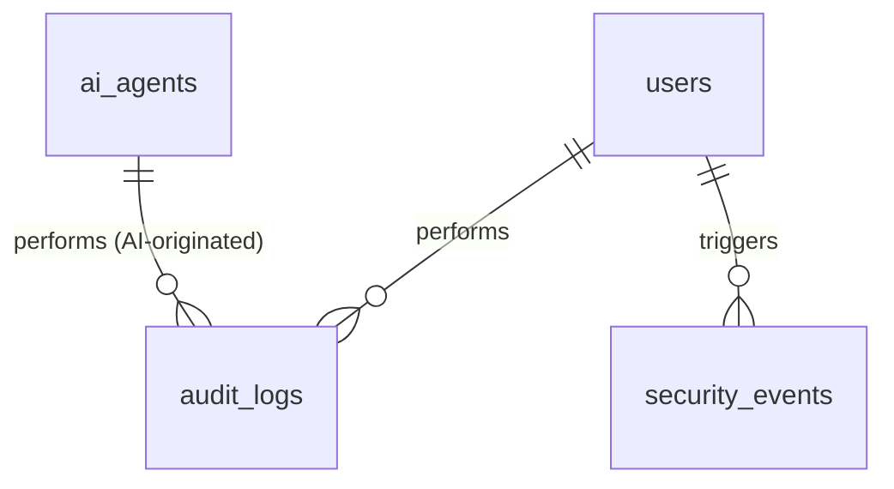

## `audit_logs`

**Purpose.** An append-only, field-level record of every create/update/delete/state-transition across
every tenant table — the record that answers "who changed this, and what was it before" for any row in
the system, human- or AI-originated.

**Attributes**

| Column | Type | Null | Notes |
|---|---|---|---|
| `id` | `BIGINT GENERATED ALWAYS AS IDENTITY` | NOT NULL | PK. |
| `company_id`† | `BIGINT` | NOT NULL | |
| `user_id` | `BIGINT` | NULL | FK → `users.id`; `NULL` when `ai_agent_id` is set (pure AI-originated system action). |
| `ai_agent_id` | `BIGINT` | NULL | FK → `ai_agents.id`. |
| `auditable_type` | `VARCHAR(60)` | NOT NULL | e.g. `invoices`. |
| `auditable_id` | `BIGINT` | NOT NULL | Polymorphic pointer paired with `auditable_type`. |
| `action` | `VARCHAR(30)` | NOT NULL | `CHECK (action IN ('created','updated','deleted','restored','posted','voided','approved','rejected','login','permission_changed'))`. |
| `old_values` / `new_values` | `JSONB` | NULL | Field-level diff; `NULL` `old_values` on `created`, `NULL` `new_values` on `deleted`. |
| `reason` | `TEXT` | NULL | |
| `ip_address` | `INET` | NULL | |
| `device` | `VARCHAR(120)` | NULL | |
| `user_agent` | `VARCHAR(500)` | NULL | |
| `created_at`† | `TIMESTAMPTZ` | NOT NULL | |

**Relationships** `users`/`ai_agents` 1—N `audit_logs`; polymorphically relates to every auditable table
platform-wide.

**Cardinality** `users ||--o{ audit_logs`.

**Primary Key** `id`.

**Foreign Keys** `user_id` → `users.id ON DELETE SET NULL`; `ai_agent_id` → `ai_agents.id ON DELETE
SET NULL`.

**Indexes** `INDEX (company_id, auditable_type, auditable_id, created_at)`; `INDEX (user_id, created_at)`.

**Constraints** `CHECK (user_id IS NOT NULL OR ai_agent_id IS NOT NULL OR action = 'login')` — every
non-login row must be attributable to a human or an agent.

**Delete Rules** Never deleted or updated (no `updated_at`/`deleted_at` columns) — this table has no
edit path by design; retention beyond the statutory window is archival (cold storage), never in-place
purge of individual rows short of full company data destruction.

**Update Rules** None — insert-only, matching `stock_movements`/`ai_messages`.

**Example Records**
```sql
INSERT INTO audit_logs (company_id, user_id, auditable_type, auditable_id, action, old_values, new_values, ip_address)
VALUES (17, 1042, 'invoices', 9931, 'voided', '{"status": "posted"}', '{"status": "void"}', '85.154.12.9');
```
```json
{ "auditable_type": "invoices", "auditable_id": 9931, "action": "voided", "user_id": 1042 }
```

**Normalization.** 3NF for the fixed columns; `old_values`/`new_values` as JSONB since the shape of
"what changed" is inherently different per `auditable_type`.

**Future Expansion.** Cryptographic hash-chaining (`prev_hash`/`row_hash`) across sequential rows for
tamper-evidence stronger than access-control alone, for customers in regulated verticals.

## `security_events`

**Purpose.** A narrower, higher-signal stream than `audit_logs`, focused on authentication and
authorization events for real-time alerting (new-country login, repeated failed attempts, permission
escalation).

**Attributes**

| Column | Type | Null | Notes |
|---|---|---|---|
| `id` | `BIGINT GENERATED ALWAYS AS IDENTITY` | NOT NULL | PK. |
| `company_id` | `BIGINT` | NULL | `NULL` if pre-auth (e.g. a failed login before company context resolves). |
| `user_id` | `BIGINT` | NULL | FK → `users.id`. |
| `event_type` | `VARCHAR(30)` | NOT NULL | `CHECK (event_type IN ('login_failed','login_success','mfa_enabled','mfa_disabled','permission_granted','permission_revoked','suspicious_ip','rate_limited','password_changed'))`. |
| `severity` | `VARCHAR(10)` | NOT NULL | `CHECK (severity IN ('info','warning','critical'))`. |
| `ip_address` | `INET` | NULL | |
| `device` | `VARCHAR(120)` | NULL | |
| `metadata` | `JSONB` | NOT NULL | `DEFAULT '{}'`. |
| `created_at`† | `TIMESTAMPTZ` | NOT NULL | |

**Relationships** `users` 1—N `security_events`.

**Cardinality** `users ||--o{ security_events`.

**Primary Key** `id`.

**Foreign Keys** `user_id` → `users.id ON DELETE SET NULL`.

**Indexes** `INDEX (user_id, created_at)`; `INDEX (severity) WHERE severity = 'critical'`;
`INDEX (event_type, created_at)`.

**Constraints** `CHECK (severity IN ('info','warning','critical'))`.

**Delete Rules** Retained for 400 days by default (a common security-log retention baseline), then
pruned by a scheduled job; `critical` rows are exempted from pruning and kept indefinitely.

**Update Rules** None — insert-only.

**Example Records**
```sql
INSERT INTO security_events (company_id, user_id, event_type, severity, ip_address, metadata)
VALUES (17, 1088, 'login_failed', 'warning', '41.32.9.201', '{"reason": "bad_password", "attempt": 3}');
```
```json
{ "event_type": "login_failed", "severity": "warning", "metadata": { "attempt": 3 } }
```

**Normalization.** 3NF.

**Future Expansion.** Automatic account lockout policy driven directly off a rolling count of this
table (currently enforced in Redis, mirrored here for the permanent record).

# Notifications

The Notifications module delivers events (invoice created, payroll completed, bank synced, AI finished)
to users across in-app, email, SMS, and push channels, with per-user, per-event, per-channel opt-out.

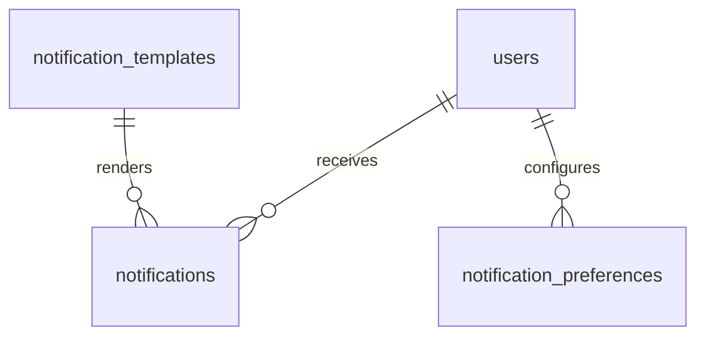

## `notification_templates`

**Purpose.** The bilingual, per-channel copy for a notification event code, so a single domain event
(`invoice.overdue`) can render correctly across in-app, email, SMS, and push without per-channel
duplication of business logic.

**Attributes**

| Column | Type | Null | Notes |
|---|---|---|---|
| `id` | `BIGINT GENERATED ALWAYS AS IDENTITY` | NOT NULL | PK. |
| `company_id` | `BIGINT` | NULL | `NULL` = system default template. |
| `code` | `VARCHAR(60)` | NOT NULL | e.g. `invoice.created`, `invoice.overdue`, `payroll.completed`, `bank.synced`, `ai.finished`, `approval.requested`. |
| `channel` | `VARCHAR(10)` | NOT NULL | `CHECK (channel IN ('in_app','email','sms','push'))`. |
| `subject_en` / `subject_ar` | `VARCHAR(200)` | NULL | Not applicable to `sms`/`push`. |
| `body_en` / `body_ar` | `TEXT` | NOT NULL | Mustache-style `{{placeholder}}` templating. |
| `variables` | `JSONB` | NOT NULL | `DEFAULT '[]'`. Declares the placeholder schema for validation. |
| `status` | `VARCHAR(20)` | NOT NULL | `CHECK (status IN ('active','inactive'))`. |
| `created_at`† / `updated_at`† | — | — | Standard columns. |

**Relationships** `notification_templates` 1—N `notifications`.

**Cardinality** `notification_templates ||--o{ notifications`.

**Primary Key** `id`.

**Foreign Keys** `company_id` → `companies.id ON DELETE CASCADE` (NULL for system rows).

**Indexes** `UNIQUE (company_id, code, channel)`.

**Constraints** `CHECK (channel IN ('in_app','email','sms','push'))`.

**Delete Rules** Soft delete blocked implicitly by keeping system templates permanent; company
overrides may be removed freely (falls back to system default).

**Update Rules** Changing `body_en`/`body_ar` affects only future `notifications`; already-sent
notifications retain their rendered `body` snapshot.

**Example Records**
```sql
INSERT INTO notification_templates (company_id, code, channel, subject_en, body_en, status)
VALUES (NULL, 'invoice.overdue', 'email', 'Invoice {{invoice_number}} is overdue', 'Invoice {{invoice_number}} for {{amount}} was due on {{due_date}}.', 'active');
```
```json
{ "code": "invoice.overdue", "channel": "email", "subject_en": "Invoice {{invoice_number}} is overdue" }
```

**Normalization.** 3NF.

**Future Expansion.** WhatsApp Business API as a fifth channel, following the same template shape.

## `notifications`

**Purpose.** A single rendered notification instance sent (or queued to send) to one user.

**Attributes**

| Column | Type | Null | Notes |
|---|---|---|---|
| `id` | `BIGINT GENERATED ALWAYS AS IDENTITY` | NOT NULL | PK. |
| `company_id`† | `BIGINT` | NOT NULL | |
| `user_id` | `BIGINT` | NOT NULL | FK → `users.id`. Recipient. |
| `notification_template_id` | `BIGINT` | NULL | FK → `notification_templates.id`. |
| `channel` | `VARCHAR(10)` | NOT NULL | |
| `title` / `body` | `TEXT` | NOT NULL | Rendered snapshot (placeholders already substituted). |
| `data` | `JSONB` | NOT NULL | `DEFAULT '{}'`. Deep-link payload (e.g. `{"type": "invoices", "id": 9931}`). |
| `read_at` | `TIMESTAMPTZ` | NULL | |
| `sent_at` | `TIMESTAMPTZ` | NULL | |
| `delivery_status` | `VARCHAR(20)` | NOT NULL | `CHECK (delivery_status IN ('pending','sent','delivered','failed'))`. |
| `created_at`† | `TIMESTAMPTZ` | NOT NULL | |

**Relationships** `users` 1—N `notifications`; `notification_templates` 1—N `notifications`.

**Cardinality** `users ||--o{ notifications`.

**Primary Key** `id`.

**Foreign Keys** `user_id` → `users.id ON DELETE CASCADE`; `notification_template_id` →
`notification_templates.id ON DELETE SET NULL`.

**Indexes** `INDEX (user_id, read_at)`; `INDEX (user_id, created_at)`.

**Constraints** `CHECK (delivery_status IN ('pending','sent','delivered','failed'))`.

**Delete Rules** Soft/hard delete via a rolling retention job (default 180 days for `read` notifications);
unread notifications are retained until read or the retention ceiling.

**Update Rules** `read_at`/`delivery_status` are the only columns updated after creation.

**Example Records**
```sql
INSERT INTO notifications (company_id, user_id, notification_template_id, channel, title, body, data, delivery_status, sent_at)
VALUES (17, 1042, 12, 'in_app', 'Invoice INV-2026-000248 is overdue', 'Invoice INV-2026-000248 for 525.000 KWD was due on 2026-08-15.', '{"type":"invoices","id":9931}', 'delivered', now());
```
```json
{ "title": "Invoice INV-2026-000248 is overdue", "delivery_status": "delivered", "read_at": null }
```

**Normalization.** 3NF; `title`/`body` are a deliberate snapshot (denormalized from the template) so a
later template edit never rewrites history a user already read.

**Future Expansion.** Notification grouping/digesting (bundling several low-priority events into one
daily-digest notification) to reduce alert fatigue.

## `notification_preferences`

**Purpose.** Per-user, per-event, per-channel opt-out — respected before any `notifications` row is
even created for a non-critical event.

**Attributes**

| Column | Type | Null | Notes |
|---|---|---|---|
| `id` | `BIGINT GENERATED ALWAYS AS IDENTITY` | NOT NULL | PK. |
| `company_id`† | `BIGINT` | NOT NULL | |
| `user_id` | `BIGINT` | NOT NULL | FK → `users.id`. |
| `event_code` | `VARCHAR(60)` | NOT NULL | Matches `notification_templates.code`. |
| `channel` | `VARCHAR(10)` | NOT NULL | |
| `is_enabled` | `BOOLEAN` | NOT NULL | `DEFAULT true`. |
| `created_at`† / `updated_at`† | — | — | Standard columns. |

**Relationships** `users` 1—N `notification_preferences`.

**Cardinality** `users ||--o{ notification_preferences`.

**Primary Key** `id`.

**Foreign Keys** `user_id` → `users.id ON DELETE CASCADE`.

**Indexes** `UNIQUE (company_id, user_id, event_code, channel)`.

**Constraints** None beyond the unique key.

**Delete Rules** `CASCADE` with the user.

**Update Rules** `is_enabled` toggled freely; security-critical event codes (e.g.
`permission_granted`) are exempted from opt-out at the application layer regardless of this table's
content.

**Example Records**
```sql
INSERT INTO notification_preferences (company_id, user_id, event_code, channel, is_enabled)
VALUES (17, 1042, 'invoice.overdue', 'sms', false);
```
```json
{ "user_id": 1042, "event_code": "invoice.overdue", "channel": "sms", "is_enabled": false }
```

**Normalization.** 3NF.

**Future Expansion.** Quiet hours (`quiet_from`/`quiet_to`) per user, deferring non-urgent channels
until working hours.

# Documents

The Documents module is the platform's polymorphic file layer on Cloudflare R2: every attachment
anywhere in the system — invoice PDFs, CR certificates, dose-of-evidence for a tax filing, an
AI-extracted receipt scan — is one `attachments` row, optionally organized into folders, with version
history when a file is replaced.

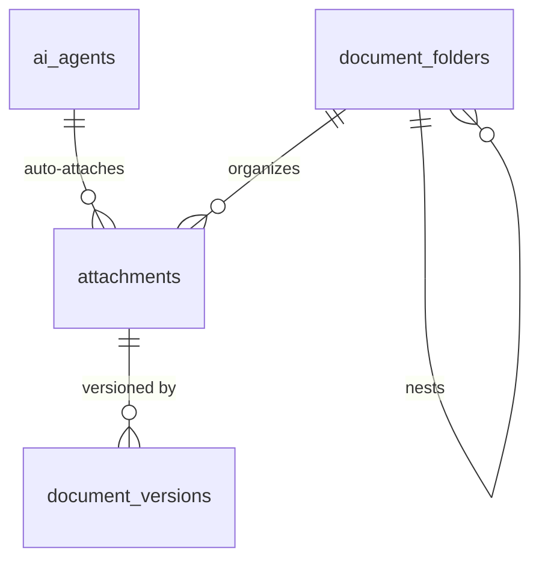

## `attachments`

**Purpose.** A single stored file, polymorphically attached to any record in the platform (an invoice,
an employee, a company, a bill) via `attachable_type`/`attachable_id`.

**Attributes**

| Column | Type | Null | Notes |
|---|---|---|---|
| `id` | `BIGINT GENERATED ALWAYS AS IDENTITY` | NOT NULL | PK. |
| `company_id`† | `BIGINT` | NOT NULL | |
| `attachable_type` | `VARCHAR(60)` | NOT NULL | e.g. `invoices`, `bills`, `employees`, `companies`. |
| `attachable_id` | `BIGINT` | NOT NULL | Polymorphic pointer. |
| `document_folder_id` | `BIGINT` | NULL | FK → `document_folders.id`. |
| `file_name` | `VARCHAR(255)` | NOT NULL | |
| `file_path` | `VARCHAR(500)` | NOT NULL | Cloudflare R2 object key. |
| `mime_type` | `VARCHAR(120)` | NOT NULL | |
| `size_bytes` | `BIGINT` | NOT NULL | |
| `checksum_sha256` | `CHAR(64)` | NOT NULL | |
| `uploaded_by` | `BIGINT` | NULL | FK → `users.id`; `NULL` if `ai_agent_id` set. |
| `ai_agent_id` | `BIGINT` | NULL | FK → `ai_agents.id`; e.g. OCR Agent auto-attaching a scanned receipt. |
| `is_ai_extracted` | `BOOLEAN` | NOT NULL | `DEFAULT false`. |
| `extracted_data` | `JSONB` | NULL | OCR/Document AI structured output. |
| `status` | `VARCHAR(20)` | NOT NULL | `CHECK (status IN ('active','archived'))`. |
| `created_at`† / `updated_at`† / `deleted_at`† | — | — | Standard columns. |

**Relationships** Polymorphic to every attachable table platform-wide; `document_folders` 1—N
`attachments`; `attachments` 1—N `document_versions`.

**Cardinality** `document_folders ||--o{ attachments`; `attachments ||--o{ document_versions`.

**Primary Key** `id`.

**Foreign Keys** `document_folder_id` → `document_folders.id ON DELETE SET NULL`; `uploaded_by` →
`users.id ON DELETE SET NULL`; `ai_agent_id` → `ai_agents.id ON DELETE SET NULL`.

**Indexes** `INDEX (company_id, attachable_type, attachable_id)`; `INDEX (document_folder_id)`;
`UNIQUE (checksum_sha256, company_id)` (de-duplication within a tenant).

**Constraints** `CHECK (uploaded_by IS NOT NULL OR ai_agent_id IS NOT NULL)`.

**Delete Rules** Soft delete only; the underlying R2 object is retained until the statutory retention
window for the attached record type elapses, then a purge job removes both the row and the object
together.

**Update Rules** `file_path`/`checksum_sha256` immutable once created — replacing a file's content
creates a new `document_versions` row, never an in-place overwrite of the R2 object.

**Example Records**
```sql
INSERT INTO attachments (company_id, attachable_type, attachable_id, file_name, file_path, mime_type, size_bytes, checksum_sha256, uploaded_by, status)
VALUES (17, 'invoices', 9931, 'INV-2026-000248.pdf', 'companies/17/invoices/9931/INV-2026-000248.pdf', 'application/pdf', 84210, 'e3b0c44298fc1c149afbf4c8996fb92427ae41e4649b934ca495991b7852b85', 1042, 'active');
```
```json
{ "id": 8801, "file_name": "INV-2026-000248.pdf", "mime_type": "application/pdf", "status": "active" }
```

**Normalization.** 3NF; the polymorphic pair is the standard trade-off against a per-table FK explosion,
accepted platform-wide (also used by `audit_logs`, `stock_movements`, `journal_entries.source_id`).

**Future Expansion.** Virus-scan status (`scan_status`/`scanned_at`) gating download availability until
a clean result is recorded.

## `document_folders`

**Purpose.** Optional user-organized grouping of attachments, independent of the polymorphic
`attachable_type` structure (e.g. a "2026 Audit Evidence" folder spanning several record types).

**Attributes**

| Column | Type | Null | Notes |
|---|---|---|---|
| `id` | `BIGINT GENERATED ALWAYS AS IDENTITY` | NOT NULL | PK. |
| `company_id`† | `BIGINT` | NOT NULL | |
| `parent_folder_id` | `BIGINT` | NULL | Self-FK. |
| `name` | `VARCHAR(150)` | NOT NULL | |
| `module_scope` | `VARCHAR(30)` | NULL | e.g. `accounting`, `payroll`; `NULL` = general. |
| `created_by`† / `created_at`† / `updated_at`† / `deleted_at`† | — | — | Standard columns. |

**Relationships** `document_folders` 1—N `attachments`, `document_folders` (self).

**Cardinality** `document_folders ||--o{ attachments`.

**Primary Key** `id`.

**Foreign Keys** `parent_folder_id` → `document_folders.id ON DELETE SET NULL`.

**Indexes** `INDEX (parent_folder_id)`; `INDEX (company_id, module_scope)`.

**Constraints** `CHECK (id <> parent_folder_id)`.

**Delete Rules** Soft delete cascades to child folders' `parent_folder_id` becoming `NULL` (they move up
one level) rather than being deleted themselves; contained `attachments` are unaffected
(`document_folder_id` set to `NULL`, not deleted).

**Update Rules** Re-parenting/renaming unrestricted.

**Example Records**
```sql
INSERT INTO document_folders (company_id, name, module_scope) VALUES (17, '2026 Audit Evidence', NULL);
```
```json
{ "id": 6, "name": "2026 Audit Evidence", "module_scope": null }
```

**Normalization.** 3NF.

**Future Expansion.** Per-folder access control (currently inherited from the containing record's
permissions, not independently restrictable).

## `document_versions`

**Purpose.** Version history for an attachment that has been replaced (a re-uploaded signed contract, a
corrected scan) — preserves prior versions rather than silently overwriting them.

**Attributes**

| Column | Type | Null | Notes |
|---|---|---|---|
| `id` | `BIGINT GENERATED ALWAYS AS IDENTITY` | NOT NULL | PK. |
| `attachment_id` | `BIGINT` | NOT NULL | FK → `attachments.id`. |
| `company_id`† | `BIGINT` | NOT NULL | |
| `version_number` | `INTEGER` | NOT NULL | |
| `file_path` | `VARCHAR(500)` | NOT NULL | R2 key of this specific version. |
| `size_bytes` | `BIGINT` | NOT NULL | |
| `checksum_sha256` | `CHAR(64)` | NOT NULL | |
| `uploaded_by` | `BIGINT` | NULL | FK → `users.id`. |
| `created_at`† | `TIMESTAMPTZ` | NOT NULL | |

**Relationships** `attachments` 1—N `document_versions`.

**Cardinality** `attachments ||--o{ document_versions`.

**Primary Key** `id`.

**Foreign Keys** `attachment_id` → `attachments.id ON DELETE CASCADE`; `uploaded_by` → `users.id ON
DELETE SET NULL`.

**Indexes** `UNIQUE (attachment_id, version_number)`.

**Constraints** `CHECK (version_number > 0)`.

**Delete Rules** `CASCADE` with the parent attachment only on full purge; individual historical versions
are never deleted independently.

**Update Rules** None — insert-only; a new version is always a new row, `attachments.file_path` is
updated to point at the latest version's `file_path` in the same transaction.

**Example Records**
```sql
INSERT INTO document_versions (attachment_id, company_id, version_number, file_path, size_bytes, checksum_sha256, uploaded_by)
VALUES (8801, 17, 2, 'companies/17/invoices/9931/INV-2026-000248-v2.pdf', 84512, 'b94d27b9934d3e08a52e52d7da7dabfac484efe37a5380ee9088f7ace2efcde', 1042);
```
```json
{ "attachment_id": 8801, "version_number": 2, "size_bytes": 84512 }
```

**Normalization.** 3NF.

**Future Expansion.** Diff/redline metadata for text-based document versions (contracts) once a
document-comparison feature is prioritized.

# Cross-Module Referential Integrity

The preceding sixteen modules were each specified as if independent, but QAYD's correctness depends on
the seams between them holding under real production load: concurrent multi-branch postings,
AI-proposed actions racing human approvals, partial failures mid-transaction, and long-lived companies
whose data must remain internally consistent for a decade or more of statutory retention. This closing
section specifies the platform-wide invariants that no single module's table list makes visible on its
own, the exact mechanism that enforces each one, and the full deletion/consolidation story that only
becomes clear when every module is considered together.

## The tenant-boundary invariant

Every one of the 81 tables in this document carries `company_id` directly, or is a direct child (via
`ON DELETE CASCADE`) of a table that does, with three deliberate exceptions: `users` (global identity,
Users module), `account_types` and `permissions` (system catalogs, Accounting/Permissions modules).
Beyond "the column exists," QAYD enforces a stronger property: **every foreign key that points from one
tenant-scoped table to another must point to a row with the same `company_id`.** A `journal_lines` row
can never reference an `accounts` row belonging to a different company; a `receipts` row can never
apply against an `invoices` row from a different tenant, even if both `id` values happen to be valid.

This is enforced three ways simultaneously, deliberately redundant because a single-layer defense is
not acceptable for financial data:

1. **Row-Level Security (RLS).** Every tenant table has `ALTER TABLE ... ENABLE ROW LEVEL SECURITY` with
   a `USING (company_id = current_setting('app.current_company_id')::bigint)` policy, set by the Laravel
   request middleware at the start of every request from the authenticated `X-Company-Id` context. This
   is the primary, connection-level defense — detailed fully in the companion Row-Level-Security
   document.
2. **`CHECK`-via-trigger cross-table validation.** For the highest-risk relationships — `journal_lines`
   → `journal_entries`, `journal_lines` → `accounts`, `invoice_items` → `invoices`, `payroll_items` →
   `payroll_runs` — a `BEFORE INSERT OR UPDATE` trigger (`trg_verify_company_id_match`) re-checks that
   the child's `company_id` equals the referenced parent's `company_id` and raises if not, independent
   of whether RLS is somehow bypassed (a superuser migration script, a bulk-import job running with
   elevated privileges).
3. **Application-layer scoping.** Every Eloquent model that represents a tenant table uses a global
   query scope (`BelongsToCompany`) that injects `WHERE company_id = ?` into every query the ORM builds,
   so even a developer mistake (forgetting a `WHERE` clause) fails closed rather than open.

The three system-row exceptions (`company_id IS NULL` on `roles`, `tax_codes`, `ai_agents`,
`report_definitions`, `notification_templates`, plus the always-global `account_types`/`permissions`)
are the one place `company_id` is deliberately absent or nullable on an otherwise tenant-scoped table.
Each of those tables' own sections above specifies exactly how a `NULL` row differs from a tenant-owned
row (visible-to-all default vs. company-specific override), and RLS policies on those tables use
`USING (company_id = current_setting('app.current_company_id')::bigint OR company_id IS NULL)` rather
than the plain equality check used everywhere else.

## Module-to-module communication: FK vs. polymorphic reference vs. domain event

Three distinct mechanisms connect the sixteen modules, and using the wrong one for a given relationship
is the single most common design mistake this ERD is written to prevent:

| Mechanism | Used when | Example | Integrity guarantee |
|---|---|---|---|
| Direct foreign key | The relationship is 1:1 or 1:N, both tables always exist, and the reference never needs to point at "one of several possible table types." | `invoices.customer_id → customers.id` | Full referential integrity, enforced by PostgreSQL itself. |
| Polymorphic reference (`_type` + `_id` pair) | One table must reference rows across several otherwise-unrelated tables (a document attaches to an invoice or a bill or an employee). | `attachments.attachable_type/attachable_id`, `audit_logs.auditable_type/auditable_id`, `journal_entries.source_type/source_id`, `stock_movements.source_type/source_id`, `ai_feedback.resulting_record_type/resulting_record_id` | No native FK; enforced by a `CHECK (auditable_type IN (...))` domain constraint plus application-layer validation. Never used where a plain FK would do. |
| Domain event | Two modules must stay eventually consistent but must never take a lock on each other's tables in the same transaction — specifically, every module that posts financial impact into Accounting. | `invoice.posted` → Accounting creates `journal_entries`; `payroll.completed` → Accounting posts payroll journal; `stock_adjustment.posted` → Accounting posts inventory-shrinkage journal | Enforced by the event being published and consumed inside the *same* database transaction via Laravel's `DB::afterCommit()` hook chained to a synchronous listener — not a queued/async job — so "the invoice is posted" and "the journal entry exists" can never observably diverge, even though the two writes are logically separate module concerns. Only cross-cutting side effects with no strict same-transaction requirement (sending a `notifications` row, indexing into search) go through the async Redis queue. |

The full list of domain events referenced across this document, and the module pair each connects:

| Event | Publisher module | Consumer module | Effect |
|---|---|---|---|
| `invoice.posted` | Sales | Accounting | Creates `journal_entries` (dr AR, cr revenue/tax); creates `stock_movements` if any line is stock-tracked (Inventory). |
| `invoice.voided` | Sales | Accounting | Creates a reversing `journal_entries`. |
| `receipt.posted` | Sales | Accounting, Banking | Creates `journal_entries` (dr bank, cr AR); creates a `bank_transactions` row. |
| `credit_note.posted` | Sales | Accounting | Creates a reversing/adjusting `journal_entries`. |
| `bill.posted` | Purchasing | Accounting | Creates `journal_entries` (dr expense/asset/tax, cr AP). |
| `goods_receipt.completed` | Purchasing | Inventory | Creates `stock_movements` (inbound) and updates `inventory_items`. |
| `vendor_payment.posted` | Purchasing | Accounting, Banking | Creates `journal_entries` (dr AP, cr bank); creates a `bank_transactions` row. |
| `stock_adjustment.posted` | Inventory | Accounting | Creates `journal_entries` (dr/cr inventory-shrinkage). |
| `stock_transfer.completed` | Inventory | (none — intra-module) | Two `stock_movements` rows (out/in); no GL impact for a same-cost-basis internal transfer. |
| `payroll.completed` | Payroll | Accounting, Banking | Creates `journal_entries` (dr salary expense, cr payables/bank); may create `bank_transactions` rows per employee or one batch row. |
| `bank_transaction.reconciled` | Banking | (none — intra-module) | Updates `bank_reconciliations`. |
| `transfer.completed` | Banking | Accounting | Creates `journal_entries` (dr destination bank, cr source bank). |
| `tax_return.filed` | Tax | (external — tax authority) | No further internal domain event; `submission_reference` recorded. |
| `report_run.completed` | Reports | Notifications | Creates `notifications` rows for the schedule's recipients. |
| `ai_feedback.decided` | AI | Whichever module the `proposed_action` targets | The target module's write only happens after this event fires with `decision IN ('approved','auto_approved')`; a `rejected`/`edited` decision either drops the proposal or re-queues an edited one, never applying the original. |
| every mutation | every module | Audit | Writes one `audit_logs` row synchronously in the same transaction as the mutation — the one domain event with no publish/consume latency at all, because audit completeness cannot tolerate an at-least-once/eventually-delivered semantics. |

## Consolidated module dependency map

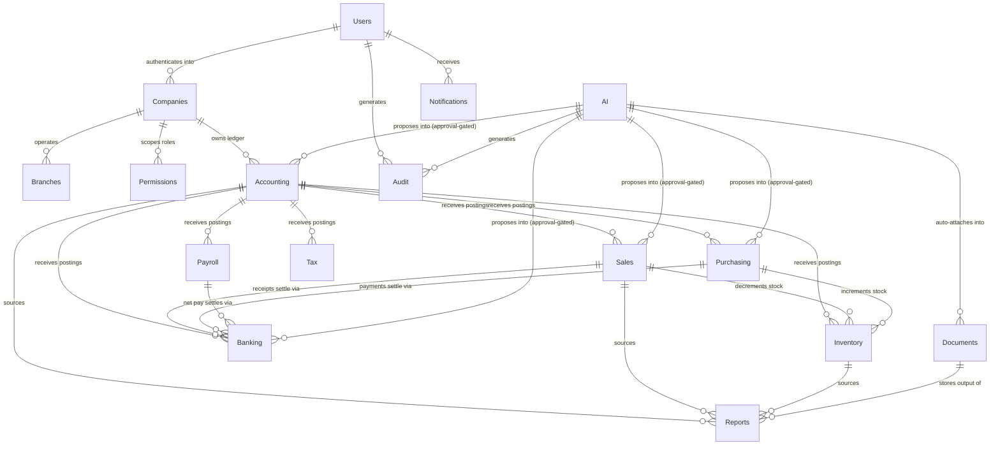

This diagram is deliberately drawn at module granularity rather than table granularity (81 nodes would
be illegible); the per-table Mermaid diagrams inside each module section above are the authoritative
detail. Read together, the two levels answer both "which tables relate to which" (module diagrams) and
"which subsystems can and cannot write into which other subsystems" (this diagram) — the latter is the
one an engineer should consult before adding any new direct FK across a module boundary, since a
proposed FK that crosses one of the arrows above in the *wrong* direction (e.g. Accounting writing
directly into Sales) is very likely a design error: postings flow from operational modules into
Accounting, never the reverse.

## Deletion and consolidation walkthrough

Because `companies` is the tenant root, "what happens when a company is deleted" is the single scenario
that exercises every cascade rule defined across all sixteen modules at once, and is worth tracing
end-to-end rather than leaving each module's Delete Rules to be reasoned about independently.

**Soft delete (`companies.deleted_at` set) — the default and near-universal path.** No child row in any
module is touched. RLS continues to permit access only to platform administrators (regular users of a
soft-deleted company are locked out at the application layer, since `company_users`/`user_roles` checks
still resolve, but the login flow refuses `status`-inactive companies). This is reversible: un-setting
`deleted_at` restores full access with zero data loss, and is the path used for the overwhelming
majority of "company churned" and "company mistakenly deleted" cases.

**Hard purge (real `DELETE FROM companies WHERE id = ?`) — rare, deliberate, and gated by the statutory
retention window.** This is where `ON DELETE CASCADE` actually fires, in dependency order:

1. `company_users`, `user_roles`, `user_invitations`, `company_settings`, `company_subscriptions` —
   cascade immediately (Companies/Permissions modules).
2. `branches`, `departments`, `warehouses` — cascade (Branches module), which in turn cascades
   `employees.branch_id`/`department_id` references to `NULL` first (already `SET NULL`, not `CASCADE`,
   so `employees` rows themselves survive this step and are removed only by the `company_id` cascade in
   step 8).
3. `roles` (company-owned only; system rows have `company_id IS NULL` and are never touched),
   `role_permissions`, `user_roles` — cascade (Permissions module).
4. `accounts`, `journal_entries` → `journal_lines` → `ledger_entries`, `fiscal_years` → `fiscal_periods`,
   `cost_centers`, `projects` — cascade (Accounting module). This is, by row count, almost always the
   largest single deletion in the whole operation for any company with meaningful trading history.
5. `customers` → `sales_quotations`/`sales_orders`/`invoices`/`receipts`/`credit_notes` and their child
   line-item tables — cascade (Sales module).
6. `vendors` → `purchase_orders`/`goods_receipts`/`bills`/`vendor_payments` and their child line-item
   tables — cascade (Purchasing module).
7. `products`, `product_categories`, `units_of_measure`, `price_lists`, `inventory_items`,
   `stock_movements`, `stock_adjustments`, `stock_transfers`, `inventory_valuations` — cascade
   (Inventory module).
8. `employees` → `payroll_runs` → `payroll_items` → `payslips`, `salary_components` — cascade (Payroll
   module).
9. `bank_accounts` → `bank_transactions`/`bank_statement_lines`/`bank_reconciliations`/`transfers` —
   cascade (Banking module).
10. `tax_codes` (company-owned only)/`tax_rates`/`tax_transactions`/`tax_returns` — cascade (Tax module).
11. `report_definitions` (company-owned only)/`report_schedules`/`report_runs` — cascade (Reports
    module).
12. `ai_agents` (company-owned only)/`ai_conversations` → `ai_messages` → `ai_feedback` — cascade (AI
    module).
13. `audit_logs`, `security_events` — these are the one place hard-purge deliberately does **not**
    cascade automatically. A dedicated `PurgeCompanyAuditTrail` job runs as an explicit, separately
    authorized step after the business-data purge above, because several jurisdictions require audit
    evidence to outlive the business records it describes (an auditor investigating why a company was
    dissolved needs the trail intact even after the company's operational data is gone). Until that job
    runs, `audit_logs`/`security_events` rows referencing the purged company are retained with
    `company_id` intact but every FK they might have held into now-deleted rows resolved to `NULL`
    (since every `_id`-style column on those two tables uses `ON DELETE SET NULL`, never `CASCADE`).
14. `notifications`, `notification_preferences` — cascade (Notifications module).
15. `attachments` → `document_versions`, `document_folders` — cascade (Documents module); the
    corresponding Cloudflare R2 objects are deleted by an asynchronous post-commit job, not inside the
    same database transaction (object storage deletion is not transactional with PostgreSQL, so the
    job is idempotent and retried until it confirms deletion, with a `deleted_at` on `attachments`
    already having made the row inaccessible to any application code the moment step 15 begins).

The ordering above is enforced by PostgreSQL's own foreign-key dependency graph (a `CASCADE` chain fires
in the order the database determines from FK dependencies, not the order listed here), but the listing
is intentionally still given start-to-finish because it is the order an engineer should mentally
simulate when asked "if I delete a company, what actually happens" — and because step 13 (audit trail
survival) is a business rule, not something the FK graph alone would tell you.

## Balanced-books and cross-table sum invariants

Beyond single-row `CHECK` constraints, three invariants span multiple rows and, in two cases, multiple
tables; these cannot be expressed as a `CHECK` constraint at all and are instead enforced by triggers or
verified by a scheduled integrity job:

1. **`SUM(journal_lines.debit) = SUM(journal_lines.credit)` per `journal_entry_id`.** Enforced at
   `posted` transition time by the `PostJournalEntry` service inside the same transaction that flips
   `journal_entries.status`; independently re-verified nightly by an integrity job that would alert if
   it ever found a posted entry out of balance (which would indicate the trigger/service path was
   bypassed, e.g. by a direct database write).
2. **`ledger_entries` is a lossless projection of posted `journal_lines`.** For every posted
   `journal_lines` row there must be exactly one `ledger_entries` row with matching `debit`/`credit`,
   and vice versa. Verified nightly by a `COUNT`/`SUM` reconciliation query per `(company_id,
   fiscal_period_id)`; a mismatch pages the on-call engineer, since it would mean the General Ledger and
   Trial Balance reports are silently wrong.
3. **`inventory_items.quantity_on_hand` equals the running sum of `stock_movements.quantity`** for that
   `(company_id, product_id, warehouse_id)`. Maintained incrementally by the same transaction that
   writes each `stock_movements` row; independently re-verified nightly, with any drift auto-corrected
   by a `stock_adjustments` row tagged `reason = 'recount'` and flagged for accountant review rather than
   silently rewritten.

## Summary table: every table, its owning module, and its primary cross-module edges

| Table | Module | Key outbound cross-module FKs |
|---|---|---|
| `users` | Users | — (root identity) |
| `user_sessions` | Users | `companies` |
| `user_invitations` | Users | `companies`, `roles` (Permissions) |
| `password_reset_tokens` | Users | — |
| `companies` | Companies | `users` (owner) |
| `company_users` | Companies | `users`, `branches` (Branches) |
| `company_settings` | Companies | `fiscal_years`, `tax_codes` (Accounting/Tax) |
| `company_subscriptions` | Companies | `companies` |
| `branches` | Branches | `companies` |
| `departments` | Branches | `users` (manager), `cost_centers` (Accounting) |
| `warehouses` | Branches | `branches` |
| `roles` | Permissions | `companies` |
| `permissions` | Permissions | — (global) |
| `role_permissions` | Permissions | — (intra-module) |
| `user_roles` | Permissions | `users`, `branches` (Branches) |
| `account_types` | Accounting | — (global) |
| `accounts` | Accounting | `bank_accounts` (Banking, inverse), `customers`/`vendors` (Sales/Purchasing, inverse) |
| `fiscal_years` | Accounting | `companies` |
| `fiscal_periods` | Accounting | `fiscal_years` |
| `journal_entries` | Accounting | every posting module (via `source_type`/`source_id`) |
| `journal_lines` | Accounting | `customers`, `vendors`, `cost_centers`, `projects`, `departments` (Branches) |
| `ledger_entries` | Accounting | `journal_lines` (intra-module projection) |
| `cost_centers` | Accounting | `journal_lines`, `departments` (Branches) |
| `projects` | Accounting | `customers` (Sales) |
| `customers` | Sales | `accounts` (Accounting control account) |
| `customer_contacts` | Sales | `customers` (intra-module) |
| `sales_quotations` | Sales | `customers`, `sales_orders` (intra-module) |
| `sales_quotation_items` | Sales | `products` (Inventory), `units_of_measure` (Inventory), `tax_codes` (Tax) |
| `sales_orders` | Sales | `customers`, `sales_quotations` (intra-module) |
| `sales_order_items` | Sales | `products` (Inventory) |
| `invoices` | Sales | `customers`, `sales_orders`, `journal_entries` (Accounting) |
| `invoice_items` | Sales | `products`, `units_of_measure`, `tax_codes` (Inventory/Tax) |
| `receipts` | Sales | `customers`, `invoices`, `bank_accounts` (Banking), `journal_entries` (Accounting) |
| `credit_notes` | Sales | `customers`, `invoices`, `journal_entries` (Accounting) |
| `vendors` | Purchasing | `accounts` (Accounting control account) |
| `vendor_contacts` | Purchasing | `vendors` (intra-module) |
| `purchase_orders` | Purchasing | `vendors` (intra-module) |
| `purchase_order_items` | Purchasing | `products`, `units_of_measure`, `tax_codes` |
| `goods_receipts` | Purchasing | `warehouses` (Branches), `vendors`, `purchase_orders` |
| `goods_receipt_items` | Purchasing | `products` (Inventory) |
| `bills` | Purchasing | `vendors`, `purchase_orders`, `journal_entries` (Accounting) |
| `bill_items` | Purchasing | `products`, `tax_codes` |
| `vendor_payments` | Purchasing | `vendors`, `bills`, `bank_accounts` (Banking), `journal_entries` (Accounting) |
| `product_categories` | Inventory | `companies` |
| `units_of_measure` | Inventory | `companies` |
| `products` | Inventory | `accounts` (Accounting default GL postings) |
| `price_lists` | Inventory | `companies` |
| `inventory_items` | Inventory | `products`, `warehouses` (Branches) |
| `stock_movements` | Inventory | every module that moves stock (via `source_type`/`source_id`) |
| `stock_adjustments` | Inventory | `warehouses`, `journal_entries` (Accounting) |
| `stock_transfers` | Inventory | `warehouses` (twice) |
| `inventory_valuations` | Inventory | `fiscal_periods` (Accounting) |
| `employees` | Payroll | `departments` (Branches), `users` |
| `salary_components` | Payroll | `accounts` (Accounting) |
| `payroll_runs` | Payroll | `journal_entries` (Accounting) |
| `payroll_items` | Payroll | `employees` (intra-module) |
| `payslips` | Payroll | `salary_components`, `employees` |
| `bank_accounts` | Banking | `accounts` (Accounting) |
| `bank_transactions` | Banking | `journal_entries` (Accounting) |
| `bank_statement_lines` | Banking | `bank_transactions` (intra-module) |
| `bank_reconciliations` | Banking | `bank_accounts` (intra-module) |
| `transfers` | Banking | `bank_accounts` (twice), `journal_entries` (Accounting) |
| `tax_codes` | Tax | `accounts` (Accounting) |
| `tax_rates` | Tax | `tax_codes` (intra-module) |
| `tax_transactions` | Tax | `fiscal_periods` (Accounting), every billing module (via `source_type`) |
| `tax_returns` | Tax | `tax_codes` (intra-module) |
| `report_definitions` | Reports | `companies` |
| `report_schedules` | Reports | `report_definitions` (intra-module) |
| `report_runs` | Reports | `attachments` (Documents) |
| `ai_agents` | AI | `companies` |
| `ai_conversations` | AI | `users`, `ai_agents` (intra-module) |
| `ai_messages` | AI | `ai_conversations` (intra-module) |
| `ai_feedback` | AI | `users`, every module a proposal targets (via `resulting_record_type`) |
| `audit_logs` | Audit | every table platform-wide (via `auditable_type`) |
| `security_events` | Audit | `users` |
| `notification_templates` | Notifications | `companies` |
| `notifications` | Notifications | `users`, `notification_templates` (intra-module) |
| `notification_preferences` | Notifications | `users` (intra-module) |
| `attachments` | Documents | every attachable table platform-wide (via `attachable_type`), `ai_agents` (AI) |
| `document_folders` | Documents | `companies` |
| `document_versions` | Documents | `attachments` (intra-module) |

This table is the single flattest view of the entire schema and is the fastest way for an engineer to
answer "if I change this table, what else might be affected" without re-reading all sixteen module
sections — trace the row, then trace every other row in this table whose "Key outbound cross-module FKs"
column names the module being changed.

# End of Document


