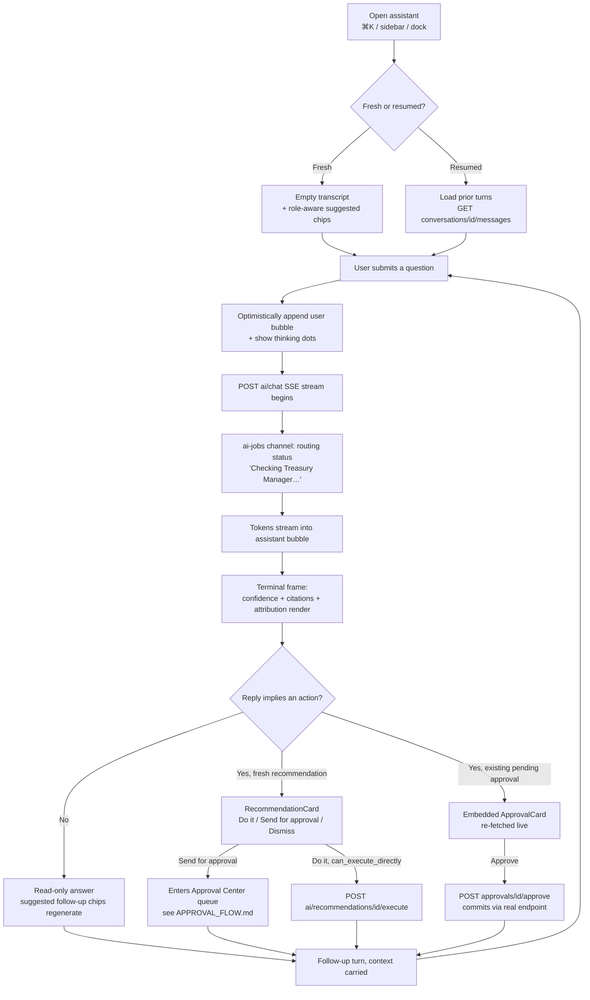

# AI Chat Flow — QAYD Frontend
Version: 1.0
Status: Design Specification
Module: Frontend
Submodule: Flows / AI_CHAT_FLOW
---

# Purpose

This document specifies the end-to-end journey of a single assistant conversation in the QAYD web
client — from the moment a user opens the assistant (via `⌘K`'s "Ask AI" hand-off or the dedicated
`/assistant` screen), through asking a question, watching the answer stream in over SSE with its
source-document citations and agent attribution, to the assistant *proposing* an action that renders
as an inline approve/reject card, a human approving it, that action committing through its own real
endpoint, and the follow-up turns that carry the conversation's context forward. It is a *flow*
document: it does not re-specify the assistant screen, the chat components, or the AI-in-UI contract —
those are owned respectively by [`../AI_CHAT.md`](../AI_CHAT.md) (the screen), the chat components it
enumerates, and [`../components/AI_WIDGETS.md`](../components/AI_WIDGETS.md) (the definitive contract
for how confidence, reasoning, and the three-button proposal pattern render). This document is
authoritative only for how those surfaces *sequence* into one coherent journey, and for the branch
points — a streaming interruption, an unavailable engine, a stale proposal, a permission the user
lacks, a resumed thread — where the journey forks.

The single load-bearing invariant this flow exists to make structurally true is the one every AI
surface in QAYD inherits ([`../README.md`](../README.md) `# Overview`, constraint 2, and
[`../components/AI_WIDGETS.md`](../components/AI_WIDGETS.md) `# The AI-in-UI Contract`): **the
assistant never commits a proposal; only a human's decision about a proposal commits.** A conversation
can draft a journal entry, suggest a reclassification, or surface a pending approval, but the byte that
posts, approves, or moves money is always a human's click on a real, permission-gated mutation — never
a token the model streamed. Everything below is arranged so that no path, including the error and
resume paths, can violate that.

# Actors & Preconditions

| Actor | Role in this flow |
|---|---|
| The conversing user | Any authenticated, non-suspended company member. Opens the assistant, asks, reads, and — when properly permissioned — acts on an inline proposal or embedded approval. |
| CEO Assistant (orchestrator) | The single front door to the fifteen-agent workforce ([`../../ai/agents/CEO_AGENT.md`](../../ai/agents/CEO_AGENT.md)). Classifies the request, fans out to specialists, reconciles disagreement, returns one cited, confidence-scored answer. The user never selects a specialist. |
| Routed specialists | The domain agents (Treasury Manager, Payroll Manager, Fraud Detection, …) the orchestrator invokes per turn; surfaced to the user only as an attribution byline and a tool-call trace, never as a mode to switch into. |
| The frontend | Renders the contract; computes nothing. Streams tokens, renders confidence/reasoning/citations from the API payload, gates the one client-checked permission (`ai.approve`) on inline action affordances, and routes every commit through the same authoritative mutation the owning screen uses. |

**Preconditions.**

- The user holds `ai.chat` — the only gate on opening `/assistant`, sending, and reading, held by
  every non-suspended account ([`../AI_CHAT.md`](../AI_CHAT.md) `# Route & Access`).
- The authenticated `(app)` shell is mounted, so the shared `RealtimeProvider` connection (used here
  for the pre-first-token "thinking"/routing status on `private-company.{id}.ai-jobs`) is already
  open; this flow opens no second WebSocket.
- An active `X-Company-Id` is resolved; the assistant reasons only over the active company's data,
  scoped to the intersection of the user's own permissions against whatever tool calls the
  orchestrator would need to make (`CEO_AGENT.md` `# Data Access & Tenant Scope`).
- The SSE proxy route `app/api/ai/chat/route.ts` is reachable; it forwards the visitor's own httpOnly
  bearer server-side and returns `text/event-stream`.

# Entry Points

Every entry point mounts the identical `AssistantView` client component ([`../AI_CHAT.md`](../AI_CHAT.md)
`# Components Used`) — differing only in container and seed context, never in behavior:

| Entry point | Lands on | Seed |
|---|---|---|
| Sidebar "AI" → the always-visible Ask AI/AI Chat leaf | `/assistant`, fresh composer | None |
| `⌘K` Command Palette → "Ask AI about '{q}'" | `/assistant?q={q}` — the free text is handed to the same composer, pre-filled ([`../components/SEARCH_BAR.md`](../components/SEARCH_BAR.md) `# The command palette`) | The typed query |
| A docked "Ask AI" trigger on any other screen | The AI Rail (`3xl`+) or a `Sheet` (below `3xl`), same transcript | That panel's `sources` (a "Scoped to: {panel}" strip renders) |
| An `InsightCard`'s "Explain more" | The docked assistant | The insight's `sources` |
| Conversation-history rail → a saved thread | `/assistant/{conversationId}` | The resumed thread's prior turns |
| A permanent redirect from the legacy `/ai/chat` | `/assistant` | Carried query, if any |

The docked variant and the full page are two renderings of one surface; a user who opens the dock,
then chooses "Open in full page" is the one path that shares a `conversation_id` between the two.

# Flow Overview

Step map (numbered, detailed in `# Step-by-Step`):

1. Open the assistant (fresh or resumed).
2. Compose and submit a question.
3. Optimistic user bubble + thinking/routing status.
4. Stream the reply over SSE.
5. Terminal frame: render confidence, citations, agent attribution.
6. Branch on whether the reply implies an action.
7a. Act on a freshly-synthesized recommendation (three-button).
7b. Act on a surfaced existing approval (embedded `ApprovalCard`).
8. Follow-up turn with carried context; or manage/resume history.

# Step-by-Step

## Step 1 — Open the assistant

- **Screen / route.** `app/(app)/assistant/page.tsx` (fresh) or
  `app/(app)/assistant/[conversationId]/page.tsx` (resumed), per
  [`../AI_CHAT.md`](../AI_CHAT.md) `# Route & Access`. Both are Server Components resolving the session
  and the history rail's first page server-side.
- **User action.** Arrives from any `# Entry Points` path.
- **UI state.** Fresh: empty transcript, a short greeting, role-aware `SuggestedPromptChips`, composer
  auto-focused. Resumed: the thread's most recent message page rendered (immutable, `staleTime:
  Infinity`), scrolled to the latest turn.
- **API call.** Fresh: none — no `ai_conversations` row is created merely by opening the page.
  Resumed: `GET /api/v1/ai/conversations/{id}/messages` (cursor, newest-first) prefetched into the
  TanStack Query cache; the history rail loads via `GET /api/v1/ai/conversations`.
- **Success branch.** Composer is interactive; proceed to Step 2.
- **Failure branches.** History-rail fetch fails → the rail shows an inline retry; the composer stays
  fully usable (a failed history list never blocks a new conversation). A resumed thread that 404s
  (deleted from another session, or cross-tenant) renders `not-found.tsx`, indistinguishable from a
  nonexistent id.

## Step 2 — Compose and submit

- **Screen / route.** Same; the composer is the pinned `ChatComposer`.
- **User action.** Types a question (or selects a `SuggestedPromptChip`, which submits identically) and
  presses `Enter` (`Shift+Enter` = newline), or uses `VoiceInputButton` (tap-to-start/stop, with a
  live transcript-while-speaking preview before submit).
- **UI state.** Send is enabled while the composer is non-empty and no stream is in flight.
- **API call.** None yet — submission fires in Step 3.
- **Success branch.** Proceed to Step 3.
- **Failure branches.** A voice-originated question with a garbled transcript is caught by the
  live-preview before submit; the user edits it like a typo.

## Step 3 — Optimistic user bubble + thinking status

- **User action.** Submit.
- **UI state.** The user's own bubble is optimistically appended (always safe — a user's own words are
  never rolled back, per [`../AI_CHAT.md`](../AI_CHAT.md) `# Interactions & Flows`) in plain `ink-3`
  fill with no accent border. The thinking indicator (three `accent-subtle` pulsing dots, the
  platform's calm AI-thinking pattern) renders while `useChat` awaits the first token; the composer
  disables `Send` (typing still allowed) and shows **Stop**.
- **API call.** `POST /api/v1/ai/chat` (SSE) via the `app/api/ai/chat/route.ts` proxy, body carrying
  `{ conversation_id, context }`. On a fresh conversation the server creates the first
  `ai_conversations` row as a side effect of this call (never merely by opening the page).
- **Realtime.** The screen already listens on `private-company.{id}.ai-jobs` through the shared
  connection; as the orchestrator fans out, the thinking dots are replaced by short status lines
  ("Checking Treasury Manager…", "Checking Payroll Manager…").
- **Success branch.** First token arrives → Step 4.
- **Failure branches.** No token and an upstream `5xx`/network drop → the user's message is preserved
  and an inline "Couldn't get a response — retry" affordance replaces the assistant bubble; a `503`
  from the AI engine renders `AiUnavailable variant="chat"` with the message preserved (see
  `# Alternate & Error Paths`).

## Step 4 — Stream the reply

- **UI state.** Tokens render progressively into the assistant bubble; the routing status lines
  collapse into a collapsed-by-default `ToolCallTrace` once prose begins. The message is *not* final —
  confidence badge, citations, and any action affordances are withheld — until the terminal SSE frame.
- **API call.** The same open SSE stream from Step 3; token batching is the Vercel AI SDK's own
  scheduling, so only the actively-streaming bubble re-renders per chunk.
- **Success branch.** Terminal frame received → Step 5.
- **Failure branches.** SSE drops mid-stream (network blip) → a bounded automatic reconnect using the
  stream's own resumption; if it fails, the partial reply is kept visible with a "Response was
  interrupted — retry" affordance, and retry re-sends the same user turn (idempotency key reused),
  never duplicating it. One routed specialist timing out inside its own budget does *not* fail the
  turn: the reply renders from whichever specialists responded, with a plain note ("Inventory Manager
  didn't respond in time — this answer excludes stock data").

## Step 5 — Terminal frame: confidence, citations, attribution

- **UI state.** `ChatMessageBubble` renders the completed payload through its fixed slot order
  ([`../AI_CHAT.md`](../AI_CHAT.md) `# AI Integration`): prose → `AgentAttributionRow` (only when
  `routed_agents.length > 0`) → collapsed `ReasoningDisclosure` → inline `CitationChip`s woven into the
  prose at each `sources[]` position → the action row (Step 6). The `ConfidenceBadge` renders the
  blended confidence, normalized via `normalizeConfidence(score, 'percentage')` — the minimum of every
  load-bearing specialist's confidence, never an average.
- **API call.** None — this is pure render of the terminal payload.
- **Success branch.** Composer re-enabled; `SuggestedPromptChips` regenerate from this turn's content;
  proceed to Step 6.
- **Failure branches.** Blended confidence below 70, or no tool could answer → plain prose, an explicit
  caveat line ("I'm not fully confident in this — want me to have the Auditor take a closer look?"),
  and **no confidence badge at all** (the failure is "no answer," not "a low-confidence answer").

## Step 6 — Branch on implied action

The reply is one of three shapes; each renders through an existing component, never a chat-native
lookalike:

| Shape | Signal | Renders | Next |
|---|---|---|---|
| Read-only answer | `requires_approval: false`, no `suggested_actions`/`recommended_action` | Prose + citations only | Step 8 |
| Fresh recommendation | `suggested_actions`/`recommended_action` populated | `RecommendationCard` — Do it / Send for approval / Dismiss | Step 7a |
| Existing pending approval | The reply surfaced a real `ai_approval_requests` row | Embedded `ApprovalCard`, re-fetched live | Step 7b |

## Step 7a — Act on a fresh recommendation

- **UI state.** `RecommendationCard`'s three-button pattern. **`Do it`** renders only when the API's
  `can_execute_directly === true` and confidence clears `AUTO_EXECUTE_THRESHOLD` (0.90); it is
  structurally absent — never disabled — for anything touching `bank.transfer`, `payroll.approve`,
  `tax.submit`, a permission change, or a delete/void. `Send for approval` and `Dismiss` (mandatory
  reason) always render; both are gated in the UI by `ai.approve` for the acting affordances.
- **API call.**
  - `Do it` → `POST /api/v1/ai/recommendations/{id}/execute` (pessimistic, awaits `2xx`; carries an
    `Idempotency-Key`).
  - `Send for approval` → `POST /api/v1/ai/recommendations/{id}/send-for-approval` — the item enters
    the Approval Center queue and the journey continues in [`./APPROVAL_FLOW.md`](./APPROVAL_FLOW.md).
  - `Dismiss` → `POST /api/v1/ai/recommendations/{id}/dismiss` with a non-empty reason (optimistic,
    5-second Undo; reason fed to `ai_memory`).
- **Success branch.** The card flips to an executed/queued/dismissed state inline; proceed to Step 8.
- **Failure branches.** `execute` `4xx/5xx` → the pessimistic mutation surfaces the error inline
  without flipping the card; a `403` (permission removed mid-session) forces a permission-cache refetch
  and an explanatory toast.

## Step 7b — Act on a surfaced existing approval

- **UI state.** The real `ApprovalCard` embedded inline — the same component and mutation the Approval
  Center uses. **Before** rendering its buttons it re-fetches `GET /api/v1/approvals/{id}` live
  (`staleTime: 0`), never trusting the chat payload, which may already be stale by the time a human
  reads it. A user without `ai.approve`, or who is not the assigned approver for the current step, sees
  the card in read-only presentation — never an enabled button that would `403`.
- **API call.** `POST /api/v1/approvals/{id}/approve` | `/reject` — reused verbatim from the Approval
  Center (`useApproveRequest`), optimistic with a client-generated `Idempotency-Key`.
- **Success branch.** The step advances (or the chain resolves); the card reflects it; proceed to
  Step 8. The full approval lifecycle beyond this click is owned by
  [`./APPROVAL_FLOW.md`](./APPROVAL_FLOW.md).
- **Failure branches.** The target changed between proposal and click → Approve is replaced with
  "Review changed data." A permission revoked mid-session → the live re-fetch renders the card
  read-only rather than trusting a stale mount-time check.

## Step 8 — Follow-up turn, or manage/resume history

- **User action.** Types a follow-up (submitted through the identical `handleSubmit` path), selects a
  regenerated chip, or manages the history rail (Rename / Archive / Open in full page).
- **UI state.** A resumed conversation generates every reply with that thread's own prior turns as
  context (the frontend does no windowing; it renders whatever the API returns and never truncates the
  user's *view* of history, only what it sends as model context). **New conversation** starts a
  genuinely empty composer, never carrying prior context.
- **API call.** Follow-up → `POST /api/v1/ai/chat` with the same `conversation_id` (loop to Step 3).
  Rename → `PATCH /api/v1/ai/conversations/{id}` `{ title }` (optimistic). Archive → `PATCH
  /api/v1/ai/conversations/{id}` `{ status: "archived" }` (there is deliberately no hard delete — a
  conversation is archived, retained for audit).
- **Success/failure.** As Step 3 for the follow-up; optimistic rename/archive roll back on failure.

# Happy Path

Mariam (CFO, `ai.chat` + `ai.approve`) opens `/assistant` from the sidebar. She types *"Why did our KWD
balance drop so much this week?"* and presses Enter. Her bubble appears instantly; three calm dots pulse,
then "Checking Treasury Manager…", "Checking Payroll Manager…". Tokens stream in: *"The main draw was the
payroll run on July 15…"* On the terminal frame the bubble settles — a `96% · High confidence` badge, a
"CEO Assistant · via Treasury Manager, Payroll Manager" attribution byline, two inline citations
(`bank_accounts #12`, `payroll_runs #204`), and a collapsed "Show work" trace. The reply carries a
`suggested_action`, so a `RecommendationCard` offers **Review Payroll Run #204 →**. She clicks it, lands on
the payroll run, confirms the figures, returns, and types a follow-up: *"Break this down by branch."* The
same loop runs, this time with the prior turn as context, and the answer narrows to per-branch figures. No
byte moved money; every number carried its confidence and its "why," and every citation was a real,
clickable record.

# Alternate & Error Paths

| Path | Trigger | Behavior |
|---|---|---|
| AI engine unavailable | `POST /api/v1/ai/chat` returns `503` | `AiUnavailable variant="chat"` in the transcript; the user's message is preserved; retry honors `Retry-After`. The rest of the app is unaffected. |
| Streaming interruption | SSE drops mid-stream | Bounded auto-reconnect via the stream's own resumption; on failure, the partial reply is kept with "Response was interrupted — retry"; retry reuses the idempotency key (no duplicate turn). |
| Specialist timeout | One routed agent misses its budget | The reply renders from the responders with a plain exclusion note; the turn is not failed. |
| Low confidence / no answer | Blended confidence < 70 or no tool could answer | Plain prose, explicit caveat, **no** confidence badge, an offered hand-off to a human/specialist. |
| Disagreement between specialists | Two agents return conflicting figures | `ToolCallTrace` auto-expands (not collapsed) with a compact agent/claim/confidence comparison; the prose names the conflict explicitly — never silently averaged. |
| Voice reply implies an action | A voice-originated turn would render `Do it` | The `Do it` renders in a "say or tap confirm" pending sub-state until an explicit spoken/tapped confirmation, since a misheard word hands-free is higher-cost than a misclick. |
| Permission absent for an inline action | User lacks `ai.approve` on a proposal/approval | `Send for approval`/`Do it`/`Approve` are disabled-with-tooltip (proposal) or the embedded `ApprovalCard` renders read-only (surfaced approval) — never an enabled path that would `403`. |
| Stale surfaced approval | The target advanced/decided elsewhere before the click | The embedded card's live re-fetch replaces Approve with "Review changed data." |
| Second message while streaming | User submits again mid-stream | `Send` stays disabled (typing allowed) until the in-flight terminal frame or **Stop**; never two concurrent streams into one conversation. |

# Data & State

The live transcript is **not** a TanStack Query cache entry — it is `useChat`'s state (`POST
/api/v1/ai/chat` is an SSE stream, not a cached query). Everything *around* the stream is ordinary
TanStack Query ([`../AI_CHAT.md`](../AI_CHAT.md) `# Data & State`).

| Purpose | Endpoint | Method | Cache / mutation behavior |
|---|---|---|---|
| Send + stream reply | `/api/v1/ai/chat` (proxied) | POST (SSE) | Not cached — `useChat` owns it; `sendExtraMessageFields` carries `agent_code`, `confidence`, `sources`, `decision_id` per assistant turn |
| List conversations | `/api/v1/ai/conversations` | GET (cursor) | `aiChatKeys.conversations()`, `staleTime: 10_000`, refetch-on-focus |
| Load a thread's messages | `/api/v1/ai/conversations/{id}/messages` | GET (cursor) | `aiChatKeys.messages(id)`, `staleTime: Infinity` (past turns immutable; `useChat` appends) |
| Rename | `/api/v1/ai/conversations/{id}` | PATCH `{ title }` | Optimistic; rollback on failure |
| Archive | `/api/v1/ai/conversations/{id}` | PATCH `{ status: "archived" }` | Optimistic remove from active list; reversible via "Archived" filter |
| Re-check surfaced approval | `/api/v1/approvals/{id}` | GET | `staleTime: 0` — always re-fetched immediately before rendering Approve/Reject |
| Approve/reject inline | `/api/v1/approvals/{id}/approve`\|`/reject` | POST | Reused verbatim from the Approval Center; optimistic |
| Act on recommendation | `/api/v1/ai/recommendations/{id}/execute`\|`/send-for-approval`\|`/dismiss` | POST | `execute` pessimistic; `dismiss` optimistic with Undo |

**Query invalidations.** Approving/rejecting an embedded approval invalidates `approvalKeys.all` and
the dashboard's urgent-actions badge (the same reconciliation the Approval Center runs). A follow-up
turn appends locally via `useChat` and does not invalidate the immutable message query. Rename/archive
optimistically patch `aiChatKeys.conversations()`.

**Realtime channels.** Message content arrives over SSE, not Reverb. The screen subscribes only to
`private-company.{id}.ai-jobs` (the shared connection) for the pre-first-token "thinking"/routing
status and long-running fan-out progress — an already-streaming reply uses SSE's own reconnect, so a
Reverb drop never interrupts it. Company switch fires `queryClient.clear()` + `router.refresh()`; the
active conversation is abandoned (never carried across the tenant boundary) and the screen lands on a
fresh `/assistant` under the new company.

# AI Touchpoints

- **Confidence + reasoning on every AI value.** Every assistant turn carries its `ConfidenceBadge`
  (except the honest "no answer" case) and a collapsed `ReasoningDisclosure`; per-routed-agent
  sub-confidence renders inside `ToolCallTrace`. Confidence is the minimum of every load-bearing
  specialist, never an average — no component recomputes a blended figure ([`../AI_CHAT.md`](../AI_CHAT.md)
  `# AI Integration`).
- **Citations are real navigations, never dead labels.** Numbered `CitationChip`s resolve to the
  underlying record (`/payroll/payroll-runs/204`, an invoice, a document viewer in a `Sheet`); a
  citation never points at an `ai_memory` row — remembered context is disclosed in prose, never as a
  clickable source.
- **Agent attribution is informative, not decorative.** The `AgentAttributionRow` renders only when a
  fan-out genuinely occurred; a single-domain reply shows no byline.
- **Proposals never auto-commit.** A fresh recommendation renders the three-button pattern with `Do it`
  gated by the server's `can_execute_directly` (absent, not disabled, when withheld); a surfaced
  approval embeds the real `ApprovalCard` re-fetched live. The assistant "narrates the existence of the
  pending action and links to it" — it is the *component*, not the *agent*, that lets a permissioned
  human act ([`../components/AI_WIDGETS.md`](../components/AI_WIDGETS.md) `# The AI-in-UI Contract`).
- **RBAC bounds what the assistant surfaces.** The assistant never returns data the user's own role
  cannot access — the answer is bounded by the intersection of the user's permissions and the tool
  calls the orchestrator would make (`CEO_AGENT.md` `# Data Access & Tenant Scope`). The frontend's own
  only client-checked permission on this flow is `ai.approve`, and only to decide whether an inline
  action affordance is interactive.

# Permissions

| Step | Permission | Enforcement |
|---|---|---|
| Open `/assistant`, send, read | `ai.chat` | Client hides the composer without it; server is authoritative |
| Reply requiring cross-domain synthesis | `ai.ceo.query` | Server-side per underlying tool call — the client never branches on it |
| Morning briefing / what-if in chat | `ai.ceo.brief` / `ai.ceo.simulate` | Server-side; invisible to the composer |
| Act on an inline `RecommendationCard` `Do it` | The action's own key (e.g. `accounting.journal.post`) + `can_execute_directly` | UI hides `Do it` when withheld; mutation endpoint `403`s as backstop |
| `Send for approval` / `Dismiss` | `ai.approve` (send), `ai.chat` (dismiss) | UI disable-with-tooltip; server authoritative |
| Approve/reject a surfaced approval | `ai.approve` + the step's `stepPermission`/`requiredPermission` | Live re-fetch renders read-only without it; mutation `403`s |

A control **withheld** by `can_execute_directly: false` does not render at all (no client-side path
exists); a control **disabled** for a permission reason renders greyed with a tooltip naming the
missing permission — the two are never conflated
([`../components/AI_WIDGETS.md`](../components/AI_WIDGETS.md) `# States`).

# i18n & RTL

- **The AI's own words are never machine-translated by the frontend.** A reply's `content` arrives
  already localized per the API's `Accept-Language` content-negotiation contract; the client's
  localization responsibility is limited to chrome — composer placeholder, chip labels, empty-state
  copy, the "Show work" toggle, history-rail group labels.
- **`dir="rtl"` is set once on `<html>`** by the root layout; no chat component toggles direction.
  Composer order (mic → input → send), `CitationChip` inline position within RTL prose, the trace
  chevron, and the history rail's slide-in edge all use logical utilities (`ms-*`/`me-*`/`ps-*`/`pe-*`/
  `text-start`/`text-end`) exclusively.
- **Three things never mirror.** Every monetary figure, percentage, confidence score, and
  citation-adjacent number renders inside a `dir="ltr"` span with `numberingSystem: "latn"` (a `96%`
  reads left-to-right mid-Arabic-sentence); directional icons flip (`ToolCallTrace`'s chevron via
  `rtl:rotate-180`) while meaning-bearing icons (the confidence mark, the CEO Assistant's geometric
  mark, a citation marker) do not.
- **Voice** is tuned for English and Gulf-dialect Arabic; the live transcript-while-speaking renders in
  whichever script the engine detects, independent of the UI's active locale.
- Arabic microcopy is authored directly in the professional Gulf register, not translated post hoc
  (e.g. composer placeholder *اسأل أي شيء عن أعمالك*, low-confidence caveat *لست واثقًا تمامًا من هذه
  الإجابة*).

# Accessibility

- **Landmarks and roles.** The transcript is a `<section aria-label="Conversation">` with `role="log"`
  (append-only, not `role="feed"`), each turn an `<article>` with an accessible name combining role and
  a short excerpt, so a screen-reader user jumps turn-to-turn without linear re-reading.
- **Streaming announce policy — announce once, never token-by-token.** The send action sets
  `role="status"`/`aria-busy="true"` once when a reply begins ("Thinking…", then "Answering…"); the
  full text is announced once via `aria-live="polite"` on completion. Token-by-token narration would
  make the surface unusable by voice. A routing status ("Checking Treasury Manager…") announces at most
  once per specialist.
- **Focus continuity.** The composer is focused on load; `Enter` sends, `Shift+Enter` newlines, `↑` on
  an empty composer edits the just-sent message, `Esc` closes the docked `Sheet` without navigating.
  Every citation, trace toggle, and message-level action is a real `Tab`-reachable `<button>` with
  `aria-expanded` on disclosures and `aria-describedby` linking a reasoning-dependent action to its
  reasoning (the "why" is available *before* the action). `⌘K` from `/assistant` focuses the existing
  composer rather than opening a redundant second instance.
- **Amounts and confidence read unambiguously.** `KWD 184,220.000` announces as one unit with its
  currency code; `ConfidenceBadge`'s percentage and band are both real text, never a bare progress-bar
  width.
- **Voice has a full non-voice equal.** Every capability voice offers has an identical typed/tapped
  path; `prefers-reduced-motion` collapses the thinking dots to a static three-dot glyph plus a
  "Generating…" live-region announcement.

# Edge Cases

| Edge case | Behavior |
|---|---|
| Abandonment before first send | Opening `/assistant` creates no `ai_conversations` row; leaving persists nothing — the history rail stays free of empty threads. |
| Resume mid-generation | The stream continues server-side; navigating away and back re-fetches the message history (now including the completed turn) rather than replaying the stream. |
| Back button mid-stream | Same — the turn is not lost; returning shows the persisted completed turn. |
| Streaming interruption | Bounded auto-reconnect; on failure the partial reply is kept with a retry that reuses the idempotency key (no duplicate turn). |
| Stale proposal | An embedded `ApprovalCard` re-fetches live before showing Approve; on divergence, "Review changed data" replaces it. A fresh `RecommendationCard` whose `can_execute_directly` no longer holds has `Do it` structurally absent. |
| Double-action | Every commit carries a client-generated `Idempotency-Key`; a slow spinner + second tap cannot double-execute or double-approve. |
| Second message while streaming | `Send` disabled until the terminal frame or **Stop**; no interleaved concurrent streams. |
| Company switch with a conversation open | `queryClient.clear()` + `router.refresh()`; the conversation is abandoned at the tenant boundary; a fresh `/assistant` loads under the new company. |
| Two tabs on the same conversation | Both stream independently against the same `conversation_id`; a message from one appears in the other only on its next `messages` re-fetch (no live cross-tab message push) — expect a brief lag, not instant mirroring. |
| Permission revoked mid-conversation (`ai.approve`) | The next inline `ApprovalCard`'s live re-fetch renders read-only; the mutation's `403` forces a permission-cache refetch and a toast. |
| Citation to a since-deleted/voided record | The `CitationChip`'s "View" opens the record's own terminal/void state, not a 404 — a citation is a historical reference to what was true when the reply was generated. |
| Renaming to empty | Rejected client-side (falls back to the placeholder truncation) before any `PATCH`. |
| Archiving the open conversation | The transcript stays fully readable/interactive; archiving only removes it from the active list. |

# End of Document
