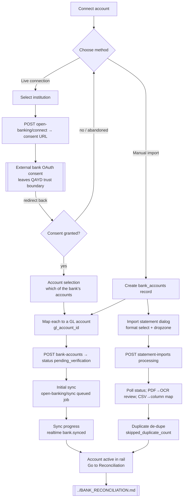

# Bank Connection Flow — QAYD Frontend
Version: 1.0
Status: Design Specification
Module: Frontend
Submodule: Flows / BANK_CONNECTION
---

# Purpose

This document specifies the end-to-end user journey of **connecting a bank account to QAYD** — from the
moment a Finance Manager decides "we should get our bank data into the system" to the moment that account
sits in the account rail with its balance live, its transactions synced, and its ledger link to a Chart of
Accounts row established. It is a *flow* document: it spans several screens and drawers rather than
specifying any single one in depth, and where it touches a screen already specified elsewhere it links out
rather than restating. The two surfaces this flow moves across are the Banking landing screen
([`../screens/BANKING_SCREEN.md`](../screens/BANKING_SCREEN.md), the concrete companion to
[`../BANKING.md`](../BANKING.md)) and the reconciliation workbench it hands off to at the end
([`../BANK_RECONCILIATION.md`](../BANK_RECONCILIATION.md)). Every business fact it names — endpoint,
permission key, status enum, statement format — is owned by [`../../accounting/BANKING.md`](../../accounting/BANKING.md)
and restated here only to make the journey legible; where this document appears to contradict that one on a
fact, that is a defect to resolve in review, never a decision an engineer makes in code.

QAYD supports **two fundamentally different ways to get a bank's data into the ledger**, and the first
choice this flow forces is between them:

1. **A live connection** — Open Banking / an aggregator — where the user consents once, QAYD holds a
   revocable token, and transactions arrive on a schedule with no further human upload. This is the richer
   path and the one the product nudges toward, but it carries an external consent handoff (OAuth) that
   leaves QAYD's own trust boundary entirely.
2. **Manual statement import** — MT940, CAMT.053, CSV/XLSX, or a scanned PDF — where the account exists in
   QAYD as a record but its data is pushed in file-by-file. This is the fallback for a bank with no Open
   Banking support, for a company not ready to grant consent, and for historical backfill before a live
   connection's start date.

Both paths converge on the same three outcomes: a `bank_accounts` row exists and is `active`, it is mapped
to exactly one Chart-of-Accounts `accounts` row (`gl_account_id`, non-null — the ledger link without which
no bank transaction can ever post), and its statement lines are available to the reconciliation workbench.
This flow owns none of the business logic behind those outcomes — it never validates an IBAN, never decides
a transaction is a duplicate, never computes a balance. It renders a sequence of decisions and hands each
to the API, which is the sole authority on whether the account may be created, the consent accepted, the
statement parsed, or the line matched.

# Actors & Preconditions

| Actor | Role in this flow |
|---|---|
| Finance Manager / Treasury | The primary driver — decides to connect, chooses the method, selects which of the bank's accounts to onboard, and confirms the GL mapping. Holds `bank.account.create` and `bank.account.manage`. |
| Owner / CEO / CFO | Everything the Finance Manager can do; the CFO is the typical Treasury administrator (`treasury_admin`) who receives consent-expiry warnings. |
| Senior Accountant / Accountant | May import a statement into an already-connected account (`bank.reconcile`) but cannot create the account or manage its live connection — the create and connect buttons are absent for them, not disabled. |
| Auditor / Read Only | Sees the resulting account and its transactions read-only; every control in this flow is omitted for them. |
| AI service account | Never drives this flow as a user. The Document AI / OCR Agent and the Banking Agent participate *inside* it (statement parsing, duplicate detection, GL-account suggestion) but are structurally incapable of holding `bank.account.create`, `bank.transfer`, or any payment-approval key regardless of company policy. |

**Preconditions.** The user holds at least `bank.read` (to be on the Banking screen at all) plus the
specific key for the action they attempt (`bank.account.create` to onboard, `bank.reconcile` to import). A
Chart of Accounts exists for the company with at least one postable account of a `bank`/asset nature to map
to — a company still in first-run onboarding with no COA is routed to set that up first (see **Edge Cases**).
The company's base currency is resolved. No precondition requires a *specific* bank to be supported for Open
Banking; an unsupported bank simply collapses the live-connection option and leaves manual import as the
only path (see **Alternate & Error Paths**).

# Entry Points

| Entry point | Screen / control | Gate |
|---|---|---|
| **"Connect account"** button in the Banking page header | [`../screens/BANKING_SCREEN.md`](../screens/BANKING_SCREEN.md) → Page header | `bank.account.create` (button omitted if absent) |
| **Empty-state CTA** in the Account rail ("No bank accounts yet — Connect account") | Banking screen, Account rail empty state | `bank.account.create` |
| **First-run onboarding** step (a brand-new company is prompted to connect its first account) | `../ONBOARDING.md` hands off here | `bank.account.create` |
| **"Import statement"** button (a manual import into an *existing* account, the second path's re-entry) | Banking screen header | `bank.reconcile` |
| **Re-authentication prompt** — a Topbar notification (`bank.open_banking.consent_expiring`) or a card-level "Reconnect" affordance when a consent has lapsed | Banking screen Account rail card / Topbar bell | `bank.account.manage` |

Every entry point except the last resolves into the same connection wizard described below; the
re-authentication prompt resolves into an abbreviated variant that skips account creation and re-runs only
the consent handoff for an account that already exists.

# Flow Overview



The flow has three shapes that share a spine: the **live-connection** path (A→B→C→…→K→R), the **manual
first-import** path (A→B→M1→N→…→Q→R), and the **re-auth** path (a truncated live path that starts at D for
an account that already exists). All three end at an `active` account offering "Go to Reconciliation."

# Step-by-Step

Each step names the screen/route it happens on (with a relative link to that screen's own document), the
user action, the resulting UI state, the exact `/api/v1` call, and its success and failure branches. Every
mutating call carries an `Idempotency-Key` header generated at the moment the confirming control is armed,
per [`../README.md`](../README.md) `# Conventions`.

### Step 1 — Choose a connection method

- **Screen / route:** Banking landing, `app/(app)/banking/accounts/page.tsx`
  ([`../screens/BANKING_SCREEN.md`](../screens/BANKING_SCREEN.md)). "Connect account" opens a `Dialog`
  hosting the method chooser — not a route change, since the account does not yet exist to have a URL.
- **User action:** picks **Live connection (Open Banking)** or **Manual statement import**.
- **UI state:** two large choice cards; the live-connection card carries a one-line "Recommended — your
  transactions arrive automatically" caption and the manual card "Import files yourself — works with any
  bank." A read of the supported-institution list runs behind the live card so an unsupported bank can grey
  that option with an explanation rather than letting the user walk into a dead end (see **Edge Cases**).
- **API call:** none yet — this is a local branch.
- **Success branch:** live → Step 2; manual → Step 6.
- **Failure branch:** none; the chooser cannot fail, only be dismissed (see **Edge Cases → abandonment**).

### Step 2 — Select the institution (live path)

- **Screen / route:** same `Dialog`, second panel.
- **User action:** searches for and selects the bank from the supported-institution list.
- **UI state:** a `Command`-backed searchable list of institutions; selecting one advances to the consent
  primer, a short non-dismissible panel restating in plain language *what* QAYD will be able to read (balances
  and transactions, never the power to move money) and *for how long* (a consent typically lasts 90 days and
  will need renewing) before the external handoff.
- **API call:** the institution list is a read owned by the Banking module's connection catalogue; no
  mutation.
- **Success branch:** Step 3.
- **Failure branch:** the selected bank is not supported for a live connection → the dialog offers "Import a
  statement instead," routing to Step 6 with the institution pre-selected.

### Step 3 — Initiate consent and hand off to the bank (live path)

- **Screen / route:** still the Banking screen; the handoff itself is external.
- **User action:** clicks "Continue to {bank}."
- **UI state:** a brief "Redirecting you to {bank} to approve access" interstitial; the app records that a
  connection attempt is in flight so a return to the tab mid-handoff resumes correctly (see **Edge Cases →
  resume**).
- **API call:** `POST /api/v1/banking/bank-accounts/{id}/open-banking/connect` — permission
  `bank.account.manage`. For a *new* account with no `{id}` yet, the connect endpoint is called against a
  provisional connection record and the `bank_accounts` row is materialized on successful callback (Step 5);
  for a **re-auth** of an existing account, `{id}` is that account. The endpoint returns the bank's OAuth2
  consent URL.
- **Success branch:** the browser navigates to the bank's own consent screen — **this is the permission
  boundary of this entire flow.** QAYD renders nothing on that screen, reads nothing the user types there,
  and receives back only an authorization code via the redirect. The user approves scope (read balances +
  transactions) at the bank, and the bank redirects to QAYD's callback. On success the API stores
  `open_banking_consent_id` and an encrypted refresh token (`bank_oauth_tokens`) that **no API response ever
  returns**.
- **Failure branch:** the user declines at the bank, or the handoff errors → the callback resolves to a
  "Consent not completed" state offering "Try again" (re-runs Step 3) or "Import a statement instead"
  (Step 6). No `bank_accounts` row is created on a declined consent.

> **Permissions boundary note.** Per [`../README.md`](../README.md) `# Overview` and the platform safety
> model, QAYD never itself enters credentials into a bank's login or consent screen and never asks the user
> to hand it their banking password. The OAuth handoff exists precisely so the user authenticates *at their
> bank*, and QAYD only ever holds a scoped, revocable, read-only token. This flow's frontend responsibility
> ends at "open the bank's consent URL" and resumes at "receive the redirect."

### Step 4 — Select which of the bank's accounts to onboard (live path)

- **Screen / route:** back inside QAYD, the connection `Dialog` reopens on the account-selection panel.
- **User action:** ticks one or more of the accounts the consent exposed (a single consent commonly covers
  several accounts — current, savings, a credit card).
- **UI state:** a checklist of the discovered accounts with masked numbers, currency, and institution type;
  each defaults to *selected*. An account already present in QAYD (matched on institution + masked number) is
  shown pre-linked and cannot be double-added (see **Edge Cases**).
- **API call:** the discovered-accounts list is part of the consent-callback payload; no separate mutation.
- **Success branch:** Step 5 (one confirm creates every selected account).
- **Failure branch:** none at this step — deselecting everything simply disables "Continue."

### Step 5 — Map each account to a GL account and create the record

- **Screen / route:** connection `Dialog`, mapping panel — the one step **both** paths share.
- **User action:** for each account being onboarded, confirms or picks the Chart-of-Accounts row it posts
  to, via `AccountPicker` ([`../screens/ACCOUNTING_SCREEN.md`](../screens/ACCOUNTING_SCREEN.md) owns the
  component). The Banking Agent pre-fills a suggested GL account where one is obvious (a same-currency bank
  account with a matching name); the suggestion carries a `ConfidenceBadge` and is never committed without
  the human's confirming selection.
- **UI state:** one mapping row per account; the `AccountPicker` is constrained to postable asset/bank-nature
  accounts. A currency mismatch between the bank account and the chosen GL account surfaces an inline warning.
- **API call:** `POST /api/v1/banking/bank-accounts` — permission `bank.account.create` — one call per
  onboarded account, each carrying `gl_account_id`, `currency_code`, `institution_type`, and the consent
  linkage. Server creates the row with `status = pending_verification`.
- **Success branch (live):** account created; proceed to Step 5a (verify) then Step 5b (initial sync). For an
  Open-Banking account the verification is satisfied by the consent itself, so the row transitions
  `pending_verification → active` via `POST /api/v1/banking/bank-accounts/{id}/verify`
  (`bank.account.verify`) automatically on the successful callback where policy allows, or on the user's
  explicit "Verify" click otherwise.
- **Success branch (manual):** account created `pending_verification`; the user proceeds directly to Step 6
  (import) — verification for a manual account is a human "Verify" action once a first statement's balances
  reconcile.
- **Failure branch:** a `422` (invalid IBAN — `VALIDATION_ERROR` / `"IBAN failed mod-97 checksum
  validation."`, or a GL-account nature mismatch) maps back onto the specific mapping row's field via
  `useApiToast.mapFieldErrors`; the dialog stays open with the user's selections intact. A `409` for an
  already-linked account de-selects and annotates that one row without failing the others.

### Step 5a — Initial transaction sync and progress (live path)

- **Screen / route:** the connection `Dialog` transitions to a progress panel; the account is already
  visible in the rail behind it.
- **User action:** none required — the sync runs on its own; the user may close the dialog and let it finish
  in the background.
- **UI state:** a determinate progress read driven by realtime, not a spinner held on a long request. The
  panel shows "Syncing {bank} — {n} transactions imported so far."
- **API call:** `POST /api/v1/banking/bank-accounts/{id}/open-banking/sync` — permission
  `bank.account.manage` — enqueues a Laravel job that calls the bank/aggregator, normalizes the payload, and
  inserts `bank_statement_lines`; a scheduled sync (default 4-hour cadence, or webhook push where the bank
  supports it) keeps it current thereafter.
- **Success branch:** on completion the `private-company.{id}.banking` channel fires `bank.synced` with
  `{ imported_count, auto_matched_count, unmatched_count }`; the panel reports the summary and offers "Go to
  Reconciliation" → Step 8.
- **Failure branch:** an aggregator error surfaces a distinct "Couldn't reach {bank} — Retry" state
  (re-enqueues the sync) rather than the generic processing shimmer; a partial pull is never treated as
  complete because the server only commits `bank_statement_lines` after a validated full response.

### Step 6 — Open the Import Statement dialog (manual path)

- **Screen / route:** Banking screen — "Import statement" (`bank.reconcile`) opens a `Dialog` hosting
  `StatementImportDropzone`.
- **User action:** picks the target account, selects a format, and drops or chooses a file.
- **UI state:** an account picker (pre-selected when entered from a specific account's card), a format
  selector — **`mt940` / `camt053` / `csv` / `xlsx` / `pdf`** — and a drop target that also accepts a
  keyboard-triggered native file picker (a literal drag is never required; see **Accessibility**).
- **API call:** none until submit.
- **Success branch:** Step 7.
- **Failure branch:** none at selection; validation is on submit.

### Step 7 — Parse, map columns, review OCR, de-duplicate (manual path)

- **Screen / route:** the same `Dialog`, which becomes a short in-place review flow. For the CSV/XLSX
  column-mapping and PDF OCR-correction sub-steps this is modeled as a `WizardSheet`
  ([`../components/DRAWERS.md`](../components/DRAWERS.md)) that keeps step state across a validation error
  rather than remounting.
- **User action:** for a **CSV/XLSX** import from a bank not seen before, maps the file's columns to
  QAYD's fields once (the mapping is saved per `bank_name` and skipped on every later import from that bank);
  for a **PDF**, reviews any OCR-extracted field below the 95% confidence floor and corrects it.
- **UI state:** the dialog shows `status: processing` and polls rather than holding a long request open. The
  PDF review step highlights sub-95% fields (field-level confidence from `ocr_field_confidence`) for
  correction; the batch cannot finalize until they are resolved.
- **API call:** `POST /api/v1/banking/statement-imports` — permission `bank.reconcile`,
  `multipart/form-data` with the `format` field — then `GET /api/v1/banking/statement-imports/{id}` polled
  while `status = processing`.
- **Success branch:** the server verifies `opening_balance + Σ lines = closing_balance`, de-duplicates
  against a hash of `(bank_account_id, value_date, amount, direction, bank_reference, raw_description)`, and
  the dialog reports the exact `{ line_count, auto_matched, unmatched }` plus any `skipped_duplicate_count`,
  then offers "Go to Reconciliation" → Step 8. A `bank.statement.imported` event fires on the banking
  channel.
- **Failure branch:** a balance mismatch blocks the import outright with `BALANCE_CHECK_FAILED` and a
  re-upload prompt (statement lines are only ever created server-side after a validated complete file, so no
  partial import is left behind); an OCR low-confidence result (`OCR_LOW_CONFIDENCE`) is *advisory* and lets
  the batch proceed to the field-correction step; a mid-upload connectivity drop surfaces "Upload
  interrupted — retry."

### Step 8 — Hand off to reconciliation

- **Screen / route:** navigates to `app/(app)/banking/reconciliation/{bankAccountId}/page.tsx`
  ([`../BANK_RECONCILIATION.md`](../BANK_RECONCILIATION.md)). This flow **never** renders the workbench
  itself — it only opens the door to it. See [`BANK_RECONCILIATION_FLOW.md`](./BANK_RECONCILIATION_FLOW.md)
  for what happens next.
- **User action:** clicks "Go to Reconciliation."
- **UI state:** the account is now `active` in the rail with a live balance; the workbench opens on the
  freshly-imported unmatched lines.
- **API call:** none — a real `<Link>` navigation.

# Flow-Specific Guards

The one guard genuinely specific to this flow is the **OAuth handoff initiation** — a pessimistic mutation
that leaves QAYD's trust boundary and must be resumable if the user returns mid-handoff. It records an
in-flight marker *before* navigating out, so a return to the tab reopens on the right step rather than
orphaning a half-consented connection:

```tsx
// hooks/banking/use-open-banking-connect.ts
'use client';

import { useMutation } from '@tanstack/react-query';
import { api } from '@/lib/api/client';
import { useIdempotencyKey } from '@/hooks/use-idempotency-key';
import { useApiToast } from '@/hooks/use-api-toast';

export function useOpenBankingConnect(bankAccountRef: string) {
  const nextKey = useIdempotencyKey();
  const toast = useApiToast();

  return useMutation({
    // no onMutate — nothing is "connected" until the bank's callback returns; pessimistic throughout.
    mutationFn: () =>
      api.post(`/banking/bank-accounts/${bankAccountRef}/open-banking/connect`, {}, { idempotencyKey: nextKey() }),
    onSuccess: ({ consent_url }: { consent_url: string }) => {
      // Persist a resume marker BEFORE the external redirect, so returning mid-handoff resumes correctly.
      sessionStorage.setItem('qayd:ob-connect', JSON.stringify({ bankAccountRef, at: Date.now() }));
      // The permissions boundary of this flow: QAYD hands off to the bank's own consent screen and
      // renders nothing there. It never enters the user's banking credentials — the user authenticates
      // at their bank; QAYD receives back only an authorization code via the callback.
      window.location.assign(consent_url);
    },
    onError: (e) => toast.fromApiError(e),
  });
}
```

The GL-mapping step reuses `AccountPicker` with the Banking Agent's suggestion pre-filled behind a
`ConfidenceBadge`; there is no bespoke component for it — the important property is that the suggestion is
never committed without the human's confirming selection, which the picker's ordinary
`value`/`onChange` contract already enforces (no "auto-map" path exists).

# Happy Path

The canonical live-connection happy path, end to end: a Finance Manager on the Banking screen clicks
**Connect account**, chooses **Live connection**, selects **NBK** from the institution list, reads the
consent primer, and clicks **Continue to NBK**. QAYD calls
`POST /banking/bank-accounts/{provisional}/open-banking/connect`, receives the consent URL, and hands the
user to NBK's own consent screen; the user approves read access at their bank and is redirected back.
QAYD's callback stores the consent and refresh token, reopens the dialog on the discovered accounts, and
the user keeps **NBK Operating (KWD)** selected. On the mapping panel the Banking Agent has pre-filled
**1010 · Bank — NBK Operating** with a high-confidence badge; the user confirms it and clicks **Create**.
`POST /banking/bank-accounts` creates the row `pending_verification`, the consent verifies it to `active`,
and `POST .../open-banking/sync` enqueues the first pull. The progress panel counts up as
`bank.synced` streams in and reports **47 transactions imported, 44 auto-matched, 3 unmatched**. The user
clicks **Go to Reconciliation** and lands in the workbench with three lines to clear. Total human decisions:
method, institution, consent (at the bank), which accounts, the GL mapping — everything else is the API's.

# Alternate & Error Paths

| Path | Trigger | Behavior |
|---|---|---|
| **Manual-only bank** | Selected bank is not supported for Open Banking | Live option is greyed with an explanation at Step 1/2; the flow routes to the manual import path (Step 6) with the institution carried over. |
| **Consent declined / abandoned at the bank** | User cancels on the bank's consent screen, or never returns | Callback resolves to "Consent not completed"; no `bank_accounts` row is created; offers Retry or manual import. |
| **Consent expiring / expired (re-auth)** | `bank.open_banking.consent_expiring` (fired 7 days before the ~90-day expiry, to the `treasury_admin`), or a lapsed consent | A Topbar notification and a card-level "Reconnect" affordance run the truncated live path from Step 3 against the *existing* `{id}`; account data stays intact; no new row, no re-mapping. |
| **PDF OCR below floor** | Extracted fields below 95% confidence | Advisory, not blocking — the batch proceeds to the field-correction review step; the user corrects flagged fields before finalizing. |
| **Statement balance mismatch** | `opening + Σ lines ≠ closing` | `BALANCE_CHECK_FAILED` blocks the import; re-upload prompt; nothing persisted. |
| **Duplicate lines on re-import** | Overlapping period re-imported | Server hash-dedupes; the dialog reports `skipped_duplicate_count`; the user is never asked to resolve duplicates line-by-line here. |
| **Duplicate suspected on a manual transaction created during backfill** | `bank.duplicate_suspected` at ≥95% likelihood | A blocking `AlertDialog` ("This looks identical to transaction #…") requires a typed override reason before proceeding; the reason is written to `audit_logs`. |
| **Invalid IBAN / account details** | `422 VALIDATION_ERROR` on create | Field-level error on the offending mapping row; dialog stays open with input intact. |
| **Import into a closed reconciliation period** | Imported lines fall inside an already-closed period | Import still succeeds (lines are immutable ingestion data); lines inside the closed range are excluded from auto-matching and flagged for the workbench's reopen flow; the summary surfaces the exclusion count. |
| **Aggregator/sync failure** | Bank unreachable mid-sync | Distinct "Couldn't reach {bank} — Retry" re-enqueues; partial pulls never treated as complete. |

# Data & State

## Endpoints across the flow

| Purpose | Endpoint | Permission | Mutation? |
|---|---|---|---|
| Bank account roster (rail, dedupe check) | `GET /api/v1/banking/bank-accounts` | `bank.read` | no |
| Create the account record | `POST /api/v1/banking/bank-accounts` | `bank.account.create` | yes |
| Verify (→ `active`) | `POST /api/v1/banking/bank-accounts/{id}/verify` | `bank.account.verify` | yes |
| Update non-financial fields | `PATCH /api/v1/banking/bank-accounts/{id}` | `bank.account.update` | yes |
| Initiate Open Banking consent | `POST /api/v1/banking/bank-accounts/{id}/open-banking/connect` | `bank.account.manage` | yes |
| On-demand / initial sync | `POST /api/v1/banking/bank-accounts/{id}/open-banking/sync` | `bank.account.manage` | yes |
| Submit a statement file | `POST /api/v1/banking/statement-imports` | `bank.reconcile` | yes |
| Poll import status | `GET /api/v1/banking/statement-imports/{id}` | `bank.reconcile` | no |
| Cash position (rail balances) | `GET /api/v1/banking/cash-position` | `bank.read` | no |

## Mutations & query invalidations

Every mutation in this flow is **pessimistic** — the UI reflects a created account, a granted consent, or a
completed import only after the server's `2xx`, never on an optimistic guess, because each touches
authoritative financial-infrastructure state (a real connection, a real ledger link). On success:

- `POST /banking/bank-accounts` invalidates `bankingKeys.accounts()` and `bankingKeys.cashPosition()`.
- `POST .../verify` and `.../open-banking/connect` invalidate `bankingKeys.accounts()` and the specific
  `bankingKeys.account(id)`.
- `POST .../open-banking/sync` completion (via the `bank.synced` realtime event, not the request response)
  invalidates `bankingKeys.transactions(...)`, `bankingKeys.cashPosition()`, and the reconciliation
  workbench's `unmatched` key for that account.
- `POST /banking/statement-imports` completion (`bank.statement.imported`) invalidates the same
  reconciliation/transaction keys.

## Realtime

| Channel | Events | Effect |
|---|---|---|
| `private-company.{id}.banking` | `bank.synced`, `bank.statement.imported`, `bank.transaction.created`, `bank.transaction.cleared` | Drives the sync/import progress read and post-connection cache invalidation. |
| `private-company.{id}.notifications.{user_id}` | `bank.open_banking.consent_expiring`, `bank.duplicate_suspected`, `bank.statement.import_failed` | Feeds the Topbar bell — the re-auth prompt and the duplicate/failure surfaces originate here. |

# AI Touchpoints

Three AI agents participate inside this flow; **none of them ever commits a connection, a mapping, or an
import** — each produces a suggestion or an extraction that a human confirms, per the platform's
confidence + reasoning + human-in-loop contract ([`../components/AI_WIDGETS.md`](../components/AI_WIDGETS.md)).

| Agent (`agent_code`) | Touchpoint | Contract |
|---|---|---|
| Document AI / OCR Agent | Parses a PDF/scanned statement into `bank_statement_lines` candidates with per-field confidence | Fields **≥95%** auto-populate; **<95%** are surfaced for human correction in the review step. Never finalizes a batch with an unresolved sub-floor field. |
| Banking Agent (`BANKING_AGENT`, child of `TREASURY_AGENT`) | Suggests the `gl_account_id` mapping at Step 5; runs duplicate detection on import | The GL suggestion renders a `ConfidenceBadge` and requires the human's confirming `AccountPicker` selection — there is no "auto-map." Duplicate detection surfaces as a de-dupe count (import) or a blocking override dialog (manual create). |
| Duplicate Detection (Treasury Manager sub-capability) | Screens new lines/transactions for near-identical prior rows | A likelihood **≥95** raises a blocking `AlertDialog` requiring a typed override reason logged to `audit_logs`. |

There is deliberately **no "Do it" auto-execute button anywhere in this flow.** Creating a bank connection
and mapping it to the ledger are exactly the class of action the platform reserves for a human under their
own permissions; the server's `can_execute_directly` resolves to `false` for every AI output here because
the resolving permission (`bank.account.create` / `bank.account.manage`) is one the AI principal type can
never structurally hold.

# Permissions

| Step | Permission | If absent |
|---|---|---|
| Reach the Banking screen | `bank.read` | Route and nav entry absent; direct hit renders the shell `403`. |
| "Connect account" / create the record | `bank.account.create` | Button omitted (not disabled). |
| Complete verification | `bank.account.verify` | The auto-verify path still runs on a valid consent; the manual "Verify" affordance is omitted. |
| Initiate / renew a live connection | `bank.account.manage` | Live-connection option and "Reconnect" affordance omitted; manual import may still be available. |
| Import a statement | `bank.reconcile` | "Import statement" omitted; stricter than the screen's own `bank.read` baseline. |
| Edit account fields post-create | `bank.account.update` | Edit action omitted. |
| Map to a GL account | Read on the Chart of Accounts (`accounting.accounts.read`) for the `AccountPicker` | Picker renders a forbidden state; the mapping step cannot proceed and the flow is blocked with an explanation. |

RBAC here is a UI courtesy over the API's own authority ([`../../foundation/PERMISSION_SYSTEM.md`](../../foundation/PERMISSION_SYSTEM.md)):
a hidden button is never the reason an action is blocked — the server re-checks every key on every call,
and a mid-flow permission revocation surfaces as a `403` on the next mutation, caught inline, never as a
silently-stuck wizard.

# i18n & RTL

- Every string in the wizard — method labels, the consent primer, format names, empty and error states — is
  a key present in both `lib/i18n/en.ts` and `lib/i18n/ar.ts`; a key in one and missing in the other fails
  `npm run i18n:check`. Arabic copy is authored by a fluent professional-register writer, never
  machine-translated.
- The whole wizard mirrors under `dir="rtl"` through logical properties (`ms-*`/`me-*`, `text-start`) with
  no flow-specific RTL code; the format-selector and account-checklist order flip automatically.
- **Numerals, IBANs, currency codes, and masked account numbers never mirror and never render in Eastern
  Arabic-Indic digits.** An IBAN (`KW81CBKU0000000000001234560101`) renders inside a
  `dir="ltr"`/`unicode-bidi: isolate` span so it reads as one unbroken token even inside an Arabic sentence.
  Balances use Western Arabic numerals in the Arabic locale, per the platform ledger rule.
- Bilingual institution names render `name_en`/`name_ar` per the active locale; the API returns both and the
  client chooses.
- An imported PDF statement's own content is the bank's document, not QAYD chrome — this flow localizes only
  the wizard around it, never the statement's own text.

| Context | English | Arabic |
|---|---|---|
| Primary action | Connect account | إضافة حساب |
| Method | Live connection | ربط مباشر |
| Method | Import statement | استيراد كشف الحساب |
| Consent primer | QAYD will read balances and transactions only | يقرأ قيد الأرصدة والحركات فقط |
| Progress | {n} transactions imported | تم استيراد {n} حركة |
| Handoff CTA | Go to Reconciliation | الانتقال إلى المطابقة |

# Accessibility

- The method chooser and every wizard step are real `Dialog`/`Sheet` surfaces with Radix focus trapping;
  focus enters on open and returns to the triggering control on close, per platform standard.
- The external OAuth handoff is a real browser navigation, not an in-app iframe — the user authenticates at
  their bank in their own browser context with their own assistive technology, which is both a security and
  an accessibility property.
- The `StatementImportDropzone` **never requires a literal drag gesture** — it exposes a keyboard-operable
  native file picker; the drop target is an enhancement, not the only path.
- Sync/import progress announces via `aria-live="polite"` (a steadily-updating count is not urgent);
  a blocking duplicate or balance-check failure announces assertively (`role="alert"`) because it halts the
  task the user is mid-way through.
- The GL-mapping `AccountPicker`'s AI suggestion is not conveyed by the confidence dot's color alone — an
  adjacent text node states the suggested account and its confidence as real text.
- Permission-gated controls are omitted, not shown disabled-and-mysterious; the one place a control renders
  disabled-with-reason is the manual "Verify" affordance when its precondition (a reconciled first
  statement) is not yet met, which carries an `aria-describedby` explanation.

# Edge Cases

| Edge case | Behavior |
|---|---|
| **Abandonment mid-wizard** | Dismissing the method chooser or an early step discards nothing on the server (no `bank_accounts` row exists yet); a dirty step (past the mapping panel with selections made) intercepts a stray ESC/scrim with a "Discard connection?" `AlertDialog` per the drawer dirty-guard. |
| **Abandonment after the OAuth redirect out, before returning** | The in-flight-attempt marker lets a return to the tab resume on the account-selection panel; a consent that completed at the bank but whose callback was never reached is recoverable via "Reconnect" (re-auth path) rather than orphaned. |
| **Resume after account created but sync incomplete** | The account already shows in the rail `active`/`pending_verification`; reopening the connection surface resumes on the progress panel reading live `bank.synced` state, never restarting the create. |
| **Back-button during the wizard** | The wizard is dialog-local state, not routed; the browser back button does not step the wizard — it navigates away from the Banking screen, which triggers the same dirty-guard as an explicit dismiss. |
| **Partial: some of a multi-account selection fail to create** | Each account is its own `POST`; a `409`/`422` on one annotates that mapping row and leaves the successfully-created siblings intact — never all-or-nothing. |
| **Double-submit of the create/import** | The confirming control disables on first click and every money-/infrastructure-affecting `POST` carries an `Idempotency-Key`; a duplicate request with an identical key is a no-op, a different payload under the same key returns `422 DUPLICATE_REQUEST`. |
| **Concurrent edit: two tabs connect the same bank** | Both hand off independently; the second callback's account-selection panel shows any already-linked account pre-linked and un-addable, so the same `bank_accounts` row is never created twice. |
| **Concurrent edit: two users import overlapping statements** | Server hash-dedupe means the later import reports its overlapping lines as `skipped_duplicate_count`; neither import corrupts the other. |
| **Consent lapses while data is stale** | The account stays visible with its last-synced balance and a "Reconnect to refresh" affordance; QAYD never silently drops the account or its history when a consent expires — connection health is expressed through the re-auth prompt, not by deleting data. |
| **No Chart of Accounts yet (first-run)** | The GL-mapping step cannot resolve a target account; the flow routes the user to set up a Chart of Accounts (or apply a template) first, then returns to the mapping step, rather than creating an unmappable account. |
| **Bare `/banking` hit** | Resolves to the nearest `not-found` boundary; every in-product entry point targets `/banking/accounts` directly. |

# End of Document
