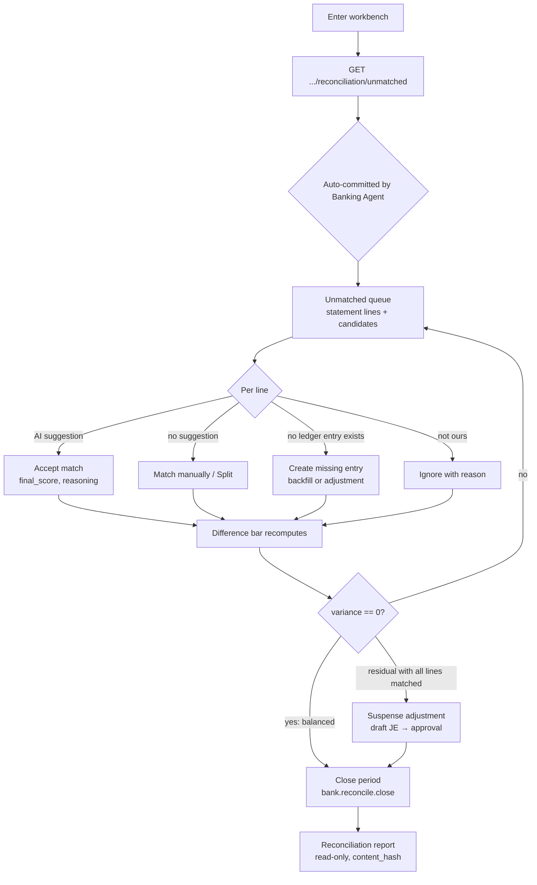

# Bank Reconciliation Flow — QAYD Frontend
Version: 1.0
Status: Design Specification
Module: Frontend
Submodule: Flows / BANK_RECONCILIATION
---

# Purpose

This document specifies the end-to-end journey of **reconciling one bank account against the ledger** — the
work of proving that QAYD's book record of an account agrees, line for line, with the bank's own statement,
and formally closing that agreement for a period. It is a *flow* document spanning the reconciliation
workbench, the statement-import path that feeds it, and the Journal Entries approval surface it hands
adjustments to; it does not re-specify any of those screens, it links out. The workbench itself is owned by
[`../BANK_RECONCILIATION.md`](../BANK_RECONCILIATION.md); the AI matching engine and confidence rules are
owned by [`../../ai/workflows/BANK_RECONCILIATION.md`](../../ai/workflows/BANK_RECONCILIATION.md); every
endpoint, permission key, and status enum named here is restated from those and from
[`../../accounting/BANKING.md`](../../accounting/BANKING.md) only to make the journey legible. Where this
document appears to contradict one of them on a fact, that is a defect to resolve in review, never a
decision an engineer makes in code.

Reconciliation in QAYD is a **five-stage loop with a human at the close**: statement lines arrive, the
Banking Agent's deterministic-plus-AI matching sweep auto-commits the confident ones, a human works the
unmatched queue (accepting suggestions, matching manually, splitting, ignoring, or creating the missing
ledger entry), the running variance is driven to exactly zero, and a Finance Manager signs the period
`closed`. The frontend owns none of this logic: it never computes the variance, never decides a match is
good enough to auto-commit, never posts a journal line. It renders the queue, stages a human's proposed
match, and hands each commit to the API — which holds a row lock, re-validates, and is the sole authority
on whether the match, the adjustment, or the close may proceed.

# Actors & Preconditions

| Actor | Role in this flow |
|---|---|
| Finance Manager / CFO / Owner | Works the queue *and* closes/reopens the period — holds `bank.reconcile`, `bank.reconcile.close`, and (rarely) `bank.reconcile.reopen`. |
| Senior Accountant | Enters the workbench and works matches (`bank.reconcile`); can propose adjustments and match/split/ignore, but **cannot close** the period. Approves the adjustment journal entry (`accounting.journal.approve`). |
| Accountant | Matches and stages candidates (`bank.reconcile`); does not close. |
| Auditor / External Auditor / Read Only | View a closed reconciliation and its report fully read-only; every mutating control is omitted. |
| AI service account (Banking Agent, General Accountant, Treasury Manager, Fraud Detection, Document AI) | Participate *inside* the flow — matching, drafting adjustments, flagging duplicates/fraud — but are **structurally barred** from `bank.reconcile.close`, `bank.reconcile.reopen`, and from posting any journal line. No agent both proposes and approves the same artifact. |

**Preconditions.** The user holds `bank.reconcile` (stricter than the Banking screen's own `bank.read`; the
workbench is not reachable on `bank.read` alone). The account exists and is `active` with a non-null
`gl_account_id` (established by [`BANK_CONNECTION_FLOW.md`](./BANK_CONNECTION_FLOW.md)). At least one
statement's worth of `bank_statement_lines` has been ingested for the current period — an empty workbench
reconciles trivially (see **Edge Cases**). The preceding period's reconciliation is not in a state that
blocks the current one.

# Entry Points

| Entry point | Screen / control | Gate |
|---|---|---|
| **"Reconcile"** row action on a `BankAccountCard` | [`../screens/BANKING_SCREEN.md`](../screens/BANKING_SCREEN.md) → Account rail | `bank.reconcile` (omitted if absent) |
| **"Reconcile"** action on a transaction row | Banking transactions table | `bank.reconcile` |
| **"Go to Reconciliation"** at the end of a statement import | Import dialog summary ([`BANK_CONNECTION_FLOW.md`](./BANK_CONNECTION_FLOW.md) Step 8) | `bank.reconcile` |
| **Discrepancy notification** (`bank.reconciliation.discrepancy_detected`, fired T+2 proactively) | Topbar bell | `bank.reconcile` |
| **Direct / bookmarked URL** `?reconciliation_id=` for a specific historical period | Address bar | `bank.reconcile`; a closed period opens read-only |

All resolve to the same route, `app/(app)/banking/reconciliation/[bankAccountId]/page.tsx` — keyed by the
**account**, not by a reconciliation id, because a Finance Manager thinks "reconcile NBK Operating," not
"open reconciliation #4103." A specific period is addressed with a `?reconciliation_id=` query param on that
same route, never a second dynamic segment.

# Flow Overview



The loop (D→E→J→K→D) repeats until `variance == 0` (status `balanced`) or an explained residual is
suspensed; only then does the human close.

# Step-by-Step

Every ledger-state mutation in this flow is **pessimistic** — no `onMutate`, the UI shows "matched" only
after the server's `2xx` — because a match, an adjustment, and a close each change the account's
authoritative reconciled state, and the server holds a row lock the client cannot see (per
[`../BANK_RECONCILIATION.md`](../BANK_RECONCILIATION.md) and the platform's Principle 10). Every mutation
carries an `Idempotency-Key` via `useIdempotencyKey`.

### Step 1 — Enter the workbench

- **Screen / route:** `banking/reconciliation/[bankAccountId]/page.tsx`
  ([`../BANK_RECONCILIATION.md`](../BANK_RECONCILIATION.md)), a full-bleed workbench.
- **User action:** clicks "Reconcile" (or arrives via any entry point above).
- **UI state:** the page resolves the account's current open period, renders the Match / Exceptions /
  History tabs, the `ReconciliationDifferenceBar` at the top, and the two-pane `ReconciliationMatchBoard`
  (statement lines ↔ transaction candidates). A `StatusPill` shows the reconciliation status.
- **API call:** `GET /api/v1/banking/bank-accounts/{id}/reconciliations` (`bank.read`) resolves the current
  period, then `GET /api/v1/banking/bank-accounts/{id}/reconciliation/unmatched` (`bank.reconcile`) — the
  workbench's primary payload: unmatched statement lines, unmatched transactions, and every AI candidate/score
  pair.
- **Success branch:** the queue renders; Step 2.
- **Failure branch:** a cross-tenant `?reconciliation_id=` resolves to `404` (never `403`); a missing period
  renders the "nothing to reconcile yet" empty state with an "Import statement" CTA.

### Step 2 — Read what the Banking Agent already committed

- **Screen / route:** same workbench, Match tab.
- **User action:** none — orientation. The confident matches are already done.
- **UI state:** lines the Banking Agent auto-committed (`final_score ≥ 90` **and** at least one deterministic
  rule scoring `≥ 30`) show as `matched` with a `match_method: 'auto_rule'` label and a provenance dot; they
  are *not* in the working queue. The difference bar already reflects them. Suggestions below the auto-commit
  threshold, and lines with no candidate, are what remain.
- **API call:** none beyond Step 1's payload.
- **Success branch:** Step 3.

### Step 3 — Work an unmatched line (the loop)

For each remaining statement line the user chooses one of four resolutions:

**3a — Accept an AI suggestion.**
- **User action:** reviews a suggested candidate's `final_score`, its `reasoning_factors`
  (`exact_reference_match`, `amount_date_exact`, `fuzzy_counterparty`, `recurring_pattern`, `ai_similarity`),
  and clicks **Accept**.
- **UI state:** the candidate card shows a `ConfidenceBadge` and a `ReasoningDisclosure` listing which rules
  fired and which fell short; below-60% candidates are hidden behind a "Show hidden (<60%)" toggle.
- **API call:** `POST /api/v1/banking/reconciliation-matches` (`bank.reconcile`) with
  `match_method: 'ai_suggested_accepted'`.
- **Success:** the line → `matched`, the transaction → `reconciled`; the difference bar recomputes.
- **Failure:** `409 ALREADY_MATCHED` — the line was matched by someone else between load and click; the
  client refetches and toasts "This line was just matched by someone else," and the row re-locks.

**3b — Match manually / split.**
- **User action:** stages one or more statement lines and one or more transactions in the `MatchTray`
  (a `useMatchStaging` Zustand store — client-only UI state, never sent as a trusted value), then commits. A
  many-to-one (POS batches → one deposit) or one-to-many is a **split** with an allocation editor confirming
  which transaction covers which portion.
- **API call:** `POST /api/v1/banking/reconciliation-matches` with
  `{ statement_line_ids: number[], bank_transaction_ids: number[], match_method: 'manual' | 'split' }`
  (validated by `commitMatchSchema`).
- **Success / failure:** as 3a; a two-sided race resolves server-side to exactly one committed match via
  `SELECT ... FOR UPDATE`, the loser getting `409`.

**3c — Create the missing ledger entry.**
- **User action:** a statement line with no counterpart (a bank fee, interest earned, a receipt never
  recorded) → "Create entry." For a known recurring pattern the Banking Agent has *already* drafted the entry
  (e.g. a monthly maintenance fee, `ai_confidence` ~0.98) and the user accepts the backfill in one step; for
  an unknown one the user proposes an adjustment.
- **API call:** `POST /api/v1/banking/bank-transactions` (`bank.reconcile`) creating a `fee` /
  `interest_earned` / `profit_distribution` / `adjustment` transaction (validated by `proposeAdjustmentSchema`
  — `transaction_type`, `amount`, `account_code`, mandatory `adjustment_reason`), then the accept path
  commits the match. The General Accountant drafts the corresponding journal entry `status='draft'`,
  `entry_type='ai_generated'` — it is **never** posted here; it routes to the Journal Entries approval chain.
- **Success:** the new transaction matches the line; the draft JE appears as an inline `ApprovalCard`
  (`kind="journal_entry"`) for `accounting.journal.approve`.
- **Failure:** `SOURCE_DOCUMENT_DELETED` if a referenced source doc was soft-deleted before the proposal
  applied — the line re-swept as unmatched.

**3d — Ignore the line.**
- **User action:** "No matching transaction exists / not ours" → provides a reason.
- **API call:** `PATCH /api/v1/banking/bank-statement-lines/{id}` (`bank.reconcile`) with
  `{ status: 'ignored', ignore_reason }` (`ignoreLineSchema`).
- **Success:** line → `ignored`, out of the queue and out of the variance.

After each resolution the `ReconciliationDifferenceBar` recomputes server-side and re-renders; the loop
continues until the queue is clear or a residual remains.

### Step 4 — Drive the variance to zero

- **Screen / route:** the difference bar, always visible atop the workbench.
- **User action:** works the queue until the bar reads exactly `0.000`.
- **UI state:** the bar shows `bank_closing_balance`, `outstanding_deposits`, `outstanding_withdrawals`,
  `adjusted_bank_balance`, `book_balance_at_period_end`, and the live `variance`. Server formula:
  `adjusted_bank_balance = bank_balance_at_period_end + outstanding_deposits − outstanding_withdrawals`;
  `variance = book_balance_at_period_end − adjusted_bank_balance`.
- **Success:** `variance == 0` → status `balanced` (`bank.reconciled` fires); the Close action arms. This is a
  *system-computed* zero, not yet a human close.
- **Failure / residual branch:** every line matched or ignored but `variance ≠ 0` → status `discrepancy`
  (Step 5).

### Step 5 — Handle a residual variance (discrepancy)

- **Screen / route:** Exceptions tab / an `ExceptionCard`.
- **User action:** reviews the Banking Agent's `bank_reconciliation_adjustment_proposal` (deliberately
  low-confidence, e.g. `confidence_score: 41` — a disclosed unknown, not a resolved fact) and, if the residual
  cannot be otherwise explained, accepts a **suspense** entry: the General Accountant drafts an
  `entry_type='adjusting'` JE against `1290 · Suspense — Unreconciled Bank Variance`, carrying a mandatory
  `reconciliation_id` and `adjustment_reason`.
- **API call:** the draft is created server-side; the user approves it through the standard chain — a suspense
  entry requires **both** Senior Accountant and Finance Manager approval, at any amount, via
  `POST /api/v1/accounting/journal-entries/{id}/approve` (`accounting.journal.approve`).
- **Success:** once the suspense entry posts, the residual is accounted for and the period may close as a
  discrepancy explicitly accepted.
- **Failure:** the JE approval is rejected → the residual stands and the period cannot close until resolved.

### Step 6 — Close the period

- **Screen / route:** the workbench header Close action.
- **User action:** clicks **Close** (armed only when `status = 'balanced'`, or when a `discrepancy` is being
  explicitly accepted).
- **UI state:** a confirming `AlertDialog`; when closing a `discrepancy`, the dialog requires an
  `acknowledged_residual_reason` (`closeReconciliationSchema`).
- **API call:** `POST /api/v1/banking/reconciliations/{id}/close` — permission `bank.reconcile.close`
  (Finance Manager tier and above; **never** an AI principal).
- **Success:** status → `closed`; both panes go fully read-only (controls omitted, not merely disabled); a
  persistent "Closed" banner renders; `bank.reconciliation.closed` fires; the reconciliation report becomes
  available with its tamper-evident `content_hash`.
- **Failure:** a concurrent write that changed the balance re-validates server-side and can `409` the close,
  re-opening the state with the now-current variance.

### Step 7 — Review the reconciliation report

- **Screen / route:** the History tab / report view (read-only).
- **User action:** opens the closed reconciliation's report; Auditors and Read-Only roles land here directly.
- **UI state:** the matched set, the difference tie-out, and the audit trail, immutable, with its
  `content_hash`.
- **API call:** `GET /api/v1/banking/bank-accounts/{id}/reconciliations` (list/history) and the closed
  reconciliation detail, cached `Infinity` since a closed period never changes.

# Flow-Specific Guards

Two guards are specific to this flow and worth showing concretely; everything else composes existing
components. The first is the **pessimistic match commit** with server-arbitrated conflict handling — the
single most important correctness property of the workbench, because two people can work the same line at
once:

```tsx
// hooks/banking/use-reconciliation-matches.ts
'use client';

import { useMutation, useQueryClient } from '@tanstack/react-query';
import { api } from '@/lib/api/client';
import { bankReconciliationKeys } from '@/lib/query/keys';
import { useIdempotencyKey } from '@/hooks/use-idempotency-key';
import { useApiToast } from '@/hooks/use-api-toast';
import type { CommitMatchInput } from '@/lib/schemas/bank-reconciliation';

export function useCommitMatch(bankAccountId: number, reconciliationId: number) {
  const qc = useQueryClient();
  const toast = useApiToast();
  const nextKey = useIdempotencyKey();

  return useMutation({
    // no onMutate — the UI shows "matched" only after the server's 2xx (Principle 10).
    mutationFn: (input: CommitMatchInput) =>
      api.post('/banking/reconciliation-matches', input, { idempotencyKey: nextKey() }),
    onSuccess: () => {
      qc.invalidateQueries({ queryKey: bankReconciliationKeys.unmatched(bankAccountId, {}) });
      qc.invalidateQueries({ queryKey: bankReconciliationKeys.detail(reconciliationId) });
      qc.invalidateQueries({ queryKey: bankReconciliationKeys.aiDecisions(reconciliationId) });
    },
    onError: (e) => {
      // 409 ALREADY_MATCHED: the losing writer of a SELECT ... FOR UPDATE race.
      if (e.code === 'ALREADY_MATCHED') {
        qc.invalidateQueries({ queryKey: bankReconciliationKeys.unmatched(bankAccountId, {}) });
        toast.info('This line was just matched by someone else.'); // row re-locks, no full reload
        return;
      }
      toast.fromApiError(e);
    },
  });
}
```

The second is the **close gate** — Close is armed only when the server-computed status is `balanced`, and a
`discrepancy` close demands an explicit acknowledged reason; the button is never a bare "Close?" over a
non-zero variance:

```tsx
// components/banking/reconciliation/close-reconciliation-action.tsx
'use client';

import { Can } from '@/components/auth/can';
import { Button } from '@/components/ui/button';
import type { ReconciliationStatus } from '@/types/banking';

export function CloseReconciliationAction({
  status, onClose,
}: { status: ReconciliationStatus; onClose: (acceptDiscrepancy: boolean) => void }) {
  const balanced = status === 'balanced';
  const discrepancy = status === 'discrepancy';
  return (
    <Can permission="bank.reconcile.close">
      <Button
        size="sm"
        disabled={!balanced && !discrepancy}                 // business-rule disablement, aria-described
        aria-describedby={!balanced && !discrepancy ? 'close-blocked-reason' : undefined}
        onClick={() => onClose(discrepancy)}                  // discrepancy path opens the reason dialog
      >
        {discrepancy ? 'Close with accepted variance' : 'Close period'}
      </Button>
    </Can>
  );
}
```

`Can` omits the control entirely for a role without `bank.reconcile.close` (a lower tier hands off to a
Finance Manager); the `disabled` state above is only ever a *business-rule* disablement (variance not yet
zero), which is why it carries an `aria-describedby` reason rather than being hidden.

# Happy Path

A Senior Accountant opens **NBK Operating** from the Banking rail. The workbench loads 47 statement lines;
the Banking Agent has already auto-committed 44 (`auto_rule`, provenance dots showing). Three remain: one
carries a 96%-confidence suggestion whose `reasoning_factors` show an exact reference match — she clicks
**Accept**; one is a KWD 3.500 monthly maintenance fee the agent has pre-drafted as a known recurring pattern
— she accepts the backfill in one step and the draft fee JE queues for approval; one is a customer receipt
never recorded — she stages it against the deposit line as a **manual** match. The `ReconciliationDifferenceBar`
ticks to `variance: 0.000`, status flips to `balanced`, and the Close action arms. Because she cannot close,
she hands off to the Finance Manager, who reviews the tie-out, clicks **Close**, confirms the dialog, and the
period locks `closed` with its report and `content_hash`. Total human decisions on the three open lines:
accept, accept-backfill, manual-match — plus one approval and one close. Everything else was the agent's and
the server's.

# Alternate & Error Paths

| Path | Trigger | Behavior |
|---|---|---|
| **Zero-line statement** | No lines to reconcile | Tie-out passes trivially; the period closes in one step with `matched_line_count: 0`. |
| **Residual with all lines matched** | `variance ≠ 0`, everything matched/ignored | Suspense adjustment (Step 5); requires two approvals; close as accepted discrepancy. |
| **Below-threshold suggestion** | `final_score < 90` or no deterministic anchor | Shown as suggest-only with the rules that fell short; the human accepts or matches manually — never auto-committed. |
| **AI-similarity-only candidate** | Only the `ai_similarity` sub-signal fired | Capped at ≤10 and never sufficient alone; surfaced but not auto-committed. |
| **Fraud flag on a line's transaction** | `bank.fraud_flag.raised` | Patched in place (`setQueryData`) with a `danger` banner; the block cannot be swiped/clicked past. |
| **Duplicate suspected** | `bank.duplicate_suspected` (≥95) | Blocking `AlertDialog`; typed override reason logged to `audit_logs`. |
| **Late transaction dated inside a closed period** | Arrives after close | Lands in the *next* open period tagged `crosses_closed_period: true`; never silently backdated into the closed one. |
| **FX rate unavailable** | Cross-currency delta needs a rate | Match commits on deterministic signals; the delta annotation is blocked with `RATE_UNAVAILABLE`. |
| **Undo after close** | Unmatch clicked on a now-closed period | `409` → toast; the row re-locks without a full reload. |
| **Reopen needed** | A closed period must be corrected | `POST /api/v1/banking/reconciliations/{id}/reopen` (`bank.reconcile.reopen`, Finance Manager only, mandatory `reopen_reason`); if the fiscal period is itself locked, the Journal Entries `accounting.period.reopen` chain runs first. |

# Data & State

## Endpoints across the flow

| Purpose | Endpoint | Permission | Mutation? |
|---|---|---|---|
| Resolve current period / history | `GET /api/v1/banking/bank-accounts/{id}/reconciliations` | `bank.read` | no |
| Workbench payload | `GET /api/v1/banking/bank-accounts/{id}/reconciliation/unmatched` | `bank.reconcile` | no |
| AI candidates / proposals feed | `GET /api/v1/ai/decisions?subject_type=bank_reconciliations&subject_id=` | `bank.reconcile` | no |
| Commit a match (accept / manual / split) | `POST /api/v1/banking/reconciliation-matches` | `bank.reconcile` | yes |
| Unmatch / undo | `DELETE /api/v1/banking/reconciliation-matches/{id}` | `bank.reconcile` | yes |
| Ignore a line | `PATCH /api/v1/banking/bank-statement-lines/{id}` | `bank.reconcile` | yes |
| Create missing transaction / adjustment | `POST /api/v1/banking/bank-transactions` | `bank.reconcile` | yes |
| Approve a drafted adjustment/suspense JE | `POST /api/v1/accounting/journal-entries/{id}/approve` | `accounting.journal.approve` | yes |
| Close the period | `POST /api/v1/banking/reconciliations/{id}/close` | `bank.reconcile.close` | yes |
| Reopen a closed period | `POST /api/v1/banking/reconciliations/{id}/reopen` | `bank.reconcile.reopen` | yes |
| Import a statement (feeds the queue) | `POST /api/v1/banking/statement-imports` | `bank.reconcile` | yes |

## Query keys & invalidations

`bankReconciliationKeys`: `current(bankAccountId)`, `detail(reconciliationId)`,
`unmatched(bankAccountId, filters)`, `history(bankAccountId)`, `aiDecisions(reconciliationId)`. Cache tuning:
the `unmatched` payload is `staleTime: 0` and kept fresh by realtime invalidation; the account header is
30s; a `closed` reconciliation and History are `Infinity`; the AI-decisions feed is 10s with
`refetchOnWindowFocus: true`. On every match/unmatch/ignore/adjustment success, `unmatched(bankAccountId)`,
`detail(reconciliationId)`, and `aiDecisions(reconciliationId)` invalidate; on close, all three plus the
Banking screen's `bankingKeys.accounts()`/`cashPosition()` invalidate.

## Realtime & concurrency

| Channel | Events | Effect |
|---|---|---|
| `private-company.{id}.banking.reconciliation.{bank_account_id}` | `bank.statement.imported`, `bank.synced`, `bank.reconciled`, `bank.reconciliation.closed`, `bank.fraud_flag.raised`, `bank.duplicate_suspected` | Invalidate `unmatched`/`detail`/`aiDecisions`; `bank.synced` drives an import toast; `bank.fraud_flag.raised` / `bank.duplicate_suspected` patch in place (`setQueryData`) for an immediate blocking banner. |
| `private-company.{id}.notifications.{user_id}` | `bank.reconciliation.discrepancy_detected`, `journal.posted` (this reconciliation's adjustment) | Topbar bell and the discrepancy entry point. |

Concurrency is **pessimistic and server-arbitrated**: match commits are wrapped in `SELECT ... FOR UPDATE`
on the statement-line row; the losing writer gets `409 ALREADY_MATCHED`, discards its proposal, refetches,
and toasts. The `useMatchStaging` tray is client-only UI state, never a trusted server value, cleared on
unmount (switching accounts is a full route change).

# AI Touchpoints

Every AI element obeys the confidence + reasoning + human-in-loop contract; **nothing auto-commits except the
Banking Agent's deterministic auto-match, which has already happened before the user arrives** and is
displayed as a fact (a `reconciled` row with a provenance dot), never a pending button.

| Agent | Touchpoint | Contract |
|---|---|---|
| Banking Agent (`banking_agent`, child of Treasury Manager) | The matching sweep, auto-commit, known-pattern fee/interest drafts, duplicate flags, adjustment proposals | Auto-commit requires `final_score ≥ 90` **and** a deterministic rule `≥ 30`; below that is suggest-only with rules shown. Never posts a journal line. |
| Treasury Manager (`TREASURY_AGENT`) | Contributes the capped AI-similarity sub-signal | Cited only inside a match's `reasoning_factors`; never a standalone on-screen actor; the sub-signal (≤10) is never sufficient alone. |
| General Accountant (`general_accountant`) | Drafts adjustment/suspense/FX journal entries | Always `status='draft'`, `entry_type IN ('ai_generated','adjusting')`; **never** submits/approves/posts — a human does, under `accounting.journal.approve`. |
| Fraud Detection (`fraud_detection`) | Cross-transaction screen | Opens a `fraud_case`, may request a hold; never resolves it; a hold is a non-dismissible `danger` banner. |
| Document AI / OCR Agent | PDF statement extraction (import path) | Per-field ≥95% floor; sub-floor fields go to human review. |

`AIProposalPanel` here always renders `autonomyLevel="suggest_only"` — **the "Do it" execute button never
renders in the reconciliation workbench.** The three confidence scales in play (`final_score`/`rules_fired`
0–100 which *gates* auto-commit; `ai_decisions.confidence_score` 0–100 for *presentation* only;
`fraud_signals.risk_score` 0.000–1.000) are deliberately kept distinct and never collapsed into one number.

# Permissions

| Step | Permission | If absent |
|---|---|---|
| Enter the workbench | `bank.reconcile` | The "Reconcile" action is omitted from the Banking screen; a direct hit renders the shell `403`. Stricter than `bank.read`. |
| View the account header / history | `bank.read` | History (mere period existence/status) is ordinary read info, narrower than the working surface. |
| Accept / manual-match / split / ignore / propose adjustment | `bank.reconcile` | Each action omitted; the queue renders read-only. |
| Approve a drafted adjustment/suspense JE | `accounting.journal.approve` | Inline `ApprovalCard` renders read-only; the entry waits for an approver. |
| Close the period | `bank.reconcile.close` | Close omitted; the workbench can reach `balanced` but a lower-tier user hands off to a Finance Manager. Never held by any AI principal. |
| Reopen a closed period | `bank.reconcile.reopen` | Reopen omitted; rarer than close, mandatory reason; if the fiscal period is locked, `accounting.period.reopen` runs first. |

# i18n & RTL

- Every workbench string, status label, match-method label (`Auto-matched`, `AI-suggested, accepted`,
  `Matched manually`, `Split match`), and dialog is keyed in both `en.ts` and `ar.ts`; Arabic is
  professionally authored, never machine-translated. AI-authored `reasoning` text arrives already localized
  from the API's content-negotiation contract — this flow localizes only chrome, never the model's words.
- The two-pane match board mirrors under `dir="rtl"` via logical properties; the panes swap reading order
  without flow-specific code.
- **Amount columns and the difference bar's figures use fixed `text-right` in both directions** (the
  platform's documented Exception A) so a bilingual finance team scans magnitude and decimal alignment on the
  same edge regardless of language; numerals, currency codes, and IBAN fragments render `dir="ltr"` /
  `unicode-bidi: isolate` and never in Eastern Arabic-Indic digits.

| Context | English | Arabic |
|---|---|---|
| Status | Balanced | متوازن |
| Status | Discrepancy | فرق |
| Action | Accept | قبول |
| Action | Match manually | مطابقة يدوية |
| Action | Close period | إغلاق الفترة |
| Difference | Variance | الفرق |

# Accessibility

- The match board is keyboard-operable end to end: staging a line and a candidate into the tray, committing,
  and undoing are all reachable without a mouse; the tray's staged selection is announced as it changes.
- Realtime match/patch updates announce via `aria-live="polite"`; a **fraud hold announces assertively**
  (`role="alert"`) because it blocks a task an approver is mid-review of.
- Every `ConfidenceBadge` dot is `aria-hidden`; an adjacent real text node carries the score and reasoning —
  never a bare progress-bar width. The `ReasoningDisclosure` is a real, focusable, Esc-dismissible control.
- A permission-gated Close renders *omitted* for a lower tier; where a control is disabled by a *business
  rule* (Close disabled while `variance ≠ 0`) it carries an `aria-describedby` explaining why, textually
  distinct from a permission disablement.
- The mandatory reason fields (ignore, adjustment, discrepancy acknowledgment, reopen) are real required
  inputs with associated labels; the close confirming dialog traps focus per Radix standard and returns it on
  close.

# Edge Cases

| Edge case | Behavior |
|---|---|
| **Abandonment mid-session** | The `useMatchStaging` tray is ephemeral client state; leaving discards only un-committed staging, never a committed match. Committed matches persisted server-side survive. |
| **Resume** | Re-entering the workbench refetches `unmatched` and re-derives the difference bar from server truth; there is no local "in-progress reconciliation" to restore beyond what the server holds. |
| **Back-button** | Tabs and `?reconciliation_id=`/`?tab=` are URL state, so back navigates period/tab deep-links correctly; the staging tray does not participate in history. |
| **Partial close** | A period cannot be "half closed" — Close is atomic and armed only at `balanced` or on an explicitly-acknowledged discrepancy; a residual left unexplained simply keeps the period open. |
| **Double-submit** | The Close/match controls disable on first click; every commit carries an `Idempotency-Key`; a duplicate is a no-op. |
| **Concurrent edit — two users match the same line** | `SELECT ... FOR UPDATE` server-side; the loser gets `409 ALREADY_MATCHED`, refetches, and toasts "matched by someone else"; exactly one match commits. |
| **Concurrent edit — one closes while another matches** | The match against a just-closed period `409`s and the row re-locks; the closer's action wins. |
| **Internal transfer on both accounts' statements** | One `transfers` row with two legs (`from_transaction_id`/`to_transaction_id`); each leg matches independently on its own account, never double-counted. |
| **Cross-tenant `?reconciliation_id=`** | Resolves `404`, never `403`, so a bookmarked id from another company leaks nothing. |
| **Source doc deleted before a proposal applies** | `SOURCE_DOCUMENT_DELETED`; the line is re-swept as unmatched rather than committing a stale match. |

# End of Document
