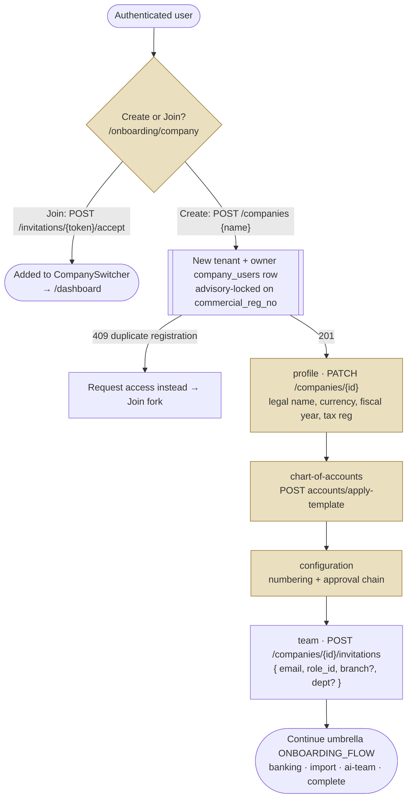

# Create Company Flow — QAYD Frontend
Version: 1.0
Status: Design Specification
Module: Frontend
Submodule: Flows / CREATE_COMPANY
---

# Purpose

This document specifies the end-to-end journey of standing up a new company (tenant) in QAYD: from the moment
an authenticated user chooses to create one, through capturing its legal and fiscal identity, seeding its Chart
of Accounts, configuring its numbering and approval basics, and inviting its first team members with roles —
to the moment the tenant boundary is fully established and the company becomes operational. It is a **flow**
document, and it stands in a deliberate, stated relationship to two others: [`./ONBOARDING_FLOW.md`](./ONBOARDING_FLOW.md)
is the umbrella first-run journey that *contains* company creation as its Create fork (steps 1–5), and
[`../ONBOARDING.md`](../ONBOARDING.md) is the authoritative *screen* specification for the eight step routes
those steps render on. This document is the **company-and-tenant lens** on that same territory: it re-specifies
none of the pixels [`../ONBOARDING.md`](../ONBOARDING.md) owns, and it does not re-narrate the whole onboarding
wizard [`./ONBOARDING_FLOW.md`](./ONBOARDING_FLOW.md) owns; it isolates the concerns that are specifically about
*creating a company* — the company-information contract, the `X-Company-Id` multi-tenant boundary, the
`company_users` membership model, the first-company-vs-additional-company difference, and the RBAC-carrying team
invitation — and treats the rest by reference.

The precedence rule matches every document in this platform. Where this flow is silent on a screen-level fact,
[`../ONBOARDING.md`](../ONBOARDING.md) governs; where it is silent on the data model or the tenant boundary,
[`../../foundation/COMPANY_STRUCTURE.md`](../../foundation/COMPANY_STRUCTURE.md) and
[`../../database/MULTI_TENANCY.md`](../../database/MULTI_TENANCY.md) govern; where it is silent on the
permission grammar, [`../../foundation/PERMISSION_SYSTEM.md`](../../foundation/PERMISSION_SYSTEM.md) governs. A
contradiction on a fact — an endpoint, a header name, a permission key — is a defect to reconcile in review,
never a decision resolved in code. This document's own additive contribution is the **tenant-establishment
map**: the one place that shows how a `POST /companies` becomes a scoped, isolated, member-populated tenant the
rest of the product then trusts.

Two constraints, restated for this journey, inherited from [`../README.md`](../README.md) and
[`../ONBOARDING.md`](../ONBOARDING.md):

1. **The frontend computes nothing about the tenant boundary.** Which company a request acts as is the
   `X-Company-Id` header the server re-resolves and re-validates on *every* request against the caller's
   `company_users` membership; the client never caches a resolved `company_id` as authority
   ([`../../database/MULTI_TENANCY.md`](../../database/MULTI_TENANCY.md)). Company creation collects a validated
   choice and submits it; the server owns isolation, the default-company invariant, and every membership check.
2. **RBAC is reflected here, and here it defines a company's very first roles.** Creating a company makes the
   caller its Owner; inviting members assigns each a `role_id` that becomes their `company_users` role — the
   first RBAC decisions in the tenant's life, enforced server-side on the invite endpoint regardless of what
   the wizard shows.

# Actors & Preconditions

| Actor | Description |
|---|---|
| **New Owner** | An authenticated, email-verified user creating their first company; becomes `owner_user_id` and the sole `company_users` row until they invite others. |
| **Serial Owner** | An existing member of one or more companies creating an additional one via the `CompanySwitcher`'s `+ Add a company`; arrives with `user` already resolved. |
| **Delegated setup partner** | Holds `company.onboarding.manage` and finishes configuration on an Owner's behalf; can configure steps 2–5 but the created company's `owner_user_id` remains the original Owner. |
| **Invitee (downstream)** | A person the Owner invites at the team step; not present during creation, but the RBAC and membership rows created here define their eventual access. |

| Precondition | Requirement |
|---|---|
| A valid session | `POST /api/v1/companies` succeeds for any authenticated user ([`../ONBOARDING.md → Access rules`](../ONBOARDING.md)); creation is how a user *becomes* an Owner, so no company-scoped permission exists yet. |
| Email verified | Per [`../../foundation/AUTHENTICATION.md`](../../foundation/AUTHENTICATION.md), "unverified users cannot create companies." |
| The onboarding shell | Company creation renders inside the `/onboarding` route group's Wizard Template ([`../ONBOARDING.md → Layout & Regions`](../ONBOARDING.md)) — no persistent Sidebar/Topbar until the tenant is operational. |

# Entry Points

| Entry point | Lands on | Notes |
|---|---|---|
| First sign-in with zero companies | `/onboarding/company` (Create fork) | The login flow's onboarding gate routes a company-less session here ([`./LOGIN_FLOW.md → Step 6`](./LOGIN_FLOW.md)). |
| `+ Add a company` in the Topbar `CompanySwitcher` | `/onboarding?intent=new-company` | A serial Owner; arrives with `user` resolved, skips anything account-level, runs the same Create fork. |
| `+ Add a company` row on `/select-company` | `/onboarding?intent=new-company` | The full-page company picker's exit into this flow ([`./LOGIN_FLOW.md → Step 4`](./LOGIN_FLOW.md)). |
| Duplicate-registration deflection | `/onboarding/company` (Join fork) | A `409` on a commercial-registration collision routes the user toward "request access instead" — the invitation path, not a duplicate tenant (`# Alternate & Error Paths`). |

# Flow Overview

Company creation is the Create fork of onboarding: one required company-identity spine (steps 1–4) plus the
team-invitation step (5), after which the tenant is member-populated and the umbrella onboarding flow continues
to its optional steps and completion. Every *node* is a step route owned by [`../ONBOARDING.md`](../ONBOARDING.md);
this document owns the tenant-establishment arrows between them.



Numbered step map:

1. **Choose Create** — `POST /companies` mints the tenant and the Owner's `company_users` row.
2. **Company details** — `PATCH /companies/{id}` captures the full legal/fiscal identity.
3. **Chart of Accounts** — `apply-template` seeds the ledger the tenant is measured against.
4. **Initial settings** — numbering patterns and a starter approval chain.
5. **Invite team** — the first `company_users` memberships beyond the Owner, each carrying a role.

# Step-by-Step

Every endpoint, field, and error code below is drawn from [`../ONBOARDING.md`](../ONBOARDING.md),
[`../../foundation/COMPANY_STRUCTURE.md`](../../foundation/COMPANY_STRUCTURE.md), and
[`../../database/MULTI_TENANCY.md`](../../database/MULTI_TENANCY.md).

## Step 1 — Create the tenant

| | |
|---|---|
| **Route** | `/onboarding/company` (Create fork) — [`../ONBOARDING.md → Interactions & Flows`](../ONBOARDING.md) |
| **User action** | Choose "Create a new company," type a company name, Continue. |
| **UI state** | A single required field (name); "Continue" disabled until it validates, with an inline reason rather than a bare disabled button. |
| **API call** | `POST /api/v1/companies` `{ name }` minimum; the caller becomes `owner_user_id`; returns the new `company_id` every later step is scoped to. Then `PATCH /api/v1/onboarding/progress` `{ step: 'company', status: 'completed', payload: { mode: 'create', company_id } }`. |
| **Server side** | Creation is wrapped in a transaction guarded by `pg_advisory_xact_lock(hashtext(commercial_reg_no))` and inserts the Owner's `company_users` row; `companies.status` defaults to `trial`, `max_users` to 5, `max_branches` to 1 ([`../../database/MULTI_TENANCY.md`](../../database/MULTI_TENANCY.md)). |
| **Success** | The Progress Rail paints the full eight-step Create path; the `private-company.{id}.onboarding` channel opens; advance to step 2. |
| **Failure — duplicate registration** | `409 Conflict` — the company may already be registered; the UI routes the user into the "request access instead" (invitation) path rather than creating a duplicate tenant (`# Alternate & Error Paths`). |

## Step 2 — Company details

| | |
|---|---|
| **Route** | `/onboarding/profile` — [`../ONBOARDING.md → Interactions & Flows`](../ONBOARDING.md) |
| **User action** | Complete the full company-information field set, grouped into three visual clusters (Identity, Locale & Fiscal, Registration). |
| **Fields** | Company Name (pre-filled from step 1), Legal Name, Country, City, Currency (KWD default), Language, Timezone, Fiscal Year (start month), Tax System, Industry, Company Size, Logo (optional), Business Registration Number, Tax Registration Number — the [`../../foundation/COMPANY_STRUCTURE.md → Company Information`](../../foundation/COMPANY_STRUCTURE.md) set. |
| **UI state** | Country, Currency, Timezone are `Combobox` pickers over static reference lists (no per-keystroke network call); selecting Country auto-suggests a matching Currency and Timezone (Kuwait → KWD → `Asia/Kuwait`) as an overridable pre-fill, never a locked value. |
| **API call** | `PATCH /api/v1/companies/{id}` with the full payload (the same endpoint Settings → Company later reuses — nothing here is onboarding-specific), then `PATCH .../progress`. |
| **Success** | The company record is the durable copy; the progress record is bookkeeping on top of it. Advance to step 3. |
| **Failure** | `422` field errors map onto each field via the standard `useApiToast().fromApiError` pattern. |

> The base currency (KWD default) and the fiscal-year start captured here become the baseline every future
> journal entry in the company's life is measured against — which is why [`../ONBOARDING.md`](../ONBOARDING.md)
> calls this "the single highest-consequence data-entry surface in the product." The frontend validates
> presence and format to fail fast; the server re-validates unconditionally.

## Step 3 — Seed the Chart of Accounts

| | |
|---|---|
| **Route** | `/onboarding/chart-of-accounts` — [`../ONBOARDING.md → Interactions & Flows`](../ONBOARDING.md) |
| **User action** | Pick a Country template (pre-selected from step 2's Country: Kuwait → `KW_STANDARD`, with `SA_STANDARD`/`AE_STANDARD` available) and optionally an Industry template, review the live preview, click "Create my Chart of Accounts." |
| **API calls** | `GET /api/v1/accounting/accounts/templates` on mount; a debounced read-only preview; `POST /api/v1/accounting/accounts/apply-template` `{ country_template, industry_template? }` on confirm. |
| **UI state** | The one step whose primary action is a financially consequential write — several hundred rows cloned transactionally, targeting under five seconds ([`CHART_OF_ACCOUNTS.md`](../../accounting/CHART_OF_ACCOUNTS.md) G1). A confirming inline summary ("This will create 214 accounts under KW_STANDARD + RETAIL — you can rename or add accounts afterward") sits above the button. |
| **Success** | Advance to step 4. |
| **Failure** | `409 ACCOUNTS_ALREADY_POSTED` if the company already has posted activity (e.g. an opening balance imported first) — renders "manage individual accounts from Settings instead," linking out rather than re-cloning the tree. |

The AI Guide Dock (`GENERAL_ACCOUNTANT`) proposes the industry template with a confidence score; its "Use this"
pre-fills the picker — the owner's own confirm click is what triggers `apply-template` (`# AI Touchpoints`).

## Step 4 — Initial settings

| | |
|---|---|
| **Route** | `/onboarding/configuration` — [`../ONBOARDING.md → Interactions & Flows`](../ONBOARDING.md) |
| **User action** | Adjust the per-document-type numbering patterns (e.g. `JE-{YYYY}-{seq:5}` → previewed live as "JE-2026-00001") and pick a starter approval-chain preset ("Single approver," "Two-tier (Finance Manager → CFO)," or "None yet — configure later"). |
| **API call** | `PATCH .../progress` with the numbering + approval payload; the numbering sequences and approval chains are the company's own records. |
| **UI state** | Both sub-sections pre-fill from `APPROVAL_ASSISTANT`'s suggestion keyed to the company Size captured in step 2 (a Freelancer/Startup gets a single-approver default; an Enterprise/Holding gets the two-tier chain); both remain fully editable. |
| **Success** | The last of the four required Create-branch steps; completing it makes the skippable nodes 5–7 individually clickable. |
| **Failure** | An invalid numbering-pattern token surfaces inline beneath the live preview, not as a toast, so the correction target is obvious. |

## Step 5 — Invite team members with roles

| | |
|---|---|
| **Route** | `/onboarding/team` — [`../ONBOARDING.md → Interactions & Flows`](../ONBOARDING.md) |
| **User action** | Add up to 20 rows of `{ email, role, branch?, department? }` and click "Send invitations." |
| **API calls** | `GET /api/v1/roles` populates each Role picker; `POST /api/v1/companies/{id}/invitations` `{ invitations: [{ email, role_id, branch_id?, department_id? }] }` sends the whole batch (partial-success); `GET /api/v1/companies/{id}/invitations`, `.../resend`, `DELETE .../{invitationId}` feed and manage the live status column. |
| **UI state** | Branch/Department pickers only render once the company has more than one of each (a brand-new single-branch company never shows an empty picker); the Role picker offers the platform default set (`Owner, CEO, CFO, Finance Manager, Senior Accountant, Accountant, Auditor, HR Manager, Payroll Officer, Inventory Manager, Warehouse Employee, Sales Manager, Sales Employee, Purchasing Manager, Purchasing Employee, Read Only, External Auditor`). |
| **Server side** | Each invitation inserts a `company_users` row at `status = 'invited'` with `invited_by`/`invited_at` set and the chosen `role_id`; the row grants **zero access until `accepted_at`** is set via an emailed, single-use, time-limited acceptance token ([`../../database/MULTI_TENANCY.md → Invitations`](../../database/MULTI_TENANCY.md)). |
| **Success** | Invitations sent; the rows that succeeded are not resubmitted on retry; "Skip for now" is available (this step is skippable in the umbrella flow). |
| **Failure** | A partial batch failure (one malformed or already-registered email) reports inline per row via the response's `errors[]`; a fully failed send preserves every drafted row for retry. |

After step 5, control returns to the umbrella [`./ONBOARDING_FLOW.md`](./ONBOARDING_FLOW.md) for the optional
banking/import steps and `POST /onboarding/complete` — which flips `companies.onboarding_status` to `completed`
and makes the tenant fully operational.

# Happy Path

1. A first-time user, routed here by the login flow's onboarding gate, chooses "Create a new company," types
   "Al-Kandari Trading Co.", and Continues. `POST /companies` returns a `company_id`; the Owner's
   `company_users` row exists; the Progress Rail paints the Create path.
2. **Company details** — Country: Kuwait → Currency KWD and Timezone `Asia/Kuwait` pre-fill; the Owner fills
   Legal Name, Tax Registration Number, Industry (Retail), Company Size (SME). Continue → `PATCH /companies/{id}`.
3. **Chart of Accounts** — `GENERAL_ACCOUNTANT` suggests `KW_STANDARD + RETAIL` at 92%; the Owner uses it,
   reviews the 214-account preview, and clicks "Create my Chart of Accounts." `apply-template` returns in <5s.
4. **Initial settings** — the Owner keeps the size-appropriate numbering pattern and single-approver chain.
5. **Invite team** — the Owner adds a Senior Accountant and an Auditor with roles and sends invitations; both
   land as `invited` `company_users` rows awaiting acceptance.
6. Control returns to the umbrella onboarding flow; the tenant is now identity-complete, ledger-seeded, and
   member-populated — a real, isolated company the `X-Company-Id` boundary can scope every future request to.

# Alternate & Error Paths

| Path | Trigger | Behavior |
|---|---|---|
| **Duplicate registration** | `POST /companies` collides on `commercial_reg_no` (advisory-locked) | `409 Conflict`; the UI surfaces "this company may already be registered — request access instead" and routes to the Join fork's invitation path rather than minting a duplicate tenant ([`../../database/MULTI_TENANCY.md`](../../database/MULTI_TENANCY.md)). |
| **Additional company** | Entered via `?intent=new-company` from an existing session | The Create fork runs identically; on umbrella completion the new company is appended to the user's `CompanySwitcher` list, and switching into it is a fresh `X-Company-Id` header change, not a re-login (`# First-company vs additional-company`). |
| **Template change after activity** | Re-applying a template after opening balances exist | `409 ACCOUNTS_ALREADY_POSTED`; "manage individual accounts from Settings instead." |
| **Delegated setup, ownership transferred mid-flow** | A delegate's `company.onboarding.manage` is revoked | The next `PATCH .../progress` returns `403`; the step renders "This company's setup is being finished by someone else." |
| **Partial invitation batch** | One bad email in a multi-row send | Per-row inline errors; successful rows are not resubmitted on retry. |
| **Invite an email already in another QAYD company** | The address belongs to a user elsewhere | `POST .../invitations` succeeds regardless — a single user may hold memberships in many companies; acceptance simply adds this company to their switcher list. |
| **Last-Owner protection (later)** | Attempting to remove the last active Owner membership | `409`; `DELETE /company-users/{id}` and self-service "leave company" both refuse to remove the last active Owner ([`../../database/MULTI_TENANCY.md`](../../database/MULTI_TENANCY.md)) — relevant to the tenant's later lifecycle, noted here because it is the invariant this flow's membership rows must respect. |

# Data & State

## Endpoints traversed across the whole flow

| Purpose | Endpoint | Permission | Owning doc |
|---|---|---|---|
| Create the tenant | `POST /api/v1/companies` | Session only | [`../ONBOARDING.md`](../ONBOARDING.md) (full CRUD deferred to a future `COMPANIES_API.md`) |
| Company details | `PATCH /api/v1/companies/{id}` | Ownership rule | ONBOARDING |
| List the user's companies | `GET /api/v1/me/companies` | self | [`../../database/MULTI_TENANCY.md`](../../database/MULTI_TENANCY.md) |
| List / apply CoA templates | `GET .../accounts/templates`, `POST .../accounts/apply-template` | `accounting.accounts.read` / `.create` | [`../../accounting/CHART_OF_ACCOUNTS.md`](../../accounting/CHART_OF_ACCOUNTS.md) |
| List roles | `GET /api/v1/roles` | Ownership rule | [`../../foundation/PERMISSION_SYSTEM.md`](../../foundation/PERMISSION_SYSTEM.md) |
| Send invitations | `POST /api/v1/companies/{id}/invitations` | `company.users.invite` | [`../../database/MULTI_TENANCY.md`](../../database/MULTI_TENANCY.md) |
| List/resend/revoke invitations | `GET /api/v1/companies/{id}/invitations`, `POST .../{id}/resend`, `DELETE .../{id}` | `company.users.invite` | MULTI_TENANCY |
| Switch/confirm active company | `POST /api/v1/auth/switch-company` | self, requires a `company_users` row | [`../../api/AUTHENTICATION_API.md`](../../api/AUTHENTICATION_API.md) |

## Worked requests the flow issues

Reproduced so an engineer wiring `CompanyChoiceForm` and `TeamInviteTable` has exact fixtures. The create is
minimal by design — the full identity is captured in the step-2 `PATCH`, not the create.

```json
// POST /api/v1/companies — create the tenant
{ "name": "Al-Kandari Trading Co." }
```

```json
// 201 Created — the caller is now owner_user_id; company_id scopes every later step
{
  "success": true,
  "data": { "id": "cmp_4471", "name": "Al-Kandari Trading Co.", "status": "trial",
            "owner_user_id": "usr_9f21c3", "plan": "trial", "max_users": 5, "max_branches": 1,
            "onboarding_status": "in_progress" },
  "message": "Company created", "errors": [], "meta": { "pagination": null },
  "request_id": "…", "timestamp": "2026-07-16T09:02:11Z"
}
```

```json
// POST /api/v1/companies/cmp_4471/invitations — batched, partial-success
{ "invitations": [
  { "email": "reem@example.com", "role_id": "rol_senior_accountant", "branch_id": null, "department_id": null },
  { "email": "not-an-email",     "role_id": "rol_auditor" }
] }
```

```json
// 207-style partial success — good rows land as `invited` company_users; the bad row reports inline
{
  "success": true,
  "data": { "created": [ { "id": "inv_88a1", "email": "reem@example.com", "status": "invited", "role_id": "rol_senior_accountant" } ] },
  "message": "1 invitation sent, 1 failed",
  "errors": [ { "code": "EMAIL_INVALID", "field": "invitations.1.email", "detail": "not-an-email is not a valid email address." } ],
  "meta": { "pagination": null }, "request_id": "…", "timestamp": "2026-07-16T09:14:03Z"
}
```

A duplicate-registration create instead returns `409 Conflict` (advisory-locked on `commercial_reg_no`), which
the UI turns into the "request access instead" invitation path rather than a raw error.

## The multi-tenant boundary — what the frontend must respect

The tenant boundary this flow *establishes* is enforced on every subsequent request by rules the frontend must
honor but never owns ([`../../database/MULTI_TENANCY.md`](../../database/MULTI_TENANCY.md)):

- **`X-Company-Id` is the acting-company header, re-resolved every request.** Every `/api/v1` call the product
  makes after this flow carries `X-Company-Id` (the company UUID form); the `ResolveTenantCompany` middleware
  re-reads it, re-verifies the caller has an *active, non-revoked* `company_users` row for it, and pins the
  scope — the JWT identifies the user, never the company. `apiFetch` sets this header from the active-company
  context ([`../README.md → Data Fetching`](../README.md)); it is never a value the client caches as authority.

  > **Reconciliation note.** [`../../database/MULTI_TENANCY.md`](../../database/MULTI_TENANCY.md) specifies
  > `X-Company-Id` as the company **UUID**, while [`../README.md`](../README.md)'s `apiFetch` example and the
  > login-flow envelope use opaque `company_id` values like `cmp_4471`. These are the same identifier at two
  > layers of representation; `MULTI_TENANCY.md` is authoritative for the header's wire form. This flow depends
  > only on the shared property: the client sends *an* opaque company id it never interprets, and the server
  > re-validates membership on every request.

- **A missing/unknown/non-member company is a boundary error, surfaced honestly.** Missing header → `400`;
  unknown/archived company → `404`; authenticated-but-not-a-member → `403`. Cross-tenant reads return `404`,
  never `403` — existence-hiding, so a real UUID belonging to another company is indistinguishable from "does
  not exist."
- **Company switch is a header change, not a re-login.** The `CompanySwitcher` (and `/select-company`) call
  `POST /auth/switch-company` for a fresh access token, then `queryClient.clear()` + `router.refresh()`; there
  is no server-side "current company" session state, so a revoked membership loses access on the very next
  request. The client must never retain a resolved `company_id` in a long-lived cookie in place of re-sending
  `X-Company-Id` — the one anti-pattern [`../../database/MULTI_TENANCY.md`](../../database/MULTI_TENANCY.md)
  explicitly rejects.

## The `company_users` membership model

Each membership this flow creates is a `company_users` row ([`../../database/MULTI_TENANCY.md`](../../database/MULTI_TENANCY.md)):

| Column | Relevance to this flow |
|---|---|
| `company_id`, `user_id`, `role_id` | The tenant, the member, and the RBAC role assigned at invite time — the Role picker's selection maps to `role_id`. |
| `status` (`invited` \| `active` \| `suspended` \| `revoked`) | An invitation starts `invited` and grants zero access until `accepted_at`; `switch-company` rejects a `suspended` membership with `403 COMPANY_MEMBERSHIP_SUSPENDED`. |
| `is_default` | Exactly one default company per user, DB-enforced by a partial unique index; `GET /me/companies` returns `is_default`. |
| `invited_by`, `invited_at`, `accepted_at`, `revoked_at` | The invitation lifecycle the team step's status column reflects. |

Note: there is **no `last_active_at` column** on `company_users`; "last active" as the login/select-company flows
describe it is a distinct signal (see the reconciliation note below), and membership suspension is modeled via
`status = 'suspended'`, not a timestamp.

> **Reconciliation note.** [`../screens/LOGIN_SCREEN.md`](../screens/LOGIN_SCREEN.md) and
> [`./LOGIN_FLOW.md`](./LOGIN_FLOW.md) describe a `last_active_at` per membership that suppresses
> `/select-company` on the next login, while [`../../database/MULTI_TENANCY.md`](../../database/MULTI_TENANCY.md)'s
> `company_users` DDL carries no such column. This is a genuine cross-document gap to resolve in review: either
> the column is added, or the "last active" signal lives elsewhere (a side table or `settings` JSONB). This
> flow does not depend on where it lives — only on the behavior both agree on: after a user has entered a
> company once, that company is remembered as their default (`is_default`) and the picker is skipped.

## First-company vs additional-company

| | First company | Additional company |
|---|---|---|
| **Entry** | Login-flow onboarding gate (zero companies) | `+ Add a company` in `CompanySwitcher` / `/select-company` → `?intent=new-company` |
| **`user` context** | Just resolved by the login flow | Already resolved; the Create fork skips anything account-level |
| **Post-completion** | `onboarding_status = completed` → the user's only operational company; Home renders | Appended to the `CompanySwitcher` list; the user switches into it via `POST /auth/switch-company` (a fresh access token scoped to the new `company_id`; the refresh token is *not* reissued) |
| **Default company** | Becomes the user's `is_default` | Does not disturb the existing default unless the user chooses to switch |

There is no separate "first-company onboarding" versus "additional-company" *code path* — a `user` is a global
identity that can hold independent memberships in any number of companies, and the same Create fork serves both;
the difference is entry context and post-completion routing, not a second flow.

## Query keys and invalidation

The onboarding-scoped keys back this flow (`onboardingKeys.{progress, coaTemplates, roles, invitations}` —
[`../ONBOARDING.md → Data & State`](../ONBOARDING.md)). The boundary invalidation is the one that matters most:
on `switch-company` into the newly created company, `queryClient.clear()` discards every prior tenant's cached
data before `router.refresh()` re-fetches under the new `X-Company-Id` — the client-side half of the isolation
the server enforces, ensuring no company A figure ever paints inside company B.

# AI Touchpoints

Company creation's AI surface is pedagogical and `suggest_only`, obeying the full platform contract
([`../ONBOARDING.md → AI Integration`](../ONBOARDING.md)):

- **`GENERAL_ACCOUNTANT` proposes the Chart of Accounts template** with a `ConfidenceBadge` and reasoning on
  hover ("Based on your industry (Retail) and country (Kuwait), I'd suggest **KW_STANDARD + RETAIL** — 92%
  confidence"). Its "Use this" *pre-fills the picker* — never applies the template — so the owner's own "Create
  my Chart of Accounts" click is the only thing that triggers `apply-template`. Below a 60% confidence floor it
  offers nothing and says so plainly rather than forcing a guess (the documented company-type→template gap).
- **`APPROVAL_ASSISTANT` pre-fills the numbering and approval starter** keyed to Company Size, editable inline.
- **`TAX_ADVISOR` narrates the tax-system field**, explaining what a template's `tax_category` placeholders
  mean before VAT go-live.
- **No sensitive action is ever one click from a suggestion.** Applying a template, and sending invitations,
  are each the owner's own explicitly labeled action — there is no "Do it" button attached to a Dock
  suggestion, because every suggestion here is `suggest_only` and the company has no posted history for an
  `auto` threshold to calibrate against. The confidence/reasoning/approve contract (`AIProposalPanel`'s
  three-button pattern, the ≥0.6 "Do it" floor, `can_execute_directly`) that governs the operational product
  is therefore present in *spirit* — confidence and reasoning are always shown — but the auto-execute half is
  deliberately dormant for the whole of company creation.

# Permissions

| Transition | Permission gate | Enforcement |
|---|---|---|
| Create the company | Valid session only | `POST /api/v1/companies` succeeds for any authenticated user; caller becomes `owner_user_id`. |
| Company details, CoA, configuration | `owner_user_id = auth()->id()` OR `company.onboarding.manage` | Checked on every `PATCH .../progress` and step write; a stale session gets a `403` rendered as "being finished by someone else." |
| Apply a CoA template | `accounting.accounts.create` (list uses `.read`) | Re-checked server-side. |
| Send invitations | `company.users.invite` | Route middleware `permission:company.users.invite`; a delegate lacking it sees the step but its "Send invitations" action is disabled with a permission tooltip. |
| Switch into the created company | An active `company_users` row | `POST /auth/switch-company`; `403 COMPANY_ACCESS_DENIED` / `COMPANY_MEMBERSHIP_SUSPENDED` otherwise. |

> **Reconciliation note.** [`../../foundation/PERMISSION_SYSTEM.md`](../../foundation/PERMISSION_SYSTEM.md)
> enumerates the permission-key *categories* (Settings, Users, Companies, Branches, Departments) but writes only
> a subset of concrete keys verbatim; of the company/team keys this flow needs, only `company.users.invite` is
> attested verbatim (alongside the `accounting.accounts.*` set). Keys such as `company.onboarding.manage` are
> named in [`../ONBOARDING.md`](../ONBOARDING.md) as the delegated setup permission; where a concrete
> company-settings key is not yet fixed in `PERMISSION_SYSTEM.md`, that is a gap for the permission catalogue to
> close, not a value this flow should invent. All checks are a UX courtesy; the server is the authority
> ([`../README.md`](../README.md) Principle 3; [`../../foundation/PERMISSION_SYSTEM.md → Golden Rules`](../../foundation/PERMISSION_SYSTEM.md): "Never trust the client. Always verify on the server.").

Roles are per-company: the same user can be `Finance Manager` in the company created here and `Read Only` in
another; permission evaluation always joins through the active company's `company_users` row, never a global
role.

# i18n & RTL

- **Bilingual names are captured, not translated at render.** Company Name and any account name carry both
  `name_en` and `name_ar` where applicable; the CoA preview always renders `code · name_en · name_ar`
  regardless of interface language, so a bilingual owner verifies both before committing.
- **Currency and registration numbers never mirror.** The base-currency symbol preview, tax/business
  registration numbers, and any `AmountCell` render inside a `dir="ltr"` span even under `ar`; a transposed
  registration digit is a wrong legal identifier.
- **Country → Currency → Timezone pre-fills survive a locale switch.** Each `Combobox`'s selected option
  re-renders its bilingual label in the new language without losing the underlying selected value, matching
  `AccountPicker`'s bilingual-value/localized-label separation.
- **Copy is authored per language** — the AI Guide Dock's agent narration and every field label are written
  directly in professional Gulf-business Arabic, not machine-translated ([`../ONBOARDING.md → RTL & Localization`](../ONBOARDING.md)).

# Accessibility

- **Focus continuity across the four required steps** — Continue/Back/rail navigation resets focus to each
  step's `<h1>` ("Step 2 of 8, Company Profile"), so a screen-reader user always knows which stage of company
  creation they reached.
- **Every required field states its requirement in text, not asterisk-only** — `CompanyProfileForm`'s labels
  read "Legal Name (required)" in the accessible name, with the visual asterisk as sighted-only reinforcement.
- **The team table is keyboard-complete** — per-row Role pickers (`Combobox`), add/remove buttons, and the
  batch "Send invitations" action are all reachable and operable without a mouse; row-level invitation errors
  pair a danger border with a text error, never color alone.
- **The consequential CoA "Create" action announces its scope before and after** — the inline "This will create
  214 accounts" summary is in the accessible flow before the button, and the result ("214 accounts created")
  announces via `aria-live="polite"`, so the one irreversible-feeling step is never a silent commit.

# Performance

Company creation shares the onboarding flow's ten-minute median budget, and its own obligation is that the
tenant-establishment steps never erode it:

- **The create itself is minimal.** `POST /companies` sends only `{ name }` — the several-hundred-field
  company-information payload is the *next* step's `PATCH`, so the moment that mints the tenant and the Owner's
  membership is a single tiny round trip, and the Progress Rail paints immediately after.
- **Reference data prefetches ahead of need.** `GET /api/v1/accounting/accounts/templates` and
  `GET /api/v1/roles` are prefetched by the `company`/`profile` Server Components the instant `mode: 'create'`
  is known — two steps before the Chart-of-Accounts and Team steps consume them — so neither step's first paint
  waits on a network round trip that could have started earlier ([`../ONBOARDING.md → Performance`](../ONBOARDING.md)).
- **`apply-template` targets under five seconds** per `CHART_OF_ACCOUNTS.md` G1; the confirm button enters a
  determinate-feeling `loading` state ("Creating your Chart of Accounts…") for that one call rather than an
  indeterminate spinner, since the bound is well understood.
- **The company switch into a newly created additional company clears before it fetches.**
  `queryClient.clear()` runs before `router.refresh()`, so the new tenant's first render never pays to
  reconcile stale prior-company data — it starts from an empty cache under the new `X-Company-Id`.

# Edge Cases

| Edge case | Flow behavior |
|---|---|
| `POST /companies` succeeds but the network drops before `PATCH .../progress` | The company exists server-side; `GET /onboarding/progress` on the next load resolves `company_id` present with `current_step: 'company'` or `'profile'` and resumes cleanly — the progress record, not client state, is the source of truth. |
| A second tab creates a company while the first is mid-step | Each `POST /companies` is an independent tenant; there is no cross-tab coordination needed, and the `CompanySwitcher` list simply reflects both on next resolution. |
| Duplicate commercial registration | `409` deflects to the invitation ("request access") path — the platform never mints two tenants for one legal entity. |
| Owner switches interface language mid-details with unsaved values | The root `dir` flips; in-flight draft values (including an Arabic-script legal name) are preserved verbatim; `Combobox` selections re-render bilingual labels without losing their value. |
| Re-applying a CoA template after an opening balance was imported | `409 ACCOUNTS_ALREADY_POSTED`; the step links out to Settings rather than re-cloning the tree. |
| Inviting past the plan's `max_users` (default 5 on `trial`) | The server enforces the ceiling; the team step surfaces the limit as a friendly state rather than a raw error, and the Owner upgrades the plan or invites fewer — the seat cap is a company-level `companies.max_users`, not a per-invite check the frontend owns. |
| A delegate finishes setup, then the Owner logs in | `owner_user_id` is unchanged by delegation; the Owner sees the fully configured company and the `company_users` rows the delegate created, since both act within the same tenant. |
| Switching into the just-created additional company | `queryClient.clear()` discards the prior company's cache before `router.refresh()` re-fetches under the new `X-Company-Id`, so no prior-tenant figure ever paints in the new one. |

# End of Document
