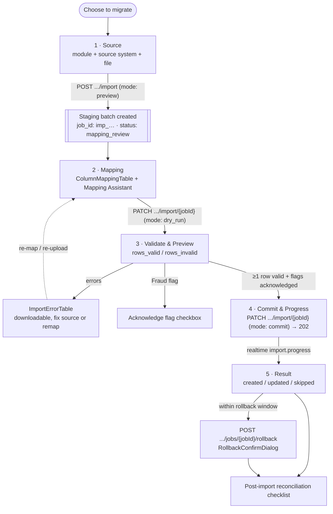

# Import Accounting System Flow — QAYD Frontend
Version: 1.0
Status: Design Specification
Module: Frontend
Submodule: Flows / IMPORT_ACCOUNTING_SYSTEM
---

# Purpose

This document specifies the end-to-end journey of migrating a company off an existing accounting system —
QuickBooks, Xero, Zoho, Odoo, SAP, Oracle, or a raw CSV/Excel export — and into QAYD: choosing the source,
uploading the export, letting the AI Mapping Agent propose a column-to-field mapping under human review,
dry-running the whole batch without writing anything, resolving conflicts, committing the survivors
transactionally, and — when it goes wrong — rolling the whole batch back and reconciling what landed. It is a
**flow** document. Where [`../IMPORT_EXPORT.md`](../IMPORT_EXPORT.md) is the authoritative *screen*
specification that owns the `/import-export` route group, its wizard and job-detail screens, every component,
endpoint, and state on them, and where [`../../accounting/CHART_OF_ACCOUNTS.md`](../../accounting/CHART_OF_ACCOUNTS.md)
§17 owns the account-import pipeline contract, this document owns the **migration journey** that runs across
those screens: the five-stage sequence, the two entry points that reach it (the onboarding Import step and the
standalone Settings entry), the AI-review contract at the mapping stage, the commit/rollback safety model, and
the post-import reconciliation the owner performs to trust what they migrated.

The precedence rule matches every document in this platform. Where this flow is silent on a screen-level fact,
[`../IMPORT_EXPORT.md`](../IMPORT_EXPORT.md) governs; where it is silent on the account-import contract,
[`../../accounting/CHART_OF_ACCOUNTS.md`](../../accounting/CHART_OF_ACCOUNTS.md) §17 governs; where it is silent
on platform conventions, [`../README.md`](../README.md) governs. A contradiction on a fact — an endpoint, an
error code, a confidence threshold — is a defect to reconcile in review, never a decision resolved in code.
This document's additive contribution is the **migration map**: the one place that shows how a QuickBooks
export becomes a set of validated, committed, reversible, reconciled QAYD ledger rows, and where a human's
judgment gates every irreversible step.

Two constraints, restated for this journey, inherited from [`../README.md`](../README.md) and
[`../IMPORT_EXPORT.md`](../IMPORT_EXPORT.md):

1. **The frontend computes nothing about the import's validity.** Every staged row is validated by the same
   Laravel `FormRequest` a manually created record runs, re-run per-row on the server at both dry-run and
   commit; the client's mapping UI collects a confident, reviewable mapping and submits it, but the pass/fail
   of any row, the duplicate-key rejection, and the two-pass parent resolution are all the server's answers.
2. **AI proposes the mapping; a human commits it — always, with no exception.** The AI Mapping Agent's every
   suggestion carries confidence and reasoning and is editable; **no AI output ever calls `mode: "commit"`**.
   Commit fires only from the wizard's own "Commit import" click handler after a human has reached the Commit
   stage. There is no "auto-import when confidence is high enough" setting anywhere in the product.

# Actors & Preconditions

| Actor | Description |
|---|---|
| **Migrating Owner / setup partner** | The person running the migration, during onboarding or afterward; holds the target module's `.import` permission. |
| **Reviewer** | The same or another user who reviews the AI mapping, the dry-run report, and any Fraud Detection flag before commit. |
| **Approver of a rollback** | A user holding `import_export.rollback` (own batch) or `import_export.rollback.any`, who reverses a committed batch within its window. |

| Precondition | Requirement |
|---|---|
| A session scoped to the target company | Every call carries `X-Company-Id`; the import stages into that tenant only ([`../../database/MULTI_TENANCY.md`](../../database/MULTI_TENANCY.md)). |
| The target module's `.import` permission | e.g. `accounting.accounts.import` for a Chart of Accounts migration; re-checked server-side at commit ([`../IMPORT_EXPORT.md`](../IMPORT_EXPORT.md)). |
| A Chart of Accounts to receive the data (for balances/transactions) | Opening balances and journal entries reference accounts; during onboarding this is why the Import step follows the Chart-of-Accounts step. |
| A source export within the ceiling | ≤20MB and ≤50,000 rows, rejected at upload otherwise ([`../IMPORT_EXPORT.md`](../IMPORT_EXPORT.md); [`../../accounting/CHART_OF_ACCOUNTS.md`](../../accounting/CHART_OF_ACCOUNTS.md) §17). |

# Entry Points

| Entry point | Lands on | Notes |
|---|---|---|
| Onboarding Import step | `/onboarding/import` (`OpeningDataImportWizard`, a nested Source → Mapping → Commit mini-wizard) | The umbrella onboarding flow's step 7 hands into this journey ([`./ONBOARDING_FLOW.md → Steps 5–7`](./ONBOARDING_FLOW.md)); a guided front door onto the *same* pipeline, not a parallel one. |
| Settings → Import & Export | `/import-export` → `[Import ▾]` → `/import-export/import/new` | The standalone entry after onboarding, reached from Settings (`import_export.read`) or the `[Import ▾]` button in a module list screen's Page Header. |
| Module-scoped deep link | `/import-export/import/new?module=accounting/accounts&source_system=quickbooks` | Pre-selects the module and source, skipping straight to file selection. |
| Resume a paused job | `/import-export/import/{jobId}` | A job in `mapping_review` or `ready_to_commit` persists (the staging batch exists from upload completion); "Save & exit" pauses without discarding. |
| A completed-import notification | `/import-export/import/{jobId}` | The `import.completed`/`import.failed` notification deep-links to the job detail, reading the already-terminal row from cache. |

> **A note on Xero.** [`../IMPORT_EXPORT.md`](../IMPORT_EXPORT.md) and
> [`../../accounting/CHART_OF_ACCOUNTS.md`](../../accounting/CHART_OF_ACCOUNTS.md) §17.3 ship pre-trained
> per-ERP column-lookup tables for QuickBooks, SAP, Oracle, Odoo, and Zoho, plus a company-to-company "Another
> QAYD company" clone. A Xero export is fully supported through the generic CSV/Excel path — the same
> parse → AI-map → review pipeline — at a lower average pre-fill confidence than the pre-trained systems
> ("honest degradation"); adding a pre-trained Xero lookup table is a backlog item for §17.3, not a frontend
> gap. This flow names Xero explicitly because it is a common migration source, and routes it through the
> CSV/Excel source with the AI Mapping Agent doing the heavier lifting.

# Flow Overview

Migration is a five-stage wizard (the platform's `WizardShell` / `WizardProgressRail`, promoted to
`components/shared/` from the onboarding chrome), forward-linear through the dry-run and gated at commit by an
explicit human action. Every *stage* is a screen state owned by [`../IMPORT_EXPORT.md`](../IMPORT_EXPORT.md);
this document owns the transitions and the safety gates between them.



Numbered stage map:

1. **Source** — pick the target module, the source system, and upload the file. Staging happens; nothing is
   written.
2. **Mapping** — review and correct the AI Mapping Agent's column-to-field proposals.
3. **Validate & Preview** — a server-side dry-run validates every staged row without writing; conflicts and
   Fraud Detection flags surface here.
4. **Commit & Progress** — the one human-gated write; transactional 500-row batches, live progress.
5. **Result & reconcile** — created/updated/skipped counts, the rollback affordance within its window, and the
   post-import reconciliation checklist.

# Step-by-Step

Every endpoint, component, threshold, and error code below is drawn from
[`../IMPORT_EXPORT.md`](../IMPORT_EXPORT.md) and [`../../accounting/CHART_OF_ACCOUNTS.md`](../../accounting/CHART_OF_ACCOUNTS.md)
§17.

## Stage 1 — Source

| | |
|---|---|
| **Route / component** | `/import-export/import/new` (`ImportSourceStep`, `ErpSourcePicker`) — or the onboarding `OpeningDataImportWizard` Source stage — [`../IMPORT_EXPORT.md`](../IMPORT_EXPORT.md) |
| **User action** | Pick the target resource (`Combobox`, permission-filtered), toggle Upload-a-file vs Migrate-from-another-system (a card grid of QuickBooks / SAP / Oracle / Odoo / Zoho / "Another QAYD company", rendered as plain wordmarks — no third-party logos), optionally "Download column template," then drag-and-drop the `.xlsx`/`.csv` file. |
| **UI state** | Upload is a presigned, direct-to-Cloudflare-R2 `PUT` (presign → PUT → finalize), bypassing any serverless body-size ceiling; the file is checked against the ≤20MB / ≤50,000-row ceiling before parse. |
| **API call** | `POST /api/v1/{resource}/import` (multipart: `file`, `source_system`, `mode: "preview"`) — e.g. `POST /api/v1/accounting/accounts/import`. Parses into a staging area, returns `{ job_id, status: "mapping_review", row_count, detected_columns, target_schema }`, and **writes nothing** to the ledger. |
| **Success** | A `job_id` (e.g. `imp_7f3a1c9e`) now exists; the `private-company.{id}.import-jobs.{job_id}` channel opens; advance to Mapping. |
| **Failure** | `FILE_TOO_LARGE` / `UNSUPPORTED_FORMAT` rejected before staging — the stage surfaces the exact ceiling and offers "Split your file and import in batches." A non-UTF-8 CSV (older QuickBooks Desktop, SAP) is detected here with an explicit re-export/best-effort notice, never silently corrupting `name_ar` with mojibake. |

PDF is **not** an import format — it is export-only, not for round-trip import. Only the Chart of Accounts
ships pre-trained per-ERP lookup tables; other modules run the same pipeline at lower average confidence.

## Stage 2 — AI-assisted mapping under human review

| | |
|---|---|
| **Route / component** | `/import-export/import/{jobId}` (`ColumnMappingTable`, `MappingAssistantDock`) — [`../IMPORT_EXPORT.md`](../IMPORT_EXPORT.md) |
| **User action** | For each detected source column, review the AI-suggested target field, correct any mapping via the per-row `Select`, and either accept individually or bulk-accept the high-confidence ones. |
| **UI state** | Each row shows `source column → target-field Select`, a `ConfidenceBadge` rendered *next to* the Select (never inside), and a live sample value. Suggestions **at or below 0.5 confidence** never pre-fill a Select value and are flagged "needs manual mapping." The Mapping Assistant dock offers one explicit bulk action, **"Apply all suggestions above 90%"** — still individually editable, still requiring an explicit "Validate" click afterward. |
| **API call** | None per keystroke — the mapping is held in local form state and sent once, at the Validate transition (Stage 3). |
| **AI contract** | The AI Mapping Agent's reasoning narrates the single lowest-confidence or most-consequential suggestion via `AiCardShell` + `ReasoningDisclosure`, one message at a time — never a wall of text. Where the source has no Arabic field (QuickBooks, Zoho), a suggested `name_ar` renders labeled "AI-translated — review before import" with an accept/edit control, **never silently written to the payload**. |
| **Success** | A complete mapping (every `requiredField` mapped) enables "Validate." |
| **Failure** | An unmapped required field blocks the Validate transition with an inline reason. |

## Stage 3 — Validate & Preview (dry-run)

| | |
|---|---|
| **Route / component** | `/import-export/import/{jobId}` (`ImportPreviewPanel`, `ImportErrorTable`) — [`../IMPORT_EXPORT.md`](../IMPORT_EXPORT.md) |
| **User action** | Review "N rows will succeed, M have errors," inspect the preview of the first ~50 successful rows, and open the per-row error report. |
| **API call** | `PATCH /api/v1/{resource}/import/{jobId}` `{ mapping, mode: "dry_run" }` — re-runs the identical `FormRequest` validation per staged row, **writes nothing**, and returns `{ status: "ready_to_commit", row_count, rows_valid, rows_invalid, errors_preview_url }`. |
| **Validation** | Every account-import row runs the full rule set (VR-1..VR-13) plus IR-1 (two-pass parent resolution: `parent_code` resolves to a same-batch row or an existing account) and IR-2 (two staged rows cannot share a natural key — reported as a *batch-level* error before any row commits). Rows past `max_account_depth` (default 12) are rejected per-row (`MAX_DEPTH_EXCEEDED`), listed, not truncated. |
| **Conflict resolution** | Duplicate-within-batch (same SKU/account code/customer number) → batch-level rejection, fix before proceeding. Cross-batch concurrent overlapping keys → ordinary per-row unique-constraint errors, no silent overwrite, no cross-batch locking. |
| **Fraud flag** | The Fraud Detection agent auto-flags an anomalous bulk change (e.g. a >40% price change across 68% of rows) as a `negative`-token `AIProposalPanel` card; it **never hard-blocks**, but requires an acknowledgment checkbox ("I've reviewed this flag") before Commit enables. |
| **Success** | With ≥1 valid row and every flag acknowledged, "Commit import" enables. |
| **Failure** | The `ImportErrorTable` is downloadable (`errors_preview_url`, e.g. `…/imp_7f3a1c9e/errors-preview.csv`); the owner fixes the source or re-maps and re-runs the dry-run — the loop back to Stage 2 costs nothing, since nothing has been written. |

## Stage 4 — Commit & Progress

| | |
|---|---|
| **Route / component** | `/import-export/import/{jobId}` (`ImportProgressCard`) — [`../IMPORT_EXPORT.md`](../IMPORT_EXPORT.md) |
| **User action** | Click "Commit import" (enabled only once ≥1 row validates and flags are acknowledged). This is the single human-gated write in the whole flow. |
| **API call** | `PATCH /api/v1/{resource}/import/{jobId}` `{ mode: "commit" }` → `202 Accepted`, status → `committing`. A transactional batch insert of **500 rows per transaction** of the dry-run-passing rows; invalid rows are skipped and listed, never silently dropped (partial-success). |
| **UI state** | A live `ImportProgressCard` driven by the `import.progress` realtime tick (patched via `setQueryData` for a smooth bar), reconciled by a full invalidation at the terminal state; a 2-second poll is the fallback while the channel reconnects. |
| **Success** | Status reaches `completed` or `completed_with_errors`; advance to Result. |
| **Failure / cancel** | Cancelling a running job takes effect at the next 500-row batch boundary — already-committed batches remain, summarized "N of M rows committed before cancellation," never half-committed or silently discarded. |

**Opening balances are a special case.** A Chart of Accounts import can carry an `opening_balance` column, but
per BR-6 opening balances are *never* set by writing `accounts.opening_balance` directly after books-open — they
are posted once per account via a system-generated "Opening Balance" journal entry (dated books-open, balanced
against the "Opening Balance Equity" clearing account) through
`POST /api/v1/accounting/accounts/opening-balances` (`accounting.accounts.set_opening_balance`). Writing
`opening_balance` on the general update endpoint after books-open is rejected `403 FIELD_LOCKED` /
`OPENING_BALANCE_LOCKED`. The Import flow's Commit stage routes balance rows through the opening-balances
endpoint, which is why an imported opening balance creates the `journal_lines` reference that later makes a CoA
template re-application fail `409 ACCOUNTS_ALREADY_POSTED`.

## Stage 5 — Result, rollback, and reconciliation

| | |
|---|---|
| **Route / component** | `/import-export/import/{jobId}` (`ImportResultSummary`, `RollbackConfirmDialog`) — [`../IMPORT_EXPORT.md`](../IMPORT_EXPORT.md) |
| **User action** | Read the created/updated/skipped counts, download the error report, and either accept the import or roll it back. |
| **Result** | "212 of 214 rows imported — 2 skipped, view details"; one `audit_logs` `imported` action tagged `source_system` + `batch_id` records the migration. Clicking back to Stages 1–3 opens a **read-only replay**, never a re-mutation of the committed batch. |
| **Rollback** | Offered only on `completed`/`completed_with_errors`, only within the module's rollback window (**default 72 hours**, company-configurable), and only while no created row has since been referenced by a later transaction. `POST /api/v1/import-export/jobs/{jobId}/rollback` is a thin dispatcher: it resolves the `jobId` → owning module + `batch_id` and calls that module's own reversal, soft-deleting/reversing every still-untouched row tagged with `batch_id` and writing one `import_rolled_back` audit action referencing the original `imported` one. `RollbackConfirmDialog` states the impact and requires a mandatory reason. Rows already referenced downstream mirror `409 ACCOUNTS_ALREADY_POSTED` — still-untouched rows are reversed, referenced rows are listed explicitly, and the batch is never blocked wholesale. |

# Happy Path

A first migration from QuickBooks, during onboarding, of a company's Chart of Accounts with opening balances:

1. **Source** — the owner reaches `/onboarding/import`, picks Chart of Accounts, selects QuickBooks, and
   uploads the `.csv` export. `POST accounts/import (mode: preview)` stages 214 rows and returns
   `job_id: imp_7f3a1c9e`, `status: mapping_review`.
2. **Mapping** — the AI Mapping Agent (backed by `GENERAL_ACCOUNTANT`) pre-fills most columns; `Account`→`code`
   + `name_en`, `Type`→`account_type_id`, `Balance`→`opening_balance`. Because QuickBooks has no Arabic field,
   each `name_ar` renders as an "AI-translated — review before import" suggestion. The owner clicks "Apply all
   suggestions above 90%," corrects two low-confidence columns, and clicks "Validate."
3. **Validate & Preview** — `PATCH …/import/{jobId} (mode: dry_run)` returns `rows_valid: 214, rows_invalid: 0`;
   the two-pass parent resolution wires every `parent_code`; no Fraud flag fires. "Commit import" enables.
4. **Commit** — the owner clicks "Commit import"; `PATCH …(mode: commit)` returns `202`; the `ImportProgressCard`
   fills to 100% across the transactional 500-row batches; balance rows post through the opening-balances
   endpoint against Opening Balance Equity.
5. **Result** — "214 of 214 accounts imported"; the owner runs the post-import reconciliation checklist below,
   confirms the trial balance balances and Opening Balance Equity clears, and continues the onboarding flow.

Nothing was written before the owner's own "Commit import" click; every stage before it was fully reversible by
simply not proceeding.

# Alternate & Error Paths

| Path | Trigger | Behavior |
|---|---|---|
| **Xero / generic CSV** | Source is Xero or a raw export with no pre-trained lookup | The generic CSV/Excel path runs the same pipeline at lower pre-fill confidence; the AI Mapping Agent does more of the work and more columns land at "needs manual mapping" (≤0.5), which the owner maps by hand. |
| **Partial success** | Some rows fail dry-run | Only the passing rows commit; failures are skipped and listed in the downloadable report — the expected terminal state (`completed_with_errors`), not an error screen. |
| **Duplicate natural key in batch** | Two staged rows share a code/SKU | Batch-level rejection at dry-run (IR-2) before any commit; the owner de-duplicates the source and re-runs. |
| **Forward parent reference** | A child row references a parent later in the file | Resolved by the two-pass IR-1 algorithm — not an error, handled server-side. |
| **Fraud flag on bulk change** | >40% price change across most rows | A `negative`-token card requires the "I've reviewed this flag" checkbox before Commit enables; never a hard block, but never bypassable silently. |
| **Ambiguous number format** | `1.234,56` vs `1,234.56` | QAYD shows how it interpreted the value under the company locale with a "Does this look right?" confirm for currency/amount columns before commit. |
| **Formula injection** | A cell begins `=`/`+`/`-`/`@` (e.g. `=cmd|…`) | Neutralized with a single-quote prefix on both import and export — never executed, never round-tripped as a live formula. |
| **Oversized file** | >20MB or >50,000 rows | Rejected at upload (`FILE_TOO_LARGE`); the Source stage offers "split and import in batches." |
| **Rate limit** | >10 import jobs/hour for the company | `429` with `retry_after`, rendered as a friendly "You've reached this hour's import limit — resets at 14:00." |
| **Permission revoked mid-wizard** | The module's `.import` key is revoked while the wizard is open | The job stays `ready_to_commit`; "Commit import" disables with a permission tooltip and the job is resumable once the permission is restored — no work is lost. |
| **Commit references break a later rollback** | Rolling back after a created row was posted-against | The rollback reverses the still-untouched rows and lists the referenced ones explicitly (`409 ACCOUNTS_ALREADY_POSTED` mirror), rather than blocking the whole batch. |
| **Network drop before staging** | Upload fails before `mode: preview` returns | Nothing exists server-side; the owner retries at Stage 1. After `mapping_review`/`ready_to_commit`, the job persists and is resumed from the job history. |

# Data & State

## Endpoints traversed across the whole flow

| Purpose | Endpoint | Method | Permission |
|---|---|---|---|
| Upload + stage (preview) | `POST /api/v1/{resource}/import` `mode: "preview"` | POST | module's `.import` (e.g. `accounting.accounts.import`) |
| Dry-run validate | `PATCH /api/v1/{resource}/import/{jobId}` `mode: "dry_run"` | PATCH | module's `.import` |
| Commit | `PATCH /api/v1/{resource}/import/{jobId}` `mode: "commit"` → `202` | PATCH | module's `.import` (re-checked) |
| Opening balances (CoA) | `POST /api/v1/accounting/accounts/opening-balances` | POST | `accounting.accounts.set_opening_balance` |
| Column template | `GET /api/v1/{resource}/import/template` | GET | module's `.import` |
| Job history | `GET /api/v1/import-export/jobs?type=import&module=&status=&source_system=&q=&cursor=` | GET | `import_export.read` |
| Job detail | `GET /api/v1/import-export/jobs/{jobId}` | GET | `import_export.read` + module's `.read` |
| Rollback | `POST /api/v1/import-export/jobs/{jobId}/rollback` | POST | `import_export.rollback` (own) / `.rollback.any` + module's `.import` |

Per-module import endpoints the Source picker enumerates: `accounting/accounts/import`,
`accounting/customers/import`, `purchasing/vendors/import`, `products/import`,
`accounting/journal-entries/bulk-import` (draft-only), `inventory/import`, `warehouses/import`, `tax/import` —
each gated by its own `.import` key ([`../IMPORT_EXPORT.md`](../IMPORT_EXPORT.md)).

## Job status lifecycle

`queued` → `mapping_review` → `validating` → `ready_to_commit` → `committing` →
(`completed` | `completed_with_errors` | `failed` | `cancelled`); rollback adds `rolling_back` → `rolled_back`.
The job survives across sittings from `mapping_review` onward, which is what makes "Save & exit" and resume
possible.

## Query keys and cache tuning

```ts
// lib/query/keys.ts
export const importExportKeys = {
  all: ["import-export"] as const,
  jobs: (filters) => [...importExportKeys.all, "jobs", filters] as const,
  job: (jobId: string) => [...importExportKeys.all, "job", jobId] as const,
  targetSchema: (module: string) => [...importExportKeys.all, "target-schema", module] as const,
};
```

| Cache entry | `staleTime` | Invalidation |
|---|---|---|
| Job history (Overview) | 30s | Cursor-paginated `DataTable`; refetch on focus |
| Non-terminal job (`queued`/`mapping_review`/`validating`/`committing`) | `0`, polled 2s | Realtime `import.*` events patch/invalidate; 2s poll is the fallback |
| Terminal job (`completed`/`…_with_errors`/`failed`/`cancelled`) | `Infinity` | Never re-fetched — a settled job is immutable |
| `targetSchema(module)` | 5 min | Importable-field schema changes on release cadence, not per company |

The mapping itself lives in local component/form state and is sent once at the dry-run transition — never a
per-keystroke network call. The mapping payload always sends the English field **key** (`sku`,
`account_type_id`), never a localized label. The `batch_id` is stored in `audit_logs.metadata` alongside the
`imported` action (`{ source_system, batch_id, rows_committed, rows_skipped }`), which is what the rollback
dispatcher resolves against.

## Realtime

| Channel | Events |
|---|---|
| `private-company.{id}.import-jobs.{job_id}` | `import.mapping_ready`, `import.validated`, `import.progress`, `import.completed`, `import.failed` |
| `private-company.{id}.notifications.{user_id}` | `import.completed`, `import.failed`, `import.rolled_back` |

Subscribed only while a job is non-terminal; the completed-import notification deep-links to the job detail,
reading the already-terminal row from cache.

# AI Touchpoints

The mapping stage is the one place AI does real work in this flow, and it obeys the full platform contract —
confidence and reasoning always shown, human always the committer:

- **The AI Mapping Agent proposes, the human disposes.** Every column suggestion carries a `ConfidenceBadge`
  and, for the single most-consequential row, a `ReasoningDisclosure` "why." Suggestions **≤0.5 confidence**
  never pre-fill and are flagged for manual mapping; the one bulk affordance is the explicit "Apply all
  suggestions above 90%," which still requires a subsequent human "Validate" click. This is the migration-flow
  instantiation of the platform's `AIProposalPanel` contract — but with the auto-execute half deliberately
  absent, because **no AI output ever calls `mode: "commit"`**. There is no confidence at which the machine
  commits on its own.
- **AI-translated Arabic names are proposals, never silent writes.** Where the source lacks an Arabic field, a
  suggested `name_ar` is labeled "AI-translated — review before import" with accept/edit — it is never written
  to the commit payload without the human's edit or acceptance.
- **Fraud Detection flags, it does not block.** An anomalous bulk change surfaces as a `negative`-token card at
  the Preview stage requiring an "I've reviewed this flag" acknowledgment before Commit enables — visible,
  never silent, and never an auto-veto that would strand a legitimate migration.
- **The Compliance Agent (export-side, suggest-only)** flags export selections that include payroll or
  national-ID fields — relevant to the round-trip but not to the import commit itself, and gated additionally
  by field-level read permissions.

# Permissions

| Transition | Permission gate | Enforcement |
|---|---|---|
| See the Import & Export overview | `import_export.read` | Granted to any role holding ≥1 resource `.import`/`.export` key. |
| Read a job's detail | `import_export.read` + the job's module `.read` | Row-level detail is additionally module-gated. |
| Start / dry-run / commit an import | the target module's `.import` (e.g. `accounting.accounts.import`, `accounting.customer.import`, `purchasing.vendor.import`, `products.import`, `accounting.journal.import`, `inventory.import`, `warehouse.create`, `tax.config.manage`) | Re-checked server-side at commit — a permission revoked mid-wizard disables Commit rather than losing the job. |
| Download an ERP template | the target module's `.import` | |
| Roll back own batch | `import_export.rollback` + the module's `.import` | |
| Roll back any user's batch | `import_export.rollback.any` + the module's `.import` | |

There is deliberately **no** separate platform-wide "run an import/export" permission — the authority is always
the specific module's own `.import`/`.export` key, so a role that can import customers but not accounts sees
only customers in the Source picker. All checks are a UX courtesy via `usePermission()` / `<PermissionGate>`;
the server re-checks at commit ([`../README.md`](../README.md) Principle 3).

# i18n & RTL

- **Numerals stay Western and LTR-embedded.** Row counts ("5,400 rows"), percentages ("62%"), and file sizes
  ("12MB") render in Western digits inside a `dir="ltr"` span even under `ar` — never Eastern Arabic-Indic,
  which reads as an error to an accountant.
- **Source-system and file names never mirror.** Proper nouns (QuickBooks, SAP, Oracle, Odoo, Zoho, an uploaded
  file name) render LTR-embedded mid-Arabic-sentence, so their Latin structure is never reordered by the bidi
  algorithm.
- **Target field labels are bilingual (`label_en`/`label_ar`); the underlying keys are not localized** — the
  mapping payload always carries the English key.
- **The source → target chevron mirrors; meaning-bearing glyphs do not.** The directional chevron uses
  `rtl:rotate-180`; the trash/checkmark and the `ConfidenceBadge` dot are static in both directions. The
  `WizardProgressRail` mirrors with zero conditional code.
- **Logical Tailwind utilities only** (`ms-*`/`me-*`/`ps-*`/`pe-*`/`text-start`/`text-end`); physical classes
  are ESLint-banned, and direction is set once at the root.

# Accessibility

- **No drag-and-drop is required to map a column.** Mapping is a plain per-row `Select`, deliberately
  sidestepping WCAG 2.2 **2.5.7 Dragging Movements** — the whole wizard is keyboard-complete, from source
  selection through commit.
- **Focus lands on each new stage's header** on every transition (`aria-live`), so a screen-reader user always
  knows which of the five stages they reached.
- **The progress bar is announced politely and throttled.** `ImportProgressCard` uses `aria-live="polite"`
  throttled to at most once per 5 seconds or per 10% boundary — a fast-ticking commit never spams a
  screen-reader user.
- **Color is never the only signal for a validation error.** The `ImportErrorTable` pairs a danger border with
  a "Required" `Badge` and an error-code column; it is a plain semantic `<table>` with `<th scope="col">`,
  never an ARIA `grid`.
- **The Fraud flag's acknowledgment is a real, labeled checkbox** in the tab order before "Commit import," not
  a color cue alone — the one gate between a review and an irreversible write is unmissable to any user.

# Edge Cases

| Edge case | Flow behavior |
|---|---|
| Non-UTF-8 CSV from older QuickBooks Desktop / SAP | Detected at `mode: preview` with an explicit re-export/best-effort notice; never lets mojibake land in `name_ar`. |
| Formula-injection cell (`=cmd\|…`, leading `=`/`+`/`-`/`@`) | Neutralized with a single-quote prefix on both import and export; never executed. |
| Forward parent reference in a CoA file | Resolved by the two-pass IR-1 algorithm; not an error. |
| Duplicate natural key within one batch | Batch-level rejection at dry-run (IR-2) before any commit. |
| File over 20MB or 50,000 rows (module may set a stricter cap) | Rejected at upload; "split and import in batches" guidance, not a bare rejection. |
| Permission revoked mid-wizard | Job stays `ready_to_commit`; Commit disabled with a tooltip; resumable when restored — no lost work. |
| Ambiguous decimal format (`1.234,56` vs `1,234.56`) | Shown as QAYD interpreted it under the company locale with a "Does this look right?" confirm for currency/amount columns. |
| Rollback after a row was posted-against | Still-untouched rows reversed; referenced rows listed explicitly (`409 ACCOUNTS_ALREADY_POSTED` mirror); batch never blocked wholesale. |
| Cancelling a running commit | Takes effect at the next 500-row batch boundary; committed batches remain, summarized "N of M committed before cancellation." |
| Network drop before staging vs. after | Before `mode: preview` returns → nothing server-side, retry at Stage 1; after `mapping_review`/`ready_to_commit` → the job persists and resumes from history. |
| Company switch mid-import | The staging batch and job are tenant-scoped by `X-Company-Id`; switching companies leaves them intact under the original tenant and out of scope for the new one, since cross-tenant reads return `404` ([`../../database/MULTI_TENANCY.md`](../../database/MULTI_TENANCY.md)). |

# Post-Import Reconciliation Checklist

Committing an import is the beginning of trusting a migration, not the end of it. This checklist is the flow's
terminal responsibility — the steps an owner works through on the Result stage (and revisits from the job
detail) before treating the migrated books as authoritative. Each item links a symptom to the QAYD screen that
confirms it; none of it is computed by this flow, which only surfaces the affordances.

1. **Row counts match the source.** Confirm `created + updated + skipped` equals the source export's row count;
   open the downloadable error report (`errors_preview_url`) for every skipped row and decide whether to fix
   and re-import that subset or accept the omission.
2. **The trial balance balances.** For a Chart of Accounts + opening-balances migration, generate a trial
   balance ([`../TRIAL_BALANCE.md`](../TRIAL_BALANCE.md)) and confirm total debits equal total credits — the
   single most important post-migration check, since a lopsided import surfaces here first.
3. **Opening Balance Equity clears to zero.** Because opening balances post against the "Opening Balance Equity"
   clearing account (BR-6), a correctly migrated set leaves that account at zero once every account's opening
   balance is entered; a non-zero balance means a missing or mismatched opening figure to chase.
4. **Reconcile control-account totals against the source system's reports.** Compare the migrated Accounts
   Receivable, Accounts Payable, and bank/cash totals against the source system's own aged reports; a
   discrepancy points at a mapping error (wrong `account_type_id`) or a skipped subledger.
5. **Spot-check the AI-mapped and AI-translated fields.** Re-open a sample of accounts whose `account_type_id`
   or `name_ar` came from an AI suggestion and confirm the classification and translation read correctly — the
   mapping was reviewed, but a post-commit sample is the honest final check.
6. **Confirm the Fraud Detection flag, if any, was warranted.** If a bulk-change flag was acknowledged at
   Preview, verify against the source that the change was intended and not an artifact of a mis-mapped column.
7. **Decide within the rollback window.** The 72-hour (configurable) window is the reconciliation budget: if
   any check above fails materially and no migrated row has yet been posted-against, `POST .../rollback` with a
   reason is the clean reset; past the window or past first downstream use, corrections are ordinary edits and
   journal entries, not a rollback.

For a migration run *inside* onboarding, this checklist is what an owner should complete before
`POST /onboarding/complete` — a company should not go operational on books whose trial balance has not been
confirmed to balance, even though onboarding itself does not *block* on it.

# End of Document
