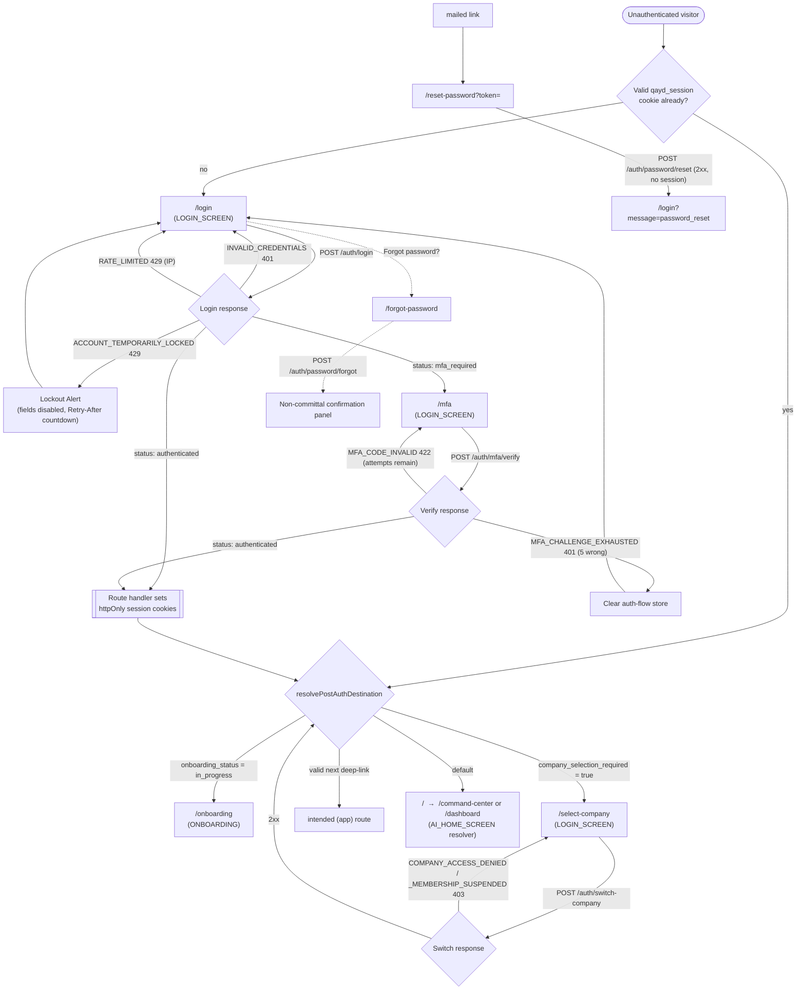

# Login Flow — QAYD Frontend
Version: 1.0
Status: Design Specification
Module: Frontend
Submodule: Flows / LOGIN
---

# Purpose

This document specifies the end-to-end journey that carries a person from an unauthenticated browser tab to a
fully scoped, company-aware session rendered inside their resolved Home screen. It is the first entry in the
new `docs/frontend/flows/` document type, which differs from a screen specification in exactly one respect:
where a screen doc owns one route and every pixel, state, and endpoint on it, a **flow** doc owns a *journey*
that spans several screens and the sequencing, hand-offs, and state that live *between* them — the connective
tissue no single screen doc is responsible for. This flow stitches together the five screens
[`../screens/LOGIN_SCREEN.md`](../screens/LOGIN_SCREEN.md) specifies (`/login`, `/mfa`, `/forgot-password`,
`/reset-password`, `/select-company`) plus the post-authentication redirect resolution that
[`../screens/AI_HOME_SCREEN.md`](../screens/AI_HOME_SCREEN.md) and [`../ONBOARDING.md`](../ONBOARDING.md) each
own one branch of. It does not re-specify any of those screens; it names the moments they connect.

The relationship to the authoritative documents beneath this flow is the same precedence rule every screen
doc in this platform states for itself. [`../../api/AUTHENTICATION_API.md`](../../api/AUTHENTICATION_API.md)
owns the wire contract — the JWT claims, the Sanctum session cookie, CSRF-cookie priming, refresh-token
rotation, the MFA challenge lifecycle, every endpoint's request/response envelope, and every named error
code. [`../screens/LOGIN_SCREEN.md`](../screens/LOGIN_SCREEN.md) owns how that contract is presented and
sequenced on each individual screen. **This flow owns the arrows between those screens** — the branch a login
response takes, the state carried from `/login` to `/mfa` without touching a cookie, the redirect that
resolves after a session finally exists, and the failure paths that send a person back a step rather than
forward. Where this document appears to disagree with either on a fact — an endpoint path, an error code, a
redirect target — that is a defect in one of the documents to reconcile in review, never a decision resolved
unilaterally in code; `AUTHENTICATION_API.md` is authoritative for the contract, `LOGIN_SCREEN.md` for the
per-screen presentation, and this document for the sequence connecting them.

Three platform constraints, restated once for this journey at their most literal, inherited from
[`../README.md`](../README.md):

1. **The frontend computes nothing that establishes identity.** A lockout countdown is the server's
   `Retry-After` header, not a client-side guess; whether a second factor may be skipped is a
   `trusted_devices` answer the API gives; whether a company may be entered is the API's `403`, never an
   inference the client draws. This flow's entire job is to *carry* answers between screens, never to author
   them.
2. **AI is visible, never silent — and this is the one journey in the product where it is correctly and
   deliberately absent.** No confidence badge, no proposal panel, no assistant presence appears anywhere in
   the `(auth)` shell, for the reasons [`../screens/LOGIN_SCREEN.md → AI Integration`](../screens/LOGIN_SCREEN.md)
   states in full and `# AI Touchpoints` below restates for the journey: there is no `company_id` for an agent
   to reason within until this flow's final step resolves.
3. **RBAC is enforced by the API; the UI only reflects it.** Four of the five screens are `public` by
   construction; the fifth, `/select-company`, is the first screen in the product where a membership check
   (`company_users` row present, active, unsuspended) actually gates a transition, and it is enforced the way
   every gate is — the API's `403`, surfaced inline.

# Actors & Preconditions

| Actor | Description |
|---|---|
| **Anonymous visitor** | A browser with no valid `qayd_session` cookie. The subject of `/login`, `/forgot-password`, `/reset-password`. |
| **Mid-login user** | A visitor who has submitted correct credentials but holds only a short-lived `mfa_token` (`mft_…`, 5-minute TTL) in the non-persisted auth-flow store — authenticated to *no* endpoint yet. The subject of `/mfa`. |
| **Multi-company user** | An authenticated user whose login envelope carried `companies.length > 1` with `company_selection_required: true`. The subject of `/select-company`. |
| **Returning user** | An authenticated visitor whose session is still valid; the anonymous-only guard bounces them past this flow entirely. |

| Precondition | Requirement |
|---|---|
| A user record exists | Registration, email verification, and account creation are owned by the Users/Onboarding module ([`../../api/AUTHENTICATION_API.md`](../../api/AUTHENTICATION_API.md)'s `POST /register` row states its full spec lives there); this flow begins at an already-created, email-verified account. |
| At least one `company_users` membership | A user with zero companies is routed into [`../ONBOARDING.md`](../ONBOARDING.md)'s Create-Company flow *after* authentication resolves, not blocked at login. |
| JavaScript enabled | Per [`../screens/LOGIN_SCREEN.md → Edge Cases`](../screens/LOGIN_SCREEN.md), authentication requires JavaScript; a no-JS visitor sees the static shell but cannot submit. This is an accepted platform-wide constraint, not a gap of this flow. |
| A reachable API | `NEXT_PUBLIC_API_BASE_URL` points at a live QAYD API; a network failure at any step preserves typed input and surfaces an inline `Alert`, never a lost form (`# Alternate & Error Paths`). |

# Entry Points

| Entry point | Lands on | Notes |
|---|---|---|
| Direct navigation to `/login` | `/login` | The canonical front door; email field auto-focused. |
| `middleware.ts` auth-gate redirect from any `(app)` route | `/login?next=<encoded original path+search>` | A lapsed session reading `/accounting/journal-entries/482` returns to that exact entry after the full chain completes; `next` is validated against a same-origin, `(app)`-prefixed allow-list before use ([`../screens/LOGIN_SCREEN.md → The next deep-link parameter`](../screens/LOGIN_SCREEN.md)). |
| A `Sign in` link from the `(marketing)` route group | `/login` | No `next`; resolves to the default post-auth destination. |
| A mailed password-reset link | `/reset-password?token=…` | Skips `/login` entirely; a missing `?token=` redirects to `/forgot-password`. |
| A `Forgot password?` link (including from a lockout `Alert`) | `/forgot-password` | The one link that stays enabled throughout an `ACCOUNT_TEMPORARILY_LOCKED` state, since a forgotten password is the legitimate way out of a self-inflicted lockout. |
| Deliberate revisit of `/select-company` from inside `(app)` | `/select-company` | The `CompanySwitcher` (`../NAVIGATION_SYSTEM.md`) is the frequent path; this full-page picker is the occasional one. |
| Sign-out from anywhere in `(app)` | `/login` | `POST /api/v1/auth/logout` revokes the session/refresh-token family, then `middleware.ts` bounces the next request to `/login`. |

# Flow Overview

The journey is a small state machine with one linear happy path and three fork points (MFA required, company
selection required, credential failure). Every transition below is owned by this document; every *node* is a
screen owned by [`../screens/LOGIN_SCREEN.md`](../screens/LOGIN_SCREEN.md) or a post-auth destination owned by
its own screen doc.



Numbered step map of the primary journey:

1. **Guard** — every `(auth)` page checks server-side for an existing valid session and bounces an
   already-signed-in visitor forward rather than rendering a sign-in form to them.
2. **Credentials** — `/login` primes the CSRF cookie, submits email + password, and branches on the response.
3. **MFA (conditional)** — `status: "mfa_required"` carries a short-lived `mfa_token` to `/mfa` for a second
   factor.
4. **Session established** — a `status: "authenticated"` response (from `/login` directly or from
   `/mfa/verify`) has its tokens written to httpOnly cookies by the BFF route handler.
5. **Company selection (conditional)** — `company_selection_required: true` routes to `/select-company`;
   selecting a row calls `switch-company` to scope the session.
6. **Destination resolution** — a single helper resolves the onboarding gate, the `next` deep-link, and the
   Home-mode preference into one final redirect.

# Step-by-Step

Each step names the route it happens on (with a relative link to that screen's doc), the user action, the UI
state, the exact `/api/v1` call, and the success/failure branches. Every endpoint, error code, and response
field below is drawn verbatim from [`../../api/AUTHENTICATION_API.md`](../../api/AUTHENTICATION_API.md) and
[`../screens/LOGIN_SCREEN.md`](../screens/LOGIN_SCREEN.md).

## Step 0 — Anonymous-only guard (server, every `(auth)` page)

| | |
|---|---|
| **Route** | `/login`, `/forgot-password`, `/reset-password` — [`../screens/LOGIN_SCREEN.md → Route & Access`](../screens/LOGIN_SCREEN.md) |
| **Action** | Page load (Server Component), before any client bundle is requested. |
| **UI state** | None rendered yet — the check runs in the Server Component so no flash of a sign-in form occurs. |
| **API call** | `GET /api/v1/auth/me` (server-side only) via the same `getSession()` helper `(app)/layout.tsx` uses. |
| **Success (session valid)** | `redirect()` forward to the resolved post-auth destination (`# Step 6`) — the visitor never sees a login form while signed in. |
| **Failure (no/invalid session)** | Render `AuthShell` + the page's client form. |

`/mfa` performs a narrower client-side variant: `MfaVerifyForm` reads `useAuthFlowStore((s) => s.mfaToken)` on
mount and redirects to `/login` if it is `null` — a refreshed or bookmarked `/mfa` with no challenge in flight
never renders a dead code field. `/select-company` inverts the guard: it *requires* a session and redirects to
`/login` if one is absent.

## Step 1 — Prime CSRF, submit credentials

| | |
|---|---|
| **Route** | `/login` — [`../screens/LOGIN_SCREEN.md → LoginForm`](../screens/LOGIN_SCREEN.md) |
| **Action** | User types email + password, optionally checks `Remember me`, submits. |
| **UI state** | `Button` enters `loading` (spinner, fixed width, `disabled`); both fields and the checkbox disable together so a slow network cannot double-submit. |
| **API calls** | (a) `GET /sanctum/csrf-cookie` primes the `XSRF-TOKEN` cookie for the double-submit defense (per [`../../api/AUTHENTICATION_API.md → Sanctum SPA Flow`](../../api/AUTHENTICATION_API.md)); (b) `POST /api/v1/auth/login` proxied through `app/api/auth/login/route.ts`, body `{ email, password, remember_me, device_name }`. |
| **Success — `status: "authenticated"`** | The route handler has already written httpOnly session cookies; `resolvePostAuthDestination` runs (`# Step 6`). |
| **Success — `status: "mfa_required"`** | Envelope `data` carries `mfa_token` (`mft_…`), `mfa_token_expires_in: 300`, and `methods: ["totp","sms","backup_code"]`; `setMfaChallenge` populates the non-persisted auth-flow store and the client `router.push("/mfa")`. |
| **Failure branches** | `INVALID_CREDENTIALS` (401), `ACCOUNT_TEMPORARILY_LOCKED` (429, `Retry-After: 720`), `RATE_LIMITED` (429, IP-scoped) — each handled per `# Alternate & Error Paths`. |

The `device_name` is a browser/OS heuristic (e.g. "Chrome — macOS"); it is what a later `trusted_devices`
match keys on, and it is why the `Trust this device` checkbox on `/mfa` can eventually let a login skip
straight to `authenticated` (`# Data & State`).

## Step 2 — Second factor (conditional)

| | |
|---|---|
| **Route** | `/mfa` — [`../screens/LOGIN_SCREEN.md → MfaVerifyForm`](../screens/LOGIN_SCREEN.md) |
| **Action** | User picks a method tab (only methods the account holds render), enters the six-digit `InputOTP` code or a 9-character backup code, optionally checks `Trust this device for 30 days`. |
| **UI state** | TOTP is the default first tab (no round trip to receive a code); for SMS, a `Resend code` link disables for a 60-second client-side countdown mirroring the server's one-send-per-60s throttle; the typed email from the auth-flow store shows in the subheading so the user always knows which account they are verifying. |
| **API calls** | `POST /api/v1/auth/mfa/verify` (proxied via `app/api/auth/mfa/verify/route.ts`), body `{ mfa_token, method, code, trust_device }`; SMS resend calls `POST /api/v1/auth/mfa/sms/send`. |
| **Success** | Response carries the same `status: "authenticated"` shape; the route handler writes session cookies (and, on `trust_device: true`, a 30-day `qayd_device_trust_hint`), then the client follows the identical `resolvePostAuthDestination` branch — `/mfa` never re-implements the routing decision. |
| **Failure — `MFA_CODE_INVALID` (422)** | Attempts remain; inline wrong-code error under the `InputOTP`, `role="alert"`. |
| **Failure — `MFA_CHALLENGE_EXHAUSTED` (401)** | Five wrong attempts kill the challenge; the client clears the auth-flow store and redirects to `/login` with the one-shot toast "Too many incorrect codes. Please sign in again." |

## Step 3 — Session cookies written (BFF route handler)

The Next.js Route Handler is the only frontend code that ever sees a raw `access_token`/`refresh_token`; it
exists specifically so browser JavaScript never does. On any `authenticated` response it runs the shared
`setSessionCookies` step, then returns to the client an envelope carrying only `user`, `companies`,
`active_company_id`, and `company_selection_required` — never the tokens themselves. From the client's
perspective, the transition from Step 1/2 to Step 6 is a single response whose `data` it routes on.

> **Reconciliation note.** [`../../api/AUTHENTICATION_API.md → Sanctum SPA Flow`](../../api/AUTHENTICATION_API.md)
> names the web session cookie `qayd_session` (httpOnly, Secure, `SameSite=Lax`, scoped to `api.qayd.app`),
> while [`../screens/LOGIN_SCREEN.md`](../screens/LOGIN_SCREEN.md)'s guard prose references a `qayd_at`/`qayd_rt`
> pair the BFF route handlers set. These describe the same mechanism — a server-set, httpOnly, browser-opaque
> session the client cannot read — at two layers of naming; `AUTHENTICATION_API.md` is authoritative for the
> cookie's wire identity. This flow depends only on the property both agree on: the browser holds no
> JS-readable token, and `credentials: "include"` on every `apiFetch` forwards the session.

## Step 4 — Company selection (conditional)

| | |
|---|---|
| **Route** | `/select-company` — [`../screens/LOGIN_SCREEN.md → CompanySelectList`](../screens/LOGIN_SCREEN.md) |
| **Action** | User clicks one company row (selection *is* the action — no separate Continue button). |
| **UI state** | Rows render from the `companies` array already in the session payload (no extra fetch); a `Skeleton` overlay replaces the clicked row's content while its `switch-company` call resolves, other rows staying interactive so a misclick is correctable. |
| **API call** | `POST /api/v1/auth/switch-company`, body `{ company_id }` — the exact endpoint the Topbar `CompanySwitcher` uses. |
| **Success (2xx)** | A fresh access token scoped to `company_id`/`role`/`permissions` is issued (the refresh token is *not* reissued, per [`../../api/AUTHENTICATION_API.md → Switching Company Context`](../../api/AUTHENTICATION_API.md)); the row is marked the account's established active company (the signal that suppresses `/select-company` on the next login), then `resolvePostAuthDestination` runs. |
| **Failure — `COMPANY_ACCESS_DENIED` / `COMPANY_MEMBERSHIP_SUSPENDED` (403)** | A small `Alert` beneath *that row only*; other rows stay clickable, since a suspended membership in one company says nothing about standing in another. |

The trailing `+ Add a company` row exits this flow entirely into [`./CREATE_COMPANY_FLOW.md`](./CREATE_COMPANY_FLOW.md)
(via `/onboarding?intent=new-company`) — creating a company is that flow's responsibility, not this one's.

## Step 5 — (folded into Step 4 for the linear path) — see Flow Overview

## Step 6 — Resolve the post-authentication destination

`resolvePostAuthDestination` is a single pure helper in `lib/auth/*`, called identically from `LoginForm`,
`MfaVerifyForm`, and `CompanySelectList` so the "where do I go now" logic exists exactly once. Its resolution
order:

1. **Onboarding gate first.** If the active company's `onboarding_status` is still `in_progress`, redirect to
   `/onboarding` — which itself resolves the correct current step via `GET /api/v1/onboarding/progress`. This
   is [`../screens/AI_HOME_SCREEN.md`](../screens/AI_HOME_SCREEN.md)'s explicit exception: the onboarding gate
   precedes any Home resolution.
2. **Company selection.** Else if `company_selection_required: true`, redirect to `/select-company` (carrying
   any pending `next` forward as its own query param).
3. **Deep link.** Else if a valid, same-origin, `(app)`-prefixed `next` is present, redirect there directly.
4. **Home.** Else redirect to `/`, and let [`../screens/AI_HOME_SCREEN.md`](../screens/AI_HOME_SCREEN.md)'s
   `homeRouteFor(mode)` resolver send the user to `/command-center` (`dashboard_layout = ai_home`) or
   `/dashboard` (`conventional`).

> **Reconciliation note.** [`../screens/LOGIN_SCREEN.md`](../screens/LOGIN_SCREEN.md) describes the default hop
> as `/command-center` directly; [`../screens/AI_HOME_SCREEN.md`](../screens/AI_HOME_SCREEN.md) later refined
> the default to `/` and made the concrete destination a per-user preference. This flow follows the refined
> rule: `resolvePostAuthDestination`'s default target is `/`, and the Home-mode resolver — not this flow —
> picks the concrete screen. Both source documents remain accurate descriptions of their own branch.

# Happy Path

The ideal end-to-end, MFA enrolled, single company, no `next`:

1. Visitor opens `/login`; the anonymous-only guard finds no session and renders `AuthShell` + `LoginForm`,
   email auto-focused. A `qayd_last_company_hint` cookie, if present, personalizes the subheading ("Continue to
   Al-Kandari Trading Co.").
2. Visitor types credentials, submits. `GET /sanctum/csrf-cookie` primes, `POST /auth/login` returns
   `status: "mfa_required"` with a `mfa_token`. `setMfaChallenge` fills the non-persisted auth-flow store; the
   client pushes `/mfa`.
3. `/mfa` renders with TOTP pre-selected and the first `InputOTP` slot focused. Visitor pastes the six-digit
   code (paste fills all slots in one action) and leaves `Trust this device` unchecked.
4. `POST /auth/mfa/verify` returns `status: "authenticated"`; the route handler writes the session cookies and
   returns `{ user, companies, active_company_id, company_selection_required: false }`.
5. `resolvePostAuthDestination`: `onboarding_status` is `completed`, `company_selection_required` is `false`,
   no `next` → redirect to `/`; the Home resolver reads `dashboard_layout: ai_home` and lands the user on
   `/command-center`.
6. The very first AI-authored content the session ever shows — the Business Health Score chip on
   `/command-center` — paints several redirects downstream of this flow's last responsibility, which ended the
   moment `resolvePostAuthDestination` fired.

Total network calls on the happy path: one CSRF prime, one login, one MFA verify, plus the destination
screen's own first-paint fetches. No `switch-company` call (single company), no `select-company` screen.

# Alternate & Error Paths

| Path | Trigger | Behavior |
|---|---|---|
| **No MFA enrolled** | `POST /auth/login` returns `status: "authenticated"` directly | `/mfa` is skipped entirely; the flow goes Step 1 → Step 3 → Step 6. |
| **Multi-company, none last-active** | Login envelope carries `company_selection_required: true`, `companies.length > 1` | Step 6 routes to `/select-company` before Home; most common for a brand-new external auditor invited into several client companies. |
| **Trusted-device MFA skip** | `POST /auth/login` finds a live `trusted_devices` row matching the request's `device_fingerprint` | Returns `status: "authenticated"` even for an MFA-mandatory role, with the token's `amr` still recording only `["pwd"]` — a trusted-device login is never misrepresented as a second factor. Degrades safely: if the `trusted_devices` table is unimplemented, `trust_device` is ignored and every login asks for MFA. |
| **Invalid credentials** | `INVALID_CREDENTIALS` (401) | Both email and password receive a shared, generic inline error (never "email not found" vs "password incorrect" separately — anti-enumeration), `role="alert"`. Typed email preserved; password cleared. |
| **Account lockout** | `ACCOUNT_TEMPORARILY_LOCKED` (429, `Retry-After: 720`) | All fields disable (not just the button); an `Alert variant="warning"` renders a live countdown from the `Retry-After` value, re-enabling the fields at zero with no reload. The `Forgot password?` link stays enabled. Lockout starts at 15 min and doubles per subsequent lockout to a 4-hour ceiling ([`../../api/AUTHENTICATION_API.md`](../../api/AUTHENTICATION_API.md)). |
| **Shared-NAT IP throttle** | `RATE_LIMITED` (429, IP-scoped; 30 failed attempts/hour/IP) | A generic "Too many attempts from this network. Try again shortly." banner — deliberately less alarming and less personal than the account lockout copy, since the platform cannot imply a specific account was targeted. |
| **MFA wrong code** | `MFA_CODE_INVALID` (422) | Inline error under the `InputOTP`; the server's attempt counter decrements. Backup-code fallback is the universal escape hatch regardless of *why* a code fails (including TOTP clock drift, which the client cannot diagnose). |
| **MFA exhausted** | `MFA_CHALLENGE_EXHAUSTED` (401) after 5 wrong | Auth-flow store cleared; redirect to `/login` with a one-shot toast (not a URL query a refresh would re-trigger). |
| **Expired MFA token** | `mfa_token` past its 5-minute TTL | The next `verify`/`resend` fails; the flow returns to `/login` to re-issue a challenge, since the `mft_…` is dead. |
| **Expired session mid-app** | Any `(app)` request returns `TOKEN_EXPIRED` / a failed refresh | `middleware.ts` redirects to `/login?next=<original>`; after re-auth (MFA and company selection included) the full chain returns the user to the exact `next` route, not the Home default. |
| **Refresh-token reuse** | `REFRESH_TOKEN_REUSE_DETECTED` (409) on a background refresh | The entire token family is revoked server-side; the next request fails auth and this flow restarts at `/login`. A security notification is enqueued and surfaced later through the `(app)` `NOTIFICATIONS.md` bell — never as a pop-up on the sign-in screen. |
| **Forgot password** | `/forgot-password` submitted | `POST /auth/password/forgot` always returns the identical non-committal envelope regardless of whether the email matches ("If an account exists for that email address, we've sent a link…"); the form is replaced in place by a confirmation `Card`, never a route change. Anti-enumeration. |
| **Reset password** | `/reset-password?token=…` | `POST /auth/password/reset` sets *no* session on success (a reset is the unauthenticated sibling of the "password change revokes every token family" rule); redirect to `/login?message=password_reset` where a one-time success banner renders above the form. Two full-panel token-invalid states: missing/malformed token, and expired/consumed (`RESET_TOKEN_EXPIRED`/`RESET_TOKEN_CONSUMED`, indistinguishable to the user by design). |
| **Company access denied at selection** | `COMPANY_ACCESS_DENIED` / `COMPANY_MEMBERSHIP_SUSPENDED` (403) | Inline `Alert` on that row only; the rest of the picker stays usable. |
| **Sign-out** | `POST /auth/logout` (or `logout-all`) | Revokes the current session/refresh-token family (or every device); `middleware.ts` bounces the next request to `/login`. |

# Data & State

## Endpoints traversed across the whole flow

| Purpose | Endpoint | Auth | Owning doc |
|---|---|---|---|
| Prime CSRF cookie | `GET /sanctum/csrf-cookie` | public | [`../../api/AUTHENTICATION_API.md → Sanctum SPA Flow`](../../api/AUTHENTICATION_API.md) |
| Sign in | `POST /api/v1/auth/login` (via `app/api/auth/login/route.ts`) | public | AUTHENTICATION_API |
| Verify second factor | `POST /api/v1/auth/mfa/verify` (via `app/api/auth/mfa/verify/route.ts`) | public, holder of `mfa_token` | AUTHENTICATION_API |
| Resend SMS OTP | `POST /api/v1/auth/mfa/sms/send` | public, holder of `mfa_token` | AUTHENTICATION_API (1 send / 60s / user) |
| Request reset | `POST /api/v1/auth/password/forgot` | public | AUTHENTICATION_API |
| Consume reset token | `POST /api/v1/auth/password/reset` | public, holder of a reset token (60-min, single-use) | AUTHENTICATION_API |
| Select / switch company | `POST /api/v1/auth/switch-company` | self, requires a `company_users` row | AUTHENTICATION_API |
| Resolve identity (guard) | `GET /api/v1/auth/me` | self | AUTHENTICATION_API |
| Sign out | `POST /api/v1/auth/logout` \| `/logout-all` | self | AUTHENTICATION_API |

## Mutations, not queries — and why there are almost no cache keys

Every network call in this flow is a `useMutation`, never a `useQuery`, for four of the five screens: TanStack
Query caches *server state for an authenticated, company-scoped session that does not yet exist* here. There is
no `company_id` to scope a key to and nothing worth caching beyond a single request/response pair.
`/select-company` is the sole partial exception, and even it reads the `companies` array already present in the
session payload rather than re-fetching. The first query cache the session ever populates belongs to the
destination screen, after this flow ends.

## Worked responses the client branches on

The two login-response shapes the flow forks on, reproduced from
[`../../api/AUTHENTICATION_API.md → Login`](../../api/AUTHENTICATION_API.md) so an engineer wiring `LoginForm`'s
`onSuccess` has an exact fixture. The BFF route handler strips `access_token`/`refresh_token` into httpOnly
cookies before the client ever sees the envelope — the shapes below are what the *route handler* receives from
the API; the client sees the same object minus the token fields.

```json
// POST /api/v1/auth/login — mfa_required (200 OK, success: true, NO cookies set yet)
{
  "success": true,
  "data": {
    "status": "mfa_required",
    "mfa_token": "mft_9c31…",
    "mfa_token_expires_in": 300,
    "methods": ["totp", "sms", "backup_code"]
  },
  "message": "Second factor required", "errors": [], "meta": { "pagination": null },
  "request_id": "…", "timestamp": "2026-07-16T08:22:41Z"
}
```

```json
// POST /api/v1/auth/login — authenticated (200 OK; route handler sets session cookies)
{
  "success": true,
  "data": {
    "status": "authenticated",
    "token_type": "Bearer", "access_token": "eyJ…", "expires_in": 900,
    "refresh_token": "rft_…", "refresh_expires_in": 2592000,
    "user": { "id": "usr_9f21c3", "name": "Fahad Al-Kandari", "email": "fahad@…", "locale": "ar", "mfa_enrolled": true },
    "companies": [
      { "id": "cmp_4471", "name_en": "Al-Kandari Trading Co.", "name_ar": "شركة الكندري التجارية", "role": "finance_manager" },
      { "id": "cmp_5502", "name_en": "Gulf Fresh Foods W.L.L.", "name_ar": "مأكولات الخليج الطازجة", "role": "read_only" }
    ],
    "active_company_id": "cmp_4471",
    "company_selection_required": true
  },
  "message": "Signed in", "errors": [], "meta": { "pagination": null },
  "request_id": "…", "timestamp": "2026-07-16T08:23:02Z"
}
```

```json
// POST /api/v1/auth/login — locked (429, Retry-After: 720)
{
  "success": false, "data": null, "message": "Too many failed sign-in attempts.",
  "errors": [{ "code": "ACCOUNT_TEMPORARILY_LOCKED", "field": null, "detail": "Locked until 2026-07-16T08:27:02Z." }],
  "meta": { "pagination": null }, "request_id": "…", "timestamp": "2026-07-16T08:15:02Z"
}
```

`company_selection_required` is the one field this flow adds to the envelope
[`../../api/AUTHENTICATION_API.md`](../../api/AUTHENTICATION_API.md) defines — `true` precisely when
`companies.length > 1` and no membership has ever been marked the account's established/default company, per
[`../screens/LOGIN_SCREEN.md → The company_selection_required field`](../screens/LOGIN_SCREEN.md). Every other
field is reused verbatim.

## The auth-flow store — deliberately non-persisted

The `mfa_token` travels from `/login` to `/mfa` through a small Zustand store with **no `persist` middleware**
(`lib/stores/auth-flow-store.ts`, [`../screens/LOGIN_SCREEN.md`](../screens/LOGIN_SCREEN.md)). A hard refresh or
a closed tab must invalidate an in-flight MFA challenge rather than leave it recoverable in storage — the
opposite of the onboarding store's deliberate persistence. It holds `{ mfaToken, mfaMethods, maskedPhone,
email, nextPath }` and is cleared on success, on exhaustion, and on "Not you? Sign in again."

## Cookies set across the flow

| Cookie | Set by | Contents | Notes |
|---|---|---|---|
| `XSRF-TOKEN` | `GET /sanctum/csrf-cookie` | CSRF double-submit token | Echoed as `X-XSRF-TOKEN` on every mutating request by `apiFetch`. |
| Session cookie (`qayd_session` / BFF pair) | `login`/`mfa/verify` route handler on `authenticated` | httpOnly, browser-opaque session | See the Step 3 reconciliation note. |
| `qayd_device_trust_hint` | `mfa/verify` route handler on `trust_device: true` | httpOnly flag, 30-day `maxAge` | Backs the trusted-device MFA-skip check on the next login. |
| `qayd_last_company_hint` | A previous successful login | Display name only — never a token or actionable ID | Personalizes `/login`'s subheading; safe because it carries nothing a page could act on without a valid session. |

## Query invalidation at the boundary

The single invalidation this flow performs is on entering `(app)`: `switch-company` (and the eventual first
authenticated render) runs `queryClient.clear()` + `router.refresh()`, matching the Topbar `CompanySwitcher`.
Trivial here because no query cache exists yet — but stated so the transition into the authenticated shell is
never left implicit.

# AI Touchpoints

This is the one end-to-end journey in the QAYD product with **zero AI-authored surface**, and that absence is a
positive application of the platform's AI rules, not an exception to them
([`../screens/LOGIN_SCREEN.md → AI Integration`](../screens/LOGIN_SCREEN.md)):

- **No `company_id` for an agent to reason within.** Every QAYD agent operates against one company's data;
  before `/select-company` resolves there is no active company, and before `/login`/`/mfa` resolve there is no
  authenticated user — so any AI panel here would have nothing true to say. The confidence/reasoning/approve
  contract every other flow's `# AI Touchpoints` section documents (`AIProposalPanel`'s `Do it` / `Send for
  approval` / `Dismiss`, the ≥0.6 "Do it" floor, the server-authoritative `can_execute_directly` gate) is
  therefore **not instantiated anywhere in this flow** — deliberately, not by omission.
- **Nothing here is a financial or operational decision.** Signing in is an identity check, not a proposal to
  approve; dressing it in AI styling would dilute the one signal the rest of the product trains — that the
  accent color means either the primary action or something AI touched.
- **The only AI-adjacent activity is server-side and invisible here.** A suspicious sign-in (reused refresh
  token, or a trusted-device skip from an unrecognized fingerprint) enqueues a security notification evaluated
  by the platform's fraud tooling — surfaced later, inside `(app)`, through the ordinary `NOTIFICATIONS.md`
  bell, never as a pop-up on the calm sign-in screen.

The first AI-authored content the session shows is downstream of this flow's last redirect.

# Permissions

RBAC gates exactly one transition in this flow; every other step is `public` by the nature of what it does.

| Step / transition | Permission gate | Enforcement |
|---|---|---|
| `/login`, `/forgot-password`, `/reset-password` | None (public) | These endpoints are `public` in [`../../api/AUTHENTICATION_API.md`](../../api/AUTHENTICATION_API.md)'s inventory. |
| `/mfa` | Holder of a valid `mfa_token` | Not a permission key — possession of the short-lived `mft_…` in the auth-flow store; absent, `MfaVerifyForm` redirects to `/login`. |
| Enter a chosen company at `/select-company` | An active, unsuspended `company_users` row for that company | The API's `403` (`COMPANY_ACCESS_DENIED` / `COMPANY_MEMBERSHIP_SUSPENDED`), surfaced inline — the frontend never pre-decides membership. |
| Post-auth destination access | The destination route's own gate | Per [`../README.md`](../README.md) Principle 4, this flow never pre-validates `next` against a permission — the destination's own server-side guard is authoritative. A `next` pointing at a route the resolved role cannot access is followed, and that route's own `403`/redirect takes over. |
| Sign-out, session management | `self` (plus `auth.session.manage_others` for revoking another user's device) | Per [`../../api/AUTHENTICATION_API.md`](../../api/AUTHENTICATION_API.md)'s endpoint inventory. |

The resolved permission set the session carries forward is fetched once, from `GET /api/v1/auth/me` (the one
endpoint returning the full permission list, not just the role slug), and read thereafter via `usePermission()`
/ `<PermissionGate>` throughout `(app)` — never re-derived per screen.

# i18n & RTL

- **Copy is authored in both languages, never machine-translated.** The lockout, invalid-credential, and MFA
  strings are the most stressful sentences on the journey and the ones a stiff translation reads worst; each is
  written directly by a fluent professional-register writer, held to the "would a CFO find this precise and
  calm" bar ([`../screens/LOGIN_SCREEN.md → RTL & Localization`](../screens/LOGIN_SCREEN.md) carries the full
  EN/AR table).
- **The split mirrors for free.** `AuthShell`'s `flex-row` reverses under `dir="rtl"` per the flexbox spec, so
  the brand panel lands at the visual end in Arabic with zero conditional code — the same way the `(app)`
  Sidebar moves edges. Every internal gap uses logical properties (`ms-*`/`me-*`, `inset-inline-end-*`).
- **Email and OTP fields are always `dir="ltr"`, even in Arabic.** An email input and each `InputOTP` slot are
  wrapped `dir="ltr"` so the `@`/`.` structure and the digit order of a six-digit code are never reordered by
  the bidi algorithm — the single most likely RTL defect on this journey, and a correctness issue, not a
  cosmetic one.
- **Autofill tokens are locale-agnostic.** `autoComplete="username"`/`"current-password"`/`"one-time-code"`
  let a password manager and mobile SMS-autofill recognize each field irrespective of the label's language.
- **The `next` deep link survives a mid-flow locale switch** unchanged; locale is a root `dir`/`lang` attribute
  flip, never a re-navigation that would drop the pending destination.

# Accessibility

The through-line for this flow is **focus and announcement continuity across three route changes** — a person
must always know which of the five screens they just landed on and what to do there.

- **Focus resets to the new screen's `<h1>` on every hop** (`/login` → `/mfa` → `/select-company`), via the
  platform's route-change focus-reset; a screen-reader user hears "Verify it's you" immediately after
  activating a login that returned `mfa_required`, never silence followed by a form to discover by tabbing.
- **Autofocus is used exactly once per screen, deliberately** — the email field, the first `InputOTP` slot, the
  reset password field — justified because each screen has one obvious next action and nothing above it to skip.
- **Errors that block the only task escalate to the assertive tier.** Invalid-credentials, lockout, and
  MFA-wrong-code messages use `role="alert"`, per [`../ACCESSIBILITY.md`](../ACCESSIBILITY.md)'s live-region
  severity table; a redirect-carrying MFA-exhaustion instead announces via a one-shot toast on the destination.
- **The lockout countdown is visible but not verbally spammed** — the numeral updates every second visually,
  but only the initial lockout message announces once; a ticking clock must never re-announce itself per tick.
- **Progress across the journey is announced, not just shown.** Each screen's own `<h1>` *is* the progress
  signal ("Verify it's you," "Choose a company") — this flow adds no separate stepper, because a five-screen
  authentication chain with conditional branches is not a linear wizard and a fake progress bar would misstate
  where the user is.
- **No CAPTCHA, no bot puzzle** anywhere in the flow — abuse resistance is the server's rate-limiting and
  lockout mechanics, which degrade far more gracefully for a keyboard-only or screen-reader user.

# Performance

This journey ships the smallest JavaScript in the product, by design, because it runs before any of the
authenticated shell's weight is needed — and because there is no legitimate reason for a sign-in to ever be
slow.

- **The `(auth)` group carries none of `(app)`'s shell.** No Sidebar, no Topbar, no `RealtimeProvider`/Echo
  client (its channel handshake requires a bearer identity this flow exists specifically to not yet have), no
  broad TanStack Query key infrastructure. Each screen is a Server Component wrapping a single client-island
  form ([`../screens/LOGIN_SCREEN.md → Performance`](../screens/LOGIN_SCREEN.md)).
- **No render-blocking fetch on any hop.** Every screen's first paint depends only on the Server Component's own
  session/anonymous guard — a single cookie read, no network call in the common case — so the form is
  interactive as fast as the shared `next/font` faces resolve (`font-display: swap`).
- **The heavy, conditional pieces are code-split.** `InputOTP` (only reached on `/mfa`) and
  `PasswordStrengthMeter` (only on `/reset-password`) are `next/dynamic`-imported, so a user who signs in with
  no MFA and never forgets a password downloads neither chunk. The non-persisted auth-flow store adds
  negligible weight and has no `localStorage` hydration to block `/mfa`'s first frame.
- **Double-submit is guarded without idempotency keys.** The submit button's `loading`-driven `disabled` state
  is the mechanism; a duplicate login is naturally idempotent at the identity layer (two independent session
  rows, not a corrupted record), so the heavier `Idempotency-Key` machinery money-moving mutations use is not
  needed here.
- **Web Vitals are held to a stricter baseline than any `(app)` screen** — there is no company-scale variance
  or large-ledger tail latency to excuse a slow `/login`, so a regression on this route is always a regression,
  never an expected scale effect.

# Edge Cases

| Edge case | Flow behavior |
|---|---|
| Already-authenticated user opens `/login` (stale bookmark) | The Step 0 server guard redirects before any form renders — no client-side flash of a sign-in form. |
| `/mfa` opened directly with no challenge in flight (refresh, bookmark, tab restore) | `useAuthFlowStore().mfaToken` is `null` (never persisted); `MfaVerifyForm` redirects to `/login` on mount. |
| Two tabs both on `/login`; user signs in successfully in Tab A | Tab B is unaffected until its own next submit; a second submit simply creates a second independent session/refresh-token family — harmless at the identity layer, no cross-tab broadcast needed on this flow (unlike the refresh single-flight coordination that exists *after* a session exists). |
| Back button after MFA success | The session now exists, so the anonymous-only guard on `/login`/`/mfa` bounces a back-navigation forward to the resolved destination rather than showing a stale, unusable form. |
| Back button after a forgot-password submit | Returns to a fresh, empty `/forgot-password` (the confirmation was an in-place state flip, not a route push) — never a resubmit. |
| Reset link opened a second time after use | `RESET_TOKEN_CONSUMED`; renders the same expired-link panel as a time expiry — a consumed and an expired token are indistinguishable by design, since both require the same next action. |
| Two reset requests, older link clicked later | Consuming either invalidates the other; the stale tab fails cleanly as `RESET_TOKEN_CONSUMED` rather than silently changing a password a newer link already set. |
| Partial completion: user abandons at `/mfa` | The non-persisted auth-flow store means a closed tab leaves nothing recoverable; the session was never established, so no cleanup is needed — the next visit starts fresh at `/login`. |
| Double-submit on `/login` or `/mfa` | The `loading`-driven `disabled` state on the submit button and all fields is the guard; a duplicate login is naturally idempotent at the identity layer (two session rows, not a corrupted record), so no `Idempotency-Key` is used — unlike money-moving mutations elsewhere. |
| `company_selection_required: true` but `companies.length === 1` | Defensive-only; `/select-company` treats a one-company array as the "skip silently" case regardless of the flag — the flag informs reachability, a one-row picker never needs choosing. |
| Trusted device later revoked ("sign out everywhere") | Per [`../screens/LOGIN_SCREEN.md → Edge Cases`](../screens/LOGIN_SCREEN.md), a bulk session revocation should cascade into `trusted_devices` so a device untrusted at the session layer does not remain a working MFA-skip; otherwise "sign out everywhere" would leave a bypass behind. |
| Trusted device trips a later device-risk marker | The pre-existing `device_risk` step-up rule wins — a materially different IP block on the same fingerprint forces a fresh MFA challenge regardless of the trust flag; the two mechanisms are complementary, and this flow lets neither silently override the other. |
| `next` points at a route the resolved role cannot access | The user is sent to `next` anyway; the destination's own server-side guard renders its `403`/redirect. This flow's only job was signing the user in, not pre-clearing every downstream permission. |
| Session expires mid-onboarding, most plausibly during an overnight background import | Re-auth returns to `/onboarding` (which re-resolves its current step) rather than Home, because `onboarding_status` is still `in_progress` — the onboarding gate in `resolvePostAuthDestination` wins over the Home default. |
| Support engineer needs to sign in as a user | No "sign in as" affordance exists anywhere in this flow; impersonation is initiated from an internal support tool per `AUTHORIZATION_API.md`, and its `ImpersonationBanner` only appears after the fact, inside `(app)`. |

# End of Document
