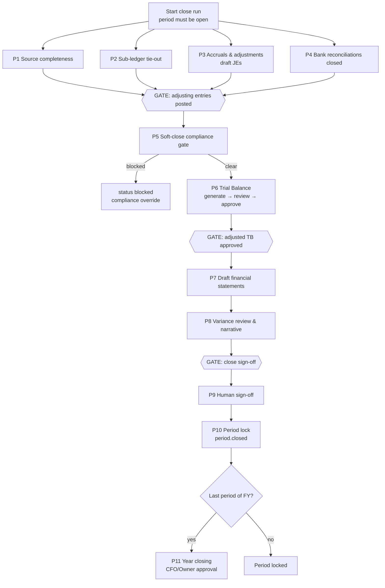

# Month-End Close Flow — QAYD Frontend
Version: 1.0
Status: Design Specification
Module: Frontend
Submodule: Flows / MONTH_END_CLOSE
---

# Purpose

This document specifies the end-to-end journey of **closing an accounting period** — the multi-day,
multi-actor, multi-screen procedure that takes a fiscal period from `open` to `locked`, with its trial
balance approved, its financial statements drafted, its adjustments posted, its banks reconciled, and a human
sign-off recorded on an immutable, tamper-evident record. It is the largest *flow* document in this set
because the close is not one screen but a supervised sequence over the Journal Entries, Trial Balance, Bank
Reconciliation, and Financial Statements surfaces, orchestrated by a checklist. It re-specifies none of those
screens; it links out. The close choreography (its eleven phases, gates, and agents) is owned by
[`../../ai/workflows/MONTH_END_CLOSE.md`](../../ai/workflows/MONTH_END_CLOSE.md); the Trial Balance and
Journal Entries screens by [`../TRIAL_BALANCE.md`](../TRIAL_BALANCE.md) and
[`../JOURNAL_ENTRIES.md`](../JOURNAL_ENTRIES.md); the reconciliation gate by
[`../BANK_RECONCILIATION.md`](../BANK_RECONCILIATION.md) and its own
[`BANK_RECONCILIATION_FLOW.md`](./BANK_RECONCILIATION_FLOW.md). Every endpoint, permission key, and status
enum named here is restated only to make the journey legible; a contradiction with the owning document is a
defect to resolve in review, never a code decision.

> **Sourcing note (read first).** The close is driven by the **Fiscal Periods module's own service**, which
> performs the period status transitions (`open → soft_close → locked`) and owns the close-run lifecycle. The
> frontend/AI documents this flow draws from name the *behaviour* and the *events* of that service in full,
> but do **not** enumerate the literal REST paths for "start a close run," "advance/lock a period," "generate
> financial statements," or a discrete "sign-off" endpoint — those belong to `docs/accounting/FISCAL_PERIODS.md`
> / the MONTH_END_CLOSE backend spec. Where this document must name such a call it does so descriptively and
> flags it, rather than inventing a path; the Trial Balance and Journal Entries endpoints it *does* name are
> quoted verbatim from their owning docs. Similarly, the docs name `accounting.period.reopen` and
> `compliance.block.override` as literal close-control permissions, but describe the *lock* itself as a
> service-performed status transition rather than a distinct `accounting.period.lock` key; this document uses
> the sign-off permission plus the service transition and flags the gap.

The frontend owns no close logic. It never computes the close-readiness score, never decides a period may
lock, never posts an adjusting entry. It renders a checklist of gates, surfaces each blocking condition with
its drill-through, and hands every sensitive act — post an accrual, approve the trial balance, sign off — to
the API under the acting human's own permissions.

# Actors & Preconditions

| Actor | Role in this flow |
|---|---|
| Finance Manager | The primary close driver — works the checklist, posts/approves adjustments, approves the trial balance, and signs off (or hands sign-off to the CFO above a tier threshold). |
| CFO / Owner | Everything the Finance Manager does; the CFO signs off above Tier-2 and holds `accounting.period.reopen`; the year-closing sweep needs CFO/Owner approval at any amount. |
| Senior Accountant / Accountant | Post correcting and accrual entries, work sub-ledger tie-outs, resolve findings; do not sign off or lock. |
| Auditor / External Auditor | Read-only over the close run, TB/FS snapshots, findings, compliance assessments, and audit logs (`accounting.journal.read` + `.export` only); the External Auditor is re-notified on a reopen. |
| AI service account (General Accountant, Banking Agent, Auditor, Tax Advisor, Reporting Agent, CFO, Compliance, Approval Assistant, Fraud Detection) | Drive the automatable phases — draft adjustments, reconcile, generate the TB and statements, produce findings and the variance narrative, gate compliance — but **never** submit/approve/post any artifact and never lock a period. No agent both proposes and approves the same artifact. |

**Preconditions to start a close run** (the API enforces each; the UI reflects them):
- The target period is `open` — a period in `future`, `soft_close`, `locked`, or `closed` cannot start a new
  run (`409 Conflict` naming the current status).
- No other `in_progress` run exists for the same `fiscal_period_id` (a UNIQUE constraint).
- The Chart of Accounts has active Retained Earnings and Current-Year Net Profit accounts.
- The preceding period is at least `soft_close`.
- Agents may be disabled — the close degrades to fully manual, it is never blocked by an agent being off.

# Entry Points

| Entry point | Screen / control | Gate |
|---|---|---|
| **Period Status tile → "Close this period"** | Accounting hub ([`../screens/ACCOUNTING_SCREEN.md`](../screens/ACCOUNTING_SCREEN.md)), the tile's close-readiness popover | `accounting.period.reopen`/sign-off tier (Close disabled while readiness `< 100`) |
| **Month-End Close checklist** route | A dedicated close workbench (Fiscal Periods module) | Finance Manager tier |
| **Close Approval Queue** | The Approval Assistant's role-scoped queue of pending human actions | The specific action's own key |
| **Proactive notification** | `period_close.ready_for_signoff` / `period_close.blocked` to the Topbar bell | Finance Manager tier |
| **Resume an in-progress run** | Re-entering the checklist for a run already `in_progress`/`blocked` | Finance Manager tier |

# Flow Overview

The close is **eleven phases**; phases 1–4 run in parallel, 5+ strictly sequential, with three human-approval
gates interleaved. The checklist is the spine; each phase links out to the screen where its work is actually
done.



The close-readiness **score** (`period_close_runs.close_score`, 0–100) is a continuously-recomputed progress
indicator surfaced on the Period Status tile and the checklist header — it is **never itself a gate**; below
100 is normal and expected. The gates are the human approvals and the compliance clear, not the number.

```
close_score = 25×source_completeness_pct + 25×sub_ledger_tie_out_pct
            + 20×trial_balance_clean_pct + 15×(compliance_gate_clear?1:0)
            + 15×(financial_statements_balanced?1:0)
```

# Step-by-Step

Each phase names where its work happens, the user action, the UI state, the driving call(s), and its
success/blocking branches. Blocking items across the whole run are carried in
`period_close_runs.blocking_compliance_alert_ids` and rendered as drill-through links, never as opaque "not
ready" text.

### Phase 1 — Source-module completeness sweep (`source_completeness_check`)

- **Where:** the checklist item links into Sales, Purchasing, Payroll, Inventory, and Banking.
- **State:** the item shows the count of unposted source documents per module — open Sales invoices,
  Purchasing bills, Payroll runs, Inventory stock movements — each a link to that module's list filtered to
  the period. The Banking Agent is concurrently driving every account's `bank_reconciliations` toward
  `balanced` (Phase 4).
- **Call:** module list reads (e.g. `GET /api/v1/sales/invoices?filter[status]=draft&...`); posting each is
  the module's own action.
- **Branch:** clear when every source document is posted; otherwise the item stays incomplete and contributes
  to `source_completeness_pct` below 100.

### Phase 2 — Sub-ledger tie-out (`sub_ledger_tie_out`)

- **Where:** an Auditor-driven comparison surfaced as a checklist item.
- **State:** compares `customers.balance_base_currency`, `vendors.balance_due`, and open inventory valuation
  layers against their GL control-account balances; a real (non-timing) mismatch surfaces a
  `control_account_mismatch` finding linking to a General-Accountant-drafted correcting entry.
- **Call:** the correcting entry is a draft JE (Phase 3 mechanics); posting is a human act.

### Phase 3 — Accruals & adjusting entries (`currency_revaluation`, `depreciation`, `accrual_deferral_draft`, `tax_provision_confirm`)

- **Where:** [`../JOURNAL_ENTRIES.md`](../JOURNAL_ENTRIES.md). The General Accountant drafts each of currency
  revaluation, depreciation, accrual/deferral, and the tax-liability provision as a **draft** JE
  (`entry_type IN ('adjusting','ai_generated')`, `status='draft'`).
- **User action:** reviews each draft — its lines, its `ai_confidence`, its `reasoning`, and its
  `source_documents` — and posts it (or edits/rejects it). An `entry_type='ai_generated'` entry requires **at
  least one human approval regardless of amount or confidence.**
- **Call:** `POST /api/v1/accounting/journal-entries/{id}/submit` → `.../approve` → `.../post`
  (`accounting.journal.submit`/`.approve`/`.post`).
- **Branch:** every adjusting entry posted → the first gate; a rejected draft returns for rework.

### Phase 4 — Bank reconciliations closed (`bank_reconciliation_close`)

- **Where:** [`BANK_RECONCILIATION_FLOW.md`](./BANK_RECONCILIATION_FLOW.md). Every `bank_accounts` row's
  reconciliation must reach `closed` (a **human-only** act, ever — `bank.reconcile.close`, never an agent).
- **State:** the checklist item lists each account with its reconciliation status; a `discrepancy` or
  `in_progress` account is a live link into its workbench.
- **Branch:** all accounts `closed` → contributes to readiness; any open reconciliation holds the gate.

### Gate 1 — Adjusting entries posted (human-approval gate)

All Phase 1–4 work is complete and every adjusting entry is posted. This is a human checkpoint, not an
automatic transition.

### Phase 5 — Fiscal-period soft-close gate (`compliance_gate` → `soft_close_transition`)

- **Where:** the checklist header.
- **State:** `fiscal_period.close_requested` fires; the Compliance Agent runs a **synchronous**
  SoD/attestation/retention check. A blocking flag halts progress and sets the run `status='blocked'`, with
  `blocking_compliance_alert_ids` rendered as drill-through cards.
- **User action (blocked path):** an Owner/CFO/Auditor clears a blocking flag with
  `compliance.block.override` (a logged, reasoned override); a blocking flag itself requires an LLM pass and
  an independent rule-engine pass to *agree* — a single-pass disagreement downgrades to advisory.
- **Branch:** clear → the Fiscal Periods service transitions `fiscal_periods.status: open → soft_close`;
  `period_close_runs.status → in_progress` continues.

### Phase 6 — Trial Balance: generate → validate → review → approve (`trial_balance_generate`/`_review`/`_approve`)

- **Where:** [`../TRIAL_BALANCE.md`](../TRIAL_BALANCE.md), the Report Page Template.
- **User action:** generates the **adjusted** TB (post-Phase-3), reviews the Auditor's and Fraud Detection's
  findings, resolves/acknowledges/dismisses each with a mandatory reason, and records the approval chain
  (Senior Accountant / Finance Manager, plus CFO above Tier-2).
- **State:** the Findings Bar lists AI-flagged variances/imbalances (`currency_error`,
  `control_account_mismatch`, `variance_pattern`, `duplicate`), each with a `ConfidenceBadge`
  (`normalizeConfidence(..., 'fraction')`), severity (`low`/`high`/`critical`), and a plain-text
  `suggested_action` — **never** an auto-apply button. An out-of-balance TB (`status: out_of_balance`) blocks
  approval.
- **Call:** `POST /api/v1/accounting/trial-balance/generate` (`.generate`, may `202` `status:"generating"`),
  `PATCH /api/v1/accounting/trial-balance/findings/{findingId}` (`.finding.manage`, body
  `{ status, resolution_note }`), `POST /api/v1/accounting/trial-balance/{id}/review` (`.review`),
  `POST /api/v1/accounting/trial-balance/{id}/approve` (`.approve`, body `{ action, comment }`).
- **Branch:** TB `approved` → the second gate; an unresolved critical finding or imbalance holds it. An
  Owner/Admin may record an override adjustment on an unresolved imbalance under
  `accounting.trial_balance.override.post`.

### Gate 2 — Adjusted trial balance approved (human-approval gate)

### Phase 7 — Draft financial statements (`financial_statements_draft`)

- **Where:** the Financial Statements surfaces (Balance Sheet, Income Statement, Cash Flow, Statement of
  Changes in Equity).
- **State:** the Reporting Agent generates each in `mode='historical'`, `status: 'draft' → 'under_review'`;
  the server validates the balance identity (VR-01) and the cash-flow-to-balance-sheet cash tie (VR-03). A
  failed identity blocks progression.
- **Branch:** statements `under_review` and balanced → Phase 8.

### Phase 8 — Variance review & narrative (`variance_review`)

- **Where:** a CFO review surface.
- **State:** the CFO Agent produces the ratio pack, budget/prior-period variance, a liquidity check, and a
  "ready to close" recommendation as an `ai_decisions` row (`decision_type='cfo_variance_narrative'`,
  optionally `'cfo_liquidity_alert'`), rendered with its confidence and reasoning.
- **Branch:** reviewed → `period_close.ready_for_signoff` fires (payload carries `close_score` and an open-findings
  summary) → the third gate.

### Gate 3 — Close sign-off (human-approval gate)

### Phase 9 — Human sign-off (`human_signoff`)

- **Where:** the checklist's sign-off panel / the Close Approval Queue.
- **User action:** a Finance Manager (or CFO ≥ Tier-2) reviews the full close packet — the approved TB, the
  drafted statements, the posted adjustments, the reconciliations, the variance narrative — and signs off.
- **State:** the sign-off is a single deliberate, confirmed action; the packet is presented read-together, not
  as scattered links.
- **Call:** the Fiscal Periods service records `period_close_runs.signed_off_by` + `signed_off_at`, moves the
  `financial_statement_snapshots` `under_review → final`, and emits `period_close.signed_off`. *(The literal
  sign-off endpoint is owned by the Fiscal Periods backend spec — see the sourcing note.)*
- **Branch:** signed → Phase 10.

### Phase 10 — Period lock (`period_lock`)

- **State:** the Fiscal Periods service transitions `fiscal_periods.status: soft_close → locked`; `period.closed`
  emits (its payload carries `trial_balance_snapshot_id`, the `financial_statement_snapshot_ids`,
  `signed_off_by/at`, `locked_at`, and `close_score`). The period is now immutable; the Period Status tile
  reads `locked`; every module's posting into the period is refused server-side.

### Phase 11 — Year closing (`year_closing`, last period of the FY only)

- **State:** Revenue and Expense are swept to Retained Earnings; `fiscal_years.status → closed`. This requires
  CFO/Owner approval at any amount.
- **Branch:** done — the fiscal year is closed.

# Flow-Specific Guards

The guard specific to this flow is the **sign-off gate** — it makes concrete that the close-readiness score
is *not* a gate (a signer may sign below 100), while the true gates (every earlier phase complete, no open
critical finding, no compliance block, statements balanced) genuinely arm the button. It also distinguishes a
permission omission from a business-rule disablement:

```tsx
// components/close/close-signoff-action.tsx
'use client';

import { Can } from '@/components/auth/can';
import { Button } from '@/components/ui/button';
import type { CloseRun } from '@/types/close';

export function CloseSignoffAction({ run, onSignOff }: { run: CloseRun; onSignOff: () => void }) {
  // The score is a progress indicator, NOT a gate — deliberately not referenced here.
  const gatesCleared =
    run.status === 'ready_for_signoff' &&      // Phases 1–8 complete, Gates 1–2 passed
    run.open_critical_finding_count === 0 &&   // no unresolved critical TB finding
    run.blocking_compliance_alert_ids.length === 0 && // compliance gate clear
    run.financial_statements_balanced;         // VR-01 / VR-03 hold

  return (
    <Can permission="accounting.period.signoff" fallback={null /* omitted for a non-signer tier */}>
      <Button
        disabled={!gatesCleared}
        aria-describedby={!gatesCleared ? 'signoff-blocked-reason' : undefined}
        onClick={onSignOff} // opens the read-together close packet + confirming dialog
      >
        Sign off &amp; close
      </Button>
      {!gatesCleared && (
        <p id="signoff-blocked-reason" className="text-caption text-ink-9">
          {/* enumerated blocking reasons, each a drill-through — never an opaque "not ready" */}
        </p>
      )}
    </Can>
  );
}
```

The `accounting.period.signoff` key above is descriptive: the literal sign-off/lock permission and endpoint
are owned by the Fiscal Periods backend spec (see the sourcing note); this document names the *gate logic*
and defers the exact key/path to that owner. `Can` omits the control for a non-signer tier; the `disabled`
state is purely a business-rule block whose reasons are enumerated as drill-through links, matching the
Period Status tile's own "Close this period" treatment on the Accounting hub.

# Happy Path

A Finance Manager opens the close checklist for **June 2026**. Phases 1–4 are mostly green: Sales, Purchasing,
Payroll, and Inventory show all documents posted, and the Banking Agent has already driven all six accounts to
`balanced`, which she closes one by one. In Phase 3 the General Accountant has drafted four adjustments — a
utilities accrual (`ai_confidence` 0.79, reasoning citing a six-month trailing average), depreciation, an FX
revaluation, and the tax provision; she reviews each and posts them, clearing Gate 1. She requests the
soft-close; the Compliance Agent's synchronous gate clears, and the period moves to `soft_close`. She
generates the adjusted Trial Balance; the Auditor flags one `currency_error` finding at 0.98 confidence
suggesting a correcting entry — she posts the correction, regenerates, and the TB balances at KWD
2,144,572.800; she and the CFO approve it, clearing Gate 2. The Reporting Agent drafts the four statements,
all balancing (VR-01/VR-03 hold); the CFO Agent's variance narrative recommends closing. `period_close.ready_for_signoff`
fires; she reviews the full packet and signs off. The Fiscal Periods service locks the period,
`period.closed` fires with `close_score: 96.5`, and the Period Status tile flips to `locked`. Because June is
not the last period of the fiscal year, Phase 11 is skipped. Human decisions: close each reconciliation, post
four adjustments plus one correction, clear the compliance gate, approve the TB, sign off — every computation
was the agents' and the server's.

# Alternate & Error Paths

| Path | Trigger | Behavior |
|---|---|---|
| **Period not startable** | Target period not `open` | `409 Conflict` naming the current status; no run starts. |
| **Compliance block** | A blocking flag at Phase 5 | `status='blocked'`; `blocking_compliance_alert_ids` drill-throughs; cleared only by `compliance.block.override` (Owner/CFO/Auditor) with a logged reason; single-pass disagreement downgrades to advisory. |
| **TB out of balance** | `POST .../generate` → `status:"out_of_balance"` | Approval blocked; an out-of-balance finding drills to the offending line; resolve or record an override adjustment (`accounting.trial_balance.override.post`, Owner/Admin). |
| **Unresolved critical finding** | A `critical` finding still `open` | Gate 2 held; the finding must be acknowledged/resolved/dismissed with a reason first. |
| **Statement identity fails** | VR-01/VR-03 fails at Phase 7 | Progression blocked; the imbalance is surfaced for correction before sign-off. |
| **Un-do a soft-close** | Mistake caught after `soft_close` | Period moves `soft_close → open`; same elevated permission + mandatory reason as a reopen; `period_close_runs.status → rolled_back` with `rollback_reason`; a fresh run may start; prior run history stays queryable. |
| **Reopen a locked period** | Correction needed after lock | The Journal Entries formal reopening — `accounting.period.reopen` (Owner/CFO only), mandatory logged reason, automatic External Auditor re-notification. Reopening is always a bigger event than progressing. |
| **Un-do a year closing** | Year-close wrong | Never edited — reverse the year-closing entry and re-run Phase 11. |
| **Agent disabled** | AI off for a phase | The phase degrades to manual work; the close is never blocked by an absent agent. |
| **Duplicate-suspected adjustment** | `meta.warnings DUPLICATE_SUSPECTED` on a draft JE | Non-blocking advisory with `candidate_ids`; the human decides. |

# Data & State

## Endpoints across the flow

| Purpose | Endpoint | Permission | Owned by |
|---|---|---|---|
| Resolve current period | `GET /api/v1/accounting/fiscal-periods` | `accounting.read` | Fiscal Periods |
| Draft/adjusting JE lifecycle | `POST /api/v1/accounting/journal-entries/{id}/submit\|approve\|reject\|post\|reverse` | `.submit`/`.approve`/`.post`/`.reverse` | [`../JOURNAL_ENTRIES.md`](../JOURNAL_ENTRIES.md) |
| JE AI explanation | `GET /api/v1/accounting/journal-entries/{id}/ai-explanation` | `.read` | Journal Entries |
| Reconciliation close | `POST /api/v1/banking/reconciliations/{id}/close` | `bank.reconcile.close` | [`../BANK_RECONCILIATION.md`](../BANK_RECONCILIATION.md) |
| TB generate / refresh | `POST /api/v1/accounting/trial-balance/generate`, `.../{id}/refresh` | `.generate` | [`../TRIAL_BALANCE.md`](../TRIAL_BALANCE.md) |
| TB findings | `PATCH /api/v1/accounting/trial-balance/findings/{findingId}` | `.finding.manage` | Trial Balance |
| TB review / approve | `POST /api/v1/accounting/trial-balance/{id}/review\|approve` | `.review` / `.approve` | Trial Balance |
| Start close run · advance · **lock** · generate statements · **sign-off** · reopen | *Fiscal Periods service — literal paths owned by `docs/accounting/FISCAL_PERIODS.md` (see sourcing note)* | sign-off tier / `accounting.period.reopen` | Fiscal Periods |
| Compliance override | *Compliance service* | `compliance.block.override` | Compliance |

## Mutations & invalidations

Every close mutation is **pessimistic** — a posted adjustment, an approved TB, a signed-off period each change
authoritative state and are shown done only after the server's `2xx`. JE mutations use optimistic-concurrency
`version` (a `409` on conflict). `trialBalanceKeys` and `journalEntryKeys` invalidate on their respective
approvals; a `period.closed` event invalidates the Accounting hub's Period Status tile, the TB history, and the
statements snapshots. Snapshots (`trial_balance_snapshots`, `financial_statement_snapshots`) each carry a
`content_hash` (sha256 over the ordered line set) — tamper-evidence the UI surfaces on the closed record.

## Realtime

| Channel / event | Effect |
|---|---|
| `period_close.initiated` | Checklist appears / updates to `in_progress`. |
| `period_close.blocked` (payload `blocking_compliance_alert_ids`) | Checklist header → `blocked`; drill-through cards render. |
| `period_close.ready_for_signoff` (payload `close_score` + open findings) | Sign-off panel arms; Topbar notification. |
| `period_close.signed_off` → `period.closed` → `fiscal_year.closed` | Sequentially lock the period / year; tile flips; posting refused. |
| `private-company.{id}.trial-balance.{snapshot_id}` (`trial_balance.generated`/`.validated`) | TB screen live updates. |
| `company.{companyId}.accounting` (`.journal.posted`, `.journal.ai_draft_ready`) | Adjustment drafts and postings stream into the checklist. |

# AI Touchpoints

Nine agents drive the automatable phases; **not one submits, approves, posts, or locks.** Every AI artifact is
a `draft` or a `finding` or a `decision` a human resolves.

| Agent | Phase | Artifact | Human gate |
|---|---|---|---|
| General Accountant | 2, 3 | Revaluation/depreciation/accrual/deferral + correcting draft JEs (`status='draft'`) | `entry_type='ai_generated'` needs ≥1 human approval at any amount/confidence. |
| Banking Agent | 4 | Drives reconciliations to `balanced` | Human closes each (`bank.reconcile.close`). |
| Auditor | 6 | `trial_balance_ai_findings` (`confidence` 0–1) | Human acknowledges/resolves/dismisses with a reason; `suggested_action` is plain text, never auto-apply. |
| Tax Advisor | 3 | `ai_decisions` (`liability_computation`) | Confirmed by a human before posting the provision. |
| Reporting Agent | 7 | `financial_statement_snapshots` (`draft`→`under_review`) | Advanced to `final` only by sign-off. |
| CFO | 8 | `ai_decisions` (`cfo_variance_narrative`, `cfo_liquidity_alert`) | Advisory input to the sign-off decision. |
| Compliance | 5 | `compliance_assessments`/`_alerts`, optional blocking decision | Blocking flag needs LLM + rule-engine agreement; cleared by `compliance.block.override`. |
| Approval Assistant | all | Aggregates pending human actions into a role-scoped Close Approval Queue | Routing only — decides nothing. |
| Fraud Detection | 6 | Duplicate/anomaly findings in the same TB feed | Human resolves. |

The three confidence scales are kept distinct: `trial_balance_ai_findings.confidence` and
`journal_entries.ai_confidence` are `0.0000–1.0000` (rendered via `normalizeConfidence(..., 'fraction')`);
`ai_decisions.confidence_score` is `0–100` (`'percentage'`). A **narrow, CFO-approved, per-company auto-post
whitelist** exists (a fixed amount/account pair at `ai_confidence ≥ 0.98`, posted by a background job) — where
it applies, the JE Summary Rail explicitly reads "Posted automatically under company policy," so even the
whitelisted case is disclosed, never silent. There is no general "Do it" that posts an adjustment.

# Permissions

| Step | Permission | If absent |
|---|---|---|
| View the checklist / period status | `accounting.read` + Finance Manager tier | The close workbench is not offered; the Period Status tile still shows readiness read-only. |
| Post adjusting entries | `accounting.journal.submit`/`.approve`/`.post` | The lifecycle button is omitted for the transition the role cannot make (never shown disabled-and-greyed). |
| Close reconciliations | `bank.reconcile.close` | Handed off to a Finance Manager; never an AI principal. |
| Approve the trial balance | `accounting.trial_balance.approve` | The `ApprovalCard` renders read-only; Owner/CEO/CFO + Finance Manager hold it, not Accountants. |
| Override a TB imbalance | `accounting.trial_balance.override.post` | Owner/CEO/CFO only; omitted otherwise. |
| Clear a compliance block | `compliance.block.override` | Owner/CFO/Auditor only; the block stands. |
| Sign off / lock the period | Sign-off tier (Finance Manager, or CFO ≥ Tier-2) via the Fiscal Periods service | Sign-off omitted; the run stalls at Gate 3 awaiting an authorized signer. |
| Reopen a locked period | `accounting.period.reopen` | Owner/CFO only; mandatory reason; External Auditor re-notified. |
| Year closing | CFO/Owner approval at any amount | Phase 11 cannot complete without it. |

The Auditor/External Auditor hold `accounting.journal.read` + `.export` only and see the entire run read-only,
with tamper-evident snapshots. RBAC is a UI courtesy over the API's authority; a revoked permission surfaces
as a `403` on the next action, caught inline, and re-renders every gated control on the next navigation.

# i18n & RTL

- Every checklist string, phase label, finding type, gate name, and dialog is keyed in both `en.ts` and
  `ar.ts`; Arabic is professionally authored. AI-authored `reasoning`/`suggested_action`/narrative text arrives
  already localized from the API's content-negotiation contract — this flow localizes only chrome.
- The checklist and statement canvases mirror under `dir="rtl"` via logical properties; the multi-phase stepper
  flips reading order without flow-specific code.
- **Amount columns across the TB, statements, and adjustment JEs use fixed numeric alignment** (Exception A);
  numerals, account codes, period labels, and the `content_hash` render `dir="ltr"` / `unicode-bidi: isolate`
  and never in Eastern Arabic-Indic digits. Financial-statement dates and figures use `Intl.*` with the
  company base currency.

| Context | English | Arabic |
|---|---|---|
| Title | Month-End Close | إقفال نهاية الشهر |
| Gate | Adjusted trial balance approved | اعتماد ميزان المراجعة المعدّل |
| Action | Sign off & close | الاعتماد والإقفال |
| Status | Blocked | محظور |
| Status | Locked | مُقفل |
| Score | Close readiness | جاهزية الإقفال |

# Accessibility

- The checklist is a real ordered structure with each phase a labeled region; phase status (complete /
  in-progress / blocked / requires-human) is conveyed as text and icon, never color alone — a colorblind or
  grayscale reviewer reads the state from words.
- The multi-phase stepper renders "Phase N of 11" and each gate's role/status as real text (the `ApprovalStepper`
  pattern), not a hue-only progress bar.
- Blocking-condition drill-throughs are real links; the compliance-override and reopen reason fields are real
  required inputs with associated labels; every confirming dialog (sign-off, override, reopen) traps focus and
  returns it on close.
- Realtime phase advances announce `aria-live="polite"`; a `period_close.blocked` event announces assertively
  (`role="alert"`) because it halts the close the user is driving.
- Findings' `ConfidenceBadge` dots are `aria-hidden` with the score and reasoning as adjacent real text; the
  `suggested_action` is readable text, never an actionable-looking control.

# Edge Cases

| Edge case | Behavior |
|---|---|
| **Abandonment mid-close** | The run persists server-side as `in_progress`; nothing is lost on navigating away — the close is a durable `period_close_runs` record, not client state. |
| **Resume** | Re-entering the checklist rehydrates from the run's server state — completed phases stay complete, the current gate is where the user left it; a `blocked` run resumes on its blocking cards. |
| **Back-button** | The checklist is a durable server-driven surface; back navigates screens, never "un-does" a phase — undo is always an explicit, permissioned, reasoned rollback. |
| **Partial** | A period is never "half locked" — the lock is the terminal Phase-10 transition after sign-off; a run interrupted at any earlier phase simply stays at that phase, fully resumable. |
| **Double-submit** | Sign-off, approve, and post controls disable on first click; mutations carry idempotency keys and optimistic-concurrency `version`; a duplicate is a no-op, a stale one `409`s. |
| **Concurrent edit — two users advance the same run** | The UNIQUE `in_progress` constraint and per-artifact `version` mean the second actor's conflicting action `409`s and re-fetches; exactly one close run exists per period. |
| **Concurrent edit — a colleague posts a draft into the period mid-close** | A new draft landing during close re-lowers `close_readiness`/`close_score`; a sign-off/lock re-validates server-side and `409`s against the now-lower state rather than locking over an unposted entry. |
| **Locked, then a late transaction** | A transaction dated inside a locked period lands in the next open period; correcting a locked period requires the `accounting.period.reopen` procedure, never an in-place edit. |
| **Snapshot integrity** | The TB and FS snapshots carry a `content_hash`; the closed record is tamper-evident and the External Auditor's read-only view exposes it. |

# End of Document
