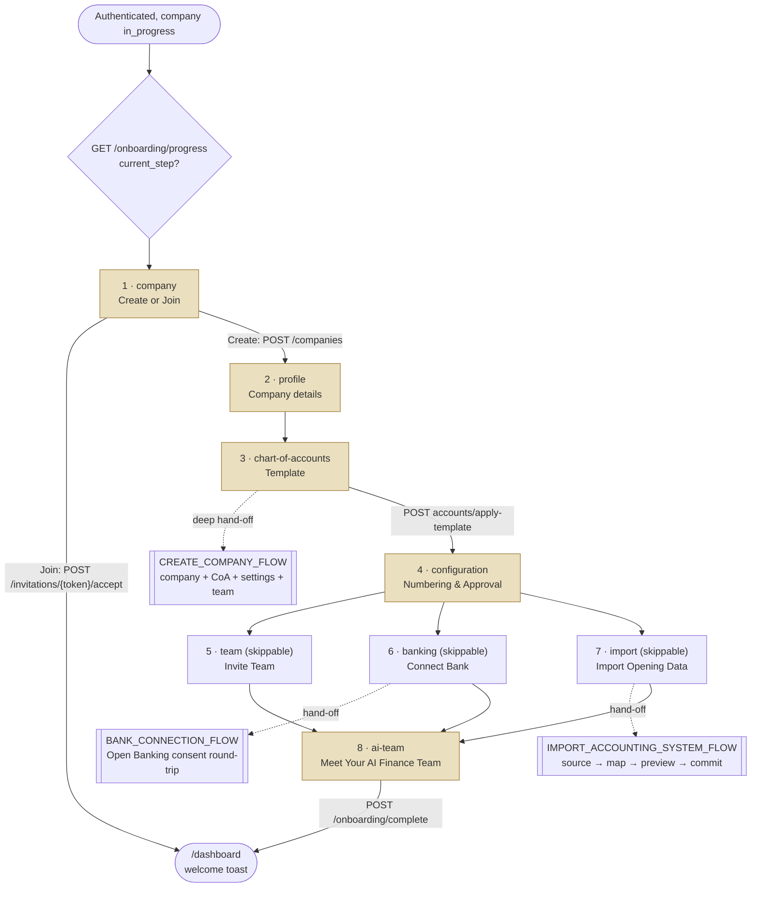

# Onboarding Flow — QAYD Frontend
Version: 1.0
Status: Design Specification
Module: Frontend
Submodule: Flows / ONBOARDING
---

# Purpose

This document specifies the first-run journey that turns a freshly authenticated user into the owner of a
fully operational QAYD company — or, on the shorter fork, drops an invited teammate straight into a company
someone else has already built. It is a **flow** document: where [`../ONBOARDING.md`](../ONBOARDING.md) is the
authoritative *screen* specification that owns the `/onboarding` route group, its eight step routes, every
component, endpoint, and state on them, this document owns the *journey* — the arrows into onboarding from the
login flow, the fork at step 1, the three sub-flows steps 3, 6, and 7 hand off into, the progress that persists
and resumes across sittings, and the exit into the operational product. It re-specifies nothing
[`../ONBOARDING.md`](../ONBOARDING.md) already owns; it names the connective tissue between that screen doc,
the login flow before it, and the three deeper flows it branches into.

The precedence rule is the same one every document in this platform states for itself. Where this flow is
silent on a fact — a component prop, an exact skeleton geometry, a per-step endpoint — [`../ONBOARDING.md`](../ONBOARDING.md)
governs first, then [`../../foundation/USER_ONBOARDING.md`](../../foundation/USER_ONBOARDING.md) and
[`../../foundation/COMPANY_STRUCTURE.md`](../../foundation/COMPANY_STRUCTURE.md) for the product-level journey
and data model, then [`../README.md`](../README.md) for the platform conventions every step inherits. Where this
document appears to contradict any of them on a fact, that is a defect to reconcile in review, never a decision
resolved in code. This flow's own additive contribution is the **cross-flow map**: it is the one document that
draws, in one place, how login → onboarding → company-creation → import → bank-connection → the first
`/dashboard` render actually connect, with each segment delegated to the flow or screen doc that owns it.

Three constraints, restated once for the journey, inherited from [`../ONBOARDING.md`](../ONBOARDING.md) and
[`../README.md`](../README.md):

1. **The frontend decides nothing a template, a rule, or a permission already decides.** Onboarding collects
   confident, validated choices and submits them; it never computes which Chart of Accounts is IFRS-aligned,
   whether an industry template fits, or a numbering sequence's next value — Laravel does.
2. **AI is visible and narrated, never silent, and never auto-commits anything sensitive.** The AI Guide Dock
   narrates each step in the voice of the specialist agent that owns that domain, and every AI default (an
   industry template, a numbering pattern, an approval chain) is a *proposal* the owner explicitly keeps or
   changes — never a fact already committed. Every agent runs `suggest_only` for the entire flow.
3. **RBAC is reflected, not enforced, here — and it gates a company that barely exists yet.** Steps 1–2 need
   only a valid session (creating a company is how a user becomes its Owner); steps 3–8 require the acting user
   to be `owner_user_id` or hold `company.onboarding.manage`, enforced server-side on every onboarding endpoint.

Success is measured exactly as [`../../foundation/USER_ONBOARDING.md`](../../foundation/USER_ONBOARDING.md)
states it: **the median company completes onboarding in under ten minutes.** That budget is why steps 6–8
(connect a bank, import opening data, meet the AI team) are optional and deferrable, never blocking the path to
a working `/dashboard`.

# Actors & Preconditions

| Actor | Description |
|---|---|
| **New Owner** | An authenticated, email-verified user with zero companies attached. Creates a company at step 1 and becomes its `owner_user_id`. The primary subject of this flow. |
| **Delegated setup partner** | An implementation partner or accountant finishing setup on an Owner's behalf, holding `company.onboarding.manage` without being `owner_user_id`. |
| **Invited teammate** | A user arriving via an invitation link who takes the Join fork at step 1 and bypasses steps 2–8 entirely. |
| **Returning Owner** | Someone resuming a partially completed onboarding on the same or a different device — the resume path is a first-class case, not an error. |

| Precondition | Requirement |
|---|---|
| A session exists | The login flow ([`./LOGIN_FLOW.md`](./LOGIN_FLOW.md)) has resolved; `resolvePostAuthDestination`'s onboarding gate is what routed the user here. |
| `onboarding_status = in_progress` (or no company) | A company whose status is `completed` renders the real product, not this flow; a user with zero companies is routed to step 1. |
| Ownership or delegation for steps 3–8 | `owner_user_id = auth()->id()` OR `company.onboarding.manage`; the server enforces this on every `PATCH /onboarding/progress` and step-specific write. |
| A valid invitation token (Join fork only) | `POST /api/v1/invitations/{token}/accept` — a wrong/expired/used token renders inline, never a route-level `403`. |

# Entry Points

| Entry point | Lands on | Notes |
|---|---|---|
| Post-authentication onboarding gate | `/onboarding` → resolved current step | The login flow's `resolvePostAuthDestination` routes a session whose active company is `in_progress` to `/onboarding` *before* any Home resolution ([`./LOGIN_FLOW.md → Step 6`](./LOGIN_FLOW.md)). |
| `+ Add a company` in the Topbar `CompanySwitcher` | `/onboarding?intent=new-company` | An existing Owner spins up an additional company from inside a session that already has one; arrives with `user` already resolved and skips anything account-level. |
| `+ Add a company` row on `/select-company` | `/onboarding?intent=new-company` | The full-page company picker's exit into this flow ([`./LOGIN_FLOW.md → Step 4`](./LOGIN_FLOW.md)). |
| A deep-linked invitation email | `/onboarding/company?invite=<token>` | Pre-fills the read-only token field on the Join fork; the Create/Join choice still renders un-defaulted. |
| Resume (returning session, any device) | `/onboarding` → `redirect()` to `current_step` | `app/onboarding/page.tsx` resolves the step from `GET /api/v1/onboarding/progress` and redirects; this is the one route never linked to directly. |
| Re-authentication after a mid-flow session lapse | `/onboarding` (not Home) | `middleware.ts` returns the user to `/onboarding` because `onboarding_status` is still `in_progress`. |

# Flow Overview

The journey is a linear eight-step wizard with one fork at step 1 (Create vs Join) and three sub-flow
hand-offs (Chart of Accounts, Connect Bank, Import). Every *node* is a step route owned by
[`../ONBOARDING.md`](../ONBOARDING.md); every *hand-off* is a flow owned by its own document.

Numbered step map (Create branch):

1. **company** — Create or Join. *Required.* Create calls `POST /companies`; Join short-circuits the whole
   wizard. Owned in depth by [`./CREATE_COMPANY_FLOW.md`](./CREATE_COMPANY_FLOW.md).
2. **profile** — the full company-information field set. *Required.*
3. **chart-of-accounts** — country + industry template, live preview, apply. *Required.* Hands into the CoA
   portion of [`./CREATE_COMPANY_FLOW.md`](./CREATE_COMPANY_FLOW.md).
4. **configuration** — numbering patterns + starter approval chain. *Required* — the last required Create step.
5. **team** — invite teammates with roles. *Skippable.*
6. **banking** — connect a bank account. *Skippable.* Hands into [`./BANK_CONNECTION_FLOW.md`](./BANK_CONNECTION_FLOW.md).
7. **import** — migrate opening data. *Skippable.* Hands into [`./IMPORT_ACCOUNTING_SYSTEM_FLOW.md`](./IMPORT_ACCOUNTING_SYSTEM_FLOW.md).
8. **ai-team** — meet the fifteen agents, then Finish setup. *Required but non-blocking* — must be visited,
   never a field to complete.

# Step-by-Step

Each step names the route it happens on (linked to the screen doc), the user action, UI state, the exact
`/api/v1` call, and its success/failure branches. All facts are drawn from [`../ONBOARDING.md`](../ONBOARDING.md).

## Step 0 — Resume resolution

| | |
|---|---|
| **Route** | `/onboarding` (`app/onboarding/page.tsx`, Server Component, no UI) — [`../ONBOARDING.md → Route & Access`](../ONBOARDING.md) |
| **Action** | Any load of the bare `/onboarding` prefix. |
| **API call** | `GET /api/v1/onboarding/progress` → `{ company_id, mode, current_step, steps }`; `company_id` is `null` before step 1 completes. |
| **Success** | `redirect()` to `current_step`'s own route. A returning session (any `current_step` other than `company`) shows a one-time "Welcome back — resuming where you left off" banner above the rehydrated content. |
| **Failure** | A corrupted/unreadable progress record is treated as a fresh start at `company`, logged server-side, never surfaced as a scary error. |

## Step 1 — Create or Join (the fork)

| | |
|---|---|
| **Route** | `/onboarding/company` — [`../ONBOARDING.md → Interactions & Flows`](../ONBOARDING.md) |
| **Action** | User picks one of two equally weighted, un-defaulted choice cards: "Create a new company" or "I have an invitation." |
| **API — Create** | `POST /api/v1/companies` (`{ name }` minimum; caller becomes `owner_user_id`), then `PATCH /api/v1/onboarding/progress` `{ step: 'company', status: 'completed', payload: { mode: 'create', company_id } }`. The Progress Rail relabels the full eight-step Create path. |
| **API — Join** | `POST /api/v1/invitations/{token}/accept`; on success the wizard is bypassed entirely and the user lands on `/dashboard` with a "You've joined **{company}** as {role}" toast, never seeing node 2 onward. |
| **Success** | Create → step 2; Join → `/dashboard`. |
| **Failure** | An invalid/expired/used token renders inline beneath the token field ("This invitation has expired — ask your company admin to resend it"); a duplicate commercial-registration Create surfaces the `409` "request access instead" deflection (see [`./CREATE_COMPANY_FLOW.md`](./CREATE_COMPANY_FLOW.md)). |

The Create fork from here through step 5 is owned in full detail by [`./CREATE_COMPANY_FLOW.md`](./CREATE_COMPANY_FLOW.md);
this document treats steps 2–4 at journey level and defers field-by-field specifics to that flow and to
[`../ONBOARDING.md`](../ONBOARDING.md).

## Steps 2–4 — Required Create-branch configuration

| Step | Route | Terminal write | Notes |
|---|---|---|---|
| **profile** | `/onboarding/profile` | `PATCH /api/v1/companies/{id}` (full company-information payload) then `PATCH .../progress` | Country selection auto-suggests Currency + Timezone (Kuwait → KWD → `Asia/Kuwait`) as an overridable pre-fill. Owned by [`./CREATE_COMPANY_FLOW.md → Company details`](./CREATE_COMPANY_FLOW.md). |
| **chart-of-accounts** | `/onboarding/chart-of-accounts` | `POST /api/v1/accounting/accounts/apply-template` `{ country_template, industry_template? }` | The one step whose primary action is a financially consequential write ("Create my Chart of Accounts," several hundred rows, transactional, <5s per `CHART_OF_ACCOUNTS.md` G1). A live preview shows the account count and a bilingual tree sample before committing. |
| **configuration** | `/onboarding/configuration` | `PATCH .../progress` with numbering + approval-chain payload | Numbering pattern editor (`JE-{YYYY}-{seq:5}` → "JE-2026-00001") + starter approval-chain preset. The last required step; completing it makes the skippable nodes 5–7 clickable. |

## Steps 5–7 — Skippable, and the sub-flow hand-offs

| Step | Route | Hand-off | Completion criterion |
|---|---|---|---|
| **team** | `/onboarding/team` | Inline `TeamInviteTable` → `POST /api/v1/companies/{id}/invitations` (batched, partial-success) | Owned by [`./CREATE_COMPANY_FLOW.md → Inviting team members`](./CREATE_COMPANY_FLOW.md). "Skip for now" marks `status: 'skipped'`. |
| **banking** | `/onboarding/banking` | Hands into [`./BANK_CONNECTION_FLOW.md`](./BANK_CONNECTION_FLOW.md) — the Open Banking consent round-trip that navigates fully away and returns to `/onboarding/banking?bank_account_id=…&consent=granted\|denied` | "An account exists and verification has started" — *not* "an account is active," since manual IBAN entry needs 1–2 business days of micro-deposit/document verification. |
| **import** | `/onboarding/import` | Hands into [`./IMPORT_ACCOUNTING_SYSTEM_FLOW.md`](./IMPORT_ACCOUNTING_SYSTEM_FLOW.md) — a nested Source → Mapping → Commit mini-wizard reusing the platform import pipeline | A file over ~2,000 rows processes as a background job the owner may navigate away from; completing onboarding never blocks on a long import. |

Each of steps 5–7 exposes "Skip for now" in the Footer Action Bar and is independently reachable from any later
step or from `/dashboard` afterward — a wizard, unlike a strictly linear form, must let an owner return to the
bank they skipped ten minutes ago.

## Step 8 — Meet the AI team, then finish

| | |
|---|---|
| **Route** | `/onboarding/ai-team` — [`../ONBOARDING.md → AI Integration`](../ONBOARDING.md) |
| **Action** | Owner acknowledges the fifteen-agent roster (grouped by pillar) and clicks "Finish setup." |
| **API call** | `POST /api/v1/onboarding/complete` — validates every required step is `completed`, flips `companies.onboarding_status` to `completed`, fires the `company.onboarding.completed` domain event (wakes the agents' first scheduled runs), returns the `/dashboard` redirect target. |
| **Success** | Redirect to `/dashboard` (or `/command-center` per the Home-mode resolver, now that the onboarding gate no longer applies). |
| **Failure** | If a required step is incomplete (e.g. reverted by a race), "Finish setup" is replaced by "Complete the required steps first," with the still-incomplete required node emphasized. |

# Happy Path

The ideal end-to-end, a single-Owner new company that completes every optional step, inside the ten-minute
budget:

1. The login flow's onboarding gate routes the just-signed-in Owner (zero companies) to `/onboarding`; Step 0
   resolves `current_step: 'company'` and redirects to `/onboarding/company`.
2. Owner chooses "Create a new company," types a name, Continues. `POST /companies` returns a `company_id`;
   the Progress Rail paints the full eight-step path; the `.onboarding` Reverb channel opens.
3. **profile** — Owner selects Kuwait; Currency (KWD) and Timezone (`Asia/Kuwait`) pre-fill; the remaining
   fields fill in three visual clusters. Continue → `PATCH /companies/{id}`.
4. **chart-of-accounts** — the AI Guide Dock (voiced by `GENERAL_ACCOUNTANT`) suggests `KW_STANDARD + RETAIL`
   at 92% confidence; Owner clicks "Use this," reviews the 214-account preview, clicks "Create my Chart of
   Accounts." `POST accounts/apply-template` returns in under five seconds.
5. **configuration** — `APPROVAL_ASSISTANT` pre-fills a size-appropriate numbering pattern and a single-approver
   chain; Owner keeps both. Continue. Nodes 5–7 unlock.
6. **team** — Owner adds two teammates with roles and sends invitations (`POST /companies/{id}/invitations`).
7. **banking** — Owner picks an institution and completes the Open Banking consent round-trip
   ([`./BANK_CONNECTION_FLOW.md`](./BANK_CONNECTION_FLOW.md)); the account returns `active`.
8. **import** — Owner uploads a QuickBooks export; the nested import flow maps, previews, and commits opening
   balances ([`./IMPORT_ACCOUNTING_SYSTEM_FLOW.md`](./IMPORT_ACCOUNTING_SYSTEM_FLOW.md)).
9. **ai-team** — Owner meets the fifteen agents (five already met as narrators) and clicks "Finish setup."
   `POST /onboarding/complete` flips the status and redirects to Home, where the first AI-authored content the
   company ever sees paints against real, just-configured data.

# Alternate & Error Paths

| Path | Trigger | Behavior |
|---|---|---|
| **Join fork** | "I have an invitation" at step 1 | `POST /invitations/{token}/accept`; the whole wizard is bypassed, the user lands on `/dashboard` with a welcome toast. A joining user never sees steps 2–8 — the target company is already `completed`. |
| **Minimal completion** | Owner skips team, banking, and import and clicks Finish from step 8 | A fully supported first-class path — only steps 1–4 and *visiting* step 8 are required. `/dashboard` renders with its own empty states for zero accounts/teammates; Dashboard's own chrome, not Onboarding's, nudges toward finishing the optional steps later. |
| **Additional company** | Entered via `?intent=new-company` from an existing session | Arrives with `user` resolved; step 1's Create fork runs identically, and on Finish the new company is added to the `CompanySwitcher` list — see [`./CREATE_COMPANY_FLOW.md → First-company vs additional-company`](./CREATE_COMPANY_FLOW.md). |
| **Template change after activity** | Owner returns to `chart-of-accounts` after opening balances were imported | `POST accounts/apply-template` is rejected `409 ACCOUNTS_ALREADY_POSTED`; the step renders "Your Chart of Accounts already has activity — manage individual accounts from Settings instead," linking out rather than pretending the wizard can still safely re-clone the tree. |
| **Open Banking denied/timed-out** | The consent screen is denied or closed mid-redirect | The callback returns to `/onboarding/banking?consent=denied`, rendering the calm "Connection wasn't completed" state; the `pending_verification` account row is retained (retry or fall back to manual IBAN), never silently deleted. Full round-trip owned by [`./BANK_CONNECTION_FLOW.md`](./BANK_CONNECTION_FLOW.md). |
| **Import partial success** | 212 of 214 rows commit | Not an error state — it is the expected terminal state, summarized "212 of 214 rows imported — 2 skipped, view details." Owned by [`./IMPORT_ACCOUNTING_SYSTEM_FLOW.md`](./IMPORT_ACCOUNTING_SYSTEM_FLOW.md). |
| **Join into a not-yet-operational company** | An invitation token points at a company whose owner hasn't finished steps 2–4 | `422 COMPANY_NOT_OPERATIONAL`; renders "This company isn't ready for new members yet." Structurally unreachable via normal UI (a company can't invite until it's set up); defensive against a replayed request. |
| **Save & exit** | The shell-header exit at any step | Flushes the current draft immediately (bypassing the 2s debounce) and returns to `/dashboard` if another company is operational, or a "Setup saved — come back anytime" interstitial otherwise. Never discards a partial step. |

# Data & State

## Endpoints traversed across the whole flow

| Purpose | Endpoint | Permission | Owning doc |
|---|---|---|---|
| Read/resume progress | `GET /api/v1/onboarding/progress` | Session only | [`../ONBOARDING.md`](../ONBOARDING.md) |
| Save a step draft/result | `PATCH /api/v1/onboarding/progress` | Ownership rule | ONBOARDING |
| Finish setup | `POST /api/v1/onboarding/complete` | Ownership rule | ONBOARDING |
| Ask the guide | `POST /api/v1/onboarding/ask` | Ownership rule | ONBOARDING |
| Create a company | `POST /api/v1/companies` | Session only | [`./CREATE_COMPANY_FLOW.md`](./CREATE_COMPANY_FLOW.md) |
| Update company profile | `PATCH /api/v1/companies/{id}` | Ownership rule | CREATE_COMPANY_FLOW |
| Accept an invitation (Join) | `POST /api/v1/invitations/{token}/accept` | Valid token | [`../../foundation/COMPANY_STRUCTURE.md`](../../foundation/COMPANY_STRUCTURE.md) |
| List / apply CoA templates | `GET .../accounts/templates`, `POST .../accounts/apply-template` | `accounting.accounts.read` / `.create` | [`./CREATE_COMPANY_FLOW.md`](./CREATE_COMPANY_FLOW.md) |
| Enter opening balances | `POST /api/v1/accounting/accounts/opening-balances` | `accounting.accounts.set_opening_balance` | [`./IMPORT_ACCOUNTING_SYSTEM_FLOW.md`](./IMPORT_ACCOUNTING_SYSTEM_FLOW.md) |
| Import CoA / customers / vendors | `POST /api/v1/accounting/accounts/import` (+ siblings) | `accounting.accounts.import` (+ target `.import`) | [`./IMPORT_ACCOUNTING_SYSTEM_FLOW.md`](./IMPORT_ACCOUNTING_SYSTEM_FLOW.md) |
| List roles / send invitations | `GET /api/v1/roles`, `POST /api/v1/companies/{id}/invitations` | Ownership / `company.users.invite` | [`./CREATE_COMPANY_FLOW.md`](./CREATE_COMPANY_FLOW.md) |
| Create/connect/verify a bank account | `POST /api/v1/banking/bank-accounts`, `.../open-banking/connect`, `.../verify` | `bank.account.create` / `.manage` / `.verify` | [`./BANK_CONNECTION_FLOW.md`](./BANK_CONNECTION_FLOW.md) |

## Query keys, cache, and invalidations across the flow

The onboarding-scoped key factories are `onboardingKeys.{progress, coaTemplates, roles, invitations, bankAccount,
importBatch}` ([`../ONBOARDING.md → Data & State`](../ONBOARDING.md)). The invalidation contract across the
journey:

| Cache entry | `staleTime` | Invalidated by |
|---|---|---|
| `onboardingKeys.progress()` | `0`, `refetchOnMount: "always"` | Every completed step; correctness beats avoiding a refetch here more than anywhere in the platform, since a stale progress read could let a user re-submit a completed step. |
| `coaTemplates()`, `roles()` | 5 min | QAYD release cadence, not per company; prefetched by the `company`/`profile` Server Components ahead of need. |
| `invitations(companyId)` | 10s, `refetchOnWindowFocus` | An `invitation.accepted` tick on the `.onboarding` channel patches this so an owner sees a status flip without a manual refresh. |
| `importBatch(id)` | `0`, realtime-driven, 5s poll fallback | `import.progress` patches directly via `setQueryData`; a terminal state triggers a full invalidation. |
| Destination screen caches | n/a | `POST /onboarding/complete` firing `company.onboarding.completed`; the first `/dashboard` render populates its own cache fresh. |

## Progress persistence & resume — the one deliberate "wizards do persist" exception

Onboarding is the platform's single documented exception to "multi-step wizards do not persist." The durable
copy of "where was I" lives entirely server-side in `onboarding_progress`; `useOnboardingStore` holds only the
current step's in-flight, not-yet-saved field values plus the AI Guide Dock's open/collapsed state, both reset
on step transition and rehydrated from the server's `payload` on mount, with **no `persist` middleware**. Every
step debounce-saves its draft to `PATCH /onboarding/progress` with `status: 'in_progress'` every 2 seconds of
inactivity — that server write, not the Zustand store, is the resume source of truth. This is why a browser
crash mid-step loses at most a few seconds of keystrokes and why resuming works across devices.

## Realtime

One company-scoped channel, `private-company.{id}.onboarding`, opened the moment step 1 produces a `company_id`
and torn down on Finish or Save & exit — carrying invitation-accepted ticks, import-batch progress, and Open
Banking consent-callback completion, each triggering an ordinary `invalidateQueries` (except the high-frequency
import progress ticks, which patch directly).

# AI Touchpoints

Onboarding is the one screen family where the AI layer's job is explicitly pedagogical before it is ever
operational — it lowers the ten-minute median, it does not draft a journal entry, because none exists yet. The
confidence/reasoning/approve contract is the same platform-wide one, applied to a company with no financial
history:

- **No mascot — the roster narrates itself, one specialist at a time.** Each step's AI Guide Dock message is
  attributed to the real agent who owns that domain in production: `GENERAL_ACCOUNTANT` on Chart of Accounts,
  `TAX_ADVISOR` on the tax field, `APPROVAL_ASSISTANT` on Numbering & Approval, `TREASURY_MANAGER` on Connect
  Bank, `DOCUMENT_AI`/`OCR_AGENT` on Import, and `CFO` introducing the roster on step 8 — so "meet your AI
  team" is a reunion with five specialists already met, not eight strangers plus seven more.
- **Every suggestion carries confidence and reasoning, and pre-fills without locking.** The canonical example
  is the Chart of Accounts industry-template suggestion ("Based on your industry (Retail) and country (Kuwait),
  I'd suggest **KW_STANDARD + RETAIL** — 92% confidence"), rendered via `ConfidenceBadge` with reasoning on
  hover, whose "Use this" *pre-fills the picker* — the owner's own "Create my Chart of Accounts" click is what
  triggers `apply-template`, never the suggestion's render.
- **A documented mapping gap, stated rather than papered over.** `COMPANY_STRUCTURE.md`'s broader company-type
  taxonomy exceeds `CHART_OF_ACCOUNTS.md`'s six industry templates; below a 60% confidence floor,
  `GENERAL_ACCOUNTANT` offers no suggestion and the Dock says so plainly ("I don't have a confident
  recommendation for a Non-Profit yet — pick whichever is closest") rather than forcing a low-confidence guess.
- **No sensitive action is ever one click from a suggestion.** Applying a template, connecting a bank, and
  sending invitations are each the owner's own explicit, separately labeled action — never a "Do it" button
  attached to a Dock suggestion. Every Dock suggestion in this flow is `suggest_only` by construction; no agent
  runs `auto` anywhere in onboarding, because the company has no posted history for a threshold to calibrate
  against. The first transaction any agent may act on without suggestion is the first one posted *after*
  `POST /onboarding/complete` returns.

# Permissions

| Step / transition | Permission gate | Enforcement |
|---|---|---|
| `company` (Create sub-path) | Valid session only | `POST /api/v1/companies` succeeds for any authenticated user; caller becomes `owner_user_id`. |
| `company` (Join sub-path) | Valid, unexpired invitation token | `POST /invitations/{token}/accept`; wrong/expired renders inline, never a route `403`. |
| `profile`, `chart-of-accounts`, `configuration` | `owner_user_id = auth()->id()` OR `company.onboarding.manage` | Checked on every `PATCH .../progress` and step write; a stale session that no longer satisfies it gets a `403` the step renders as "This company's setup is being finished by someone else." |
| `team` (send invitations) | Ownership rule + `company.users.invite` | A delegate with `company.onboarding.manage` but not `company.users.invite` sees the step but its "Send invitations" action is disabled with a permission tooltip. |
| `banking` (connect) | Ownership rule + `bank.account.create` | Matches `BANKING.md`'s own permission. |
| `import` | Ownership rule + `accounting.accounts.import` (+ each target resource's `.import`) | Mirrors the import pipeline's own gate; see [`./IMPORT_ACCOUNTING_SYSTEM_FLOW.md`](./IMPORT_ACCOUNTING_SYSTEM_FLOW.md). |
| `ai-team` (Finish) | Ownership rule | `POST /onboarding/complete`; read-only otherwise. |

No step is gated by a *feature* permission the way `bank.transfer` or `payroll.approve` are elsewhere — the
only authorization question onboarding asks is "is this your company to configure," never "is this action too
sensitive for your role," because until step 8 completes there is exactly one human role in play: the Owner (or
their explicit delegate). All checks go through `usePermission()` / `<PermissionGate>` as a UX courtesy; the
server is the authority ([`../README.md`](../README.md) Principle 3).

# i18n & RTL

- **The Progress Rail mirrors for free.** The 8-node rail uses logical properties only; under `dir="rtl"` node
  1 renders at the visual right edge and the progression reads right-to-left, with zero onboarding-specific RTL
  code — the same way the sidebar mirrors.
- **Numerals, currency, and IBANs never mirror.** Every `AmountCell` preview, the "Step 3 of 8" counter, and
  every IBAN in `banking` render inside a `dir="ltr"` span; a transposed IBAN digit is a wrong bank account,
  not a cosmetic bug.
- **The account-tree preview is always bilingual.** Every previewed account renders `code · name_en · name_ar`
  regardless of interface language ("1101.001 · Cash on Hand · النقد في الصندوق"), so a bilingual bookkeeper
  verifies both names before committing the template.
- **The AI Guide Dock's agent copy is authored per language,** written directly in professional Gulf-business
  Arabic by a fluent writer, not machine-translated ([`../ONBOARDING.md → RTL & Localization`](../ONBOARDING.md)
  carries the full EN/AR table).
- **A mid-step locale switch preserves in-flight draft values verbatim** — a company legal name typed in Arabic
  script does not need re-entry because the interface direction changed; every `Combobox`'s selected option
  re-renders its bilingual label in the new language without losing the underlying value.

# Accessibility

The through-line is **progress legibility and focus continuity across eight route changes** — this flow is the
first sustained keyboard-and-screen-reader experience a new owner has, and a confusing stepper here sets the
tone for the whole relationship.

- **The Progress Rail is a real navigation landmark,** `<nav aria-label="Onboarding progress">` wrapping an
  ordered list of eight items — a `<button>` when `completed`/`skipped`, an `aria-disabled="true"` element when
  `upcoming` — so the accessible affordance and the pointer affordance never disagree. The current step carries
  `aria-current="step"`, and each item's accessible name states its position *and* state ("Step 3, Chart of
  Accounts, current" / "Step 7, Import Opening Data, upcoming, requires Step 4 first"), giving a screen-reader
  user the same "why is this inert" explanation a sighted user gets from the tooltip.
- **Focus resets to the step's `<h1>` on every transition** — Continue, Back, a Progress Rail node, or Skip all
  navigate to a real route (never an in-place swap hidden from assistive tech), and a screen-reader user hears
  "Step 4 of 8, Numbering & Approval Basics" immediately, never silence followed by a form to discover.
- **The 2-second debounce-save never announces.** An in-progress field save is silent — announcing "Saved"
  every two seconds while someone types their legal name is noise; only the step-completing save and terminal
  states (import summary, invitation batch result) use `aria-live="polite"`.
- **The Open Banking redirect round-trip is announced on return** with a clear, immediately focused heading
  ("Connection successful — {bank} account added" / "Connection wasn't completed"), never a silent restore.
- **Color is never the only channel for step state** — completed/current/upcoming/skipped each pair with a
  distinct glyph (check / ring / plain outline / diagonal-line), so a grayscale screenshot loses no
  information.

# Performance

The ten-minute median from [`../../foundation/USER_ONBOARDING.md`](../../foundation/USER_ONBOARDING.md) is the
budget every number here is held against; no single step's network or rendering cost may be what erodes it.

- **Reference data prefetches two steps ahead.** `GET /api/v1/accounting/accounts/templates` and
  `GET /api/v1/roles` are prefetched by the `company`/`profile` Server Components the moment `mode: 'create'` is
  known, so the Chart-of-Accounts and Team steps never wait on a round trip that could have started earlier.
- **The next step's route bundle prefetches on the current step's mount** via `<Link prefetch>` on the Progress
  Rail's completed/current nodes, so "Continue" never shows a route-level bundle flash, only that step's own
  data.
- **`apply-template` targets under five seconds** (`CHART_OF_ACCOUNTS.md` G1), driving a determinate "Creating
  your Chart of Accounts…" `loading` state rather than an indeterminate spinner.
- **The Import step's parsing weight is code-split** (`next/dynamic({ ssr: false })`) — a company that skips
  Import never downloads `xlsx`/PDF-extraction code at all; the sub-flow's heavy pieces load only when reached
  ([`./IMPORT_ACCOUNTING_SYSTEM_FLOW.md`](./IMPORT_ACCOUNTING_SYSTEM_FLOW.md)).
- **The AI Guide Dock's "Ask something" debounces at 400ms** and returns a short, scoped answer — a fast utility
  narrowly scoped to the current step, never an open-ended chat competing with the step's own task for
  attention or bandwidth.
- **Web Vitals are tracked against onboarding's own baseline**, distinct from `(app)` routes, since a
  brand-new session with an empty `QueryClient` and no warm company context has a structurally different
  first-load profile than a returning user's `/dashboard`.

# Edge Cases

| Edge case | Flow behavior |
|---|---|
| Browser closed mid-step, owner returns days later on a different device | `GET /onboarding/progress` is the sole source of truth on every load; there is no local-only state to lose. The Resume banner renders once, fields rehydrate from the server `payload`, the Progress Rail reflects exactly the state left behind. |
| Two admins (Owner + delegate) work on the same setup from two tabs | Every `PATCH .../progress` is last-write-wins per field group; the `.onboarding` channel patches the other tab within moments. A genuine simultaneous same-field edit resolves to whichever save reaches the server last — acceptable because pre-completion onboarding data carries no financial consequence yet. |
| A second tab completes "Finish setup" while the first sits on an earlier step | The first tab's next `PATCH`/`POST` gets the now-`completed` state back and renders a one-time "Setup was already finished in another tab" interstitial with a single "Go to Dashboard" action. |
| Session expires mid-step (most plausibly during an overnight background import) | Re-auth returns to `/onboarding` (not `/dashboard`) because `onboarding_status` is still `in_progress`; the background import job is entirely server-side and unaffected — it completes independently and the realtime channel simply has no listener until the session resumes. |
| Owner returns to `chart-of-accounts` and re-applies a template after activity exists | `409 ACCOUNTS_ALREADY_POSTED`; renders a "manage individual accounts from Settings" state rather than re-cloning the tree. |
| An invited email already belongs to a user in a different QAYD company | `POST .../invitations` succeeds regardless — a single user may belong to multiple companies; accepting simply adds the new company to that user's `CompanySwitcher` list. |
| Import file exceeds the platform row/size ceiling | `POST .../import` rejects the whole upload before staging (`FILE_TOO_LARGE`); the import flow's Source stage surfaces the exact ceiling and offers "split and import in batches" — owned by [`./IMPORT_ACCOUNTING_SYSTEM_FLOW.md`](./IMPORT_ACCOUNTING_SYSTEM_FLOW.md). |
| Owner switches interface language mid-step with unsaved draft values | The root `dir` flips; `useOnboardingStore` draft values are preserved verbatim; every `Combobox`'s selected option re-renders its bilingual label without losing its underlying value. |
| Partial completion: owner clicks Finish having skipped 5–7 | Fully supported; `POST /onboarding/complete` succeeds and `/dashboard` renders its own zero-account/zero-teammate empty states — Dashboard's chrome, not Onboarding's, owns any later nudge. |

# End of Document
