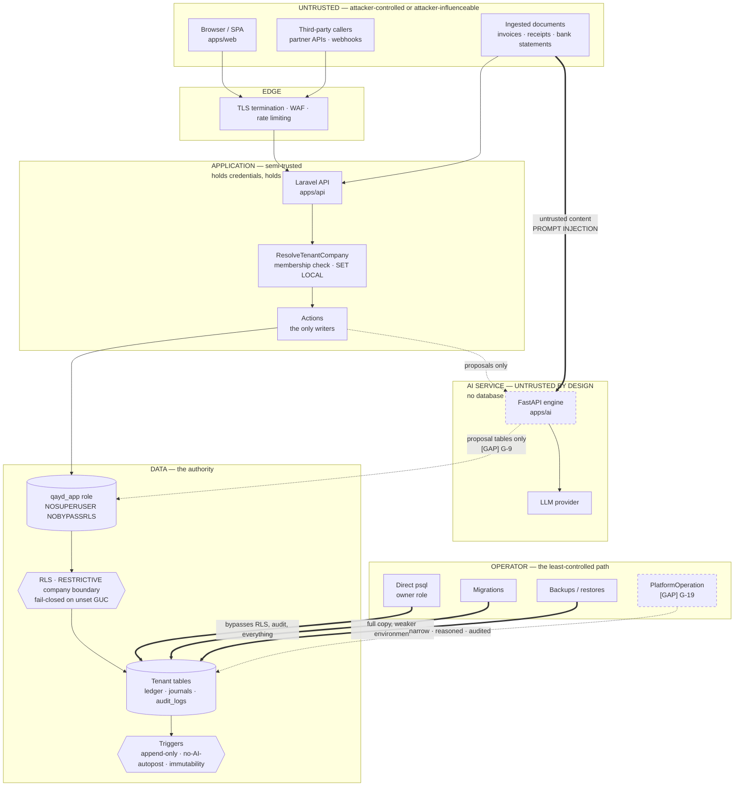
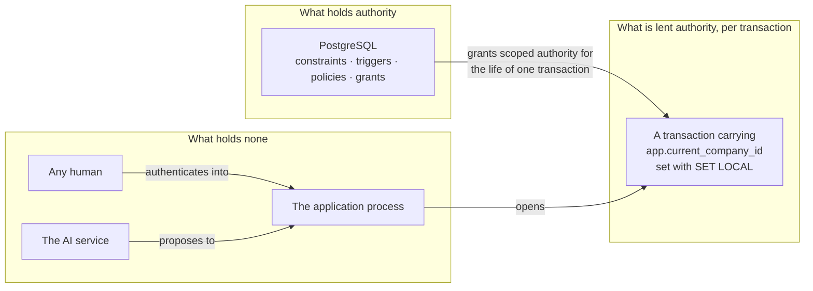
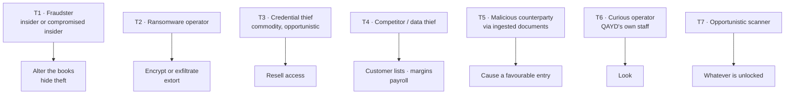
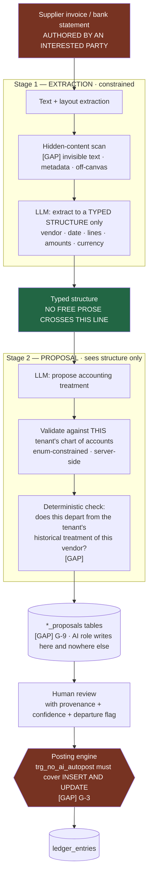
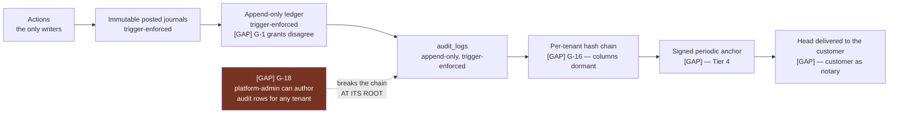
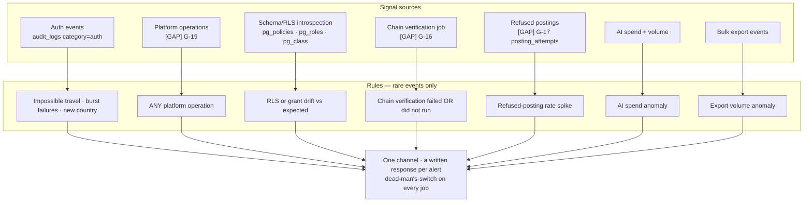

# Target Security Architecture

**What QAYD's security architecture should be when it is finished, and the threat model it answers.**

Complements `docs/security/SECURITY_ARCHITECTURE.md` (the product specification) and playbook §7 (the
current four-layer tenancy stack). This document is the *target* — it shows where today's architecture is
already correct, where the gaps sit inside it, and what a competent attacker would actually do.

Diagrams are Mermaid. Everything marked **[GAP]** is not built today.

---

## Contents

1. [Trust boundaries](#1-trust-boundaries)
2. [The authority model](#2-the-authority-model)
3. [Request lifecycle and where each control fires](#3-request-lifecycle-and-where-each-control-fires)
4. [Threat model](#4-threat-model)
5. [The AI trust boundary](#5-the-ai-trust-boundary)
6. [The integrity chain](#6-the-integrity-chain)
7. [Detection architecture](#7-detection-architecture)
8. [What the target looks like, summarised](#8-what-the-target-looks-like-summarised)

---

## 1. Trust boundaries

The single most useful diagram in this corpus. Every arrow crossing a boundary is a place where trust must
be re-established rather than inherited.



### The boundaries that matter, ranked

| # | Boundary | Crossing control | Status |
|---|---|---|---|
| 1 | **Application → Data** | The `qayd_app` role is `NOSUPERUSER NOBYPASSRLS`; RLS is `ENABLE`d and `FORCE`d; the company boundary is RESTRICTIVE `[CODE]` | **Strong.** The best-built boundary in the system |
| 2 | **Ingested document → AI** | Nothing today. The document *is* the prompt | **Weakest.** §5 |
| 3 | **AI → Data** | The AI service holds no database credentials `[CODE]`; `trg_no_ai_autopost` on `INSERT` | **Half-built.** G-3, G-8, G-9 |
| 4 | **Operator → Data** | None. `psql` on the owner role is outside RLS, outside `audit_logs`, outside everything | **Unbuilt.** §4.4, G-19 |
| 5 | **Tenant → Tenant** | Boundary 1, plus the membership check that decides *which* tenant | Strong, under-tested (`ANTI_PATTERNS.md` §A-6) |
| 6 | **Browser → Application** | TLS, auth, RBAC; CSRF unwired on the cookie flow (TD-07) | Adequate, one open item |

**The observation worth carrying:** QAYD's boundaries are strongest exactly where most systems are weakest
(application→data) and weakest exactly where the newest risk is (document→AI, operator→data). That is an
unusual and defensible position, and it means the remaining security work is narrow and nameable rather
than diffuse.

---

## 2. The authority model

The organising idea, and the thing that distinguishes QAYD's design from a conventionally-built SaaS:

> **Authority is held by the database and lent to a transaction. It is never held by the application, and
> never by a person.**



Four consequences, each of which is a security property rather than a policy:

1. **Compromising the application does not yield the data.** The connection's authority is bounded by RLS,
   and the role cannot bypass it. SQL injection becomes a tenant-scoped bug rather than a total breach.
2. **There is no privileged user.** No role in the product grants cross-tenant reach. `is_platform_admin`
   exists and is deliberately unwired for reads (TD-04, P22).
3. **Authority expires by construction.** `SET LOCAL` discards at commit `[DOCS]`. There is no session that
   accumulates privilege — the reason the pooling hazard is a *correctness* concern rather than a design
   flaw.
4. **The audit trail is an authority the application cannot revoke.** `trg_audit_logs_immutable` raises for
   any update or delete, so even the table owner cannot rewrite it `[CODE]`.

**The one place the model is currently violated** is the `audit_logs` RESTRICTIVE boundary, which ORs on
`app_is_platform_admin()` in both `USING` and `WITH CHECK` `[CODE]` — a session GUC granting cross-tenant
*write* authority on the tamper-evidence table. Analysed at `ANTI_PATTERNS.md` §A-3; resolved at
`IMPLEMENTATION_RECOMMENDATIONS.md` §2.2.

---

## 3. Request lifecycle and where each control fires

```mermaid
sequenceDiagram
    participant B as Browser
    participant E as Edge
    participant A as Auth
    participant M as ResolveTenantCompany
    participant Z as RBAC
    participant AC as Action
    participant D as PostgreSQL
    participant L as audit_logs

    B->>E: request
    E->>E: TLS · rate limit · request id
    E->>A: verify JWT / session
    Note over A: revocation via perms_ver<br/>[GAP] TD-09
    A->>M: identity + requested company
    M->>D: membership check on OWNER connection
    Note over M,D: owner connection deliberately —<br/>a pre-context read on the RLS<br/>connection cannot distinguish<br/>"not a member" from "no rows"
    M->>M: 404 on any failure — never 403
    M->>D: BEGIN; set_config('app.current_company_id', id, LOCAL)
    M->>Z: authorize permission
    Note over Z: role ∪ grant − deny · deny-by-default
    Z->>AC: execute
    AC->>D: writes via qayd_app
    D->>D: RLS RESTRICTIVE boundary
    D->>D: CHECK constraints · triggers
    D->>L: audit row, SAME transaction
    Note over D,L: [GAP] G-16 hash chain computed here
    D-->>B: COMMIT — GUC discarded
```

### Control inventory by stage

| Stage | Control | Defeats | Status |
|---|---|---|---|
| Edge | TLS, HSTS | Network observer | Built |
| Edge | Rate limiting | Brute force, enumeration, scraping | Partial |
| Auth | JWT RS256, Sanctum | Forgery | Built `[CODE]` |
| Auth | MFA | **Credential compromise — the most common initial access vector** | **[GAP] TD-08** |
| Auth | Token revocation | Post-logout replay | **[GAP] TD-09** |
| Tenant | Membership verification | Tenant confusion | Built |
| Tenant | 404 not 403 | Tenant enumeration | Built |
| Tenant | `SET LOCAL` in a transaction | Cross-request GUC leakage | Built for HTTP; **[GAP]** untested under a pooler; **[GAP]** unaddressed for jobs |
| AuthZ | `PermissionResolver` | Privilege escalation | Built `[CODE]` |
| AuthZ | Deny-by-default | Missing checks | Built |
| Data | RLS RESTRICTIVE + FORCE | Cross-tenant access, injection escalation | Built `[CODE]` |
| Data | `NOSUPERUSER NOBYPASSRLS` | Everything above being wrong | Built `[CODE]` |
| Data | Append-only ledger trigger | Ledger tampering | Built; **[GAP] G-1** grants/policies disagree |
| Data | Posted-journal immutability | History rewriting | Built |
| Data | `trg_no_ai_autopost` | AI reaching the ledger | **Half-built — [GAP] G-3, `INSERT` only** |
| Audit | Same-transaction write | Unattributable change | Partial — posting does not audit (TD-16) |
| Audit | Append-only trigger | Log rewriting | Built `[CODE]` |
| Audit | Hash chain | Undetectable log edit | **[GAP] G-16, columns dormant** |
| Detect | Anything at all | An attack in progress | **[GAP] — §7** |

---

## 4. Threat model

Built around **who actually attacks an accounting system and what they want**, rather than around a
standard's control list. Ordered by expected loss, not by technical interest.



### T1 — The insider fraudster · **highest expected loss**

`[INFERENCE]` For an accounting system this is the defining threat, and it is the one most security
programmes under-weight because it is not exciting. The attacker is an authorised user of the tenant —
a bookkeeper, an accountant, an office manager — who wants to move money and hide it in the books.

| Attack | Control | Status |
|---|---|---|
| Alter a posted entry to conceal a payment | Posted journals immutable; ledger append-only `[CODE]` | **Strong** |
| Delete an inconvenient entry | Append-only trigger; no un-post path | **Strong** |
| Back-date into a closed period | Fiscal-period gating | Partial — year-granular only (TD-13) |
| Post a fraudulent entry outright | Nothing prevents an authorised user posting a valid entry — **and nothing should**. The control is *detection*: it is recorded, attributed, immutable and reviewable | By design |
| Approve their own entry | Maker–checker separation (`docs/security/AUTHORIZATION.md`) | Specified |
| Alter the audit trail to hide the above | Append-only trigger `[CODE]`; **hash chain [GAP]** | Tier 2 of 5 |
| **Use a platform-admin session to forge audit rows** | — | **[GAP] G-18 — live** |

> **The security value QAYD sells is precisely this row.** An accounting system whose history cannot be
> rewritten is a fraud control for the *owner* against their own staff. That is a product claim, not just a
> security posture, and it is why the append-only guarantees are worth more than any certificate.

### T2 — Ransomware · **highest tail risk**

`[INFERENCE]` The modern pattern is double extortion: exfiltrate, then encrypt. The controls are almost
entirely *operational*, and QAYD has the fewest of them.

| Requirement | Status |
|---|---|
| Backups isolated from production credentials | **Unverified** |
| Backups immutable / versioned so they cannot be encrypted too | **Unverified** |
| **Restore tested with a stopwatch** | **[GAP]** — an untested backup is a hypothesis |
| Exfiltration detection (bulk export alerting) | **[GAP]** |
| MFA on all administrative access | **[GAP] TD-08** |
| Documented recovery objectives | **[GAP]** |

**A tested restore is the single highest-value operational control in this entire corpus**, and it is the
cheapest. For a system holding SMEs' statutory books, unrecoverable data loss is an existential outcome for
the customer as well as for QAYD.

### T3 — Commodity credential compromise · **most likely**

Phishing, password reuse, infostealer malware. The attacker holds valid credentials, so every
authorization control operates exactly as designed and grants them everything the user has.

- **Prevention:** MFA — **[GAP] TD-08**. Phishing-resistant WebAuthn is the strong form.
- **Containment:** RBAC least privilege limits what a compromised account reaches. Built.
- **Detection:** anomalous-login alerting — **[GAP]**.
- **Response:** immediate revocation — **[GAP] TD-09**, though `perms_ver` is the mechanism already present
  (`BEST_PRACTICES.md` §6.2).

`[INFERENCE]` Highest likelihood, and QAYD's weakest chain: prevention absent, detection absent, response
delayed by up to fifteen minutes.

### T4 — Data theft

An SME's books contain the customer list, margins, supplier terms and payroll — commercially valuable to a
competitor and personally sensitive to employees. The realistic paths are T3 (a compromised account
exporting normally) and the operator paths of §4.4, not a cross-tenant break.

### T5 — Malicious counterparty via ingested documents · **newest, least defended**

The supplier who wants a favourable entry, attacking through a document QAYD's AI reads. Fully treated in
§5 and `BEST_PRACTICES.md` §7. Called out separately here because it is the only threat in this model whose
*entry point is a normal business process*.

### T6 — The curious operator · QAYD's own staff

`[INFERENCE]` Not usually malicious — an engineer debugging in production, a support agent looking up a
customer, a founder checking a metric. The harm is not primarily to the data; it is to the answer QAYD gives
when a customer asks who can see their books.

Today the honest answer is: **anyone with production database access can read everything, and nothing
records it.** `ANTI_PATTERNS.md` §A-4. The target answer is `PlatformOperation` (G-19): distinct credential,
narrow policy, written reason, same-transaction audit, time-boxed, and visible to the affected tenant.

### T7 — Opportunistic scanning

Automated vulnerability scanning, credential stuffing, dependency exploits. Addressed by patching
discipline, dependency scanning in CI, rate limiting, and not exposing what need not be exposed. Real, and
the best-understood threat on this list.

### Threat / control matrix

| Threat | Likelihood | Impact | Primary control | Detective control | Net |
|---|---|---|---|---|---|
| T1 Insider fraud | Medium | **Severe** | Immutability — **strong** | Audit trail — good, **chain [GAP]** | **Good, one live hole (G-18)** |
| T2 Ransomware | Low | **Existential** | Backups — **unverified** | Exfil detection — **[GAP]** | **Weakest** |
| T3 Credential theft | **High** | Severe | MFA — **[GAP]** | Login anomaly — **[GAP]** | **Weak** |
| T4 Data theft | Medium | High | RBAC + RLS — strong | Export alerting — **[GAP]** | Moderate |
| T5 Prompt injection | Medium | High | Containment — **half-built (G-3)** | AI audit — **[GAP]** | **Weak, and growing** |
| T6 Curious operator | **High** | Moderate | None | None | **Weak** |
| T7 Scanning | High | Low | Patching, rate limits | Standard | Adequate |

> **What the matrix says, plainly:** QAYD's *architectural* controls are excellent and its *operational* and
> *detective* controls are near-absent. The remaining work is therefore cheap — it is configuration,
> process and small jobs, not redesign. That is a good position to be in, and it is worth knowing before
> anyone proposes buying an audit.

---

## 5. The AI trust boundary



### The four properties that make this safe

`[INFERENCE]`, grounded in `[DOCS]` OWASP LLM01 and QAYD's existing P15/R-31/R-32.

1. **The AI service holds no database credentials.** Today this is an *absence*; G-8 makes it a CI-enforced
   guarantee. An absence can be undone by one `composer require`.
2. **Prose does not cross the stage boundary.** Extraction emits a typed structure; the proposing step never
   sees document text. An instruction embedded in a PDF cannot reach the step that decides accounting
   treatment if that step is not given prose. **This single design choice removes most of the practical
   attack surface and costs one extra model call.**
3. **Model output is validated, never resolved.** The model may suggest an account; the application matches
   it against this tenant's chart and refuses anything outside it. Output is data, not a name to look up.
4. **The database refuses an AI-authored posting without a human approver** — and this is the control that
   bounds everything else, which is why **G-3 is the highest-priority item in this corpus.**

### The check that catches the realistic attack

`[INFERENCE]` The §`BEST_PRACTICES.md` §7.2 attack — hidden text redirecting a vendor's payments to a
different account — is not caught by any filter. It is caught by a **deterministic** comparison against the
tenant's own history: *this vendor has been coded to 2100 for eleven months; this proposal says 6100.*

Three reasons this is the right control: it requires no model, it cannot be prompted around, and it is a
genuinely good product feature that a user would want even with no adversary. Security controls that are
also features get built and stay built.

---

## 6. The integrity chain

How QAYD proves the books were not altered, end to end. Each link is a distinct guarantee; the chain is only
as strong as the weakest, and the weakest is currently the audit trail's write path.



**Read the diagram from the red box.** Every link to the right of `audit_logs` inherits its trustworthiness
from the assumption that audit rows are truthful when written. G-18 breaks that assumption. Building the
hash chain first would produce a cryptographic guarantee over forgeable entries — worse than no chain,
because it converts an unproven log into a confidently-wrong one (`ANTI_PATTERNS.md` §A-7).

**Sequencing is therefore not a preference: G-18 → G-1 → G-16 → anchor.**

Tier definitions, current position and target: `BEST_PRACTICES.md` §8.1. QAYD is at **Tier 2**; the target
is **Tier 4** (signed anchor), reached via the design in `IMPLEMENTATION_RECOMMENDATIONS.md` §5. Tier 5 —
an independently operated log — is not proportionate at SME scale.

---

## 7. Detection architecture

The layer QAYD does not have. `[INFERENCE]` — a target, not a description.



Two design rules, both from `ANTI_PATTERNS.md` §A-12:

- **Alert only on things that should be rare.** Rare events are intrinsically low-volume and therefore
  survive contact with human attention. Every rule above is chosen on that basis.
- **Monitor the monitor.** A verification job that stops running emits no alerts, which is indistinguishable
  from success. Dead-man's-switch alerting — fire when the job has *not* reported — is the only form that
  catches it.

**Rule R3 deserves emphasis.** `[INFERENCE]` The realistic way QAYD's tenancy model degrades is not an
attack; it is a migration that adds a table without `FORCE`, or widens a policy, or grants a verb back. A
scheduled introspection diff against an expected baseline is the only control that catches that class, and
it is a single query plus a comparison.

---

## 8. What the target looks like, summarised

| Layer | Today | Target | Gap |
|---|---|---|---|
| **Tenancy** | RLS FORCE + RESTRICTIVE + `NOBYPASSRLS`; four layers live | Same, plus adversarial generated tests and a pooler concurrency test | Testing, not design |
| **Authorization** | `role ∪ grant − deny`, deny-by-default, ~71 permissions | Same, plus `perms_ver`-driven immediate revocation | TD-09 |
| **Authentication** | JWT RS256 + Sanctum; refresh rotation with reuse detection | Plus MFA (TOTP now, WebAuthn later), CSRF on the cookie flow | TD-07, TD-08 |
| **Privileged access** | None exists — deliberately | `PlatformOperation`: distinct role, narrow policy, reason, same-transaction audit, time-boxed, tenant-visible | G-19 |
| **Ledger integrity** | Append-only trigger; immutable posted journals | Plus aligned grants and policies; dedicated posting role | G-1, G-2 |
| **Audit trail** | Append-only, trigger-enforced, RLS-scoped | Plus **no platform write hatch**, per-tenant hash chain, signed anchor, verification job | **G-18 first**, then G-16 |
| **AI boundary** | Credential-less service; `INSERT`-only trigger | Plus `UPDATE` coverage, CI credential check, proposal tables + `qayd_ai` role, two-stage extraction, historical-departure check | **G-3 first**, then G-8, G-9 |
| **Encryption** | TLS; platform at-rest | Plus encrypted backups with separated keys, narrow field-level set, envelope/KMS, crypto-shredding pattern decided at schema time | — |
| **Secrets** | Env vars, scanning, generated keys | Secrets manager at a defined trigger; masked value types | — |
| **Detection** | None | §7 | The whole layer |
| **Response** | Leak runbook only | General incident runbook, rehearsed once, CITRA 24-hour clock accounted for | — |

**The shape of the conclusion:** every remaining item is small, named, and independently deliverable. There
is no redesign in this table. That is the payoff of having made the expensive architectural decisions
correctly and early — which QAYD did.
